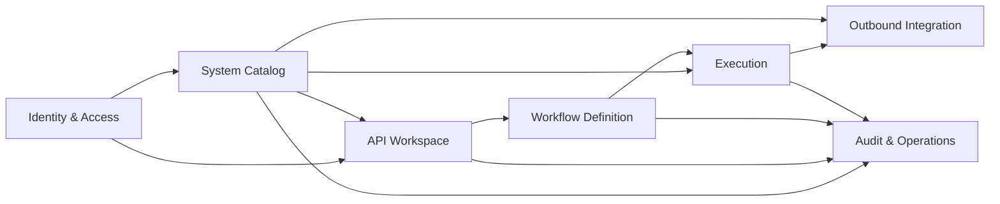

# System Architecture Proposal — Sprint v1

## New

<!-- ID: ARCH-OVERVIEW-001 -->
### Architecture Overview

#### 1. Executive Summary

- **Style:** modular monolith with bounded contexts, one Fastify API process, one independently scalable worker process, and one MySQL/InnoDB database with schema ownership by module.
- **Runtime:** Vue 3 SPA → Fastify 5 API → application/domain modules → Prisma 6/MySQL; DB-backed jobs are claimed by Node.js workers.
- **Deployment:** internal authenticated web application behind an ingress/reverse proxy; API and worker are stateless and multi-instance safe.
- **Primary trade-off:** MySQL queue/polling minimizes new infrastructure and preserves transactional guarantees, while accepting lower throughput than a broker and requiring lease/lock discipline.
- **Primary risks:** brownfield Host migration ambiguity, dynamic-provider SSRF, queue contention at the 20-workflow cap, and OIDC/session migration from local JWT storage.

#### 2. Package Index

| File | Purpose |
|---|---|
| `proposals/sequence-v1.md` | SEQ-001–006 runtime, error and recovery paths |
| `proposals/erd-v1.md` | ENT-001–021 ownership, DDL, indexes and migration |
| `proposals/adr-v1.md` | ADR-001–008 decisions and alternatives |
| `proposals/data-flow-v1.md` | FLOW-001–003 classified data movement and retention |
| `proposals/api-specs-v1.md` | API-001–023 REST contracts and errors |
| `proposals/events-v1.md` | EVT-001 explicit v1 no-broker contract |
| `proposals/nfr-v1.md` | NFR-001–009 measurable budgets and config map |
| `proposals/project-reference-v1.md` | PR-001–008 module/code boundary contract |
| `assets/c4-model.drawio` | C4 System Context, Container and Component views |
| `assets/api-lab-data-flow.drawio` | Developer, QA and operator DFD views |

#### 3. C4 Model

##### 3.1 System Context

| Actor / system | Relationship | Trust classification |
|---|---|---|
| Developer / QA | Builds, validates, runs and inspects APIs/workflows | Authenticated user |
| System operator | Configures Host/Environment and repairs disabled workflows | Same v1 role with ABAC resource gates; Central-IAM MFA assurance is required when the authenticated session is created |
| Central IAM (OIDC/Keycloak) | Authenticates users and issues identity claims | External generic provider |
| Target API providers | Receive Host-bound outbound HTTPS requests | Dynamic external `provider` |
| Secret manager | Supplies the envelope-encryption key at runtime | Internal security provider |
| Signed approved address-set manifest | Supplies signed, versioned approval records keyed by approval ref, Host, Environment and canonical CIDR hash | Read-only deployment security artifact owned by Security + Host owner; verified fail-closed by System Catalog |
| Observability platform | Receives redacted logs, traces, metrics and errors | Internal operations provider |

##### 3.2 Container View

| Container | Responsibility | Technology | Data ownership | Interfaces |
|---|---|---|---|---|
| Web SPA | Design SCREEN-001–008, polling and exact-field navigation | Vue 3, Vite, Pinia, Ant Design Vue | Client UI state only | HTTPS JSON `/api/v1`; redacted Sentry HTTPS envelopes |
| API application | Auth, validation, CRUD, signed address-manifest verification, versioning, job acceptance | Fastify 5, TypeScript | Transactional writes by module | REST/OpenAPI, internal ports, read-only signed manifest mount |
| Execution worker | Claims jobs, resolves mappings, calls providers, persists evidence | Node.js/TypeScript | Execution state transitions | MySQL leases, outbound HTTPS |
| Retention/recovery scheduler | Expires Undo windows, enforces retention and recovers expired leases | Node.js/TypeScript Kubernetes CronJob | Policy-driven scheduled transitions through repository ports | `runRetention`, `recoverExpiredLeases`, MySQL lease singleton |
| MySQL | Authoritative state, versions, jobs, history and audit | MySQL/InnoDB, Prisma | All durable v1 state | SQL transactions |
| Central IAM | Identity and session lifecycle | OIDC/Keycloak-compatible | Identity source | Authorization Code + PKCE |
| Secret manager | Holds active/previous key-encryption keys | Vault-compatible abstraction | Key material | Authenticated runtime API |
| Observability | Diagnostics without secrets | Pino, OpenTelemetry, Sentry | Telemetry | OTLP/HTTPS |
| Target API providers | Execute dynamic Host-bound API requests | External HTTPS providers | Provider-owned | HTTPS REST |
| Signed approved address-set manifest | Security + Host-owner approved network target records | Signed, version-controlled IaC artifact mounted read-only | Network approval source of truth; no runtime writes | `ApprovedAddressSetRegistry` signature/version and exact ref + Host + Environment + CIDR-hash verification |

##### 3.3 Component View

| Component | Owning container | Responsibility | Input | Output | Refs |
|---|---|---|---|---|---|
| Identity Adapter | API application | Validate OIDC session/claims; CSRF guard | Secure cookie, CSRF token | Actor context | ARCH-COMP-001, ADR-006 |
| System Catalog + `ApprovedAddressSetRegistry` | API application | Logical Host and Environment bindings; fail-closed signed-manifest verification and persistence of canonical approved CIDR evidence | Host/env commands + read-only signed manifest | Host context + verified approval ref/hash/version/audit evidence | ARCH-COMP-002, ENT-001–003/016, API-002 |
| API Workspace | API application | Resource tree and API definitions | Resource/API commands | Saved API versions | ARCH-COMP-003, ENT-004–006/017, API-001–007 |
| Workflow Definition | API application | Immutable versions, validation and dependency impact/recovery | Definition/revision/impact command | Version/report/status/affected IDs | ARCH-COMP-004, API-008–011/021/022 |
| Execution Admission & Query | API application | Shared idempotency, run/rerun admission, status/history and masked response-schema projection | Mutation/run/rerun/query | Original mutation response or Execution ID/evidence/schema projection | ARCH-COMP-005, ENT-011–015/018/020/021, API-002/004–007/009/011–016/022 |
| Execution Runner | Execution worker | Claim jobs, execute sequential attempts and persist monotonic terminal state | Durable job/snapshot | Attempts/artifacts/terminal state | ARCH-COMP-005, SEQ-003/004/006 |
| Outbound Gateway | Execution worker | Resolve Host binding, protect SSRF, execute HTTP | Resolved request snapshot | Bounded response/error | ARCH-COMP-006, ADR-005 |
| API Audit Adapter | API application | Append API/config/security facts and export redacted API telemetry | API domain/security facts | Audit/log/trace/metric | ARCH-COMP-007, NFR-006 |
| Worker Telemetry Adapter | Execution worker | Append execution facts and export redacted worker telemetry | Execution/attempt facts | Audit/log/trace/metric | ARCH-COMP-007, NFR-006 |
| Scheduler Observability Adapter | Retention/recovery scheduler | Append retention/recovery facts and export scheduler telemetry | Schedule/recovery facts | Audit/log/trace/metric | ARCH-COMP-007, NFR-006 |
| Retention Worker | Retention/recovery scheduler | Undo expiry, history/artifact cleanup, job recovery | Scheduled scans | Purged/expired state | ARCH-COMP-008, SEQ-006 |

##### 3.4 Editable Sources

- C4: `assets/c4-model.drawio` — three pages named `C1-System-Context`, `C2-Containers`, `C3-Components`.
- DFD: `assets/api-lab-data-flow.drawio` — three pages split because Developer, QA and Operator data paths materially differ.
- Connectors route around shapes; unavoidable crossings use `jumpStyle=arc`.

#### 4. Architecture Traceability Map

| FR / US | Components | APIs | Sequence / data ownership | Obligations |
|---|---|---|---|---|
| FR-001 / US-001, US-009 | System Catalog, Workspace | API-001, API-021, API-022 | SEQ-001/005; ENT-001 owns Host | Host ACTIVE gate and dependency-aware Host lifecycle |
| FR-002 / US-002 | System Catalog, Identity | API-001/002/023 | SEQ-001; FLOW-001; ENT-002/003/016 | Create/read/update/delete Environment bindings; Host-wide schema; encrypted values/credentials |
| FR-003 / US-001, US-009 | API Workspace | API-003–006 | SEQ-001/005; ENT-004/005/006 | normalized tree, impact before delete, same-identity 10-second undo |
| FR-004 / US-003 | API Workspace | API-007 | SEQ-002; ENT-006/017 | optimistic revision, immutable API version, sensitive paths |
| FR-005 / US-003 | Execution, Outbound Gateway | API-012/014 | SEQ-003; ENT-011–014/018/020 | environment and encrypted credential snapshot, bounded body |
| FR-006 / US-004, US-005 | Workflow Definition | API-008/009 | SEQ-002; ENT-007–009 | ≤20 steps, immutable `step_key`, workflow-local variables |
| FR-007 / US-006 | Workflow Definition | API-010/011/013 | SEQ-002/004; ENT-010 | deterministic Lỗi/Cảnh báo findings and exact target |
| FR-008 / US-007 | Execution | API-013/014 | SEQ-004; ENT-011–014/018 | sequential state machine and per-attempt evidence |
| FR-009 / US-008 | Execution, Outbound Gateway | API-013/014 | SEQ-004; ENT-012/018 | exact retryable-error policy, retry only current step |
| FR-010 / US-007/010 | Execution, Retention | API-015/016 | SEQ-006; ENT-011 | 30-day history, rerun latest |
| FR-011 / US-009 | Catalog, Workspace, Workflow Definition | API-004–007, API-011, API-021/022 | SEQ-005; ENT-001/006/009/010/017 | Host/API/method impact, DISABLED until review/validate/enable |
| FR-012 / US-003, US-007, US-010 | System Catalog, Outbound, Audit | API-002/007/014/015 | SEQ-003/004/006; FLOW-001/002; ENT-014/016/019/020 | mask configured paths and pin encrypted credentials |

#### 5. Bounded Contexts And Data Ownership

| Context | Type | Owns | May depend on |
|---|---|---|---|
| Identity & Access | Generic | Session/actor projection only | Central IAM |
| System Catalog | Supporting | Host, Environment binding, variables, encrypted credential | Identity |
| API Workspace | Core | Workspace, tree nodes, API definitions | System Catalog public query |
| Workflow Definition | Core | Workflow, immutable versions, dependency index, validation report | Workspace public query |
| Execution | Core | Executions, steps, jobs, artifacts, idempotency and workflow-capacity counter | Saved versions and System Catalog snapshots |
| Outbound Integration | Supporting | No durable domain master; gateway policies | System Catalog read model |
| Audit & Operations | Supporting | Audit records and telemetry policy | Facts emitted through internal port |

No module reads another module's tables directly. Cross-context reads use declared application ports; physical co-location in MySQL does not waive ownership.

The canonical entity/data-domain × bounded-context `Master / Consume / —` matrix is `erd-v1.md` §4. This overview owns the context boundaries; the ERD matrix owns the downstream read/write dependency classification and must remain aligned with PR-002/003 and FLOW-001–003.

#### 6. Technology Stack

| Layer | Technology | Version source | Decision |
|---|---|---|---|
| Frontend | Vue, Vite, Pinia, Ant Design Vue, Axios | repository manifests | Brownfield standards exception governed by ADR-008; feature boundaries per PR-007 |
| Backend | Fastify, Node.js, TypeScript | repository manifests / Node ≥20.20 | Brownfield standards exception governed by ADR-008; modularize route monolith |
| Persistence | Prisma, MySQL/InnoDB | repository manifests | Transactional data and queue leases |
| Messaging/cache | None in v1 | ADR-004 | MySQL job table; no Redis/Kafka |
| Identity | OIDC/Keycloak-compatible | deployment config | Central IAM, Authorization Code + PKCE |
| Secrets | AES-256-GCM + Vault-compatible manager | ADR-005 | Envelope encryption and rotation |
| Observability | Pino, OpenTelemetry, Sentry | NFR-006 | Structured redacted diagnostics |
| Tests | Node test, Fastify inject, Vitest, Vue Test Utils, Playwright, JSON Schema/OpenAPI checks | repository + confirmed choice | Unit, integration, E2E and contract layers |

#### 7. Interaction And Runtime Topology

The SPA is a synchronous facade over REST. CRUD operations commit in the request transaction. Run/rerun admission creates an immutable execution snapshot, idempotency record and `READY` job in one short transaction, returning `202`. Workers claim jobs using atomic leases, execute exactly one step at a time, persist an attempt, then advance or terminate. The UI polls `GET execution` at one-second intervals while non-terminal. External calls never occur inside a DB transaction.

| Concern | Decision |
|---|---|
| Exposure | Internal authenticated application; target APIs external |
| Instances | API and worker multi-instance; no in-memory locks |
| Compute | Containers behind ingress/reverse proxy |
| Database | One MySQL deployment, module-owned tables |
| Admission | Atomic count of active workflow executions; reject 21st with 429 and `Retry-After` |
| Worker recovery | Lease expiry returns non-terminal jobs to claimable state; attempts remain append-only |
| Polling | 1 second only for running execution; back off/stop at terminal state or hidden tab |

##### 7.1 Environment Matrix

| Environment | Topology | Data / integration policy | Release gate |
|---|---|---|---|
| Development | Docker Compose: SPA, API, worker, MySQL; OIDC/secret/provider adapters may use local fakes | synthetic data only; loopback provider allowed only in local allowlist | unit/integration/contract tests |
| SIT | Company Kubernetes namespace; managed MySQL; test IAM/Vault; Prisma Access egress | masked non-production data; provider sandbox allowlist | schema, security, Agent Security admission and workflow concurrency tests |
| UAT | Production-like Kubernetes sizing; isolated managed MySQL | approved UAT identities/data; provider UAT endpoints | Product/Design acceptance, risk-assessment review, 200% zoom and recovery flows |
| Production | Multi-AZ company Kubernetes; Cloudflare ingress; managed MySQL PITR; Vault; Prisma Access egress | production data; least privilege and audited IP/CIDR allowlists | canary, health/SLO, Security Testing/CVSS gate and rollback verification |

##### 7.2 Component Deployment Matrix

| Component | Deployment / scale | Availability | Security | Failure / fallback |
|---|---|---|---|---|
| Web SPA | versioned static assets on CDN/object origin | immutable assets; previous release retained | Cloudflare WAF, CSP, SRI where supported, no browser secrets | serve previous version during rollback |
| API application | Kubernetes Deployment, min 2 replicas, stateless HPA | readiness/liveness, rolling update | OIDC session, CSRF, network policy, DB least privilege; Agent Security admission/runtime control required | fail closed for IAM/DB/key-provider actions |
| Execution worker | separate Deployment, min 2 replicas, concurrency configured per pod | MySQL leases and heartbeat | no ingress, workload identity, Prisma Access egress; Agent Security admission/runtime control required | expired lease recovery; DEAD alert |
| MySQL | managed Multi-AZ InnoDB with PITR | RPO 15 min/RTO 4 h | TLS ≥1.3, certificate verification, private network, per-module DB roles; managed-host security attestation | restore/runbook; no in-memory substitute |
| Retention/recovery scheduler | Kubernetes CronJob plus lease singleton | retry on next schedule, lag alert | worker DB role limited to policy procedures; Agent Security admission/runtime control required | no out-of-policy deletion |

##### 7.3 Integration Deployment Matrix

| A → B | Class | Protocol / volume | Security | Provider SLA | Fallback |
|---|---|---|---|---|---|
| Browser → Cloudflare → SPA/API | bi-directional UI | HTTPS; interactive | TLS ≥1.3 with certificate verification, WAF/rate limit, OIDC cookie/CSRF | internal SLO NFR-002 | explicit unavailable/session states |
| API → Central IAM | provider | OIDC login/token exchange plus authoritative protected-request status verification | TLS ≥1.3, certificate verification, PKCE, signed issuer/audience/nonce | login 5 s; protected status 2 s | rejected identity/expired session → 401; dependency uncertainty → 503 + `Retry-After`; no protected payload; preserve only safe return URL |
| API/worker → Vault | provider | key fetch/rotation, cached only within bounded process memory | workload identity, TLS ≥1.3, certificate verification, key ID audit | company secret-service SLO | fail closed for secret operation; no plaintext fallback |
| Worker → dynamic target API | provider | HTTPS, max 20 active workflows | TLS ≥1.3, certificate verification, Host allowlist, DNS/redirect validation, Prisma Access, timeout/circuit breaker/per-Host bulkhead | per Host; not inherited | typed failure and Product-scoped current-Step fixed-delay retry under ADR-005 |
| Runtime → OTel/Sentry | provider | redacted async telemetry | TLS ≥1.3, certificate verification, allowlisted fields | operational best effort | bounded buffering; business flow continues |
| CI → Sentry release API | provider | one upload per immutable frontend release | short-lived CI secret/workload identity; release ID match; no token in image/browser | deployment-time dependency | failed upload/verification blocks production promotion; no public source map fallback |

##### 7.3a Integration IP Allowlist Register

| Connection | Required IP/CIDR allowlist | Owner / evidence |
|---|---|---|
| Cloudflare → SPA/API origin | Origin ingress accepts only current Cloudflare egress CIDRs; end-user source IP remains an audited forwarded attribute, never an origin allow rule | Platform; IaC diff + ingress-policy test per release |
| API → Central IAM | Kubernetes egress and Prisma Access permit only approved IAM service CIDRs/endpoints; deny when the approved address set is unavailable | IAM + Platform; destination-object export + connectivity test |
| API/worker → Vault | Namespace network policy permits only the Vault service CIDR/port | Security/SRE; policy manifest + denied-path test |
| API/worker → MySQL | Private subnet/security group permits only application/worker identities and approved pod/node CIDRs | DBA/Platform; security-group export + connection test |
| Worker → dynamic target API | ENT-002 carries a canonical non-empty approved target IP/CIDR set, hash and approval reference in the binding revision; ENT-020 pins them at admission; DNS/connect/every redirect must remain inside the pinned set | Host owner + Security; API-002 binding approval/audit reference + SSRF/redirect test |
| Runtime → OTel/Sentry | Prisma Access destination objects contain the Security-approved provider CIDR/IP set and deny other telemetry egress | SRE/Security; destination-object export + egress test |
| CI → Sentry release API | Release runner egress is restricted to the approved Sentry API CIDR/IP set | Platform/Security; CI network-policy evidence + upload test |

Infrastructure connection address-set changes remain reviewed IaC changes. For dynamic targets, Security + Host owner approve a manifest record keyed by approval ref, Host, Environment and canonical CIDR hash; CI signs/version-controls the manifest and mounts it read-only into the API. `ApprovedAddressSetRegistry` verifies signature/version and exact record match before API-002 may persist the verified set/hash/reference/revision/audit in ENT-002; missing, invalid, stale or unavailable manifest fails closed with no key/DB call. ENT-020 pins the verified policy at admission. Missing/empty policy rejects admission, stale binding revisions return 409, and DNS/connect/redirect mismatch fails before credential transmission. If a provider cannot supply a stable approved IP/CIDR set, production integration remains disabled until Security approves a documented ADR exception; FQDN-only allowlisting is not silently treated as equivalent.

##### 7.4 Delivery, Egress And Feature-Flag Controls

The mandatory promotion order is `Code → Build → Test → Scan → Deploy`. A later stage consumes only the immutable output and signed evidence of the preceding stage; Deploy cannot start until every Scan control passes.

| Stage | Blocking controls | Evidence / output |
|---|---|---|
| Code | protected review, lint, formatting, typecheck, generated-contract drift check | reviewed source revision and dependency lockfiles |
| Build | reproducible frontend/backend/container build, SBOM generation, bundle-size budget | immutable build ID, image digest, SBOM and private source-map package |
| Test | unit, integration, contract and E2E; coverage, accessibility, pseudolocale/RTL and performance budgets | test reports tied to the immutable build ID |
| Scan | SAST, SCA/license, secret scan, container scan, IaC scan, Agent Security verification and signed provenance | blocking security verdict and signed attestation |
| Deploy | environment approval, migration preflight, feature-flag/canary policy and post-deploy verification | deployment record, health evidence and rollback reference |

- CI gates are fail-closed and preserve the ordered stage evidence above; no scan is deferred until after deployment.
- Security owns a release-linked Security Testing ticket created at least three working days before go-live. Findings use CVSS 3.1; High-or-higher findings block release, while Medium-or-lower findings require an owned remediation plan and retest evidence.
- Security and the Technical Owner own the comprehensive risk-assessment artifact. It is reviewed before UAT exit, linked from release evidence, and must cover threat, likelihood/impact, treatment owner, due date and residual-risk decision; unresolved release-blocking risk stops promotion.
- CI verifies Agent Security admission/runtime coverage for every API, worker and scheduler Kubernetes workload; a missing/failed control blocks SIT promotion and production deployment.
- Production frontend builds generate hidden source maps outside the public asset bundle. CI binds them to the immutable release/build ID, uploads them to Sentry with a short-lived secret or workload identity, verifies the release association, then deletes the local maps before CDN publication.
- The Sentry upload credential is available only to the CI release job: it is never embedded in a frontend bundle, runtime image, build log or downloadable artifact. A failed upload, release-ID mismatch, verification failure or residual public `.map` file blocks production promotion.
- Internet egress is denied by default and routed through **Palo Alto Prisma Access**; Host allowlist changes are audited. Prisma ORM is unrelated to this network control.
- Cloudflare terminates public ingress protection; Kubernetes ingress handles internal routing. Frontend HTML uses `Cache-Control: no-cache, must-revalidate`; content-hashed JS/CSS/font/image assets are served only through Cloudflare CDN with `Cache-Control: public, max-age=31536000, immutable`, a strong content-hash `ETag`, and `Last-Modified` equal to the immutable build timestamp. The CDN cache key is `{build_id}:{normalized_path}:{content_hash}:{content_encoding}`. Normal deploy invalidation is versioned-URL replacement, not purge; rollback selects the previous build manifest. Security revocation or corrupted asset triggers an audited Cloudflare API purge by exact URL/tag, never a wildcard origin purge. Authenticated API responses are `private, no-store` unless an endpoint explicitly defines conditional `private, no-cache` ETag behavior such as API-014.
- Feature flags use `<scope>.<feature>.<purpose>`: `api_lab.v1.read_enable`, `api_lab.v1.write_enable`, `identity.oidc.cutover_enable`. Each has an owner, reviewer, audience, default-off state, kill-switch classification, expiry/removal task and audited configuration history. Rollout is development → SIT/UAT → production canary 1–5% → 25% → 50% → 100% → archive with flag/dead-code removal within 90 days.
- Schema rollout follows expand → checkpointed backfill → dual-read comparison → write cutover → one-release observation → contract.

##### 7.5 Cost Governance And FinOps

- IaC policy requires `cost_center`, `business_unit`, `product`, `environment` and `owner` on every deployable resource through native tags or equivalent labels; a missing allocation field blocks deployment.
- Platform/SRE owns a monthly right-sizing review using CPU, memory, database, storage, network and job-utilization evidence. Each reviewed resource receives a retain/resize/remove decision, owner and due date.
- Ephemeral non-production resources default to a 24-hour idle TTL. A daily recovery job reports and safely removes expired idle resources; exceptions require an owner, reason and expiry.
- Shared Kubernetes, MySQL, Vault, Prisma Access, Cloudflare and Sentry costs use showback by namespace, allocation tags and measurable usage where supported. Direct chargeback is not applicable in v1 until Finance approves an allocation model; showback collection remains mandatory.
- Verification evidence is the IaC policy result, daily orphan/idle scan and monthly FinOps report defined by NFR-009.

##### 7.6 Accepted Standards Exception Registry

| Exception ID | Standard deviation | Authority / scope | Compensating controls | Downstream obligation | Status / revisit trigger |
|---|---|---|---|---|---|
| EXC-AUTH-001 | Browser-facing API uses an OIDC BFF/server-session cookie instead of exposing `Authorization: Bearer` to browser JavaScript | ADR-006; accepted by `khanh-pham` for Sprint v1 personal/internal/non-commercial browser traffic; M2M remains Central-IAM Bearer/workload identity | Authorization Code + PKCE, Secure/HttpOnly/SameSite cookie, CSRF, MFA assurance, authoritative session validation, deny-all ABAC and no browser token storage | Plan/Test must cite ADR-006 and cover callback, CSRF, revocation, inactivity and no-token-in-storage; this is a resolved governed exception, not an open architecture warning | Accepted while scope holds; revisit if Central IAM mandates another browser profile or before external/public/commercial deployment |
| EXC-STACK-001 | Existing Fastify/Node and Vue stack differs from preferred greenfield framework tables | ADR-008; accepted by project architecture authority only for this brownfield increment | PR-008 dependency boundaries, OpenAPI/error contracts, supported runtime/version monitoring, framework-idiomatic implementation and full test/security gates | Plan must budget brownfield integration/testing ownership; Implement may not generalize the exception to new standalone services/UIs | Accepted for Sprint v1; revisit on new standalone service/UI or runtime end-of-support |
| EXC-QUEUE-001 | Bounded v1 durable jobs use MySQL lease rows and `DEAD` state instead of a broker-native DLQ | ADR-004 and `ARCH-DEC-003`, selected by `khanh-pham` for the personal/internal workload | ACID admission, leases/heartbeat, three-recovery ceiling, atomic terminal failure/capacity release, immediate critical alert and Operations runbook | Plan/Test must allocate and verify exhausted recovery, alert, inspection, authorized manual recovery and capacity-slot release | Accepted for the bounded v1 load; revisit when NFR-001/003 fails after tuning or recovery operations become unsafe |
| EXC-RETRY-001 | Workflow target-provider retries use Product's fixed delay and 0–5 range instead of the general max-3 exponential-jitter rule | ADR-005 plus Product BR-004/US-008; standalone implicit Step remains zero retry | Exact error allowlist, current-Step-only retry, persisted attempt evidence, bounded 0–5 count; every non-provider dependency retains max-3 exponential jitter | Plan/Test must generate exact count/delay/error-class contracts and prove prior successful Steps are not repeated | Accepted because Product owns this behavior; revisit only through a Product change introducing advanced backoff/error policy |

**Exception acceptance evidence:** On 2026-07-19, `khanh-pham`, project owner and Architecture authority for this personal project, explicitly confirmed `EXC-AUTH-001`, `EXC-STACK-001`, `EXC-QUEUE-001` and `EXC-RETRY-001` as accepted exceptions rather than open warnings, and authorized continuation of Architecture validation. This acceptance does not manufacture downstream implementation/test evidence and does not waive any compensating control, revisit trigger or the independent-security-review gate for external/public/commercial deployment.

These four rows are explicit, scope-bounded Architecture-authority dispositions backed by the durable decisions/requirements named above. They close the standards-deviation decision at the Architecture gate without claiming downstream test evidence exists. Plan and Test must inherit each obligation verbatim; failure to allocate or verify it blocks those later phases rather than silently reopening or widening the Architecture decision.

| Exception | Required Plan inheritance | Required Test evidence | Architecture exit condition |
|---|---|---|---|
| EXC-AUTH-001 | identity/CSRF/revocation implementation slice and Central-IAM dependency owner | callback/state/PKCE/MFA, CSRF, immediate revocation, >15-minute idle expiry, fail-closed IAM and browser-storage secret scan | ADR-006, PR-001 and NFR-004 define owners, controls and scope trigger |
| EXC-STACK-001 | framework integration/upgrade ownership and PR-008 import boundaries | OpenAPI/error-contract, dependency-boundary, supported-version and production source-map gates | ADR-008 and PR-008 prevent extension to new standalone services/UI |
| EXC-QUEUE-001 | dead-job operations/runbook slice with capacity-accounting ownership | third recovery exhaustion → `DEAD`, immediate alert, terminal Execution, slot release, inspect and authorized manual recovery | ADR-004, ENT-013/021 and SEQ-006 define durable state and transitions |
| EXC-RETRY-001 | provider retry implementation slice separate from other dependency resilience | exact attempts=`1+retryCount`, fixed delay, retryable allowlist, current Step only, non-provider max-3 exponential jitter | Product BR-004, ADR-005, API/SEQ/NFR contracts agree; standalone is explicitly zero retry |

#### 8. Security And Trust Boundaries

| Boundary | Controls |
|---|---|
| Browser → API | TLS ≥1.3 with certificate verification, Secure/HttpOnly/SameSite cookie, CSRF token, CSP, OIDC session, authoritative Central-IAM status on every protected request, immediate termination revocation, >90-day account inactivity policy, five-failure/15-minute brute-force block, server-side session inactivity >15 minutes → invalidate + reauthenticate, request/rate limits |
| API/worker → MySQL | TLS ≥1.3 with certificate verification, dedicated least-privilege identities, short transactions |
| Worker → target provider | Host binding only, relative path resolution, allowlist, DNS/IP validation before connect and redirect, TLS ≥1.3 with certificate verification, bounded timeout, per-Host bulkhead, circuit breaker and Product-scoped fixed-delay retry under ADR-005 |
| API/worker → secret manager | TLS ≥1.3 with certificate verification, workload identity, key reference only in config, rotation with active/previous key IDs |
| Runtime → observability | field allowlist, sensitive-path masking, no token/credential/body by default |

##### 8.1 Component-Specific STRIDE

| Component | S | T | R | I | D | E |
|---|---|---|---|---|---|---|
| Identity Adapter | issuer/audience/nonce validation | signed state/PKCE | login/logout audit | HttpOnly cookie; token redaction | callback/rate limits | server-side claim mapping only |
| System Catalog | actor context | revision + AEAD tag | immutable config audit | encrypted values/credentials | request limits | no client-authoritative Host state |
| Workspace/Workflow | actor context | hash/revision/dependency transaction | version/change audit | sensitive-path masking | step/resource limits | internal ports only |
| Execution/Worker | workload identity + lease owner | monotonic state + idempotency | append-only attempts | pinned encrypted secret; masked artifacts | global cap, timeouts, leases | no ingress; least-privilege worker role |
| Outbound Gateway | binding identity | DNS/redirect revalidation | request metadata audit | credential in memory only | circuit breaker/body cap | deny private/reserved destinations by default |
| Audit/Telemetry | workload identity | append-only DB role | request/trace correlation | allowlist/redaction | bounded buffer | separate write-only exporter identity |

Phase 1 uses one authenticated role with ABAC authorization over actor, Host/resource ownership, lifecycle, revision and action attributes. Server policy is deny-all by default; authentication, CSRF and server-side gates remain mandatory.

##### 8.2 Permission Matrix — Phase 1

| Principal state | Read Workspace/API/Workflow/History | Create/edit/delete | Validate/run/rerun | Environment/credential configuration | Sensitive-data contract | Server-side authorization gates |
|---|---|---|---|---|---|---|
| Authenticated user, Central-IAM MFA assurance satisfied at sign-in | Yes | Yes, including destructive Host/API actions when impact checks pass | Yes, only when Host, saved revision, validation and lifecycle state permit; recovery Enable still requires Review/Validate | Yes; saved credentials remain masked and can only be replaced | Cannot reveal/copy stored credentials; configured sensitive fields are masked in artifacts, history, logs and accessible DOM | `requireActor`, verified session-level MFA `amr`/`acr`, ABAC deny-all policy, CSRF on mutations, Host/resource ownership, optimistic revision, dependency-impact token, idempotency, lifecycle and capacity checks |
| Unauthenticated or expired session | No | No | No | No | No protected payload is returned | Fail closed with 401/403 as applicable; redirect to sign-in and preserve only the safe return URL |

The single-role ABAC model is deliberate v1 authorization, not an absence of authorization. Security + Product Owner + Technical Owner are the required Permission Matrix reviewers/approvers through ADR-006. Central IAM enforces MFA during the normal sign-in/reauthentication journey before the server creates an API Lab session; phase 1 has no action-time step-up branch and therefore uses Design's existing authenticated/unauthenticated states without interrupted-mutation resume behavior. Every protected route enforces actor/resource attributes and server-side `lastActivityAt`; inactivity greater than 15 minutes invalidates the session before data access and requires Central-IAM reauthentication. Disabled controls are usability hints and never the enforcement boundary. Any future role split, action-time step-up or RBAC model requires Product/Design change, API permission updates, migration analysis and a new or superseding ADR.

##### 8.3 Resilience Parameter Contract

| Dependency / pressure | Timeout | Retry | Circuit breaker | Bulkhead | Degradation / load shed |
|---|---|---|---|---|---|
| Central IAM login/token exchange | 5 s | max 3, exponential full jitter, idempotent discovery/token/userinfo calls only | 50% failures/30 s, minimum 10 calls; open 60 s | isolated HTTP pool, max 10 concurrent | no session is created or refreshed; login/callback returns typed 503 + `Retry-After` |
| Central IAM protected-request status verification | 2 s | none at request level; one authoritative verification attempt | shares the isolated IAM breaker, but an open breaker is uncertainty and never authorizes | same isolated HTTP pool, max 10 concurrent | fail closed with typed 503 + `Retry-After`; no protected payload; an existing local session is not authority to continue |
| Secret Manager | 2 s | max 3, exponential full jitter for safe key-read only | 50% failures/30 s, minimum 10 calls; open 60 s | isolated pool, max 5 concurrent | key-dependent Environment create/update or restricted-value encryption fails closed with typed 503; Environment delete remains available when IAM, database and manifest dependencies are healthy; an admitted run records masked terminal key-provider evidence asynchronously |
| Target provider | API timeout, default 30 s/max 300 s | Workflow Step: Product retry 0–5 with saved fixed delay and current failed Step only; standalone implicit Step: fixed 0 retry/one attempt; ADR-005 | 50% failures/30 s, minimum 10 calls; open 60 s per Host | max 5 concurrent outbound calls per Host | affected Execution fails with typed evidence; Workspace/History remain available; saturation returns typed 503 internally |
| MySQL | connect 5 s; statement 10 s unless migration/job policy overrides | max 3 exponential full jitter for idempotent reads/lease claims only; never replay an unclassified mutation | pool acquisition failures trip readiness and dependency alert | pool max 20 per process; worker/API pools isolated | action fails closed; public transient response is typed 503 + `Retry-After` |
| Telemetry exporter | 2 s | max 3 exponential full jitter in bounded exporter queue | exporter SDK breaker/open state | bounded exporter queue isolated from request workers | drop/count after buffer bound; business transaction continues |

The 21st Workflow admission remains Product-defined HTTP 429 capacity control, not infrastructure load shedding. Process/dependency saturation uses 503 + `Retry-After`; unexpected, non-transient defects alone use 500.

#### 9. Migration And Delivery Strategy

1. Expand schema with logical Host/binding, normalized workspace/version/execution tables.
2. Run a read-only grouping preview using normalized legacy Host name; emit collision/missing-binding report.
3. Require an operator-supplied mapping for collisions; never merge ambiguous rows automatically.
4. Backfill logical Hosts/bindings and legacy API/flow definitions into version 1 records.
5. Dual-read behind a feature flag, validate counts and representative workflows, then switch writes.
6. Keep old columns/tables during one release rollback window; contract only after production verification.
7. OIDC/session migration ships independently before removing localStorage JWT compatibility.
8. Every migration ships a reviewed `down` script that reverses only that migration's schema/data transformation. CI and staging execute `up → down → up`, compare schema invariants and representative data, and block promotion on irreversible loss. Production rollback uses the reviewed down script only while its declared rollback preconditions hold; otherwise restore from the verified backup and retained old structures through the migration runbook.

#### 10. Assumptions, Constraints And Risks

| Item / source | Confidence | Owner / downstream impact | Architecture treatment | Confirmation / change trigger |
|---|---|---|---|---|
| Latest successful response metadata — Design §4 | High | Architecture; Variable Browser/Test | Query masked retained artifact schema projection | Architecture integration test before Plan approval; Product change if user-managed schema becomes necessary |
| Company Kubernetes/Cloudflare/Prisma Access baseline — internal production choice A | Medium | Platform owner; deployment/IaC tasks | Bind production topology to company Kubernetes, Cloudflare ingress and Prisma Access egress | Platform owner confirms namespaces/policies during Plan; topology change requires Architecture feedback |
| HashiCorp Vault reference adapter — secret-manager choice A | Medium | Security/SRE; key rotation/runbook | `KeyProvider` port with Vault KV/Transit-compatible implementation and workload identity | Security owner confirms mount/auth/key IDs before Plan approval; alternate manager requires adapter-only ADR update |
| Dynamic provider SLA — Product has no fixed partner | High | Host owner; Test fallback cases | Do not inherit provider availability; every Environment binding records an approved CIDR set/hash/evidence and optional SLA metadata | Per-binding onboarding supplies values; missing address policy disables execution and missing SLA keeps explicit failure behavior |
| 300-second hard timeout ceiling — internal safety baseline | High | Architecture; API validation/load tests | Default 30 seconds, maximum 300 seconds | Product change plus capacity test required to exceed it |
| Deadline, team size and internal owner/SLA remain open — Product RISK-OPEN-002 | High | Product Owner + Delivery Lead; blocks reliable Plan capacity/ownership | After Architecture approval, Plan may decompose technical work in DRAFT but cannot claim committed dates, capacity, ownership or internal SLA | Resolve before `approve plan`; validation rejects a committed schedule/owner matrix while the input remains open |
| Personal-project consolidated security governance — `ARCH-001` | Medium | `khanh-pham`, acting as Security + Product Owner + Technical Owner + ANBM reviewer | Permission Matrix and component-specific STRIDE are APPROVED for the current personal-project/internal scope; role consolidation is explicit rather than inferred | Independent security review is mandatory before any external-user, public-production or commercial deployment; that scope transition requires Architecture feedback/change and new approval evidence |

#### 11. Architecture Decisions

| ADR | Decision |
|---|---|
| ADR-001 | Modular monolith with explicit internal ports |
| ADR-002 | Logical Host independent of Environment |
| ADR-003 | Normalized tree plus immutable workflow/API versions |
| ADR-004 | MySQL lease queue, idempotency and 20-workflow admission |
| ADR-005 | Host-bound outbound gateway and AES-256-GCM credentials |
| ADR-006 | Central OIDC session with secure cookies |
| ADR-007 | One-second polling instead of SSE/broker events |
| ADR-008 | Preserve existing Fastify/Vue stack as a governed brownfield exception |

<!-- ID: ARCH-001 -->
### ARCH-001: Personal-Project Permission Matrix And STRIDE Approval Evidence

| Evidence field | Recorded value |
|---|---|
| Project governance context | Personal project with one accountable owner; reviewer roles are deliberately consolidated for the current internal/non-commercial scope |
| Reviewer identity | `khanh-pham` |
| Roles exercised | Security reviewer; Product Owner; Technical Owner; ANBM STRIDE reviewer |
| Reviewed scope | Architecture Overview §8.1 component-specific STRIDE; §8.2 Permission Matrix; ADR-006 identity/session decision and related controls |
| Decision | **APPROVED** — Permission Matrix and STRIDE controls are accepted for Architecture v1 |
| Decision date supplied by reviewer | `2026-07-19` |
| Evidence recorded at | `2026-07-19 07:20:38 +07` |
| Durable evidence reference | `ARCH-001` |
| Independence limitation | Self-review is accepted only for this personal-project/internal/non-commercial scope; it is not represented as independent assurance |
| Mandatory change trigger | Before external users, public production or commercial deployment, obtain an independent security review, record new reviewer evidence, and re-run `validate architecture` |

**Reviewer confirmation recorded verbatim:**

> Tôi, khanh-pham, là chủ dự án cá nhân và kiêm các vai trò Security, Product Owner, Technical Owner và ANBM reviewer. Tôi đã review Permission Matrix và STRIDE trong Architecture v1, quyết định APPROVED. Cho phép ghi nhận self-approval ngày 2026-07-19; yêu cầu independent security review trước khi hệ thống phục vụ người dùng bên ngoài hoặc triển khai thương mại.

This evidence satisfies the current-scope human review gate without claiming separation of duties. The deployment/change trigger above is normative and cannot be waived implicitly.

<!-- ID: ARCH-COMP-001 -->
### ARCH-COMP-001: Identity Adapter

- **Responsibility:** terminate OIDC Authorization Code + PKCE, maintain server-side session projection, validate authoritative Central-IAM subject/session status and CSRF, enforce immediate termination revocation plus Central-IAM inactivity/brute-force policy, and expose immutable actor context.
- **Owns:** session projection only; Central IAM remains identity master.
- **Public surface:** `requireActor`, `requireCsrf`, API-017–020 login/callback/logout/session routes.
- **Failure mode:** revoked/disabled/blocked subject or unavailable authoritative status fails closed with 401/403 before protected data access; API Lab state is not mutated.

<!-- ID: ARCH-COMP-002 -->
### ARCH-COMP-002: System Catalog

- **Responsibility:** logical Host lifecycle and per-Environment base URL, signed-manifest verification plus canonical approved target CIDR policy/evidence, variables and encrypted credential bindings.
- **Owns:** ENT-001–003/016.
- **Public surface:** Host context query and Environment configuration use cases.
- **Failure mode:** missing/inactive Host disables run while preserving editable definitions.

<!-- ID: ARCH-COMP-003 -->
### ARCH-COMP-003: API Workspace

- **Responsibility:** normalized resource hierarchy and saved API definitions, impact scan, soft-delete and 10-second undo.
- **Owns:** ENT-004–006/017.
- **Public surface:** API-001, API-003–007; `ApiDefinitionReader` port.
- **Failure mode:** mutation rolls back atomically; dependency-affecting changes never bypass impact scan.

<!-- ID: ARCH-COMP-004 -->
### ARCH-COMP-004: Workflow Definition

- **Responsibility:** workflow lifecycle, immutable versions, deterministic validation, exact-field findings and recovery gating.
- **Owns:** ENT-007–010.
- **Public surface:** API-008–011; `WorkflowVersionReader`, `WorkflowValidationService` and `WorkflowImpactService` ports. `WorkflowImpactService` supplies dependency queries and caller-UnitOfWork lifecycle disablement.
- **Failure mode:** stale revision returns 409; invalid version remains DRAFT/DISABLED and cannot run.

<!-- ID: ARCH-COMP-005 -->
### ARCH-COMP-005: Execution Orchestrator

- **Responsibility:** shared mutation idempotency plus run/rerun admission, immutable snapshots, DB jobs, attempts, history and polling projection.
- **Owns:** ENT-011–014/018/020/021 plus ENT-015 idempotency.
- **Public surface:** `IdempotencyCoordinator` wraps idempotent module mutations in one caller-supplied MySQL `UnitOfWork`; `ExecutionResponseSchemaReader` exposes masked schema projection to validation; API-012–016; worker claim/heartbeat/complete application ports. Lease recovery is invoked through the scheduler-owned `recoverExpiredLeases` application port, not by a scheduler-to-runner call.
- **Failure mode:** lease expiry enables safe recovery; terminal state is monotonic.

<!-- ID: ARCH-COMP-006 -->
### ARCH-COMP-006: Host-Bound Outbound Gateway

- **Responsibility:** resolve request only against selected Host binding, block SSRF/DNS rebinding, apply timeout/retry/circuit breaker, forward authoritative `X-Request-ID`/`X-Trace-ID`, and bound response capture.
- **Owns:** no master tables; consumes immutable execution snapshot.
- **Public surface:** `execute(ResolvedProviderRequest)` internal port.
- **Failure mode:** typed timeout/network/non-retryable error; never falls back to an arbitrary URL.

<!-- ID: ARCH-COMP-007 -->
### ARCH-COMP-007: Audit And Observability

- **Responsibility:** append immutable security/business audit facts and emit redacted diagnostics through single-container API Audit Adapter, Worker Telemetry Adapter and Scheduler Observability Adapter deployments; the SPA Sentry adapter captures the governed frontend error/performance categories and redacted context defined by NFR-006.
- **Owns:** ENT-019 audit records; telemetry platform owns exported diagnostics.
- **Public surface:** `AuditSink`, `Telemetry` internal ports.
- **Failure mode:** security audit write failure rejects sensitive mutation; telemetry export failure does not corrupt business transaction.

<!-- ID: ARCH-COMP-008 -->
### ARCH-COMP-008: Retention And Recovery Worker

- **Responsibility:** expire undo windows, purge 30-day execution artifacts, retain security audit per policy, and release/mark dead stale jobs.
- **Owns:** scheduled policies over owned repositories; not direct cross-module SQL.
- **Public surface:** scheduler entrypoints declared in PR-006; retention/recovery facts and alerts go directly through the Scheduler Observability Adapter.
- **Failure mode:** alert after two missed schedules; retention lag metric; no silent deletion outside policy.

## Updated

## Removed

### Self-Review Checklist

- [x] C4 has text and editable three-level Draw.io source.
- [x] C2 includes every deployed runtime including the scheduler; C3 assigns every component to its owning container(s).
- [x] FR-001–012 map to component, API, sequence and data ownership.
- [x] Bounded contexts, public surfaces and ownership are explicit.
- [x] Security, migration, failure and deployment implications are defined.
- [x] NFR configuration, DFD, ERD, API and sequence details live in companion proposals.
