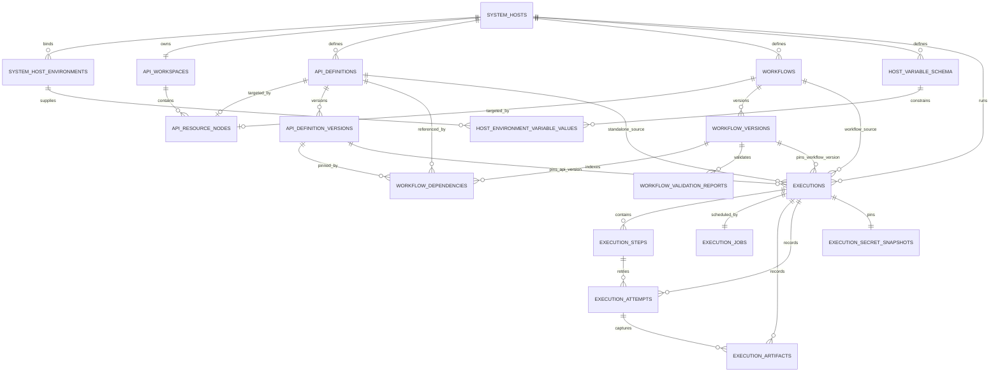

# Entity Relationship Proposal — Sprint v1

**Architecture package references:** entrypoint `architecture-v1.md` (`ARCH-OVERVIEW-001`); companion set `adr-v1.md`, `api-specs-v1.md`, `data-flow-v1.md`, `erd-v1.md`, `events-v1.md`, `nfr-v1.md`, `project-reference-v1.md`, `sequence-v1.md`.

## New

<!-- ID: ENT-001 -->
### ENT-001: `system_hosts`

Owner: System Catalog. Logical identity independent of Environment.

```sql
CREATE TABLE system_hosts (
  id CHAR(36) PRIMARY KEY,
  name VARCHAR(120) NOT NULL,
  status VARCHAR(32) NOT NULL DEFAULT 'ACTIVE',
  revision BIGINT UNSIGNED NOT NULL DEFAULT 1,
  created_at DATETIME(3) NOT NULL, updated_at DATETIME(3) NOT NULL,
  deleted_at DATETIME(3) NULL,
  CONSTRAINT ck_system_hosts_status CHECK (status IN ('ACTIVE','INACTIVE','DELETED')),
  UNIQUE KEY uq_system_hosts_name (name),
  KEY ix_system_hosts_status_name (status, name)
) ENGINE=InnoDB;
```

Access pattern: Host detail/list by status/name; optimistic writes by `id + revision`.

<!-- ID: ENT-002 -->
### ENT-002: `system_host_environments`

```sql
CREATE TABLE system_host_environments (
  id CHAR(36) PRIMARY KEY, host_id CHAR(36) NOT NULL, environment_key VARCHAR(64) NOT NULL,
  base_url VARCHAR(2048) NOT NULL, target_cidrs_json JSON NOT NULL, target_cidrs_sha256 CHAR(64) NOT NULL,
  target_cidrs_approval_ref VARCHAR(191) NOT NULL, target_cidrs_recorded_by VARCHAR(191) NOT NULL,
  target_cidrs_recorded_at DATETIME(3) NOT NULL, target_cidrs_manifest_version VARCHAR(64) NOT NULL,
  credential_ciphertext VARBINARY(8192) NULL,
  credential_nonce BINARY(12) NULL, credential_tag BINARY(16) NULL, credential_key_id VARCHAR(128) NULL,
  revision BIGINT UNSIGNED NOT NULL DEFAULT 1, created_at DATETIME(3) NOT NULL, updated_at DATETIME(3) NOT NULL,
  CONSTRAINT fk_she_host FOREIGN KEY (host_id) REFERENCES system_hosts(id),
  CONSTRAINT ck_she_target_cidrs CHECK (JSON_TYPE(target_cidrs_json) = 'ARRAY' AND JSON_LENGTH(target_cidrs_json) BETWEEN 1 AND 64),
  UNIQUE KEY uq_she_host_env (host_id, environment_key)
) ENGINE=InnoDB;
```

Access pattern: one selected binding by `(host_id, environment_key)`; credential columns are always read through encrypted repository projection. The repository canonicalizes and validates every IPv4/IPv6 CIDR, rejects duplicates/empty sets, verifies the current `base_url` resolution is contained, hashes the canonical JSON, and writes the Security/Host-owner approval reference and timestamp in the same revision/audit transaction. The set has no silent time-based expiry in v1: replacement is a revisioned mutation, and a stale writer/admission fails with `REVISION_CONFLICT`/`ENVIRONMENT_REVISION_CONFLICT`.

<!-- ID: ENT-003 -->
### ENT-003: `host_variable_schema`

```sql
CREATE TABLE host_variable_schema (
  id CHAR(36) PRIMARY KEY, host_id CHAR(36) NOT NULL,
  variable_key VARCHAR(64) NOT NULL, is_required BOOLEAN NOT NULL DEFAULT FALSE,
  is_sensitive BOOLEAN NOT NULL DEFAULT FALSE, revision BIGINT UNSIGNED NOT NULL DEFAULT 1,
  created_at DATETIME(3) NOT NULL, updated_at DATETIME(3) NOT NULL,
  CONSTRAINT fk_hvs_host FOREIGN KEY (host_id) REFERENCES system_hosts(id),
  UNIQUE KEY uq_hvs_key (host_id, variable_key)
) ENGINE=InnoDB;
```

Access pattern: load the one authoritative variable-name schema for a Host; every Environment value must reference one schema row.

<!-- ID: ENT-016 -->
### ENT-016: `host_environment_variable_values`

```sql
CREATE TABLE host_environment_variable_values (
  id CHAR(36) PRIMARY KEY, host_environment_id CHAR(36) NOT NULL, variable_schema_id CHAR(36) NOT NULL,
  value_text TEXT NULL, value_ciphertext VARBINARY(8192) NULL, value_nonce BINARY(12) NULL,
  value_tag BINARY(16) NULL, value_key_id VARCHAR(128) NULL,
  created_at DATETIME(3) NOT NULL, updated_at DATETIME(3) NOT NULL,
  CONSTRAINT fk_hevv_binding FOREIGN KEY (host_environment_id) REFERENCES system_host_environments(id) ON DELETE CASCADE,
  CONSTRAINT fk_hevv_schema FOREIGN KEY (variable_schema_id) REFERENCES host_variable_schema(id) ON DELETE CASCADE,
  UNIQUE KEY uq_hevv_binding_schema (host_environment_id, variable_schema_id),
  CONSTRAINT ck_hevv_one_storage CHECK ((value_text IS NULL) <> (value_ciphertext IS NULL))
) ENGINE=InnoDB;
```

Sensitive schema rows require AEAD columns and `value_text=NULL`; non-sensitive rows require `value_text` and null ciphertext fields. Repository validation also verifies binding and schema belong to the same Host.

<!-- ID: ENT-004 -->
### ENT-004: `api_workspaces`

```sql
CREATE TABLE api_workspaces (
  id CHAR(36) PRIMARY KEY, host_id CHAR(36) NOT NULL,
  created_at DATETIME(3) NOT NULL, updated_at DATETIME(3) NOT NULL,
  CONSTRAINT fk_workspace_host FOREIGN KEY (host_id) REFERENCES system_hosts(id),
  UNIQUE KEY uq_workspace_host (host_id)
) ENGINE=InnoDB;
```

One workspace per logical Host; Host deletion is soft and does not cascade workspace history.

<!-- ID: ENT-005 -->
### ENT-005: `api_resource_nodes`

```sql
CREATE TABLE api_resource_nodes (
  id CHAR(36) PRIMARY KEY, workspace_id CHAR(36) NOT NULL, parent_id CHAR(36) NULL,
  parent_scope_id CHAR(36) GENERATED ALWAYS AS (COALESCE(parent_id, workspace_id)) STORED,
  node_type VARCHAR(32) NOT NULL,
  name VARCHAR(120) NOT NULL, normalized_name VARCHAR(120) NOT NULL, sort_order INT NOT NULL DEFAULT 0,
  target_api_id CHAR(36) NULL, target_workflow_id CHAR(36) NULL,
  revision BIGINT UNSIGNED NOT NULL DEFAULT 1,
  created_at DATETIME(3) NOT NULL, updated_at DATETIME(3) NOT NULL,
  CONSTRAINT fk_node_workspace FOREIGN KEY (workspace_id) REFERENCES api_workspaces(id),
  CONSTRAINT fk_node_parent FOREIGN KEY (parent_id) REFERENCES api_resource_nodes(id),
  CONSTRAINT ck_node_type CHECK (node_type IN ('COLLECTION','FOLDER','API','WORKFLOW')),
  CONSTRAINT ck_node_target CHECK (
    (node_type = 'API' AND target_api_id IS NOT NULL AND target_workflow_id IS NULL) OR
    (node_type = 'WORKFLOW' AND target_api_id IS NULL AND target_workflow_id IS NOT NULL) OR
    (node_type IN ('COLLECTION','FOLDER') AND target_api_id IS NULL AND target_workflow_id IS NULL)
  ),
  UNIQUE KEY uq_node_sibling_name (workspace_id, parent_scope_id, normalized_name),
  KEY ix_node_parent_sort (workspace_id, parent_id, sort_order),
  KEY ix_node_search (workspace_id, normalized_name, node_type)
) ENGINE=InnoDB;
```

The type-specific target columns remove the prior polymorphic-FK gap. Their FKs are added after ENT-006/007 exist; moves reject cycles by ancestor walk inside the transaction.

<!-- ID: ENT-006 -->
### ENT-006: `api_definitions`

```sql
CREATE TABLE api_definitions (
  id CHAR(36) PRIMARY KEY, host_id CHAR(36) NOT NULL, current_version_id CHAR(36) NULL,
  revision BIGINT UNSIGNED NOT NULL DEFAULT 1,
  status VARCHAR(32) NOT NULL DEFAULT 'ACTIVE',
  undo_deadline DATETIME(3) NULL, deleted_at DATETIME(3) NULL,
  created_at DATETIME(3) NOT NULL, updated_at DATETIME(3) NOT NULL,
  CONSTRAINT fk_api_host FOREIGN KEY (host_id) REFERENCES system_hosts(id),
  CONSTRAINT ck_api_status CHECK (status IN ('ACTIVE','DELETED_UNDOABLE','DELETED')),
  KEY ix_api_host_status (host_id, status), KEY ix_api_undo (status, undo_deadline)
) ENGINE=InnoDB;
```

The row owns lifecycle and current-version pointer only; delete/undo changes lifecycle state on the same ID.

<!-- ID: ENT-017 -->
### ENT-017: `api_definition_versions`

```sql
CREATE TABLE api_definition_versions (
  id CHAR(36) PRIMARY KEY, api_id CHAR(36) NOT NULL, version_no INT UNSIGNED NOT NULL,
  method VARCHAR(10) NOT NULL, path VARCHAR(2048) NOT NULL, definition_json JSON NOT NULL,
  sensitive_paths_json JSON NOT NULL, definition_hash CHAR(64) NOT NULL,
  created_by VARCHAR(191) NOT NULL, created_at DATETIME(3) NOT NULL, updated_at DATETIME(3) NOT NULL,
  CONSTRAINT fk_adv_api FOREIGN KEY (api_id) REFERENCES api_definitions(id),
  UNIQUE KEY uq_adv_identity (id, api_id),
  UNIQUE KEY uq_adv_number (api_id, version_no), UNIQUE KEY uq_adv_hash (api_id, definition_hash),
  KEY ix_adv_method_path (api_id, method, path(191))
) ENGINE=InnoDB;
ALTER TABLE api_definitions ADD CONSTRAINT fk_api_current_version
  FOREIGN KEY (current_version_id, id) REFERENCES api_definition_versions(id, api_id);
```

Versions are insert-only. `uq_adv_identity` supports composite owner/version FKs, so a current pointer, dependency or Execution cannot pair an API version with another API owner.

<!-- ID: ENT-007 -->
### ENT-007: `workflows`

```sql
CREATE TABLE workflows (
  id CHAR(36) PRIMARY KEY, host_id CHAR(36) NOT NULL, name VARCHAR(120) NOT NULL,
  status VARCHAR(32) NOT NULL DEFAULT 'DRAFT', current_version_id CHAR(36) NULL,
  revision BIGINT UNSIGNED NOT NULL DEFAULT 1, recovery_revision BIGINT UNSIGNED NOT NULL DEFAULT 0,
  created_at DATETIME(3) NOT NULL, updated_at DATETIME(3) NOT NULL,
  CONSTRAINT fk_workflow_host FOREIGN KEY (host_id) REFERENCES system_hosts(id),
  CONSTRAINT ck_workflow_status CHECK (status IN ('DRAFT','READY','DISABLED')),
  KEY ix_workflow_host_status (host_id, status)
) ENGINE=InnoDB;
ALTER TABLE api_resource_nodes
  ADD CONSTRAINT fk_node_api FOREIGN KEY (target_api_id) REFERENCES api_definitions(id),
  ADD CONSTRAINT fk_node_workflow FOREIGN KEY (target_workflow_id) REFERENCES workflows(id);
```

`current_version_id` receives its FK after ENT-008 exists to avoid creation-order cycle.

<!-- ID: ENT-008 -->
### ENT-008: `workflow_versions`

```sql
CREATE TABLE workflow_versions (
  id CHAR(36) PRIMARY KEY, workflow_id CHAR(36) NOT NULL, version_no INT UNSIGNED NOT NULL,
  definition_json JSON NOT NULL, definition_hash CHAR(64) NOT NULL, step_count TINYINT UNSIGNED NOT NULL,
  created_by VARCHAR(191) NOT NULL, created_at DATETIME(3) NOT NULL, updated_at DATETIME(3) NOT NULL,
  CONSTRAINT fk_wv_workflow FOREIGN KEY (workflow_id) REFERENCES workflows(id),
  UNIQUE KEY uq_wv_identity (id, workflow_id),
  UNIQUE KEY uq_wv_number (workflow_id, version_no), UNIQUE KEY uq_wv_hash (workflow_id, definition_hash),
  CONSTRAINT ck_wv_steps CHECK (step_count BETWEEN 0 AND 20)
) ENGINE=InnoDB;
ALTER TABLE workflows ADD CONSTRAINT fk_workflow_current_version
  FOREIGN KEY (current_version_id, id) REFERENCES workflow_versions(id, workflow_id);
```

Immutable after insert; `uq_wv_identity` supports composite owner/version FKs. Ordered steps, immutable `step_key`, retry/mapping and workflow variables live in the canonical JSON schema.

<!-- ID: ENT-009 -->
### ENT-009: `workflow_dependencies`

```sql
CREATE TABLE workflow_dependencies (
  id CHAR(36) PRIMARY KEY, workflow_version_id CHAR(36) NOT NULL, workflow_id CHAR(36) NOT NULL,
  api_id CHAR(36) NOT NULL, api_version_id CHAR(36) NOT NULL, step_key VARCHAR(64) NOT NULL,
  created_at DATETIME(3) NOT NULL, updated_at DATETIME(3) NOT NULL,
  CONSTRAINT fk_wd_version FOREIGN KEY (workflow_version_id, workflow_id) REFERENCES workflow_versions(id, workflow_id) ON DELETE CASCADE,
  CONSTRAINT fk_wd_workflow FOREIGN KEY (workflow_id) REFERENCES workflows(id),
  CONSTRAINT fk_wd_api FOREIGN KEY (api_id) REFERENCES api_definitions(id),
  CONSTRAINT fk_wd_api_version FOREIGN KEY (api_version_id, api_id) REFERENCES api_definition_versions(id, api_id),
  UNIQUE KEY uq_wd_step (workflow_version_id, step_key), KEY ix_wd_api_workflow (api_id, workflow_id)
) ENGINE=InnoDB;
```

Composite owner/version FKs guarantee that the dependency's Workflow version belongs to `workflow_id` and its API version belongs to `api_id`. Impact scan by API ID and current workflow version is derived atomically when a version is saved.

<!-- ID: ENT-010 -->
### ENT-010: `workflow_validation_reports`

```sql
CREATE TABLE workflow_validation_reports (
  id CHAR(36) PRIMARY KEY, workflow_id CHAR(36) NOT NULL, workflow_version_id CHAR(36) NOT NULL,
  report_json JSON NOT NULL, passed_count INT UNSIGNED NOT NULL, warning_count INT UNSIGNED NOT NULL,
  error_count INT UNSIGNED NOT NULL, definition_hash CHAR(64) NOT NULL, created_by VARCHAR(191) NOT NULL,
  created_at DATETIME(3) NOT NULL, updated_at DATETIME(3) NOT NULL,
  CONSTRAINT fk_wvr_workflow FOREIGN KEY (workflow_id) REFERENCES workflows(id),
  CONSTRAINT fk_wvr_version FOREIGN KEY (workflow_version_id, workflow_id) REFERENCES workflow_versions(id, workflow_id),
  KEY ix_wvr_latest (workflow_id, created_at), KEY ix_wvr_version (workflow_version_id)
) ENGINE=InnoDB;
```

The composite FK prevents a report from pairing one Workflow with another Workflow's version. Each finding stores severity, code, `step_key`, field path, reason and stable focus target.

<!-- ID: ENT-011 -->
### ENT-011: `executions`

```sql
CREATE TABLE executions (
  id CHAR(36) PRIMARY KEY, host_id CHAR(36) NOT NULL, host_environment_id CHAR(36) NOT NULL,
  environment_key VARCHAR(64) NOT NULL, environment_revision BIGINT UNSIGNED NOT NULL, snapshot_at DATETIME(3) NOT NULL,
  execution_type VARCHAR(32) NOT NULL,
  api_id CHAR(36) NULL, api_version_id CHAR(36) NULL,
  workflow_id CHAR(36) NULL, workflow_version_id CHAR(36) NULL,
  source_execution_id CHAR(36) NULL, status VARCHAR(32) NOT NULL,
  snapshot_json JSON NOT NULL, initiated_by VARCHAR(191) NOT NULL, started_at DATETIME(3) NULL,
  finished_at DATETIME(3) NULL, created_at DATETIME(3) NOT NULL, updated_at DATETIME(3) NOT NULL,
  CONSTRAINT fk_execution_host FOREIGN KEY (host_id) REFERENCES system_hosts(id),
  CONSTRAINT fk_execution_environment FOREIGN KEY (host_environment_id) REFERENCES system_host_environments(id),
  CONSTRAINT fk_execution_api FOREIGN KEY (api_id) REFERENCES api_definitions(id),
  CONSTRAINT fk_execution_api_version FOREIGN KEY (api_version_id, api_id) REFERENCES api_definition_versions(id, api_id),
  CONSTRAINT fk_execution_workflow FOREIGN KEY (workflow_id) REFERENCES workflows(id),
  CONSTRAINT fk_execution_workflow_version FOREIGN KEY (workflow_version_id, workflow_id) REFERENCES workflow_versions(id, workflow_id),
  CONSTRAINT fk_execution_source FOREIGN KEY (source_execution_id) REFERENCES executions(id),
  CONSTRAINT ck_execution_type CHECK (execution_type IN ('API','WORKFLOW')),
  CONSTRAINT ck_execution_typed_source CHECK (
    (execution_type = 'API' AND api_id IS NOT NULL AND api_version_id IS NOT NULL AND workflow_id IS NULL AND workflow_version_id IS NULL) OR
    (execution_type = 'WORKFLOW' AND api_id IS NULL AND api_version_id IS NULL AND workflow_id IS NOT NULL AND workflow_version_id IS NOT NULL)
  ),
  CONSTRAINT ck_execution_status CHECK (status IN ('PENDING','RUNNING','SUCCEEDED','FAILED')),
  KEY ix_execution_history (host_id, created_at, status), KEY ix_execution_active (execution_type, status, created_at),
  KEY ix_execution_environment_time (host_environment_id, created_at), KEY ix_execution_source (source_execution_id)
) ENGINE=InnoDB;
```

Type-specific definition/version FKs guarantee that every Execution points to an existing API or Workflow version owned by the same definition. Snapshot contains immutable definition/environment metadata and references ENT-020's pinned encrypted secret snapshot, never a mutable binding credential reference. V1 has exactly `PENDING -> RUNNING -> SUCCEEDED|FAILED`; cancel is deliberately absent per Product lifecycle.

<!-- ID: ENT-012 -->
### ENT-012: `execution_steps`

```sql
CREATE TABLE execution_steps (
  id CHAR(36) PRIMARY KEY, execution_id CHAR(36) NOT NULL, step_index TINYINT UNSIGNED NOT NULL,
  step_key VARCHAR(64) NOT NULL, label VARCHAR(120) NOT NULL,
  status VARCHAR(32) NOT NULL,
  attempt_count TINYINT UNSIGNED NOT NULL DEFAULT 0, started_at DATETIME(3) NULL, finished_at DATETIME(3) NULL,
  final_error_code VARCHAR(100) NULL, created_at DATETIME(3) NOT NULL, updated_at DATETIME(3) NOT NULL,
  CONSTRAINT fk_es_execution FOREIGN KEY (execution_id) REFERENCES executions(id) ON DELETE CASCADE,
  CONSTRAINT ck_es_status CHECK (status IN ('PENDING','RUNNING','SUCCEEDED','FAILED','NOT_RUN')),
  UNIQUE KEY uq_es_identity (id, execution_id),
  UNIQUE KEY uq_es_index (execution_id, step_index), UNIQUE KEY uq_es_key (execution_id, step_key)
) ENGINE=InnoDB;
```

<!-- ID: ENT-013 -->
### ENT-013: `execution_jobs`

```sql
CREATE TABLE execution_jobs (
  id CHAR(36) PRIMARY KEY, execution_id CHAR(36) NOT NULL,
  status VARCHAR(32) NOT NULL DEFAULT 'READY',
  available_at DATETIME(3) NOT NULL, lease_owner VARCHAR(191) NULL, lease_expires_at DATETIME(3) NULL,
  claim_failures TINYINT UNSIGNED NOT NULL DEFAULT 0, last_error_code VARCHAR(100) NULL,
  created_at DATETIME(3) NOT NULL, updated_at DATETIME(3) NOT NULL,
  CONSTRAINT fk_job_execution FOREIGN KEY (execution_id) REFERENCES executions(id) ON DELETE CASCADE,
  CONSTRAINT ck_job_status CHECK (status IN ('READY','LEASED','RETRY_WAIT','DONE','DEAD')),
  UNIQUE KEY uq_job_execution (execution_id), KEY ix_job_claim (status, available_at, lease_expires_at)
) ENGINE=InnoDB;
```

Claim query uses transaction + `SELECT ... FOR UPDATE SKIP LOCKED` where supported; otherwise guarded atomic update.
On the third exhausted lease-claim recovery, one transaction changes the job to `DEAD`, its Execution to `FAILED`, later Steps to `NOT_RUN`, and decrements ENT-021 exactly once when it is a Workflow run; `last_error_code=WORKER_RECOVERY_EXHAUSTED` remains observable.

<!-- ID: ENT-018 -->
### ENT-018: `execution_attempts`

```sql
CREATE TABLE execution_attempts (
  id CHAR(36) PRIMARY KEY, execution_id CHAR(36) NOT NULL, execution_step_id CHAR(36) NULL,
  attempt_scope_id CHAR(36) GENERATED ALWAYS AS (COALESCE(execution_step_id, execution_id)) STORED,
  attempt_no TINYINT UNSIGNED NOT NULL, status VARCHAR(32) NOT NULL,
  started_at DATETIME(3) NOT NULL, finished_at DATETIME(3) NULL, duration_ms INT UNSIGNED NULL,
  http_status SMALLINT UNSIGNED NULL, error_code VARCHAR(100) NULL, retryable BOOLEAN NOT NULL DEFAULT FALSE,
  created_at DATETIME(3) NOT NULL, updated_at DATETIME(3) NOT NULL,
  CONSTRAINT fk_attempt_execution FOREIGN KEY (execution_id) REFERENCES executions(id) ON DELETE CASCADE,
  CONSTRAINT fk_attempt_step FOREIGN KEY (execution_step_id, execution_id) REFERENCES execution_steps(id, execution_id) ON DELETE CASCADE,
  CONSTRAINT ck_attempt_status CHECK (status IN ('RUNNING','SUCCEEDED','FAILED')),
  UNIQUE KEY uq_attempt_step_no (execution_id, attempt_scope_id, attempt_no),
  UNIQUE KEY uq_attempt_id_execution (id, execution_id),
  UNIQUE KEY uq_attempt_id_execution_step (id, execution_id, execution_step_id),
  KEY ix_attempt_execution_time (execution_id, started_at)
) ENGINE=InnoDB;
```

Standalone API runs use `execution_step_id=NULL`; generated `attempt_scope_id` maps them to their Execution ID so MySQL still enforces unique attempt numbers. Workflow runs use the composite Step/Execution FK, preventing evidence from crossing Execution ownership, and store every current-step retry as one append-only row.

<!-- ID: ENT-014 -->
### ENT-014: `execution_artifacts`

```sql
CREATE TABLE execution_artifacts (
  id CHAR(36) PRIMARY KEY, execution_id CHAR(36) NOT NULL, execution_step_id CHAR(36) NULL,
  execution_attempt_id CHAR(36) NOT NULL, artifact_type VARCHAR(32) NOT NULL,
  metadata_json JSON NOT NULL, body_masked MEDIUMTEXT NULL, byte_count INT UNSIGNED NOT NULL,
  truncated BOOLEAN NOT NULL DEFAULT FALSE, content_sha256 CHAR(64) NULL,
  created_at DATETIME(3) NOT NULL, updated_at DATETIME(3) NOT NULL,
  CONSTRAINT fk_ea_execution FOREIGN KEY (execution_id) REFERENCES executions(id) ON DELETE CASCADE,
  CONSTRAINT fk_ea_step FOREIGN KEY (execution_step_id, execution_id) REFERENCES execution_steps(id, execution_id) ON DELETE CASCADE,
  CONSTRAINT fk_ea_attempt_execution FOREIGN KEY (execution_attempt_id, execution_id) REFERENCES execution_attempts(id, execution_id) ON DELETE CASCADE,
  CONSTRAINT fk_ea_attempt_step FOREIGN KEY (execution_attempt_id, execution_id, execution_step_id) REFERENCES execution_attempts(id, execution_id, execution_step_id) ON DELETE CASCADE,
  CONSTRAINT ck_ea_type CHECK (artifact_type IN ('REQUEST','RESPONSE','ERROR')),
  KEY ix_ea_execution_step_attempt (execution_id, execution_step_id, execution_attempt_id)
) ENGINE=InnoDB;
```

Every artifact requires a stable ENT-018 identity. `fk_ea_attempt_execution` enforces the association for standalone and Workflow runs; `fk_ea_attempt_step` additionally proves a Workflow artifact's nullable Step identity equals its referenced attempt. `attempt_no` is projected by joining ENT-018 and is not independently persisted on ENT-014. Body is masked before persistence and limited to 204,800 bytes.

<!-- ID: ENT-015 -->
### ENT-015: `idempotency_records`

```sql
CREATE TABLE idempotency_records (
  id CHAR(36) PRIMARY KEY, actor_id VARCHAR(191) NOT NULL, route_key VARCHAR(191) NOT NULL,
  idempotency_key VARCHAR(191) NOT NULL, request_hash CHAR(64) NOT NULL, resource_id CHAR(36) NULL,
  response_status SMALLINT UNSIGNED NULL, response_body_json JSON NULL, expires_at DATETIME(3) NOT NULL,
  created_at DATETIME(3) NOT NULL, updated_at DATETIME(3) NOT NULL,
  CONSTRAINT chk_idem_response_size CHECK (response_body_json IS NULL OR OCTET_LENGTH(CAST(response_body_json AS CHAR)) <= 65536),
  UNIQUE KEY uq_idem_scope (actor_id, route_key, idempotency_key), KEY ix_idem_expiry (expires_at)
) ENGINE=InnoDB;
```

Access pattern: Execution-owned `IdempotencyCoordinator` resolves or rejects one actor/route/key atomically inside the mutation caller's supplied `UnitOfWork`. The first successful mutation stores the bounded original HTTP status/body projection before commit; an identical retry returns that stored response without re-invoking the handler. A different request hash returns `IDEMPOTENCY_KEY_REUSED`. `response_body_json` is limited to 64 KiB and must already be masked; expiry cleanup scans `expires_at`.

<!-- ID: ENT-019 -->
### ENT-019: `security_audit_logs`

```sql
CREATE TABLE security_audit_logs (
  id CHAR(36) PRIMARY KEY, actor_id VARCHAR(191) NOT NULL, action VARCHAR(100) NOT NULL,
  target_type VARCHAR(100) NOT NULL, target_id VARCHAR(191) NOT NULL, outcome VARCHAR(32) NOT NULL,
  request_id VARCHAR(100) NOT NULL, trace_id VARCHAR(100) NOT NULL, metadata_json JSON NOT NULL,
  occurred_at DATETIME(3) NOT NULL, created_at DATETIME(3) NOT NULL, updated_at DATETIME(3) NOT NULL,
  KEY ix_audit_target_time (target_type, target_id, occurred_at),
  KEY ix_audit_actor_time (actor_id, occurred_at)
) ENGINE=InnoDB;
```

Audit rows are append-only by DB privilege; metadata uses an allowlist and cannot contain raw secrets/bodies.

<!-- ID: ENT-020 -->
### ENT-020: `execution_secret_snapshots`

```sql
CREATE TABLE execution_secret_snapshots (
  id CHAR(36) PRIMARY KEY, execution_id CHAR(36) NOT NULL,
  credential_ciphertext VARBINARY(8192) NULL, credential_nonce BINARY(12) NULL,
  credential_tag BINARY(16) NULL, credential_key_id VARCHAR(128) NULL,
  sensitive_variables_ciphertext MEDIUMBLOB NULL, variables_nonce BINARY(12) NULL,
  variables_tag BINARY(16) NULL, variables_key_id VARCHAR(128) NULL,
  target_cidrs_json JSON NOT NULL, target_cidrs_sha256 CHAR(64) NOT NULL,
  target_cidrs_approval_ref VARCHAR(191) NOT NULL, target_cidrs_recorded_by VARCHAR(191) NOT NULL,
  target_cidrs_recorded_at DATETIME(3) NOT NULL, target_cidrs_manifest_version VARCHAR(64) NOT NULL,
  snapshot_hash CHAR(64) NOT NULL, created_at DATETIME(3) NOT NULL, updated_at DATETIME(3) NOT NULL,
  CONSTRAINT fk_ess_execution FOREIGN KEY (execution_id) REFERENCES executions(id) ON DELETE CASCADE,
  UNIQUE KEY uq_ess_execution (execution_id)
) ENGINE=InnoDB;
```

Admission opens one transaction, locks the selected Environment binding revision, and byte-copies the already encrypted credential/sensitive-value ciphertext together with its original nonce, authentication tag and immutable key ID plus the canonical target CIDRs/hash/approval reference into ENT-020; it never decrypts, re-encrypts or generates a nonce. Missing/empty address data rejects admission as `ENVIRONMENT_INCOMPLETE`. The independent snapshot row freezes those exact encrypted bytes and the approved network boundary and commits atomically with the Execution/job. If the binding revision changes before commit, admission rolls back and returns `409 ENVIRONMENT_REVISION_CONFLICT`; no Execution is accepted from a mixed snapshot. The Gateway resolves DNS immediately before connect and after every redirect, requiring every IP to remain inside the pinned set; mismatch fails closed before sending credentials. Routine key rotation retains every key ID referenced by a non-expired ENT-020 row for at least the 30-day execution-retention window; the worker resolves that pinned key ID and decrypts only in memory. A Security emergency revocation overrides retention and causes the worker to fail closed with masked `KEY_PROVIDER_UNAVAILABLE` evidence. Retention deletes ENT-020 with the Execution after 30 days.

<!-- ID: ENT-021 -->
### ENT-021: `execution_capacity_counters`

```sql
CREATE TABLE execution_capacity_counters (
  scope_key VARCHAR(64) PRIMARY KEY, active_count SMALLINT UNSIGNED NOT NULL DEFAULT 0,
  revision BIGINT UNSIGNED NOT NULL DEFAULT 1,
  created_at DATETIME(3) NOT NULL, updated_at DATETIME(3) NOT NULL,
  CONSTRAINT ck_capacity_active CHECK (active_count BETWEEN 0 AND 20)
) ENGINE=InnoDB;
```

Migration seeds exactly one `GLOBAL_WORKFLOW` row. Workflow admission locks it `FOR UPDATE`, verifies `active_count < 20`, increments it and creates the Execution/job in the same transaction. Terminal success/failure decrements it in the terminal-state transaction. The recovery scheduler compares it with the indexed ENT-011 `PENDING|RUNNING` count; mismatch alerts and is reconciled only under the same row lock with an audit fact. Standalone API runs never change this counter.

### 1. Relationship Overview



### 2. Naming Conventions

| Surface | Convention | Enforcement |
|---|---|---|
| Table/column/index/FK | tables/columns use `snake_case`; named constraints/indexes use `uq|ix|fk|ck_<registered_table_code>_<purpose>`; MySQL primary keys use inline `PRIMARY KEY` and engine name `PRIMARY` | Prisma migration lint loads the immutable registry below, rejects unknown/duplicate codes and exempts only the engine-defined primary-key name |
| IDs | application-generated UUID string stored `CHAR(36)` | injected `IdGenerator` |
| Time | UTC `DATETIME(3)`; server `Clock` | repository boundary |
| JSON | camelCase, explicit `schemaVersion`, JSON Schema validation | application service + contract tests |
| Closed values | `VARCHAR(32)` plus named `CHECK`; native database `ENUM` is forbidden | migration review + DB constraint tests |
| Lifecycle | uppercase closed value set; monotonic terminal transitions | domain state machine + named `CHECK` |
| Audit timestamps | every entity has `created_at` and `updated_at`; insert-only rows initialize them equally and never mutate | repository/migration tests |

#### 2.1 Registered Table Codes

Table codes are deliberate stable migration identifiers, not ad-hoc abbreviations. A full table name may be used as its own code; once emitted in an applied migration, a code is immutable.

| Code | Table | Code | Table |
|---|---|---|---|
| `system_hosts` | `system_hosts` | `she` | `system_host_environments` |
| `hvs` | `host_variable_schema` | `hevv` | `host_environment_variable_values` |
| `workspace` | `api_workspaces` | `node` | `api_resource_nodes` |
| `api` | `api_definitions` | `adv` | `api_definition_versions` |
| `workflow` | `workflows` | `wv` | `workflow_versions` |
| `wd` | `workflow_dependencies` | `wvr` | `workflow_validation_reports` |
| `execution` | `executions` | `es` | `execution_steps` |
| `job` | `execution_jobs` | `attempt` | `execution_attempts` |
| `ea` | `execution_artifacts` | `idem` | `idempotency_records` |
| `audit` | `security_audit_logs` | `ess` | `execution_secret_snapshots` |
| `capacity` | `execution_capacity_counters` | — | — |

### 3. Access Patterns And Index Justification

| Pattern | Index | Why |
|---|---|---|
| Select Host binding/schema/value | `uq_she_host_env`, `uq_hvs_key`, `uq_hevv_binding_schema` | resolve one immutable Environment snapshot without table scan |
| Render/move/search tree | `ix_node_parent_sort`, `ix_node_search` | ordered siblings and ranked search |
| Load current/pinned definitions | `uq_adv_number/hash`, `uq_wv_number/hash` | optimistic/version resolution and duplicate suppression |
| Enforce definition/version and execution/step ownership | `uq_adv_identity`, `uq_wv_identity`, `uq_es_identity` plus composite FKs | prevent cross-owner current pointers, dependencies, reports, attempts and artifacts |
| Dependency impact | `ix_wd_api_workflow` | list affected current workflows by API |
| Claim work | `ix_job_claim` | status/availability/lease scan with row locks |
| Serialize workflow capacity | ENT-021 primary key `scope_key` | one lock owner prevents concurrent 20th/21st admission race |
| Poll/history | `ix_execution_history`, `ix_execution_active` | Host filter/page and global active-cap query |
| Inspect attempts/artifacts | `ix_attempt_execution_time`, `ix_ea_execution_step_attempt` | ordered evidence without N+1 scans |
| Audit investigation | `ix_audit_target_time`, `ix_audit_actor_time` | target/actor timeline within retention |

### 4. Data Ownership Matrix

`Master` is the only context allowed to write the canonical rows. `Consume` means access through a declared application port, immutable snapshot or redacted audit projection; it never permits direct reads of another context's tables. `—` means no data dependency.

| Entity / data domain | Identity & Access | System Catalog | API Workspace | Workflow Definition | Execution | Outbound Integration | Audit & Operations |
|---|---|---|---|---|---|---|---|
| Session/actor projection | Master | Consume | Consume | Consume | Consume | — | Consume |
| Host, Environment, variable schema/value and credential (`ENT-001–003/016`) | Consume | Master | Consume | Consume | Consume | Consume | Consume |
| Workspace, tree, API lifecycle/version (`ENT-004–006/017`) | Consume | Consume | Master | Consume | Consume | — | Consume |
| Workflow lifecycle/version/dependency/report (`ENT-007–010`) | Consume | Consume | Consume | Master | Consume | — | Consume |
| Execution, Step, Job, Attempt, Artifact, idempotency, secret snapshot and capacity (`ENT-011–015/018/020/021`) | Consume | Consume | Consume | Consume | Master | Consume | Consume |
| Security audit records (`ENT-019`) and redacted telemetry policy | — | — | — | — | — | — | Master |

Identity & Access and the other producer contexts append security/business facts only through the write-only `AuditSink`; producing a fact is not a `Consume` relationship and grants no read or mutation access to `ENT-019`. Retention and recovery jobs reside in the Audit & Operations platform boundary, consume only declared repository ports, and never become a second master. This matrix is canonical for downstream module dependencies and is consistent with Architecture Overview §5, PR-002/003, FLOW-001–003 and API-001–022.

### 5. Data Risks

| Risk | Impact | Architectural control | Owner / verification |
|---|---|---|---|
| A variable changes between sensitive and non-sensitive storage modes while values already exist | Plaintext may remain after sensitivity is enabled, or ciphertext metadata may become inconsistent | One System Catalog transaction rewrites every affected binding using AEAD before schema revision commit; fail closed and roll back on any key-provider/write failure | Security + System Catalog; migration/integration test asserts `value_text=NULL` for sensitive rows |
| JSON definition schema/version drifts across API and Workflow releases | Saved versions become unreadable or validation/execution behavior changes silently | Every JSON document carries `schemaVersion`, passes versioned JSON Schema validation and immutable hash checks; expand/backfill/dual-read precedes contract removal | API Workspace + Workflow Definition; contract fixtures for every supported schema version |
| Execution retention deletes evidence outside the 30-day policy or removes security audit records | History is incomplete or regulated audit evidence is lost | Bounded checkpointed purge operates only on Execution-owned repositories; `ENT-019` is excluded and follows NFR-006; dry-run counts and retention-lag alerts are mandatory | SRE + Audit; scheduled retention reconciliation report |
| Delete/Undo races around the server deadline or collides with a recreated sibling name | API lifecycle/tree identity becomes ambiguous | Server `Clock`, optimistic revision and atomic state transition govern the deadline; restore preserves the same API ID and fails with typed collision without auto-enabling workflows | API Workspace; boundary-time and concurrent-restore tests |
| Cross-owner IDs are paired incorrectly in current pointers, dependencies, reports, attempts or artifacts | Referential integrity can associate evidence with the wrong API, Workflow or Execution | Composite owner/version and execution/step foreign keys plus registered unique identities reject cross-owner pairs | DBA + owning context; negative FK migration/integration tests |
| Target MySQL version lacks required `CHECK` or locking semantics | Limits and job/capacity invariants are not enforced as designed | SIT verifies MySQL version, `CHECK`, `FOR UPDATE` and `SKIP LOCKED`; guarded atomic-update claimer is the documented fallback | DBA; migration preflight and concurrency suite |

No known Data Risk is accepted without a control. New persistence engines, object storage, event brokers, or cross-region replication require an Architecture change and an updated matrix/risk review.

### 6. Assumptions And Migration

- MySQL/InnoDB, UTC `DATETIME(3)`, DB `snake_case`, JSON payloads versioned by schema discriminator.
- Every FK and access pattern has an index; staging must verify critical queries with `EXPLAIN`.
- Prisma migrations follow expand → preview/backfill with checkpoints → dual read → cutover → contract.
- Every migration includes a reviewed down script. CI and staging prove `up → down → up` with schema/data invariant checks; production uses it only while declared rollback preconditions hold, otherwise restores the verified backup plus retained old structures through the runbook.
- No automatic merge of ambiguous legacy Hosts; migration produces a collision report and stops those groups.
- Retention deletes ENT-011–014/018/020 in bounded batches after 30 days; ENT-019 audit follows NFR-006.

| Assumption | Confidence | Owner / validate | Change trigger |
|---|---|---|---|
| MySQL supports required locking pattern | Medium | DBA verifies version and `SKIP LOCKED` in SIT | use guarded atomic-update claimer if unavailable |
| JSON definition size remains below row limits | Medium | Performance test representative 20-step payload | move large artifacts to object storage via Architecture change |
| Host schema/value split matches FR-002 | High | Product trace + integration tests across DEV/UAT/PROD | Product changes variable ownership |

## Updated

## Removed

### Self-Review Checklist

- [x] All 21 entities include executable MySQL DDL, PKs, FKs and access-pattern indexes.
- [x] Canonical Master/Consume ownership and Data Risks are explicit for every persisted domain.
- [x] Ownership, lifecycle, encryption and retention are explicit.
- [x] Mermaid ERD and brownfield migration strategy are included.
