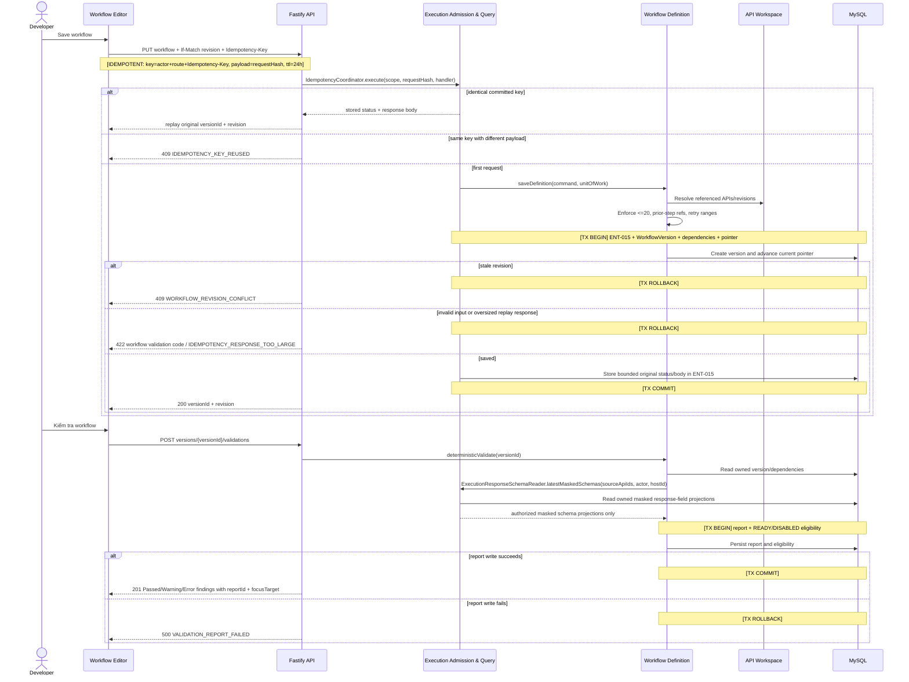

# Sequence Proposal — Sprint v1

**Architecture package references:** entrypoint `architecture-v1.md` (`ARCH-OVERVIEW-001`); companion set `adr-v1.md`, `api-specs-v1.md`, `data-flow-v1.md`, `erd-v1.md`, `events-v1.md`, `nfr-v1.md`, `project-reference-v1.md`, `sequence-v1.md`.

## New

<!-- ID: SEQ-001 -->
### SEQ-001: Open Workspace And Configure Environment

#### Package-Wide Keyed-Mutation Protocol

**Common keyed-mutation protocol:** Every API mutation that requires `Idempotency-Key` enters through `Execution.IdempotencyCoordinator.execute(scope, requestHash, handler)`. The coordinator returns the committed status/body for an identical retry, rejects a different payload with `409 IDEMPOTENCY_KEY_REUSED`, or invokes the owning module handler inside one caller-supplied MySQL `UnitOfWork`. Before commit it serializes the masked success projection, stores it in ENT-015, and enforces `IDEMPOTENCY_RESPONSE_MAX_BYTES=65536`; overflow rolls back the domain mutation, audit and idempotency reservation together and returns `422 IDEMPOTENCY_RESPONSE_TOO_LARGE`. The explicit branches below are normative examples of this shared protocol; no keyed handler bypasses it.

#### SEQ-001 Runtime Flow

```mermaid
sequenceDiagram
  actor U as Authenticated user
  participant UI as Vue SPA
  participant API as Fastify API
  participant EX as Execution Admission & Query
  participant IAM as Identity Adapter
  participant CIAM as Central IAM
  participant CAT as System Catalog
  participant REG as Approved Address Set Registry
  participant K as Secret Manager
  participant WS as API Workspace
  participant DB as MySQL
  U->>UI: Open Host API Lab
  UI->>API: GET /api/v1/auth/session + If-None-Match
  API->>IAM: Validate absolute/idle expiry and activity projection
  IAM->>CIAM: Introspect immutable subject + active/session status
  Note over IAM,CIAM: [TO: 2000ms] TLS >=1.3; no positive active-status cache; uncertainty fails closed
  alt account/session revoked, disabled or blocked
    CIAM-->>IAM: inactive
    IAM-->>API: deny protected payload
    API-->>UI: 401 AUTH_REQUIRED
  else IAM unavailable or uncertain
    CIAM--xIAM: unavailable/invalid response
    IAM-->>API: fail closed
    API-->>UI: 503 SERVICE_UNAVAILABLE; no protected payload
  else authoritative status active
    CIAM-->>IAM: active immutable subject
  alt session projection unchanged
    IAM-->>API: unchanged session projection
    API-->>UI: 304 + ETag; empty body
  else session projection changed
    IAM-->>API: current actor/session projection
    API-->>UI: 200 session projection + ETag
  else absolute-expired or idle greater than 15 minutes
    IAM-->>API: session invalid
    API-->>UI: 401 AUTH_REQUIRED; no protected payload
  end
  end
  UI->>API: GET /api/v1/hosts/{hostId}/api-lab
  API->>IAM: requireActor(session)
  IAM->>CIAM: Introspect immutable subject + active/session status for this protected request
  alt authoritative status active
    CIAM-->>IAM: active immutable subject
    IAM-->>API: verified actor
  else revoked, disabled, blocked or expired
    CIAM-->>IAM: inactive
    IAM-->>API: deny
    API-->>UI: 401 AUTH_REQUIRED; no workspace payload
  else IAM unavailable or uncertain
    CIAM--xIAM: unavailable/invalid response
    IAM-->>API: fail closed
    API-->>UI: 503 SERVICE_UNAVAILABLE; no workspace payload
  end
  API->>CAT: getHostContext(hostId)
  CAT->>DB: Read logical Host + selected binding
  API->>WS: getWorkspaceSummary(hostId)
  WS->>DB: Read workspace/tree counts
  alt Host exists
    API-->>UI: 200 context + ACTIVE/INACTIVE + revision
  else missing, absolute-expired, or idle greater than 15 minutes
    API-->>UI: 404 HOST_OR_RESOURCE_NOT_FOUND / 401 AUTH_REQUIRED (details.reason=IDLE_TIMEOUT when idle)
  end
  U->>UI: Create, update or delete Environment
  alt create missing binding
    UI->>API: PUT environment (If-None-Match: * + Idempotency-Key)
  else update existing binding
    UI->>API: PUT environment (If-Match + Idempotency-Key)
  else delete binding
    UI->>API: DELETE environment (If-Match + Idempotency-Key)
  end
  Note over UI,API: [IDEMPOTENT: key=actor+route+Idempotency-Key, payload=requestHash, ttl=24h]
  API->>EX: IdempotencyCoordinator.execute(scope, requestHash, handler)
  alt identical committed key
    EX-->>API: stored status + masked response body
    API-->>UI: replay original response; handler not invoked
  else same key with different payload
    EX-->>API: 409 IDEMPOTENCY_KEY_REUSED
    API-->>UI: 409; no Catalog/key-provider call
  else first request
    alt delete command
      EX->>CAT: deleteEnvironment(command, unitOfWork)
      Note over CAT,DB: [TX BEGIN] ENT-015 + binding values/key reference delete + audit; Host schema remains
      CAT->>DB: Delete binding; remaining count may be 0
      EX->>DB: Store bounded original 200 response in ENT-015
      Note over CAT,DB: [TX COMMIT]
      API-->>UI: 200 deletedEnvironmentKey + remaining count
    else create or update command
      EX->>CAT: saveEnvironment(command, unitOfWork)
      CAT->>CAT: canonicalize non-empty target CIDRs and compute hash
      CAT->>REG: verify signed manifest(ref, host, environment, CIDR hash)
      alt manifest unavailable, invalid or stale
        REG-->>CAT: fail closed
        API-->>UI: 503 SERVICE_UNAVAILABLE or 422 INVALID_TARGET_CIDR_SET; no key/DB call
      else exact approved record
        REG-->>CAT: verified approval record/version
        CAT->>CAT: validate base-URL DNS membership and replay size <=64 KiB
        CAT->>K: Fetch active encryption key by key ID
      Note over CAT,K: [TO: 2000ms] TLS >=1.3; no automatic retry for mutation
      alt key provider unavailable or timeout
        K-->>CAT: unavailable
        Note over EX,DB: [TX ROLLBACK] idempotency reservation
        API-->>UI: 503 KEY_PROVIDER_UNAVAILABLE + Retry-After
      else key available
        K-->>CAT: active key handle
        CAT->>CAT: Encrypt credential/value with AES-256-GCM
        Note over EX,DB: [TX BEGIN] ENT-015 + Catalog binding/schema/encrypted values + CIDR set/hash/approval + audit
        CAT->>DB: Create/update binding/schema/address-set/revision + audit
        alt precondition, revision or replay-size conflict
          Note over EX,DB: [TX ROLLBACK]
          API-->>UI: 409 ENVIRONMENT_PRECONDITION_FAILED/REVISION_CONFLICT or 422 response too large
        else valid
          EX->>DB: Store bounded original status/body in ENT-015
          Note over EX,DB: [TX COMMIT]
          API-->>UI: 201 created / 200 updated masked config
        end
        end
      end
    end
  end
```

- **Transaction:** Environment configuration and audit fact commit atomically; secret-manager key lookup occurs before the short write transaction.
- **Timeout/retry:** no automatic retry for mutation; client may retry with the same idempotency key only after network uncertainty.
- **Refs:** API-001/002/020/023, ENT-001–004/015/016, FLOW-001.

<!-- ID: SEQ-002 -->
### SEQ-002: Save And Validate Immutable Workflow Version



- **Determinism:** same saved Workflow version plus the same referenced immutable API versions yields the same structural findings; runtime value absence remains an execution error.
- **Warnings:** only the three Product-defined warning classes; 0 Error permits READY, warning confirmation is an action-time UI/API flag.
- **Refs:** API-008–011, ENT-006–010.

<!-- ID: SEQ-003 -->
### SEQ-003: Run Standalone API

```mermaid
sequenceDiagram
  actor U as Developer
  participant UI as API Editor
  participant API as Fastify API
  participant EX as Execution Orchestrator
  participant DB as MySQL
  participant W as Worker
  participant K as Secret Manager
  participant GW as Outbound Gateway
  participant P as Target Provider
  U->>UI: Chạy API
  UI->>API: POST /api-runs + Idempotency-Key
  Note over API,EX: [IDEMPOTENT: key=actor+route+Idempotency-Key, payload=requestHash, ttl=24h]
  API->>EX: IdempotencyCoordinator.execute(scope, requestHash, admitStandaloneRun)
  alt identical committed key
    EX-->>API: stored 202 + executionId
    API-->>UI: replay original 202; no second job
  else same key with different payload
    API-->>UI: 409 IDEMPOTENCY_KEY_REUSED
  else first request
    Note over EX,DB: [TX BEGIN] lock env revision + byte-copy ciphertext/keyId and CIDRs/hash/approval evidence into ENT-020 + execution + READY job + ENT-015
    EX->>DB: Persist admission records without decrypt/re-encrypt or key-provider call; reject missing CIDR policy
    alt invalid admission or projected response exceeds 64 KiB
      Note over EX,DB: [TX ROLLBACK] domain + audit + idempotency
      API-->>UI: typed admission error / 422 IDEMPOTENCY_RESPONSE_TOO_LARGE
    else admitted
      EX->>DB: Store bounded original 202 + executionId in ENT-015
      Note over EX,DB: [TX COMMIT]
      API-->>UI: 202 executionId
    end
  end
  Note over EX,W: [ASYNC] Durable READY job is claimed only after admission commit; API does not wait for provider execution
  W->>DB: Claim job lease
  W->>K: Fetch snapshot key by keyId
  Note over W,K: [TO: 2000ms] TLS >=1.3; fail closed, no plaintext fallback
  alt key provider unavailable or timeout
    K-->>W: KEY_PROVIDER_UNAVAILABLE
    Note over W,DB: [TX BEGIN] failed attempt + terminal FAILED, no provider call
    W->>DB: Persist key-provider failure evidence
    Note over W,DB: [TX COMMIT]; [TX ROLLBACK] leaves lease recoverable
  else key available
    K-->>W: key handle
    Note over W,GW: Standalone is one implicit Step with retryCount=0 (maxAttempts=1); API-012 accepts no retry override
    W->>GW: Execute resolved Host-bound request against pinned CIDR set/hash
    GW->>GW: Resolve DNS; require every connect/redirect IP inside pinned set
    Note over GW,P: [TO: apiVersion.timeoutSeconds; fallback=30000ms; max=300000ms]
    GW->>P: HTTPS Host-bound request
    alt response
      P-->>GW: HTTP response
      GW-->>W: status, duration, bounded/masked body
      Note over W,DB: [TX BEGIN] append ENT-018 attempt, ENT-014 artifacts FK-linked by executionAttemptId + terminal SUCCEEDED/FAILED
      W->>DB: Persist standalone evidence and terminal state
      Note over W,DB: [TX COMMIT]; [TX ROLLBACK] leaves lease recoverable
    else timeout/network
      GW-->>W: typed provider error
      Note over W,DB: [TX BEGIN] append failed ENT-018 attempt/error artifact linked by executionAttemptId + terminal FAILED; no automatic retry
      W->>DB: Persist standalone failure evidence
      Note over W,DB: [TX COMMIT]; [TX ROLLBACK] leaves lease recoverable
    end
  end
  loop every 1s while non-terminal
    UI->>API: GET execution + If-None-Match
    API->>DB: Read authorized masked projection + current ETag
    alt projection unchanged
      API-->>UI: 304 + ETag; empty body
    else projection changed
      API-->>UI: 200 status/attempt/artifact metadata + ETag
    end
  end
```

- **No external call in transaction.** Artifact body is capped at 200 KB and truncated with explicit metadata.
- **Credential handling:** decrypt immediately before request, never persist/log raw value, release buffer after use.
- **Standalone BR-004 interpretation:** Product permits the lower bound zero and retry editing belongs only to saved Workflow Steps in approved Design. Architecture therefore pins standalone `retryCount=0`, performs exactly one attempt, and exposes `Chạy lại` as a new user-created Execution; retryable classification is still recorded for diagnostics but cannot trigger a second call.
- **Refs:** API-012/014, ADR-004/005/007.

<!-- ID: SEQ-004 -->
### SEQ-004: Run Sequential Workflow With Retry

```mermaid
sequenceDiagram
  actor U as QA user
  participant UI as Workflow Editor
  participant API as Fastify API
  participant EX as Execution Orchestrator
  participant DB as MySQL
  participant W as Worker
  participant K as Secret Manager
  participant GW as Outbound Gateway
  participant P as Target Provider
  U->>UI: Chạy workflow
  UI->>API: POST workflow-runs + versionId + warningAcknowledged + Idempotency-Key
  Note over API,EX: [IDEMPOTENT: key=actor+route+Idempotency-Key, payload=requestHash, ttl=24h]
  API->>EX: IdempotencyCoordinator.execute(scope, requestHash, admitWorkflowRun)
  alt identical committed key
    EX-->>API: stored 202 + executionId
    API-->>UI: replay original 202; no second job/capacity increment
  else same key with different payload
    API-->>UI: 409 IDEMPOTENCY_KEY_REUSED
  else first request
    Note over EX,DB: [TX BEGIN] capacity + lock env revision + byte-copy ciphertext/keyId and CIDRs/hash/approval evidence into ENT-020 + execution/job + ENT-015
    EX->>DB: Perform atomic admission without key-provider call; reject missing CIDR policy
    alt active workflow count >= 20
      Note over EX,DB: [TX ROLLBACK] no Execution/History/idempotency row
      API-->>UI: 429 WORKFLOW_CAPACITY_REACHED + Retry-After
    else invalid/stale/not acknowledged
      Note over EX,DB: [TX ROLLBACK]
      API-->>UI: 409 HOST_INACTIVE / WORKFLOW_NOT_READY / REPORT_STALE / WARNING_ACK_REQUIRED / ENVIRONMENT_REVISION_CONFLICT
    else projected response exceeds 64 KiB
      Note over EX,DB: [TX ROLLBACK] capacity + admission + audit + idempotency
      API-->>UI: 422 IDEMPOTENCY_RESPONSE_TOO_LARGE
    else admitted
      EX->>DB: Store bounded original 202 + executionId in ENT-015
      Note over EX,DB: [TX COMMIT]
      Note over EX,W: [ASYNC] Durable READY job is claimed after admission commit
      API-->>UI: 202 executionId
    end
  end
  W->>DB: Claim execution lease
  W->>K: Fetch snapshot key by keyId
  Note over W,K: [TO: 2000ms] TLS >=1.3; fail closed, no plaintext fallback
  alt key provider unavailable or timeout
    K-->>W: KEY_PROVIDER_UNAVAILABLE
    Note over W,DB: [TX BEGIN] execution FAILED + all Steps NOT_RUN + release capacity, no provider call
    W->>DB: Persist key-provider failure evidence
    Note over W,DB: [TX COMMIT]; [TX ROLLBACK] leaves lease recoverable
  else key available
    K-->>W: key handle
    loop each ordered step
      W->>W: Resolve environment/workflow/prior-step mappings
      loop current step attempt <= retryCount
        Note over W,P: [RETRY: max=retryCount 0..5, strategy=fixed-delay, delay=retryDelaySeconds default 1000ms, scope=current-step, exception=ADR-005]
        Note over GW,P: Retryable only timeout, DNS/network/connect, reset, HTTP 408/429/5xx
        Note over GW,P: [TO: apiVersion.timeoutSeconds; fallback=30000ms; max=300000ms]
        W->>GW: execute(request, timeout, pinnedCidrs, addressSetHash)
        GW->>GW: Resolve DNS; require every connect/redirect IP inside pinned set
        GW->>P: HTTPS request to bound Host target
        alt success
          P-->>GW: bounded HTTP response
          GW-->>W: bounded response
          Note over W,DB: [TX BEGIN] successful attempt + masked artifact + step SUCCEEDED
          W->>DB: Persist successful attempt
          Note over W,DB: [TX COMMIT]; [TX ROLLBACK] leaves step non-terminal
        else retryable and attempts remain
          P-->>GW: timeout/network error or HTTP 408/429/5xx
          GW-->>W: retryable error
          Note over W,DB: [TX BEGIN] failed attempt + heartbeat + RETRY_WAIT availableAt
          W->>DB: Persist failed attempt and retry schedule
          Note over W,DB: [TX COMMIT]; [TX ROLLBACK] leaves lease recoverable
          W->>W: Wait exactly retryDelaySeconds before the next current-Step attempt
        else final/non-retryable
          P-->>GW: terminal response/error or retry budget exhausted
          GW-->>W: final/non-retryable error
          Note over W,DB: [TX BEGIN] failed attempt + step/execution FAILED + later NOT_RUN + decrement ENT-021
          W->>DB: Persist terminal failure
          Note over W,DB: [TX COMMIT]; [TX ROLLBACK] leaves lease recoverable
          W->>W: Set workflowOutcome=FAILED; exit attempt loop and ordered-step loop
        end
      end
    end
    alt workflowOutcome is SUCCEEDED after every ordered step
      Note over W,DB: [TX BEGIN] execution SUCCEEDED + release capacity
      W->>DB: Persist terminal success
      Note over W,DB: [TX COMMIT]; [TX ROLLBACK] leaves lease recoverable
    else workflowOutcome is FAILED
      Note over W,DB: Terminal failure already persisted; later Steps remain NOT_RUN; no success write and no second capacity release
    end
  end
  opt Concurrent UI poll tick while execution is non-terminal
    UI->>API: GET execution + If-None-Match
    API->>DB: Read authorized masked projection + current ETag
    alt projection unchanged
      API-->>UI: 304 + ETag; empty body
    else projection changed
      API-->>UI: 200 step/attempt/status projection + ETag
    end
  end
```

- **Idempotency:** identical key/actor/route returns original execution; mismatched payload returns 409.
- **Recovery:** expired lease can be reclaimed; completed step attempts are never replayed unless the persisted state says the step is non-terminal.
- **Terminal invariant:** the worker compares-and-sets one terminal Execution state. A failed current Step exits both loops, keeps every later Step `NOT_RUN`, releases capacity in the failure transaction and makes the guarded success branch unreachable.
- **Refs:** API-013/014, ENT-011–015/018/020/021, NFR-003.

<!-- ID: SEQ-005 -->
### SEQ-005: Delete API, Undo, And Workflow Recovery

```mermaid
sequenceDiagram
  actor U as Operator
  participant UI as Resource Tree
  participant API as Fastify API
  participant EX as Execution Admission & Query
  participant WS as API Workspace
  participant WF as Workflow Definition
  participant DB as MySQL
  UI->>API: POST API impact
  API->>WS: scanDependencies(apiId, revision)
  WS->>DB: Read owned API state/revision
  WS->>WF: WorkflowImpactService.listByApi(apiId)
  WF->>DB: Read owned dependency index
  WF-->>WS: exact affected workflows
  API-->>UI: affected workflows + count
  U->>UI: Confirm delete
  UI->>API: DELETE API + If-Match + Idempotency-Key
  Note over UI,API: [IDEMPOTENT: key=actor+deleteRoute+Idempotency-Key, payload=apiRevision+impactToken, ttl=24h]
  API->>EX: IdempotencyCoordinator.execute(deleteScope, payloadHash, handler)
  alt identical committed delete
    EX-->>API: stored 200 response
    API-->>UI: replay original undoDeadline + disabled workflows
  else key reused with different payload
    API-->>UI: 409 IDEMPOTENCY_KEY_REUSED
  else first delete request
    EX->>WS: deleteWithImpact(command, unitOfWork)
    Note over EX,DB: [TX BEGIN] ENT-015 + Workspace lifecycle + Workflow disable + audit
    WS->>DB: Mark DELETED_UNDOABLE, undoDeadline=now+10s; hide tree node
    WS->>WF: WorkflowImpactService.disableImpactedWorkflows(ids, reason, unitOfWork)
    WF->>DB: Mark exact workflows DISABLED in caller UnitOfWork
    EX->>DB: Store bounded original 200 response
    Note over EX,DB: [TX COMMIT]; [TX ROLLBACK] all on failure
    API-->>UI: 200 undoDeadline + disabled workflows
  end
  alt Undo within 10 seconds
    UI->>API: POST /undo
    Note over UI,API: [IDEMPOTENT: key=actor+undoRoute+Idempotency-Key, payload=deletionRevision, ttl=24h]
    API->>EX: IdempotencyCoordinator.execute(undoScope, payloadHash, handler)
    alt identical committed Undo
      EX-->>API: stored 200 response
      API-->>UI: replay restored result
    else key reused with different payload
      API-->>UI: 409 IDEMPOTENCY_KEY_REUSED
    else first Undo request
      EX->>WS: restoreSameApiRow(command, unitOfWork)
      Note over EX,DB: [TX BEGIN] ENT-015 + same API identity/version/tree location; workflows remain DISABLED
      WS->>DB: Restore ACTIVE API
      alt restore succeeds
        EX->>DB: Store bounded original 200 response
        Note over EX,DB: [TX COMMIT]
        API-->>UI: 200 restored; recoveryRequired=true
      else restore fails
        Note over EX,DB: [TX ROLLBACK] restore/idempotency; recovery TX sets DELETED and audits
        API-->>UI: 500 API_UNDO_FAILED; API remains deleted
      end
    end
  else Deadline elapsed
    API-->>UI: 409 API_UNDO_WINDOW_EXPIRED
  end
  U->>UI: Review -> Validate -> Enable
  UI->>API: POST workflow enable + validationReportId + Idempotency-Key
  API->>EX: IdempotencyCoordinator.execute(enableScope, payloadHash, handler)
  alt identical committed enable
    API-->>UI: replay stored 200 READY response
  else key reused with different payload
    API-->>UI: 409 IDEMPOTENCY_KEY_REUSED
  else first enable request
    EX->>WF: enableAfterReview(command, unitOfWork)
    Note over EX,DB: [TX BEGIN] ENT-015 + current report/review check + READY + audit
    WF->>DB: Verify current report/revision and enable workflow
    alt stale report/revision
      Note over EX,DB: [TX ROLLBACK]
      API-->>UI: 409 REVIEW_STALE / REPORT_STALE
    else valid
      EX->>DB: Store bounded original 200 response
      Note over EX,DB: [TX COMMIT]
      API-->>UI: 200 READY
    end
  end
```

- **Clock:** server `Clock` is authoritative; UI countdown is informational.
- **Invariant:** undo never auto-enables workflows because dependency review evidence must remain explicit.
- **Refs:** API-004–007/011/021/022, ENT-001/006/009/010/017, FLOW-003.

#### Method And Host Lifecycle Impact Variant

```mermaid
sequenceDiagram
  actor U as Operator
  participant UI as API/Host Editor
  participant API as Fastify API
  participant EX as Execution Admission & Query
  participant CAT as System Catalog
  participant WS as API Workspace
  participant WF as Workflow Definition
  participant DB as MySQL
  alt API method change
    UI->>API: POST PREVIEW_API_METHOD_CHANGE (apiId, method, revision)
    API->>WS: scanDependencies(apiId, proposedMethod)
    WS->>DB: Read owned API state/revision
    WS->>WF: WorkflowImpactService.listByApi(apiId)
    WF->>DB: Read owned dependency index
    WF-->>WS: exact affected workflows
    API-->>UI: impactToken + exact affected workflows
    U->>UI: Confirm named API and count
    UI->>API: PUT API + impactToken + If-Match + Idempotency-Key
    Note over UI,API: [IDEMPOTENT: key=actor+route+Idempotency-Key, payload=revision+impactToken, ttl=24h]
    API->>EX: IdempotencyCoordinator.execute(methodScope, payloadHash, handler)
    alt identical committed method change
      API-->>UI: replay stored API revision + disabledWorkflowIds
    else key reused with different payload
      API-->>UI: 409 IDEMPOTENCY_KEY_REUSED
    else first method-change request
      EX->>WS: changeMethodWithImpact(command, unitOfWork)
      Note over EX,DB: [TX BEGIN] ENT-015 + API version + Workflow disable + audit
      alt token/revision stale
        Note over EX,DB: [TX ROLLBACK]
        API-->>UI: 409 IMPACT_TOKEN_INVALID / REVISION_CONFLICT; no partial disable
      else valid
        WS->>DB: Create immutable API version
        WS->>WF: WorkflowImpactService.disableImpactedWorkflows(ids, reason, unitOfWork)
        WF->>DB: Mark exact workflows DISABLED in caller UnitOfWork
        EX->>DB: Store bounded original response in ENT-015
        Note over EX,DB: [TX COMMIT]
        API-->>UI: updated API revision + disabledWorkflowIds
      end
    end
  else Host INACTIVE/DELETED transition
    UI->>API: POST lifecycle-impact (hostId, status, revision)
    API->>CAT: scanHostDependencies(hostId, proposedStatus)
    CAT->>DB: Read owned Host state/revision
    CAT->>WF: WorkflowImpactService.listByHost(hostId)
    WF->>DB: Read owned workflow dependency index
    WF-->>CAT: exact affected workflows
    API-->>UI: 200 impactToken + affected workflows + historyPreserved
    U->>UI: Confirm named Host and count
    UI->>API: PATCH Host + impactToken + If-Match + Idempotency-Key
    Note over UI,API: [IDEMPOTENT: key=actor+route+Idempotency-Key, payload=revision+impactToken, ttl=24h]
    API->>EX: IdempotencyCoordinator.execute(scope, payloadHash, handler)
    alt identical committed lifecycle key
      EX-->>API: stored Host revision + disabledWorkflowIds
      API-->>UI: replay original response; no mutation
    else same key with different payload
      API-->>UI: 409 IDEMPOTENCY_KEY_REUSED
    else first lifecycle request
      Note over EX,DB: [TX BEGIN] ENT-015 + Host lifecycle + Workflow disable + audit
      EX->>CAT: changeHostLifecycleWithImpact(command, unitOfWork)
      Note over CAT,DB: Catalog owns Host mutation; Workflow owns disablement; both share the supplied UnitOfWork
      alt token or revision stale
        Note over EX,DB: [TX ROLLBACK] including idempotency reservation
        API-->>UI: 409 IMPACT_TOKEN_INVALID / REVISION_CONFLICT; no partial disable
      else projected response exceeds 64 KiB
        Note over EX,DB: [TX ROLLBACK] Host/Workflow/audit/idempotency
        API-->>UI: 422 IDEMPOTENCY_RESPONSE_TOO_LARGE
      else valid
        CAT->>DB: Update Host lifecycle revision
        CAT->>WF: WorkflowImpactService.disableImpactedWorkflows(ids, reason, unitOfWork)
        WF->>DB: Mark exact workflows DISABLED in caller UnitOfWork
        Note over EX,DB: Persist bounded original response in ENT-015; [TX COMMIT]
        EX-->>API: updated Host revision + disabledWorkflowIds
        API-->>UI: 200 original Host revision + disabledWorkflowIds
      end
    end
  end
```

- **Active Execution invariant:** Host lifecycle changes affect future admission and dependent Workflow definition state only. An already admitted Execution continues from its immutable Host/API/Environment snapshot and is never rewritten or cancelled by API-022.

Method change creates a new immutable API version under the API Workspace transaction boundary. Host lifecycle mutation remains owned by System Catalog and preserves definitions/history. `Workflow Definition` participates through a declared port and the caller-owned UnitOfWork, so neither branch opens a second transaction or crosses bounded-context ownership implicitly. Both variants require the same explicit Review → Validate → Enable recovery contract before a disabled workflow returns to READY.

<!-- ID: SEQ-006 -->
### SEQ-006: History Rerun, Retention And Lease Recovery

```mermaid
sequenceDiagram
  actor U as QA user
  participant UI as History
  participant API as Fastify API
  participant EX as Execution
  participant DB as MySQL
  participant S as Scheduled Worker
  participant O as Scheduler Observability Adapter
  UI->>API: GET executions?filters&pageSize=50
  API->>EX: queryHistory
  EX->>DB: Indexed server-side query of retained masked projections
  API-->>UI: masked rows + page metadata; no raw credential/body
  U->>UI: Chạy lại
  UI->>API: POST execution/{id}/reruns + latest version/env confirmation + Idempotency-Key
  Note over UI,API: [IDEMPOTENT: key=actor+rerunRoute+Idempotency-Key, payload=latestVersion+environmentConfirmation, ttl=24h]
  API->>EX: IdempotencyCoordinator.execute(scope, requestHash, admitRerun)
  alt identical committed rerun key
    EX-->>API: stored 202 + new executionId
    API-->>UI: replay original 202; no second job/capacity increment
  else same key with different payload
    API-->>UI: 409 IDEMPOTENCY_KEY_REUSED
  else first rerun request
    API->>EX: validate latest runnable state
    Note over EX,DB: [TX BEGIN] latest snapshot + execution/job + ENT-015 + sourceExecutionId
    EX->>DB: Create rerun admission
    alt latest state valid, capacity available and response <=64 KiB
      EX->>DB: Store bounded original 202 + new executionId in ENT-015
      Note over EX,DB: [TX COMMIT]
      Note over API,EX: [ASYNC] Durable rerun job proceeds after admission commit
      API-->>UI: 202 new executionId
    else projected response exceeds 64 KiB
      Note over EX,DB: [TX ROLLBACK] admission + capacity + audit + idempotency
      API-->>UI: 422 IDEMPOTENCY_RESPONSE_TOO_LARGE
    else stale/invalid/capacity reached
      Note over EX,DB: [TX ROLLBACK] no new Execution/idempotency row
      API-->>UI: 409 or 429 with typed error
    end
  end
  par Daily retention
    S->>DB: Batch delete artifacts/executions older than 30 days, preserve audit
  and Frequent lease recovery
    S->>DB: Requeue expired non-terminal jobs; DEAD after configured claim failures
  end
  alt claim failures reach 3
    Note over S,DB: [TX BEGIN] job DEAD + execution FAILED + later NOT_RUN + decrement ENT-021 for Workflow
    S->>DB: Persist WORKER_RECOVERY_EXHAUSTED terminal evidence
    Note over S,DB: [TX COMMIT]; [TX ROLLBACK] keeps prior state for next recovery scan
    S->>O: Emit redacted dead-job fact + alert
  end
  alt retention or recovery batch fails
    S->>DB: Roll back current batch, keep checkpoint
    S->>O: Emit redacted retention-lag/dead-job fact + alert
  end
```

- **Pagination:** server-side, page size default/max 50; URL state remains a frontend concern.
- **Retention:** daily bounded batches with checkpoint; audit records follow NFR-006, not 30-day execution policy.
- **Capacity invariant:** every terminal workflow transition, including exhausted lease recovery, decrements ENT-021 exactly once in the same transaction.
- **Refs:** API-015/016, NFR-005/007.

## Updated

## Removed

### Self-Review Checklist

- [x] Every SEQ item contains a `sequenceDiagram`.
- [x] Happy, error, transaction, timeout, retry, idempotency and async markers appear where relevant.
- [x] No external provider call occurs inside a database transaction.
