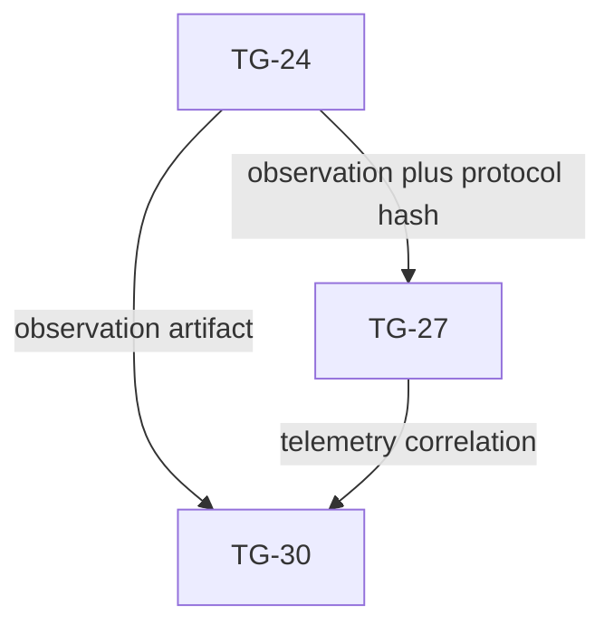

# Plan Delta — v1.7.19-kpi-baseline-deadline

## 1. Rationale

Move Product KPI evidence from the Test-design gate to the Implement completion gate without changing scope or architecture. The TC-076 Protocol Contract revision `tc076-v1` fixes the pilot/task/formula; this delta reallocates TG-27 within the existing ten-day horizon, re-estimates TG-24/TG-27/TG-30 and makes TG-30 reject missing, inconclusive or failed KPI evidence deterministically.

## 2. Effective Task-Group Overrides

| TG | Existing responsibility retained | Added responsibility | qa_test_refs | blocks / blocked_by | DOD evidence |
|---|---|---|---|---|---|
| TG-24 | Frontend-to-backend Workflow E2E integration | Execute the TC-076 Protocol Contract revision `tc076-v1`: allocate the next non-reusable sequence, run AS-IS → reset → Workflow, capture the fixed fixture/device/protocol and predeclared exclusion status | TC-076 plus existing browser E2E cases | effective `blocks=[TG-27,TG-28,TG-29,TG-30]`, `blocked_by=[TG-22]` | Write immutable `docs/evidence/kpi/TC-076/sets/{evidence_set_id}/observation.json`; TG-27/TG-30 independently verify its protocol and observation hashes |
| TG-27 | Observability/audit/redaction evidence | Verify canonical `ENT-007`/`ENT-011` fields and NFR-006 correlation for the same evidence set without payload/credential values | TC-076 plus existing observability cases | effective `blocks=[TG-30]`, `blocked_by=[TG-23,TG-24]` | Write immutable `docs/evidence/observability/TC-076/sets/{evidence_set_id}/telemetry-correlation.json`; incomplete/mismatched evidence is `KPI_INCONCLUSIVE` |
| TG-30 | Read-only coverage and internal-release evidence aggregation | Scan the current protocol's evidence sets, consume the greatest sequence, calculate KPI values, write decision and atomically publish the canonical selector; never replace observation or correlation | TC-076 plus existing final quality refs | effective `blocks=[]`, `blocked_by=[TG-24,TG-25,TG-26,TG-27,TG-28,TG-29]`; blocks `approve implement` | Write immutable `docs/evidence/release/TC-076/sets/{evidence_set_id}/decision.json` plus atomic `current.json`; only a selected matching `PASSED` permits approval |

The rows above replace the corresponding base `blocks`/`blocked_by` sets. All other base dependency edges remain unchanged. `TG-24 → TG-27` ensures correlation cannot start before the immutable observation exists; direct `TG-24 → TG-30` ensures TG-30 hashes that observation rather than relying on TG-27 or TG-28/TG-29 to relay it.

### 2a. KPI Evidence Artifact Contract

| Artifact | Producer | Minimum schema | Consumer / gate use | Mutation rule |
|---|---|---|---|---|
| `docs/evidence/kpi/TC-076/sets/{evidence_set_id}/observation.json` | TG-24 | `tc076-v1`; sequence/set ID; canonical marker-delimited protocol SHA-256; pilot/task/browser/device; redacted AS-IS/Workflow observations; counts; Workflow/Execution IDs; `VALID|EXCLUDED`; exclusion enum/note | TG-27/TG-30 independently reproduce the protocol digest, compute observation SHA-256 and verify identity, equivalence and predeclared exclusion rules | Immutable; only an excluded/incomplete attempt may create the next sequence |
| `docs/evidence/observability/TC-076/sets/{evidence_set_id}/telemetry-correlation.json` | TG-27 | set ID; observation SHA-256; `ENT-007.id/created_at`; selected `ENT-011.id/workflow_id/execution_type/status/finished_at`; NFR-006 correlation result; no payload/credential | TG-30 computes SHA-256 and verifies canonical data before deciding | Immutable; same set ID only |
| `docs/evidence/release/TC-076/sets/{evidence_set_id}/decision.json` | TG-30 | state `PASSED|FAILED|KPI_INCONCLUSIVE`; both input hashes; targets/observations/formula; evaluator; UTC `evaluated_at`; protocol/set/sequence | Gate accepts only when this is the selected greatest sequence and state is `PASSED` | Immutable; valid PASSED/FAILED is terminal for `tc076-v1` |
| `docs/evidence/release/TC-076/current.json` | TG-30 | protocol; selected set/sequence; three paths/hashes; state; evaluated_at | Gate compares selector with an independent greatest-sequence scan over all three roots | Mutable only by atomic temp-write + rename after decision persistence; selector mismatch blocks |

### 2b. Effective Evidence-Surface Overrides

| TG | Effective affected surface / `allowed_diff_boundary` addition | Effective `code_ownership_zones` addition | Concrete `repo_test_delta_target` |
|---|---|---|---|
| TG-24 | TC-076 protocol runner and observation evidence only; no telemetry or release decision | `tests/e2e/api-lab-workflow/kpi-baseline/**`; `docs/evidence/kpi/TC-076/**` | `tests/e2e/api-lab-workflow/kpi-baseline/**` validates fixture sequence, sequence allocation, exclusion enum and observation schema |
| TG-27 | TC-076 canonical-field/correlation verifier within observability boundary | `tests/observability/TC-076/**`; `docs/evidence/observability/TC-076/**` | `tests/observability/TC-076/**` validates ENT-007/011 selection, timestamps, IDs, redaction and mismatch outcomes |
| TG-30 | KPI scan/decision/selector verification only; no source or earlier evidence mutation | `scripts/verify-quality.*`; `docs/evidence/release/TC-076/**` | `scripts/verify-quality.*` tests greatest-sequence selection, hash chain, orphan/duplicate/supersession states and atomic selector publication |

The three write zones are disjoint. TG-30 may read TG-24/TG-27 artifacts after their dependencies complete but may write only its release-decision zone.

### 2c. Canonical Measurement And Selection Rules

- **Protocol/order:** `protocol_revision=tc076-v1`; `evidence_set_id=tc076-v1-a{attempt_sequence:04d}`. TG-24 allocates the next integer before observation; sequences never overlap or repeat.
- **Protocol digest:** use the unique BEGIN/END markers inside anchored `TC-076`; SHA-256 covers the exact raw UTF-8/LF byte slice after the BEGIN-marker LF through the LF immediately before the END marker, excluding marker lines. CR, invalid UTF-8, missing/duplicate markers, a slice without exactly one terminal LF or any TG-24/TG-27/TG-30 digest mismatch yields `KPI_INCONCLUSIVE`.
- **Canonical start:** `ENT-007 workflows.created_at` for the newly created protocol Workflow, keyed by `workflows.id`; UTC database clock, `DATETIME(3)`.
- **Canonical first success:** the smallest tuple `(executions.finished_at, executions.id)` in `ENT-011` where `workflow_id` matches, `execution_type='WORKFLOW'`, `status='SUCCEEDED'` and `finished_at IS NOT NULL`.
- **Calculation:** `elapsed_seconds=(ENT-011.finished_at-ENT-007.created_at)/1000` at millisecond precision; pass time iff `0 <= elapsed_seconds <= 600.000`. Reduction uses the observed integer denominator exactly as TC-076 specifies.
- **Correlation precedence:** Product tracking/NFR-006 telemetry confirms IDs/status/timestamps but never replaces ENT-007/011. Missing record, negative time, ID/status mismatch or telemetry timestamp differing from canonical data yields `KPI_INCONCLUSIVE`.
- **Selector:** scan the union of set IDs under all three owner roots for `tc076-v1`; greatest numeric sequence supersedes all older states. Duplicate/reused/malformed sequence, unknown protocol, orphan/hash mismatch or `current.json` disagreement blocks. Newest observation without decision is `PENDING`.
- **Rerun:** only excluded/incomplete attempts may allocate the next sequence. A valid `PASSED` or `FAILED` is terminal for `tc076-v1`; a later unauthorized same-revision set yields `KPI_INCONCLUSIVE`.

## 3. Delivery Traceability Addition

| FR / NFR / Risk | US | Architecture Refs | QA Test Intent | External QA Readiness | Task Group | Affected Code/Evidence Surfaces | Validation Commands | Repo Test Delta Target |
|---|---|---|---|---|---|---|---|---|
| `RISK-OPEN-001`; Product §3.1 KPI | US-003–US-008 | ENT-007 `workflows.id/created_at`; ENT-011 `executions.id/workflow_id/execution_type/status/finished_at`; NFR-006 correlation; FLOW-002 | TC-076 Protocol Contract revision `tc076-v1`; TC-076 | N/A — named personal-project pilot; independent study required before external/commercial use | TG-24, TG-27, TG-30 | protocol runner + `docs/evidence/kpi/TC-076/**`; correlation tests + `docs/evidence/observability/TC-076/**`; quality selector + `docs/evidence/release/TC-076/**` | `validate implementation --mode spec`; `validate implementation --mode quality` | TG-24 `tests/e2e/api-lab-workflow/kpi-baseline/**`; TG-27 `tests/observability/TC-076/**`; TG-30 `scripts/verify-quality.*` selection/hash fixtures |

### 3a. QA Test Reference Reconciliation

The following explicit replacements form the effective Plan truth; Test remains DRAFT until its own approval gate succeeds.

| Base Plan statement | Effective replacement in this pack |
|---|---|
| QA model: “Test has not started” | Test DRAFT exists at `docs/sprint-v1/testing/test-plan-v1.md` and `docs/sprint-v1/testing/proposals/test-cases-v1.md` with TC-001–TC-076. The mapping below is the implementation-consumable candidate QA intent; Test must be APPROVED before `approve implement`. |
| Phase Acceptance Gate item 4: every group uses `qa_test_intent_pending` | Every TG uses the concrete `qa_test_refs` below together with its unchanged base `repo_test_delta_target`; no external QA repository applies. |
| References: Testing “Pending ... scenarios” | Replace with the two Test DRAFT paths above; their validation and approval remain mandatory, and TC-076 runtime evidence is due only at `approve implement`. |

| TG | Effective `qa_test_refs` |
|---|---|
| TG-01 | TC-060, TC-061, TC-064, TC-075 |
| TG-02 | TC-065, TC-068 |
| TG-03 | TC-061, TC-064, TC-070, TC-073 |
| TG-04 | TC-001–006, TC-032, TC-062, TC-068, TC-075 |
| TG-05 | TC-003, TC-007, TC-025–026, TC-046–048, TC-052, TC-061, TC-071, TC-075 |
| TG-06 | TC-010–018, TC-033–035, TC-038, TC-042, TC-049–060, TC-075 |
| TG-07 | TC-025–027, TC-036–040, TC-046–048, TC-052, TC-060, TC-063, TC-071, TC-075 |
| TG-08 | TC-016–018, TC-033, TC-036–040, TC-042, TC-049–059, TC-061, TC-075 |
| TG-09 | TC-019–024, TC-031–032, TC-041, TC-043, TC-049–060, TC-063, TC-067, TC-075 |
| TG-10 | TC-028–031, TC-061, TC-063, TC-071, TC-075 |
| TG-11 | TC-013–024, TC-031, TC-043, TC-060, TC-063, TC-067, TC-075 |
| TG-12 | TC-007–009, TC-019–024, TC-041, TC-062–063, TC-068, TC-075 |
| TG-13 | TC-027, TC-030, TC-037, TC-039–040, TC-048, TC-052, TC-059, TC-063, TC-071, TC-075 |
| TG-14 | TC-064, TC-069–070 |
| TG-15 | TC-001–003, TC-025–027, TC-044–048, TC-052, TC-060, TC-068, TC-071–073, TC-075 |
| TG-16 | TC-004–009, TC-032, TC-041, TC-062, TC-068, TC-072, TC-075 |
| TG-17 | TC-010–015, TC-033–035, TC-038, TC-042, TC-049, TC-051, TC-058, TC-060, TC-072, TC-075 |
| TG-18 | TC-016–018, TC-036–040, TC-042, TC-049–059, TC-072, TC-075 |
| TG-19 | TC-007–009, TC-019–024, TC-028, TC-031, TC-043, TC-060, TC-062–064, TC-067–068, TC-072, TC-075 |
| TG-20 | TC-028–031, TC-061, TC-063, TC-071–072, TC-075 |
| TG-21 | TC-067, TC-074 |
| TG-22 | TC-060–075 |
| TG-23 | TC-060–071, TC-075 |
| TG-24 | TC-001–059, TC-072, TC-075, TC-076 |
| TG-25 | TC-060, TC-066–067, TC-073–074 |
| TG-26 | TC-022–024, TC-060, TC-062–063, TC-065, TC-068, TC-070 |
| TG-27 | TC-061, TC-064, TC-070, TC-073, TC-076 |
| TG-28 | TC-044–045, TC-072–073 |
| TG-29 | TC-061, TC-065, TC-068, TC-073 |
| TG-30 | TC-001–076 final evidence/coverage aggregation; TC-076 is a hard `approve implement` gate |

This table overrides only QA references and linked-coverage placeholders. Evidence surfaces, repo-test targets, effort and day changes for TG-24/TG-27/TG-30 are explicitly governed by §§2b and 4; all other base TG fields remain unchanged.

### 3b. Effective PLAN-1 QA Test Intent Overrides

The rows below replace only the `QA Test Intent` cell of the matching base Plan §2b Delivery Traceability Index row. Architecture refs, external-QA disposition, task groups, affected surfaces, validation commands and repo-test targets remain unchanged. These references point to the current Test DRAFT and become approval-consumable only after `approve test`.

| Base PLAN-1 row | Effective QA Test Intent |
|---|---|
| FR-001 | TC-001–003, TC-027, TC-037, TC-044–045, TC-065, TC-072, TC-075 |
| FR-002 | TC-004–006, TC-032, TC-062, TC-068, TC-075 |
| FR-003 | TC-003, TC-025–026, TC-046–048, TC-052, TC-071, TC-075 |
| FR-004 | TC-007–009, TC-041, TC-061, TC-075, TC-076 |
| FR-005 | TC-006–009, TC-041, TC-062, TC-068, TC-075, TC-076 |
| FR-006 | TC-010–015, TC-034–035, TC-038, TC-060, TC-075 |
| FR-007 | TC-016–018, TC-033, TC-042, TC-049–056, TC-061, TC-075, TC-076 |
| FR-008 | TC-019–021, TC-031, TC-043, TC-060, TC-063, TC-067, TC-075, TC-076 |
| FR-009 | TC-008, TC-022–024, TC-062–063, TC-068, TC-075 |
| FR-010 | TC-028–031, TC-063, TC-071, TC-075, TC-076 |
| FR-011 | TC-025–027, TC-036–040, TC-046–060, TC-071, TC-075 |
| FR-012 | TC-006–007, TC-009, TC-019, TC-028, TC-064, TC-068, TC-075 |
| NFR-001 | TC-066 |
| NFR-002, NFR-003 | TC-060, TC-062–063, TC-067 |
| NFR-004 | TC-062, TC-065, TC-068 |
| NFR-005, NFR-007 | TC-030, TC-048, TC-069, TC-071 |
| NFR-006 | TC-064, TC-070, TC-076 |
| NFR-008 | TC-044–045, TC-072–073 |
| NFR-009 | TC-074 |

## 4. Dependency And Timeline Effect

- No new task group or working day is added; the horizon remains Day 1–10.
- TG-24 remains D9-W1. TG-27 moves from D9-W2 to D10-W1 after both TG-23 and TG-24; its evidence zone is disjoint from TG-28/TG-29. TG-30 remains D10-W2 and consumes all three prerequisite lanes.
- Effective estimates/context fit: TG-24 `7 agent-h / 2.0 developer-h`, one bounded browser-protocol/evidence context; TG-27 `6 agent-h / 1.25 developer-h`, one canonical-field/correlation context; TG-30 `4 agent-h / 1.25 developer-h`, one read-only scan/decision/selector context. Each remains `S`, one day and ≤8 agent-h.
- Effective capacity: Day 9 becomes `5.5h` (base 6.0 − old TG-27 1.0 + TG-24 delta 0.5); Day 10 becomes `4.5h` (base 3.0 − old TG-30 1.0 + TG-27 1.25 + TG-30 1.25). Total becomes `39.0h ≤60h`; all other days stay unchanged. Total agent effort becomes `197h`.
- Any behavioral defect returns to its owning TG. TG-30 may only aggregate/refute evidence and cannot manufacture or repair metric values.
- `approve test` requires an execution-ready TC-076 protocol, not completed runtime evidence.
- `approve implement` requires the independently selected greatest `tc076-v1` sequence and matching `current.json` decision to be `PASSED`; every other state/selection/hash condition blocks it.

## 5. Acceptance Notes

Pass when Plan validation resolves TC-076 to TG-24/TG-27/TG-30, preserves code-ownership separation and makes the KPI decision an explicit `approve implement` gate. Fail on fabricated or inferred KPI measurements, changed pilot/task/protocol, unredacted evidence, missing telemetry correlation or a release decision that ignores `KPI_INCONCLUSIVE`; the fixed synthetic task/fixtures remain valid.

## Self-Review Checklist

- [x] Existing TG IDs and ten-day horizon are preserved; the explicit TG-24 → TG-27/TG-30 edges and TG-27 D10-W1 reallocation are capacity-checked
- [x] Product risk, Test case, Plan owners and approval gate are cross-linked
- [x] Evidence generation is separated from read-only aggregation
- [x] Effective dependency sets include symmetric TG-24 → TG-27 and TG-24/TG-27 → TG-30 evidence edges; all unchanged base edges remain authoritative
- [x] Every base `qa_test_intent_pending` placeholder has a concrete effective TC mapping
- [x] KPI Delivery Traceability row contains Architecture refs, concrete surfaces, validation commands and repo-test targets
- [x] All base PLAN-1 FR/NFR QA Test Intent cells have concrete effective TC overrides
- [x] Canonical timestamps, protocol version, greatest-sequence selection and supersession are deterministic
- [x] No metric or approval evidence is fabricated
