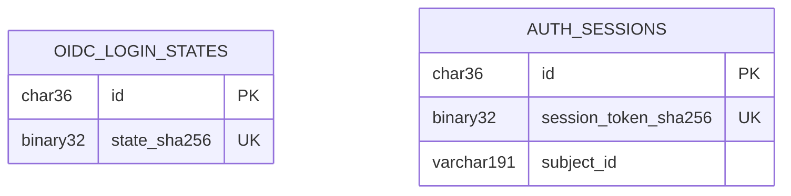

# Architecture Registry Delta — v1.7.21-oidc-session-error-contracts

## New

<!-- ID: ARCH-003 -->
### ARCH-003: Identity Entity Registry Cross-Reference

This block is an Architecture-level cross-reference for the Identity persistence change. The canonical ERD additions, registered table codes, access patterns and ownership extension are routed through `ENT-022` and `ENT-023` in `architecture-delta-v1.7.21-oidc-session-error-contracts.md`; those `ENT-*` anchors merge into `erd.md` and supersede the older `Session/actor projection` row wherever the two differ. This `ARCH-003` block does not claim an ERD merge route.

#### Relationship extension

No FK connects the ephemeral login state to the session. Both tables are Identity-owned roots keyed by application-generated UUID; Central-IAM subject ID is an immutable external reference, not a local FK.

#### Registered immutable table codes

| Code | Table | Allowed name examples |
|---|---|---|
| `ols` | `oidc_login_states` | `ck_ols_expiry`, `uq_ols_state_hash`, `ix_ols_expiry` |
| `as` | `auth_sessions` | `ck_as_expiry`, `uq_as_token`, `ix_as_subject_active`, `ix_as_expiry` |

Migration lint must reject `oidc_state`, `auth_session` or any other unregistered prefix for these tables.

#### Access patterns and ownership

| Pattern / domain | Index / owner | Consistency and consumer rule |
|---|---|---|
| Claim one login state by digest and retain replay tombstone until expiry | `uq_ols_state_hash`, `ix_ols_expiry`; Identity & Access Master | atomic conditional update; no other context reads the table |
| Resolve active session by opaque-selector digest | `uq_as_token`; Identity & Access Master | strong read before every protected request |
| Revoke subject sessions or purge expired sessions | `ix_as_subject_active`, `ix_as_expiry`; Identity & Access Master | monotonic invalidation; bounded cleanup |
| Actor projection | Identity & Access Master; all domain contexts Consume through `requireActor` | no direct ENT-023 reads outside Identity |

#### Canonical ownership matrix extension

| Entity / data domain | Identity & Access | System Catalog | API Workspace | Workflow Definition | Execution | Outbound Integration | Audit & Operations |
|---|---|---|---|---|---|---|---|
| OIDC login state and server session (ENT-022/023), including versioned actor/MFA projection | Master | Consume through `requireActor` only | Consume through `requireActor` only | Consume through `requireActor` only | Consume through immutable actor context only | — | Consume redacted audit projection only |

No context outside Identity may import the ENT-022/023 repositories or read their tables directly. FLOW-004 owns their authentication data movement; API-017–020/024 own their public lifecycle/error contract.

#### Data risks

| Risk | Control | Verification |
|---|---|---|
| Replay or two callbacks consume one state | conditional single-row claim before provider exchange | concurrent integration test proves one winner |
| Raw selector/verifier/CSRF leaks | SHA-256 selectors; AES-256-GCM verifier/CSRF ciphertext; key only in Secret Manager | DB/log/trace/browser secret-marker scan |
| Session remains usable after expiry/revocation | absolute/idle checks and authoritative IAM verification before payload | boundary-clock and dependency-failure tests |

## Updated

## Removed

### Self-Review Checklist

- [x] `ARCH-003` routes to Architecture while ENT-022/023 relationship, immutable table codes, access patterns and ownership route through their canonical `ENT-*` anchors to the ERD target.
- [x] Canonical ownership forbids direct cross-context reads and links FLOW-004 plus API-017–020/024.
- [x] Data risks cover replay, restricted material and lifecycle revocation.
