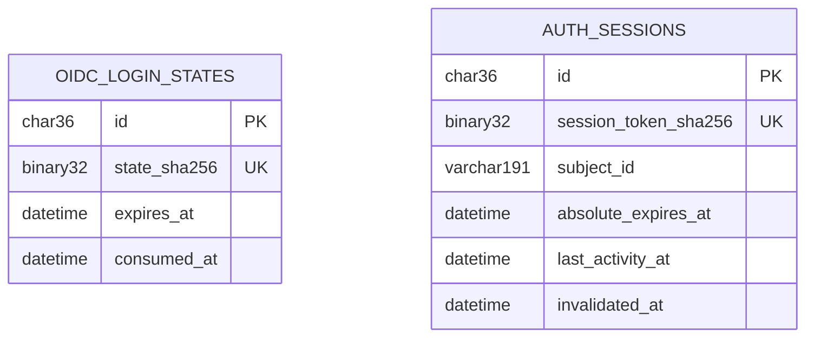
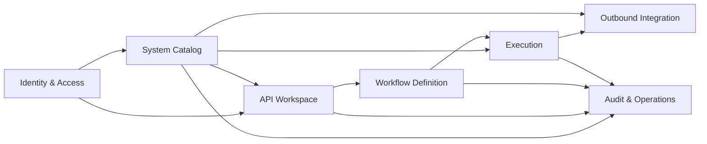

# Architecture Delta — v1.7.21-oidc-session-error-contracts

### 1. Rationale

TG-02 and TG-03 stopped at the mandatory pre-code gate because approved Architecture did not provide an implementable identity persistence schema, contradicted itself on authoritative-IAM uncertainty, and required a generated error catalog whose source was outside approved Plan ownership. This delta supplies the smallest coherent contract correction.

### 2. Downstream Impact

- Plan: expand TG-02 Prisma/migration/test ownership and TG-03 catalog/generator/manifest ownership.
- Test: refine TC-065 and TC-070 with exact expiry, replay, error and generation assertions; refine TC-072 for every valid and malformed DS-COMP-012 recovery branch.
- Implement: the already-open TG-02/TG-03 lanes have absorbed this selected DRAFT candidate truth in six bounded slices. Their evidence remains `IN_PROGRESS`; merge/closure and `approve implement` remain gated by this pack's approval and both implementation validations.
- Product/Design: Product is unchanged. Design delta DS-COMP-012 defines pre-claim MSG-047 bounded same-callback retry, post-claim MSG-046 `RESTART_LOGIN` recovery, and malformed-contract MSG-048 fail-closed recovery with separate hooks, actions and exits. MSG-024 remains reserved for actual session expiry. Ordinary protected-route 503 responses retain their existing retry surfaces.

### 3. Acceptance Notes

- Every login-state/session field has concrete MySQL DDL, constraint and index semantics.
- API-017–020, SEQ-001, ADR-006, ARCH-COMP-001, NFR-004 and PR-001 use the same lifecycle and error meanings.
- IAM uncertainty and session-store failure are distinguishable typed `503` outcomes with `Retry-After`.
- `backend/errors.yml` remains the canonical catalog and its generator/output boundary is explicit.

---

## New

<!-- ID: ENT-022 -->
### ENT-022: `oidc_login_states`

Owner: Identity & Access. Durable one-time Authorization Code + PKCE initiation state; no raw state, nonce, PKCE verifier or IAM token is stored.

```sql
CREATE TABLE oidc_login_states (
  id CHAR(36) PRIMARY KEY,
  state_sha256 BINARY(32) NOT NULL,
  nonce_sha256 BINARY(32) NOT NULL,
  pkce_verifier_ciphertext VARBINARY(1024) NOT NULL,
  pkce_verifier_nonce BINARY(12) NOT NULL,
  pkce_verifier_tag BINARY(16) NOT NULL,
  pkce_verifier_key_id VARCHAR(128) NOT NULL,
  return_to VARCHAR(2048) NOT NULL,
  created_at DATETIME(3) NOT NULL,
  updated_at DATETIME(3) NOT NULL,
  expires_at DATETIME(3) NOT NULL,
  consumed_at DATETIME(3) NULL,
  CONSTRAINT ck_ols_expiry CHECK (expires_at > created_at),
  UNIQUE KEY uq_ols_state_hash (state_sha256),
  KEY ix_ols_expiry (expires_at, consumed_at)
) ENGINE=InnoDB;
```

Access pattern: API-017 inserts one row with `expires_at = created_at + 10 minutes`. API-018 hashes the supplied state and atomically sets `consumed_at` only when the row is unconsumed and not expired. Consumption happens before the external token exchange, so a crash or provider failure cannot make the callback reusable; the user starts a new login. Consumed rows remain until their original expiry and are then removed by bounded retention. PKCE verifier encryption uses a secret-manager key reference; lookup/decryption failure returns `KEY_PROVIDER_UNAVAILABLE`, while row persistence failure returns `SESSION_STORE_UNAVAILABLE`; neither condition creates a session.

<!-- ID: ENT-023 -->
### ENT-023: `auth_sessions`

Owner: Identity & Access. Server-side session projection; Central IAM remains the identity and lifecycle master.

```sql
CREATE TABLE auth_sessions (
  id CHAR(36) PRIMARY KEY,
  session_token_sha256 BINARY(32) NOT NULL,
  subject_id VARCHAR(191) NOT NULL,
  actor_projection_json JSON NOT NULL,
  mfa_assurance_json JSON NOT NULL,
  csrf_token_sha256 BINARY(32) NOT NULL,
  csrf_token_ciphertext VARBINARY(1024) NOT NULL,
  csrf_token_nonce BINARY(12) NOT NULL,
  csrf_token_tag BINARY(16) NOT NULL,
  csrf_token_key_id VARCHAR(128) NOT NULL,
  absolute_expires_at DATETIME(3) NOT NULL,
  last_activity_at DATETIME(3) NOT NULL,
  invalidated_at DATETIME(3) NULL,
  invalidation_reason VARCHAR(32) NULL,
  revision BIGINT UNSIGNED NOT NULL DEFAULT 1,
  created_at DATETIME(3) NOT NULL,
  updated_at DATETIME(3) NOT NULL,
  CONSTRAINT ck_as_expiry CHECK (absolute_expires_at > created_at),
  CONSTRAINT ck_as_actor_json CHECK (JSON_TYPE(actor_projection_json) = 'OBJECT'),
  CONSTRAINT ck_as_mfa_json CHECK (JSON_TYPE(mfa_assurance_json) = 'OBJECT'),
  CONSTRAINT ck_as_invalidation CHECK (
    (invalidated_at IS NULL AND invalidation_reason IS NULL) OR
    (invalidated_at IS NOT NULL AND invalidation_reason IN ('LOGOUT','IDLE_TIMEOUT','ABSOLUTE_EXPIRY','IAM_REVOKED'))
  ),
  UNIQUE KEY uq_as_token (session_token_sha256),
  KEY ix_as_subject_active (subject_id, invalidated_at, absolute_expires_at),
  KEY ix_as_expiry (absolute_expires_at, invalidated_at)
) ENGINE=InnoDB;
```

Access pattern: the cookie contains a random opaque selector whose SHA-256 digest locates the row. The row stores only a minimal allowlisted actor/MFA projection. It stores the CSRF selector as both a lookup/comparison digest and AES-256-GCM ciphertext so API-020 can return the same session-bound token after process restart; plaintext exists only in request-local memory and is never logged. It stores no access, refresh or ID token and no full IAM claims. `absolute_expires_at` is copied from the verified IAM session/token expiry. Before protected data access, one transaction rejects/invalidate absolute expiry or inactivity greater than 15 minutes; a successful request advances `last_activity_at` and `revision` only when at least 60 seconds elapsed since the prior persisted activity. Revocation/logout invalidation is monotonic and cannot be reversed. CSRF decryption failure returns `KEY_PROVIDER_UNAVAILABLE`; repository failure remains `SESSION_STORE_UNAVAILABLE`.

**Versioned JSON projection contract:** application validation runs before insert and after read; unknown keys, wrong types or unsupported versions fail closed as corrupt session data and never reach `requireActor`. `actor_projection_json` is exactly `{ "schemaVersion": 1, "id": string[1..191], "displayName": string[1..191], "email"?: string[1..320] }`. `mfa_assurance_json` is exactly `{ "schemaVersion": 1, "amr": array<string>[1..16] (unique values, each 1..64 characters, containing "mfa"), "acr": string[1..191] }`. Email remains an opaque display/contact value after IAM validation; no authorization decision uses it. Writers reject additional IAM claims rather than persisting them. Readers accept only version `1`; a future shape requires a new supported version plus migration/backward-read rules.



The callback creates no FK between the ephemeral login-state row and the session. It consumes ENT-022 before provider exchange and creates ENT-023 only after verified IAM/MFA success, preventing retained login metadata from becoming session authority.

**Registered immutable table codes:** `oidc_login_states` uses code `ols` with names such as `ck_ols_expiry`, `uq_ols_state_hash` and `ix_ols_expiry`; `auth_sessions` uses code `as` with names such as `ck_as_expiry`, `uq_as_token`, `ix_as_subject_active` and `ix_as_expiry`. Migration lint rejects `oidc_state`, `auth_session` and every unregistered prefix for these tables.

**Canonical ERD ownership extension:** ENT-022/023 are Identity & Access Master data. System Catalog, API Workspace and Workflow Definition consume only the immutable actor context exposed by `requireActor`; Execution consumes only the immutable actor context captured at start; Audit & Operations consumes only redacted audit projection. No context outside Identity imports the ENT-022/023 repositories or reads their tables directly. This extension supersedes the older `Session/actor projection` ownership row wherever the two differ. FLOW-004 owns authentication data movement and API-017–020/024 own the public lifecycle/error contract.

| ERD access pattern | Index / owner | Consistency and consumer rule |
|---|---|---|
| Claim one login state by digest and retain replay tombstone until expiry | `uq_ols_state_hash`, `ix_ols_expiry`; Identity & Access Master | atomic conditional update; no other context reads the table |
| Resolve active session by opaque-selector digest | `uq_as_token`; Identity & Access Master | strong read before every protected request |
| Revoke subject sessions or purge expired sessions | `ix_as_subject_active`, `ix_as_expiry`; Identity & Access Master | monotonic invalidation; bounded cleanup |
| Consume actor projection | Identity & Access Master; other contexts through `requireActor` | no direct ENT-023 reads outside Identity |

<!-- ID: ARCH-002 -->
### ARCH-002: Identity Persistence C4 Addendum

This is the candidate-truth addendum to ARCH-OVERVIEW-001 for the two new persistence entities. It supplements—not replaces—the approved three-level C4 package and is authoritative wherever the older overview says `ENT-001–021` or describes Identity as projection-only. The effective package index is `ENT-001–023`, `FLOW-001–004`, `API-001–024`, `NFR-001–010`; Identity & Access owns ENT-022/023 and the new API-017–020 boundary.

| C4 level | Candidate correction | Relationship |
|---|---|---|
| System Context | Central IAM remains the external identity authority and Secret Manager remains the external key authority; MySQL is an internal API Lab container and is not shown as an external software system | User → API Lab System → Central IAM/Secret Manager |
| Container | Fastify API/Identity Adapter owns ENT-022/023 repositories and key-adapter calls; browser keeps only Secure/HttpOnly session cookie plus request-local CSRF value | Vue SPA → Fastify API → Central IAM/Secret Manager/MySQL |
| Component | ARCH-COMP-001 uses `OidcLoginStateRepository`, `AuthSessionRepository`, `CentralIamStatusPort` and `IdentityKeyPort`; infrastructure adapters realize those ports; other domains receive only immutable actor context | Identity Adapter → ports; repository adapters → MySQL; IAM adapter → Central IAM; key adapter → Secret Manager |

- **Bounded-context correction:** Identity & Access masters ENT-022/023, consumes Central-IAM status and Secret Manager key handles, and exposes actor context through `requireActor`; it is no longer “Session/actor projection only” without durable ownership.
- **Entity-range correction:** the sprint-v1 Architecture package contains `ENT-001–023`.
- **Editable source:** `docs/sprint-v1/architecture/assets/c4-identity-session-delta.drawio`; pages `System Context — Identity Delta`, `Container — Identity Delta` and `Component — Identity Delta` record the added context/container/component relationships. It is reviewed together with the approved three-page `architecture/assets/c4-model.drawio` source and is copied by the sprint-seal asset route.

<!-- ID: NFR-010 -->
### NFR-010: Identity Boundary Reliability And Configuration

This independent NFR defines the fail-closed identity dependency budget and its canonical implementation mapping.

| Field | Value |
|---|---|
| Category | Identity boundary reliability and security configuration enforcement |
| Target | exact 10-minute OIDC state expiry; `>15m` idle invalidation; `>=60s` activity persistence; one 5-second end-to-end callback IAM deadline covering discovery, JWKS and token exchange; one 2-second protected-status call; zero positive-status cache; Secret Manager-referenced encryption keys |
| Source | ADR-006, ENT-022/023, API-017–020/024 |
| Priority | Must |
| Applies to | Identity/API, MySQL repositories, Secret Manager and Central-IAM adapter |
| Verification | boundary-clock integration tests, configuration-contract test, dependency-failure tests and secret-marker scan |

| NFR ID | NFR Target | Config Key | Value | Who Sets It | Notes |
|---|---|---|---|---|---|
| NFR-010 | One-time OIDC state lifetime | `OIDC_LOGIN_STATE_TTL_MINUTES` | `10` | Identity/API | exact expiry; callback at the boundary is expired |
| NFR-010 | Session idle/activity persistence | `SESSION_IDLE_TIMEOUT_MINUTES` / `SESSION_ACTIVITY_WRITE_MIN_SECONDS` | `15` / `60` | Identity/API | idle invalidation is `>15m`; activity write is due at `>=60s` |
| NFR-010 | End-to-end callback IAM deadline | `IAM_LOGIN_TIMEOUT_MS` / `IAM_LOGIN_RETRY_MAX` | `5000` / `3` | Identity/API/SRE | one deadline starts before discovery and is shared by discovery, JWKS and token POST; safe GET may retry within remaining time; token POST and callback resubmission never retry |
| NFR-010 | Authoritative protected-status verification | `IAM_STATUS_TIMEOUT_MS` / `IAM_POSITIVE_STATUS_CACHE_SECONDS` | `2000` / `0` | Identity/API/SRE | exactly one status call per protected request; no cache and no request retry |
| NFR-010 | Identity encryption keys | `OIDC_STATE_KEY_ID` / `SESSION_CSRF_KEY_ID` | Secret Manager references | SRE/Security | key material never enters app config or persistence |

| Context | System response | Metric |
|---|---|---|
| Login discovery/JWKS/token path is transiently unavailable | retry only idempotent GET within the remaining end-to-end 5-second deadline, give token POST only the remaining time, then fail with `SERVICE_UNAVAILABLE` | total elapsed ≤5000ms; zero token-POST retry; no callback resubmission |
| Protected subject status is unavailable or uncertain | one call bounded at 2 seconds, then `503 SERVICE_UNAVAILABLE`; no protected payload | exactly one status call, zero positive-cache hits and zero protected payload |
| State/session/key configuration differs from the canonical values | startup/config-contract validation fails closed | zero runtime start with invalid identity security parameters |

<!-- ID: API-024 -->
### API-024: Identity Error Catalog And Endpoint Override

This candidate anchor is normative for API-017–020 and for the common Identity middleware inherited by every protected API. The pack's updated API-023 anchor removes the two pre-release identity aliases and aligns its API-017–020 matrix with this contract while preserving all domain-specific catalog and endpoint rows. The generator applies this addendum after that canonical catalog and fails if an endpoint resolves to two active meanings.

**Protected-route middleware inheritance:** every endpoint whose `Auth` is `Required` inherits the `requireActor` outcomes `401 AUTH_REQUIRED`, `503 SERVICE_UNAVAILABLE` and `503 SESSION_STORE_UNAVAILABLE`, even when its endpoint-specific API-023 row does not repeat them. All such endpoints first execute ordinary `requireActor` except API-019, whose explicit tombstone-aware authentication operation below preserves the same active-session outcomes while allowing idempotent logout tombstones. A protected response that must decrypt the session-bound CSRF value additionally inherits `503 KEY_PROVIDER_UNAVAILABLE`; API-019 verifies the supplied CSRF digest and API-020 `304` returns an empty body, so neither path decrypts CSRF. These outcomes are merged into generated endpoint metadata before domain-specific outcomes, require positive `retry_after_seconds` plus HTTP `Retry-After` for every `503`, and stop before protected domain reads or writes. The generator rejects a protected endpoint that removes, aliases or remaps an inherited outcome.

**Identity retry field contract:** for every API-024 `503`, the standard envelope includes `error.details.retry_after_seconds` as a required integer in `[1,86400]`; example: `{"error":{"code":"SERVICE_UNAVAILABLE","message":"Dịch vụ xác thực tạm thời không khả dụng.","request_id":"req-uuid","trace_id":"trace-id","details":{"retry_after_seconds":5}}}`. The decimal HTTP `Retry-After` header carries the identical integer. Generated YAML/OpenAPI/runtime output fails contract validation when either value is missing, non-positive, outside range or unequal. Non-429/503 responses omit this detail unless another endpoint contract explicitly requires it.

**Callback recovery-action field contract:** `error.details.recovery_action` is a string enum whose only v1 value is `RESTART_LOGIN`. It is required on API-018 `503` responses produced after the ENT-022 claim commits, forbidden/omitted on pre-claim API-018 failures and all other endpoint contexts, and never substitutes for `retry_after_seconds`. `backend/errors.yml` records the allowed enum for the three API-018 dependency codes; generated OpenAPI exposes the optional enum property, while Identity runtime validation/tests enforce the endpoint- and commit-dependent required/omitted branch. Any unknown value or invalid retry metadata on API-018 is a client fail-closed condition: discard callback input and start a fresh API-017 flow with the fixed safe landing path `/`. A `RESTART_LOGIN` value received from any non-API-018 response is not actionable and must not trigger navigation.

**API-019 authentication exception:** API-019 is `Auth: Required` but replaces the ordinary `requireActor` pre-handler with the tombstone-aware Identity logout operation. That operation resolves the selector first: an ACTIVE session performs the normal authoritative-IAM and CSRF checks; a still-resolvable `LOGOUT` tombstone verifies its persisted CSRF digest and returns idempotent 200 without IAM status lookup or mutation; unknown, expired, purged or differently invalidated selectors return `401 AUTH_REQUIRED`. API-019 still inherits the same typed IAM/store outcomes where its active-session path can produce them. No other protected endpoint bypasses `requireActor`.

| Code | HTTP | Retryable | Condition |
|---|---:|---|---|
| `SERVICE_UNAVAILABLE` | 503 | yes | a required dependency, bulkhead or process capacity is transiently unavailable, including Central IAM discovery/token/status uncertainty; `Retry-After` required |
| `KEY_PROVIDER_UNAVAILABLE` | 503 | yes | PKCE/CSRF encryption or decryption key lookup fails; `Retry-After` required |
| `SESSION_STORE_UNAVAILABLE` | 503 | yes | ENT-022/023 repository transaction/read fails; `Retry-After` required |

`IAM_UNAVAILABLE` and `IAM_OR_SESSION_STORE_UNAVAILABLE` were pre-release proposal names and were never shipped by an approved/sealed public API. Sprint v1 is still unsealed, so API-024 replaces them before the first release; `backend/errors.yml`, generated TypeScript/OpenAPI and runtime responses must not emit them. ADR-006 records this pre-release compatibility decision; any rename after first external release requires a versioned API/ADR and deprecation window.

| API | 400 | 401 | 403 | 404 | 409 | 422 | 429 | 500 | 503 |
|---|---|---|---|---|---|---|---|---|---|
| API-017 | INVALID_RETURN_URL | N/A | ACCESS_DENIED | N/A | LOGIN_ALREADY_ACTIVE | OIDC_CONFIG_INVALID | RATE_LIMIT_EXCEEDED | INTERNAL_ERROR | SERVICE_UNAVAILABLE/KEY_PROVIDER_UNAVAILABLE/SESSION_STORE_UNAVAILABLE |
| API-018 | OIDC_CALLBACK_INVALID | OIDC_TOKEN_REJECTED | ACCESS_DENIED | SESSION_STATE_NOT_FOUND | CALLBACK_REPLAYED | CLAIM_MAPPING_INVALID | RATE_LIMIT_EXCEEDED | INTERNAL_ERROR | SERVICE_UNAVAILABLE/KEY_PROVIDER_UNAVAILABLE/SESSION_STORE_UNAVAILABLE |
| API-019 | INVALID_REQUEST | AUTH_REQUIRED | CSRF_INVALID | N/A | N/A | GLOBAL_LOGOUT_UNSUPPORTED | RATE_LIMIT_EXCEEDED | INTERNAL_ERROR | SERVICE_UNAVAILABLE/SESSION_STORE_UNAVAILABLE |
| API-020 | INVALID_REQUEST | AUTH_REQUIRED | ACCESS_DENIED | N/A | SESSION_STATE_CONFLICT | SESSION_CLAIMS_INVALID | RATE_LIMIT_EXCEEDED | INTERNAL_ERROR | SERVICE_UNAVAILABLE/KEY_PROVIDER_UNAVAILABLE/SESSION_STORE_UNAVAILABLE |

Each 503 response carries positive `retry_after_seconds` metadata and HTTP `Retry-After`, returns no protected payload and never silently changes to 401/403. For API-018, `retryable=yes` means the dependency may recover after that delay; it never authorizes resubmitting a consumed callback. If failure occurs before the conditional claim commits, the state remains unconsumed, `recovery_action` is omitted and the caller may retry that callback after the delay. If failure occurs after commit, `recovery_action=RESTART_LOGIN` is required and the client starts API-017 with `returnTo=/` after the delay; neither the consumed callback route nor API-018's success-only `returnTo` is used as a recovery source. API-019 uses the explicit tombstone-aware authentication exception above and verifies CSRF by digest; `KEY_PROVIDER_UNAVAILABLE` applies to API-020 200 responses and login/callback encryption paths. A repository failure remains distinct.

<!-- ID: FLOW-004 -->
### FLOW-004: OIDC Login-State And Protected-Session Flow

FLOW-001 remains the post-authenticated configuration flow. This separate flow supplies the authentication movement that FLOW-001 intentionally treats as a precondition.

| Element | Detail |
|---|---|
| External actors/systems | User, Central IAM, Secret Manager |
| Processes | P1 Login initiation/callback; P2 protected-session authorization |
| Stores | D1 ENT-022 login state; D2 ENT-023 server session |
| Editable source | `docs/sprint-v1/architecture/assets/identity-session-data-flow.drawio`, page `Identity-Session`; copied by the sprint-seal asset route |

| Arrow ID | From → To | Data / classification |
|---|---|---|
| `i-e1` | User/browser → P1 | safe return URL / Internal; no bearer persistence |
| `i-e2` | P1 → Secret Manager | verifier/CSRF key reference / Restricted metadata |
| `i-e3` | Secret Manager → P1 | request-local key handle / Restricted memory only |
| `i-e4` | P1 → D1 | state/nonce digests, encrypted verifier, expiry/consume time / Confidential |
| `i-e5a` | P1 → User/browser | API-017 `200 authorizationUrl` with state/challenge; browser then navigates / Restricted transport |
| `i-e5b` | User/browser → Central IAM | authorize request with state/challenge / Restricted transport |
| `i-e5c` | Central IAM → User/browser | callback redirect with code/state / Restricted transport |
| `i-e5d` | User/browser → P1 | callback code/state / Restricted transport |
| `i-e5e` | P1 → Central IAM | discovery/JWKS GET and one-time token exchange / Restricted transport |
| `i-e5f` | Central IAM → P1 | verified token/nonce/MFA/subject result / Restricted transport |
| `i-e6` | P1 → D2 | session/CSRF digests, encrypted CSRF, allowlisted actor/MFA projection, expiry / Confidential |
| `i-e7` | User/browser → P2 | opaque session cookie and mutation CSRF value / Restricted transport |
| `i-e8a` | P2 → D2 | session resolve, expiry/activity/revision/invalidation command / Confidential |
| `i-e8b` | D2 → P2 | session projection, revision and transaction result / Confidential |
| `i-e9a` | P2 → Central IAM | authoritative subject/session-status query / Confidential transport |
| `i-e9b` | Central IAM → P2 | active/inactive/uncertain status result / Confidential transport |
| `i-e10` | P2 → Secret Manager | session-CSRF key reference for API-020 200 / Restricted metadata |
| `i-e11` | Secret Manager → P2 | request-local CSRF decryption key handle / Restricted memory only |
| `i-e12` | P1 → User/browser | API-018 `200 returnTo` + HttpOnly cookie; pre-claim typed 503 permits one delayed same-callback retry; post-claim/malformed recovery starts API-017 with `returnTo=/` / Restricted transport |
| `i-e13` | P2 → User/browser | authorized session/protected response or typed fail-closed error / Confidential transport |

Failure rules: key lookup returns `KEY_PROVIDER_UNAVAILABLE`; repository failure returns `SESSION_STORE_UNAVAILABLE`; IAM uncertainty returns `SERVICE_UNAVAILABLE`; inactive/expired authority returns `AUTH_REQUIRED`. Every failure stops before protected domain reads/writes. TLS ≥1.3, no raw-token persistence and the ARCH-003 ownership rules apply.

## Updated

+<!-- ID: API-023 -->
### API-023: `DELETE /api/v1/hosts/{hostId}/api-lab/environments/{environmentKey}`

| Attribute | Value |
|---|---|
| Auth | Required |
| Roles | Authenticated user; Host/resource ABAC |
| Idempotent | Yes — `Idempotency-Key`, actor/route/payload scoped for 24 h |
| Rate limit | 120 requests/minute per actor/route; burst 20 |

| Request field | In | Type | Required | Default | Validation | Example |
|---|---|---|---|---|---|---|
| `hostId` | path | UUID | yes | — | existing logical Host | `a3f...` |
| `environmentKey` | path | string | yes | — | existing binding in Host | `UAT` |
| `If-Match` | header | integer ETag | yes | — | current binding revision | `8` |
| `Idempotency-Key` | header | string | yes | — | actor/route scoped; max 128 | `env-delete-1` |
| `X-CSRF-Token` | header | string | yes | — | current session-bound token | `csrf...` |

| Response field | Type | Required | Description | Example |
|---|---|---|---|---|
| `deletedEnvironmentKey` | string | yes | removed binding key | `UAT` |
| `remainingEnvironmentCount` | integer | yes | may be zero | `0` |
| `schemaRevision` | integer | yes | unchanged Host-wide schema revision | `3` |

**Success:** HTTP `200 OK`; binding values, encrypted credential reference and immutable audit fact are deleted atomically. Deleting the last Environment is allowed and produces the Design `environment-empty` state; the Host-wide variable schema remains so the next API-002 create can supply/migrate values deliberately. Existing Executions retain immutable ENT-020 snapshots, while new runs cannot select the deleted binding.

**Errors:** `400 INVALID_REQUEST`; `401 AUTH_REQUIRED`; `403 CSRF_INVALID|ACCESS_DENIED`; `404 HOST_OR_ENVIRONMENT_NOT_FOUND`; `409 REVISION_CONFLICT|IDEMPOTENCY_KEY_REUSED`; `422 IDEMPOTENCY_RESPONSE_TOO_LARGE`; `429 RATE_LIMIT_EXCEEDED`; `503 SERVICE_UNAVAILABLE`; `500 ENVIRONMENT_DELETE_FAILED`.

#### 1. Standard Error Envelope

```json
{"error":{"code":"WORKFLOW_CAPACITY_REACHED","message":"Đã đạt giới hạn 20 workflow đang chạy.","request_id":"req-uuid","trace_id":"trace-id","details":{"active":20}}}
```

#### 2. Error Code Catalog

| Code | HTTP | Retryable | Condition |
|---|---:|---|---|
| `INVALID_REQUEST` | 400 | after correction | malformed syntax, identifier or body envelope |
| `INVALID_COMMAND` | 400 | after correction | unsupported resource command or missing command discriminator |
| `INVALID_RETURN_URL` | 400 | after correction | login return URL is not same-origin/allowlisted |
| `OIDC_CALLBACK_INVALID` | 400 | no | callback parameters/state are malformed |
| `AUTH_REQUIRED` | 401 | after login | no or expired authenticated session |
| `OIDC_TOKEN_REJECTED` | 401 | after login | IAM token exchange/validation rejected identity |
| `ACCESS_DENIED` | 403 | no | actor cannot access scoped Host/resource |
| `CSRF_INVALID` | 403 | after refresh | missing, expired or mismatched CSRF token |
| `HOST_OR_RESOURCE_NOT_FOUND` | 404 | no | Host or selected resource absent in scope |
| `HOST_OR_ENVIRONMENT_NOT_FOUND` | 404 | no | Host or Environment binding absent |
| `HOST_OR_WORKSPACE_NOT_FOUND` | 404 | no | Host or Workspace absent |
| `RESOURCE_OR_PARENT_NOT_FOUND` | 404 | no | command target or parent absent |
| `API_NOT_FOUND` | 404 | no | API absent in Host Workspace |
| `API_TOMBSTONE_NOT_FOUND` | 404 | no | undoable deletion record absent |
| `API_OR_HOST_NOT_FOUND` | 404 | no | API or owning Host absent |
| `WORKFLOW_OR_VERSION_NOT_FOUND` | 404 | no | Workflow or requested version absent |
| `WORKFLOW_OR_API_VERSION_NOT_FOUND` | 404 | no | Workflow or referenced API version absent |
| `WORKFLOW_OR_REPORT_NOT_FOUND` | 404 | no | Workflow or validation report absent |
| `API_VERSION_OR_BINDING_NOT_FOUND` | 404 | no | API version or Environment binding absent |
| `WORKFLOW_VERSION_REPORT_OR_BINDING_NOT_FOUND` | 404 | no | Workflow version, report or binding absent |
| `EXECUTION_NOT_FOUND_OR_EXPIRED` | 404 | no | Execution absent or outside retention |
| `HOST_NOT_FOUND` | 404 | no | logical Host absent |
| `SOURCE_OR_LATEST_DEFINITION_OR_BINDING_NOT_FOUND` | 404 | no | rerun source/latest definition/binding absent |
| `SESSION_STATE_NOT_FOUND` | 404 | no | OIDC callback session state absent/expired |
| `SESSION_NOT_FOUND` | 404 | no | authenticated session record absent |
| `HOST_CONTEXT_CONFLICT` | 409 | after refresh | selected Host context changed |
| `REVISION_CONFLICT` | 409 | after refresh | optimistic revision is stale |
| `ENVIRONMENT_PRECONDITION_FAILED` | 409 | after refresh | create/update precondition does not match Environment existence |
| `SCHEMA_IN_USE` | 409 | after correction | schema key removal would orphan Environment values |
| `WORKSPACE_STATE_CONFLICT` | 409 | after refresh | Workspace state changed during query/mutation |
| `DUPLICATE_SIBLING` | 409 | after correction | sibling name already exists |
| `TREE_CYCLE` | 409 | after correction | move would create an ancestry cycle |
| `RESOURCE_NOT_EMPTY` | 409 | after correction | non-empty resource cannot be removed by command |
| `IMPACT_TOKEN_INVALID` | 409 | after preview | impact token absent, expired, mismatched or stale |
| `API_STATE_CONFLICT` | 409 | after refresh | API lifecycle state disallows action |
| `API_UNDO_WINDOW_EXPIRED` | 409 | no | server-authoritative 10-second undo deadline elapsed |
| `WORKFLOW_STATE_CONFLICT` | 409 | after refresh | Workflow lifecycle state disallows read/action |
| `WORKFLOW_REVISION_CONFLICT` | 409 | after refresh/copy | Workflow optimistic revision is stale |
| `IDEMPOTENCY_KEY_REUSED` | 409 | with new key/correct payload | same scoped key used with a different payload hash |
| `IDEMPOTENCY_RESPONSE_TOO_LARGE` | 422 | after reducing response-producing input | projected successful response exceeds 65,536 bytes; coordinator rolls back before commit |
| `VERSION_NOT_CURRENT` | 409 | after refresh | validation target is not current saved version |
| `RECOVERY_REVISION_CONFLICT` | 409 | after refresh | recovery session revision is stale |
| `REVIEW_STALE` | 409 | after new review | recovery review no longer matches current definition |
| `REPORT_STALE` | 409 | after validation | report does not match current saved version |
| `VALIDATION_ERRORS_EXIST` | 409 | after correction/validation | current report contains Error findings |
| `WARNING_ACK_REQUIRED` | 409 | after explicit acknowledgement | current report has Warning findings without confirmation |
| `IMPACT_TOKEN_REQUIRED` | 409 | after preview | contract-changing action lacks impact token |
| `HOST_INACTIVE` | 409 | after Host activation | Host lifecycle blocks run |
| `API_NOT_ACTIVE` | 409 | after refresh | API lifecycle blocks run |
| `ENVIRONMENT_INCOMPLETE` | 409 | after configuration | required Environment value is missing |
| `ENVIRONMENT_REVISION_CONFLICT` | 409 | after refresh | admission binding revision changed |
| `WORKFLOW_NOT_READY` | 409 | after validation/enable | Workflow lifecycle blocks run |
| `EXECUTION_PROJECTION_CONFLICT` | 409 | after refresh | requested projection/ETag conflicts with state |
| `HISTORY_QUERY_CONFLICT` | 409 | after correction | filters identify incompatible query scopes |
| `LATEST_STATE_INVALID` | 409 | after correction | latest definition/Environment is not rerunnable |
| `LOGIN_ALREADY_ACTIVE` | 409 | no | login initiation conflicts with active login state |
| `CALLBACK_REPLAYED` | 409 | no | OIDC callback state/code was already consumed |
| `LOGOUT_IN_PROGRESS` | 409 | after completion | logout already executing for session |
| `SESSION_STATE_CONFLICT` | 409 | after refresh/login | session projection changed unexpectedly |
| `INVALID_QUERY_COMBINATION` | 422 | after correction | query parameters are semantically incompatible |
| `INVALID_URL` | 422 | after correction | Environment base URL violates HTTPS/format policy |
| `INVALID_TARGET_CIDR_SET` | 422 | after Security/Host-owner correction | target CIDR set is absent, empty, malformed, duplicated, excludes current base-URL resolution, or its ref/Host/Environment/hash does not match the signed Approved Address Set manifest |
| `INVALID_VARIABLE_SCHEMA` | 422 | after correction | variable schema key/shape/uniqueness invalid |
| `MISSING_REQUIRED_VALUE` | 422 | after correction | required Environment value missing |
| `INVALID_FILTER` | 422 | after correction | filter value/name invalid |
| `INVALID_SORT` | 422 | after correction | sort field/direction not allowlisted |
| `INVALID_FIELDS` | 422 | after correction | field-selection name not allowlisted |
| `INVALID_NAME` | 422 | after correction | resource name invalid |
| `INVALID_TARGET` | 422 | after correction | resource command target type/location invalid |
| `INVALID_METHOD` | 422 | after correction | HTTP method invalid or not allowlisted |
| `API_NOT_DELETABLE` | 422 | after correction | API cannot enter delete transition |
| `RESTORE_COLLISION` | 422 | after correction | original tree location/name cannot be restored safely |
| `INVALID_PATH` | 422 | after correction | API path is not a valid relative path |
| `INVALID_BODY` | 422 | after correction | API request body invalid for selected type |
| `INVALID_TIMEOUT` | 422 | after correction | timeout outside 1–300 seconds |
| `INVALID_SENSITIVE_PATH` | 422 | after correction | sensitive path syntax/uniqueness invalid |
| `VERSION_NOT_IN_WORKFLOW` | 422 | after correction | requested version belongs to another Workflow |
| `INVALID_WORKFLOW_NAME` | 422 | after correction | Workflow name invalid |
| `STEP_LIMIT_EXCEEDED` | 422 | after correction | Workflow has more than 20 Steps |
| `DUPLICATE_STEP_KEY` | 422 | after correction | immutable Step key duplicated |
| `INVALID_MAPPING` | 422 | after correction | mapping namespace/path/direction invalid |
| `INVALID_RETRY` | 422 | after correction | retry count/base delay invalid |
| `DEFINITION_SCHEMA_INVALID` | 422 | after correction | saved definition cannot be validated structurally |
| `INVALID_LIFECYCLE_TRANSITION` | 422 | after correction | requested Workflow transition invalid |
| `API_DEFINITION_INVALID` | 422 | after correction | saved API version cannot execute |
| `SNAPSHOT_INVALID` | 422 | after correction | immutable run snapshot cannot be created |
| `INVALID_INCLUDE` | 422 | after correction | execution expansion not allowlisted |
| `INVALID_DATE_RANGE` | 422 | after correction | history range invalid or exceeds 30 days |
| `INVALID_PAGE` | 422 | after correction | page/pageSize outside contract |
| `SOURCE_NOT_RERUNNABLE` | 422 | after correction | source Execution type/state cannot rerun |
| `OIDC_CONFIG_INVALID` | 422 | after configuration | IAM issuer/client/redirect configuration invalid |
| `CLAIM_MAPPING_INVALID` | 422 | after IAM correction | required identity claim mapping invalid |
| `GLOBAL_LOGOUT_UNSUPPORTED` | 422 | after correction | all-session logout unsupported by IAM |
| `SESSION_CLAIMS_INVALID` | 422 | after login correction | stored actor claims cannot produce session projection |
| `INVALID_HOST_TRANSITION` | 422 | after correction | proposed Host lifecycle transition invalid |
| `RATE_LIMIT_EXCEEDED` | 429 | yes | actor/route request rate exceeded; `Retry-After` required |
| `WORKFLOW_CAPACITY_REACHED` | 429 | yes | 20 Workflow executions already active; `Retry-After` required |
| `POLL_RATE_LIMIT_EXCEEDED` | 429 | yes | execution polling rate exceeded; `Retry-After` required |
| `INTERNAL_ERROR` | 500 | policy-dependent | redacted unexpected internal failure |
| `SERVICE_UNAVAILABLE` | 503 | yes | required dependency, bulkhead or process capacity is transiently unavailable; `Retry-After` required |
| `KEY_PROVIDER_UNAVAILABLE` | 503 | yes | secret-manager key operation unavailable/timed out; `Retry-After` required |
| `DELETE_TRANSACTION_FAILED` | 500 | policy-dependent | API delete/disable transaction failed |
| `API_UNDO_FAILED` | 500 | policy-dependent | restore transaction failed and fail-closed recovery runs |
| `VERSION_TRANSACTION_FAILED` | 500 | policy-dependent | immutable version transaction failed |
| `VALIDATION_REPORT_FAILED` | 500 | policy-dependent | validation report persistence failed |
| `ENABLE_TRANSACTION_FAILED` | 500 | policy-dependent | recovery enable transaction failed |
| `ADMISSION_TRANSACTION_FAILED` | 500 | policy-dependent | execution/idempotency/job admission failed |
| `SESSION_STORE_UNAVAILABLE` | 503 | yes | server-side session store unavailable; `Retry-After` required |
| `IMPACT_SCAN_FAILED` | 500 | policy-dependent | Host/API dependency scan failed |
| `HOST_TRANSITION_FAILED` | 500 | policy-dependent | Host lifecycle/disable transaction failed |
| `ENVIRONMENT_DELETE_FAILED` | 500 | policy-dependent | Environment binding/value/audit delete transaction failed |

#### 2.1 Error Catalog Metadata Contract

Every §2 row has a complete generated `backend/errors.yml` record even when the compact catalog displays only its core columns:

| Metadata field | Normative derivation |
|---|---|
| `message_key` | `errors.api_lab.<lowercase_code>`; for example `WORKFLOW_CAPACITY_REACHED` → `errors.api_lab.workflow_capacity_reached` |
| `retryable` | The §2 `Retryable` cell is authoritative. `yes` means retry only after the supplied delay; `after ...` means retry only after the stated user/system correction; `no` means never automatically retry. |
| `retry_after_seconds` / header | Required and positive for every 429/503 response; emitted in both catalog metadata and HTTP `Retry-After`. Null for other statuses. |
| `category` | 400/422 → `validation`; 401/403 → `auth`; 404/409 → `business`; 429 → `throttling`; 500/503 → `system`. |

The OpenAPI generator and contract tests fail when a code lacks any of these four metadata fields or when an endpoint/status differs from §4.

#### 3. Shared Field-Level Schemas

| Type.field | Type | Required | Default | Validation / semantics | Example |
|---|---|---|---|---|---|
| `HostContext.id` | UUID | yes | — | logical Host identity | `a3f...` |
| `HostContext.name` | string | yes | — | trimmed 1–120 | `Billing` |
| `HostContext.status` | enum | yes | — | `ACTIVE|INACTIVE|DELETED` | `ACTIVE` |
| `HostContext.revision` | integer | yes | — | optimistic revision, non-negative | `7` |
| `EnvironmentContext.key` | string | yes | — | binding belongs to Host | `UAT` |
| `EnvironmentContext.revision` | integer | yes | — | binding revision, non-negative | `3` |
| `EnvironmentContext.missingRequired` | integer | yes | `0` | non-negative missing-value count | `0` |
| `EnvironmentContext.credentialMasked` | boolean | yes | `false` | reports presence only; never returns credential | `true` |
| `EnvironmentContext.approvedTargetCidrs` | array<CIDR> | yes | — | canonical non-empty binding policy | `["203.0.113.0/24"]` |
| `EnvironmentContext.addressSetHash` | SHA-256 | yes | — | hash of canonical CIDR JSON at this revision | `abc...` |
| `EnvironmentContext.addressSetApprovalRef` | string | yes | — | Security/Host-owner approval evidence reference | `SEC-NET-2026-014` |
| `EnvironmentContext.addressSetRecordedBy` | string | yes | — | immutable server-recorded requester; not approval authority | `user-17` |
| `EnvironmentContext.addressSetRecordedAt` | UTC timestamp | yes | — | verified policy commit time for this revision | `2026-07-19T02:25:00Z` |
| `EnvironmentContext.addressSetManifestVersion` | string | yes | — | verified manifest version pinned to binding revision | `2026-07-19.3` |
| `WorkspaceSummary.id` | UUID | yes | — | Workspace belongs to Host | `d61...` |
| `WorkspaceSummary.resourceCount` | integer | yes | `0` | non-negative | `12` |
| `WorkspaceSummary.workflowCount` | integer | yes | `0` | non-negative | `3` |
| `ResourceNode.id` | UUID | yes | — | stable resource identity | `b42...` |
| `ResourceNode.parentId` | UUID|null | yes | `null` | same Workspace; acyclic parent | `null` |
| `ResourceNode.type` | enum | yes | — | `COLLECTION|FOLDER|API|WORKFLOW` | `API` |
| `ResourceNode.name` | string | yes | — | trimmed 1–120, unique among siblings | `Orders` |
| `ResourceNode.path` | string | yes | — | canonical full parent path | `/Core/Orders` |
| `ResourceNode.revision` | integer | yes | `0` | non-negative | `4` |
| `ResourceNode.sortOrder` | integer | yes | `0` | non-negative sibling order | `10` |
| `ImpactItem.workflowId` | UUID | yes | — | dependency-index hit | `w82...` |
| `ImpactItem.stepKey` | string | yes | — | immutable dependent Step key | `step_get_order` |
| `ImpactItem.workflowName` | string | yes | — | display name | `Sync order` |
| `ImpactItem.reason` | enum | yes | — | `API_DELETE|METHOD_CHANGE|HOST_LIFECYCLE` | `API_DELETE` |
| `VariableSchemaItem.id` | UUID | conditional | server-generated | omitted only for new schema key | `s32...` |
| `VariableSchemaItem.key` | string | yes | — | `[A-Za-z_][A-Za-z0-9_]*`, max 64, Host-wide unique | `token` |
| `VariableSchemaItem.required` | boolean | yes | `false` | required in every Environment when true | `true` |
| `VariableSchemaItem.sensitive` | boolean | yes | `false` | value is write-only/masked when true | `true` |
| `VariableSchemaItem.revision` | integer | conditional | server-generated | required when updating existing schema item | `2` |
| `EnvironmentValueItem.schemaId` | UUID | conditional | — | exactly one of `schemaId` or `key` selects schema item | `s32...` |
| `EnvironmentValueItem.key` | string | conditional | — | exactly one of `schemaId` or `key` selects schema item | `token` |
| `EnvironmentValueItem.value` | string | yes | — | request-only; non-empty when schema item required | `secret` |
| `EnvironmentValueProjection.key` | string | yes | — | schema key | `token` |
| `EnvironmentValueProjection.masked` | boolean | yes | `false` | true for sensitive value | `true` |
| `EnvironmentValueProjection.value` | string|null | yes | `null` when masked | raw sensitive value forbidden | `null` |
| `KeyValueRow.key` | string | yes | — | nonblank and unique among enabled rows in section | `Accept` |
| `KeyValueRow.value` | string | yes | — | expression permitted where Design allows | `application/json` |
| `KeyValueRow.enabled` | boolean | yes | `true` | disabled row is not sent | `true` |
| `RequestBody.type` | enum | yes | `none` | `none|json|text` | `json` |
| `RequestBody.content` | string|null | yes | `null` | valid JSON when type `json`; null when `none` | `{"id":1}` |
| `WorkflowDefinition.variables` | array<WorkflowVariable> | yes | `[]` | variable keys unique | `[]` |
| `WorkflowDefinition.steps` | array<WorkflowStep> | yes | `[]` | ordered 0–20 Steps | `[...]` |
| `WorkflowVariable.key` | string | yes | — | `[A-Za-z_][A-Za-z0-9_]*`, max 64, unique | `orderId` |
| `WorkflowVariable.value` | string | yes | — | saved literal/expression string | `1` |
| `WorkflowStep.stepKey` | string | yes | server-generated on create | immutable, unique within Workflow | `step_create_order` |
| `WorkflowStep.label` | string | yes | — | trimmed 1–120; duplicate labels allowed | `Create order` |
| `WorkflowStep.apiId` | UUID | yes | — | API in same Host Workspace | `a71...` |
| `WorkflowStep.apiVersionId` | UUID | yes | — | immutable version belongs to API | `v91...` |
| `WorkflowStep.mappings` | array<Mapping> | yes | `[]` | unique target fields; only env/workflow/prior-Step sources | `[]` |
| `WorkflowStep.retryCount` | integer | yes | `0` | 0–5 | `2` |
| `WorkflowStep.retryDelaySeconds` | number | yes | `1` | ≥0; fixed delay before each retry; ADR-005 | `1` |
| `Mapping.targetField` | string | yes | — | supported request field path, unique per Step | `body.orderId` |
| `Mapping.expression` | string | yes | — | canonical `${{source.path}}`; source is literal `env`, `workflow`, or a prior immutable `step_key`; no alias, current/forward Step or implicit namespace | `${{step_01.data.customer.id}}` |

Canonical positive examples are `${{env.tenant_id}}`, `${{workflow.order_id}}` and `${{step_01.data.customer.id}}`. Invalid examples include `${{environment.tenant_id}}` (unsupported alias), `${{tenant_id}}` (missing namespace), `${{current_step.value}}` and any current/forward `step_key`. Parser, OpenAPI examples, Variable Browser insertion and validation findings must use the exact `env|workflow|<prior-step_key>` grammar.
| `WorkflowProjection.id` | UUID | yes | — | stable Workflow identity | `w82...` |
| `WorkflowProjection.name` | string | yes | — | trimmed 1–120 | `Create order` |
| `WorkflowProjection.status` | enum | yes | — | `DRAFT|READY|DISABLED` | `READY` |
| `WorkflowProjection.revision` | integer | yes | — | optimistic revision | `5` |
| `WorkflowProjection.currentVersionId` | UUID|null | yes | `null` | belongs to Workflow | `"..."` |
| `LatestValidation.reportId` | UUID | yes | — | persisted report identity | `r64...` |
| `LatestValidation.versionId` | UUID | yes | — | version belongs to same Workflow | `v12...` |
| `LatestValidation.passed` | integer | yes | `0` | non-negative | `12` |
| `LatestValidation.warnings` | integer | yes | `0` | non-negative | `1` |
| `LatestValidation.errors` | integer | yes | `0` | non-negative | `0` |
| `LatestValidation.stale` | boolean | yes | `false` | stale blocks Run/Enable | `false` |
| `ApiProjection.id` | UUID | yes | — | stable API identity | `a71...` |
| `ApiProjection.revision` | integer | yes | — | current metadata revision | `7` |
| `ApiProjection.currentVersionId` | UUID | yes | — | current immutable version | `v91...` |
| `ApiProjection.method` | HTTP method | yes | — | current version method | `POST` |
| `ApiProjection.path` | string | yes | — | relative path starts `/` | `/orders` |
| `ApiProjection.status` | enum | yes | — | `ACTIVE|DELETED_UNDOABLE|DELETED` | `ACTIVE` |
| `ValidationFinding.findingId` | UUID | yes | — | stable finding identity within report | `f22...` |
| `ValidationFinding.code` | string | yes | — | deterministic catalogued validation code | `MAPPING_SAMPLE_MISSING` |
| `ValidationFinding.severity` | enum | yes | — | `PASSED|WARNING|ERROR` | `WARNING` |
| `ValidationFinding.stepKey` | string|null | yes | `null` | immutable Step target when Step-scoped | `step_a` |
| `ValidationFinding.apiId` | UUID|null | yes | `null` | API target when API-scoped | `a71...` |
| `ValidationFinding.fieldPath` | string | yes | — | stable definition field path | `steps[0].mapping` |
| `ValidationFinding.focusTarget` | string | yes | — | stable editor control hook | `mapping-input` |
| `ValidationFinding.messageKey` | string | yes | — | localized message key | `validation.mapping_sample_missing` |
| `ValidationFinding.details` | object | yes | `{}` | non-sensitive structured evidence with documented per-code keys | `{}` |
| `ActorProjection.id` | string | yes | — | stable IAM subject projection | `user-17` |
| `ActorProjection.displayName` | string | yes | — | no raw identity token/claims | `Nguyen QA` |
| `ExecutionSummary.id` | UUID | yes | — | Execution identity | `e73...` |
| `ExecutionSummary.kind` | enum | yes | — | `API|WORKFLOW` | `WORKFLOW` |
| `ExecutionSummary.status` | enum | yes | — | `PENDING|RUNNING|SUCCEEDED|FAILED`; no cancel in v1 | `FAILED` |
| `ExecutionSummary.versionId` | UUID | yes | — | pinned immutable definition version | `v12...` |
| `ExecutionSummary.environmentId` | UUID | yes | — | pinned Environment identity | `n44...` |
| `ExecutionSummary.environmentKey` | string | yes | — | pinned display key | `UAT` |
| `ExecutionSummary.environmentRevision` | integer | yes | — | pinned binding revision | `3` |
| `ExecutionSummary.snapshotAt` | UTC datetime | yes | — | immutable admission snapshot time | `2026-07-18T15:00:00Z` |
| `ExecutionSummary.createdAt` | UTC datetime | yes | — | acceptance time | `2026-07-18T15:00:00Z` |
| `ExecutionSummary.sourceExecutionId` | UUID|null | yes | `null` | set only for rerun | `"..."` |
| `ExecutionSummary.durationMs` | integer|null | yes | `null` while active | non-negative | `1240` |
| `ExecutionSummary.initiatedBy` | string | yes | — | actor ID projection only | `user-17` |
| `StepEvidence.executionStepId` | UUID | yes | — | stable persisted Step-execution identity | `es31...` |
| `StepEvidence.stepKey` | string | yes | — | immutable Step key | `step_a` |
| `StepEvidence.index` | integer | yes | — | ordered 1–20 | `1` |
| `StepEvidence.status` | enum | yes | — | `PENDING|RUNNING|SUCCEEDED|FAILED|NOT_RUN` | `FAILED` |
| `AttemptEvidence.executionAttemptId` | UUID | yes | — | stable ENT-018 identity; artifact join key | `at52...` |
| `AttemptEvidence.executionStepId` | UUID|null | yes | `null` for standalone | must belong to the same Execution | `es31...` |
| `AttemptEvidence.stepKey` | string|null | yes | `null` for standalone | immutable Workflow Step key projection | `step_a` |
| `AttemptEvidence.attemptNo` | integer | yes | — | append-only within the Step; standalone scope starts at 1 | `2` |
| `AttemptEvidence.status` | enum | yes | — | `RUNNING|SUCCEEDED|FAILED` | `FAILED` |
| `AttemptEvidence.durationMs` | integer|null | yes | `null` while running | non-negative | `30100` |
| `AttemptEvidence.httpStatus` | integer|null | yes | `null` | provider status when response exists | `503` |
| `AttemptEvidence.errorCode` | string|null | yes | `null` | typed provider/runtime error | `HTTP_5XX` |
| `AttemptEvidence.retryable` | boolean | yes | `false` | follows SEQ-004 exact list | `true` |
| `ArtifactEvidence.artifactId` | UUID | yes | — | stable ENT-014 identity | `ar83...` |
| `ArtifactEvidence.executionAttemptId` | UUID | yes | — | required ENT-018 FK and API join key | `at52...` |
| `ArtifactEvidence.executionStepId` | UUID|null | yes | `null` for standalone | equals the referenced attempt's Step identity | `es31...` |
| `ArtifactEvidence.stepKey` | string|null | yes | `null` for standalone | immutable Workflow Step key projection | `step_a` |
| `ArtifactEvidence.attemptNo` | integer | yes | — | projection from the referenced attempt, not independent storage | `2` |
| `ArtifactEvidence.type` | enum | yes | — | `REQUEST|RESPONSE|ERROR` | `RESPONSE` |
| `ArtifactEvidence.bodyMasked` | string|null | yes | `null` | never contains raw configured sensitive value | `{"token":"•••"}` |
| `ArtifactEvidence.byteCount` | integer | yes | `0` | original non-negative byte count | `204800` |
| `ArtifactEvidence.truncated` | boolean | yes | `false` | true when original exceeds 200 KiB | `true` |
| `ArtifactEvidence.sha256` | string|null | yes | `null` | digest of original bounded input when retained | `abc...` |

#### 4. Normative Per-Endpoint Error Response Table

This is the required per-endpoint Status/Code/Condition/Details contract in consolidated form. Every cell names the endpoint-specific codes for that status; the exact Condition comes from the corresponding §2 row and Details come from §2.1 plus the endpoint's field/state rules. `N/A` means the status is not applicable. A 503 cell covers transient dependency/bulkhead/process unavailability and always includes `Retry-After`; a 500 cell is limited to unexpected or transaction-internal failure and is never used for ordinary dependency unavailability.

| API | 400 | 401 | 403 | 404 | 409 | 422 | 429 | 500 | 503 |
|---|---|---|---|---|---|---|---|---|---|
| API-001 | INVALID_REQUEST | AUTH_REQUIRED | ACCESS_DENIED | HOST_OR_RESOURCE_NOT_FOUND | HOST_CONTEXT_CONFLICT | INVALID_QUERY_COMBINATION | RATE_LIMIT_EXCEEDED | INTERNAL_ERROR | SERVICE_UNAVAILABLE |
| API-002 | INVALID_REQUEST | AUTH_REQUIRED | CSRF_INVALID/ACCESS_DENIED | HOST_NOT_FOUND | REVISION_CONFLICT/ENVIRONMENT_PRECONDITION_FAILED/SCHEMA_IN_USE/IDEMPOTENCY_KEY_REUSED | INVALID_URL/INVALID_TARGET_CIDR_SET/INVALID_VARIABLE_SCHEMA/MISSING_REQUIRED_VALUE/IDEMPOTENCY_RESPONSE_TOO_LARGE | RATE_LIMIT_EXCEEDED | INTERNAL_ERROR | KEY_PROVIDER_UNAVAILABLE/SERVICE_UNAVAILABLE |
| API-003 | INVALID_REQUEST | AUTH_REQUIRED | ACCESS_DENIED | HOST_OR_WORKSPACE_NOT_FOUND | WORKSPACE_STATE_CONFLICT | INVALID_FILTER/INVALID_SORT/INVALID_FIELDS | RATE_LIMIT_EXCEEDED | INTERNAL_ERROR | SERVICE_UNAVAILABLE |
| API-004 | INVALID_COMMAND | AUTH_REQUIRED | CSRF_INVALID/ACCESS_DENIED | RESOURCE_OR_PARENT_NOT_FOUND | REVISION_CONFLICT/DUPLICATE_SIBLING/TREE_CYCLE/RESOURCE_NOT_EMPTY/IDEMPOTENCY_KEY_REUSED | INVALID_NAME/INVALID_TARGET/INVALID_METHOD/IDEMPOTENCY_RESPONSE_TOO_LARGE | RATE_LIMIT_EXCEEDED | INTERNAL_ERROR | SERVICE_UNAVAILABLE |
| API-005 | INVALID_REQUEST | AUTH_REQUIRED | CSRF_INVALID/ACCESS_DENIED | API_NOT_FOUND | REVISION_CONFLICT/IMPACT_TOKEN_INVALID/API_STATE_CONFLICT/IDEMPOTENCY_KEY_REUSED | API_NOT_DELETABLE/IDEMPOTENCY_RESPONSE_TOO_LARGE | RATE_LIMIT_EXCEEDED | DELETE_TRANSACTION_FAILED | SERVICE_UNAVAILABLE |
| API-006 | INVALID_REQUEST | AUTH_REQUIRED | CSRF_INVALID/ACCESS_DENIED | API_TOMBSTONE_NOT_FOUND | API_UNDO_WINDOW_EXPIRED/API_STATE_CONFLICT/REVISION_CONFLICT/IDEMPOTENCY_KEY_REUSED | RESTORE_COLLISION/IDEMPOTENCY_RESPONSE_TOO_LARGE | RATE_LIMIT_EXCEEDED | API_UNDO_FAILED | SERVICE_UNAVAILABLE |
| API-007 | INVALID_REQUEST | AUTH_REQUIRED | CSRF_INVALID/ACCESS_DENIED | API_OR_HOST_NOT_FOUND | REVISION_CONFLICT/IMPACT_TOKEN_REQUIRED/IMPACT_TOKEN_INVALID/IDEMPOTENCY_KEY_REUSED | INVALID_METHOD/INVALID_PATH/INVALID_BODY/INVALID_TIMEOUT/INVALID_SENSITIVE_PATH/IDEMPOTENCY_RESPONSE_TOO_LARGE | RATE_LIMIT_EXCEEDED | VERSION_TRANSACTION_FAILED | SERVICE_UNAVAILABLE |
| API-008 | INVALID_REQUEST | AUTH_REQUIRED | ACCESS_DENIED | WORKFLOW_OR_VERSION_NOT_FOUND | WORKFLOW_STATE_CONFLICT | VERSION_NOT_IN_WORKFLOW | RATE_LIMIT_EXCEEDED | INTERNAL_ERROR | SERVICE_UNAVAILABLE |
| API-009 | INVALID_REQUEST | AUTH_REQUIRED | CSRF_INVALID/ACCESS_DENIED | WORKFLOW_OR_API_VERSION_NOT_FOUND | WORKFLOW_REVISION_CONFLICT/IDEMPOTENCY_KEY_REUSED | INVALID_WORKFLOW_NAME/STEP_LIMIT_EXCEEDED/DUPLICATE_STEP_KEY/INVALID_MAPPING/INVALID_RETRY/IDEMPOTENCY_RESPONSE_TOO_LARGE | RATE_LIMIT_EXCEEDED | VERSION_TRANSACTION_FAILED | SERVICE_UNAVAILABLE |
| API-010 | INVALID_REQUEST | AUTH_REQUIRED | CSRF_INVALID/ACCESS_DENIED | WORKFLOW_OR_VERSION_NOT_FOUND | VERSION_NOT_CURRENT/RECOVERY_REVISION_CONFLICT | DEFINITION_SCHEMA_INVALID | RATE_LIMIT_EXCEEDED | VALIDATION_REPORT_FAILED | SERVICE_UNAVAILABLE |
| API-011 | INVALID_REQUEST | AUTH_REQUIRED | CSRF_INVALID/ACCESS_DENIED | WORKFLOW_OR_REPORT_NOT_FOUND | REVIEW_STALE/REPORT_STALE/VALIDATION_ERRORS_EXIST/WARNING_ACK_REQUIRED/IDEMPOTENCY_KEY_REUSED | INVALID_LIFECYCLE_TRANSITION/IDEMPOTENCY_RESPONSE_TOO_LARGE | RATE_LIMIT_EXCEEDED | ENABLE_TRANSACTION_FAILED | SERVICE_UNAVAILABLE |
| API-012 | INVALID_REQUEST | AUTH_REQUIRED | CSRF_INVALID/ACCESS_DENIED | API_VERSION_OR_BINDING_NOT_FOUND | HOST_INACTIVE/API_NOT_ACTIVE/ENVIRONMENT_INCOMPLETE/ENVIRONMENT_REVISION_CONFLICT/IDEMPOTENCY_KEY_REUSED | API_DEFINITION_INVALID/IDEMPOTENCY_RESPONSE_TOO_LARGE | RATE_LIMIT_EXCEEDED | ADMISSION_TRANSACTION_FAILED | SERVICE_UNAVAILABLE |
| API-013 | INVALID_REQUEST | AUTH_REQUIRED | CSRF_INVALID/ACCESS_DENIED | WORKFLOW_VERSION_REPORT_OR_BINDING_NOT_FOUND | HOST_INACTIVE/WORKFLOW_NOT_READY/REPORT_STALE/WARNING_ACK_REQUIRED/ENVIRONMENT_REVISION_CONFLICT/IDEMPOTENCY_KEY_REUSED | SNAPSHOT_INVALID/IDEMPOTENCY_RESPONSE_TOO_LARGE | WORKFLOW_CAPACITY_REACHED/RATE_LIMIT_EXCEEDED | ADMISSION_TRANSACTION_FAILED | SERVICE_UNAVAILABLE |
| API-014 | INVALID_REQUEST | AUTH_REQUIRED | ACCESS_DENIED | EXECUTION_NOT_FOUND_OR_EXPIRED | EXECUTION_PROJECTION_CONFLICT | INVALID_INCLUDE | POLL_RATE_LIMIT_EXCEEDED | INTERNAL_ERROR | SERVICE_UNAVAILABLE |
| API-015 | INVALID_REQUEST | AUTH_REQUIRED | ACCESS_DENIED | HOST_NOT_FOUND | HISTORY_QUERY_CONFLICT | INVALID_DATE_RANGE/INVALID_FILTER/INVALID_SORT/INVALID_FIELDS/INVALID_PAGE | RATE_LIMIT_EXCEEDED | INTERNAL_ERROR | SERVICE_UNAVAILABLE |
| API-016 | INVALID_REQUEST | AUTH_REQUIRED | CSRF_INVALID/ACCESS_DENIED | SOURCE_OR_LATEST_DEFINITION_OR_BINDING_NOT_FOUND | LATEST_STATE_INVALID/WARNING_ACK_REQUIRED/IDEMPOTENCY_KEY_REUSED | SOURCE_NOT_RERUNNABLE/IDEMPOTENCY_RESPONSE_TOO_LARGE | WORKFLOW_CAPACITY_REACHED/RATE_LIMIT_EXCEEDED | ADMISSION_TRANSACTION_FAILED | SERVICE_UNAVAILABLE |
| API-017 | INVALID_RETURN_URL | N/A | ACCESS_DENIED | N/A | LOGIN_ALREADY_ACTIVE | OIDC_CONFIG_INVALID | RATE_LIMIT_EXCEEDED | INTERNAL_ERROR | SERVICE_UNAVAILABLE/KEY_PROVIDER_UNAVAILABLE/SESSION_STORE_UNAVAILABLE |
| API-018 | OIDC_CALLBACK_INVALID | OIDC_TOKEN_REJECTED | ACCESS_DENIED | SESSION_STATE_NOT_FOUND | CALLBACK_REPLAYED | CLAIM_MAPPING_INVALID | RATE_LIMIT_EXCEEDED | INTERNAL_ERROR | SERVICE_UNAVAILABLE/KEY_PROVIDER_UNAVAILABLE/SESSION_STORE_UNAVAILABLE |
| API-019 | INVALID_REQUEST | AUTH_REQUIRED | CSRF_INVALID | N/A | N/A | GLOBAL_LOGOUT_UNSUPPORTED | RATE_LIMIT_EXCEEDED | INTERNAL_ERROR | SERVICE_UNAVAILABLE/SESSION_STORE_UNAVAILABLE |
| API-020 | INVALID_REQUEST | AUTH_REQUIRED | ACCESS_DENIED | N/A | SESSION_STATE_CONFLICT | SESSION_CLAIMS_INVALID | RATE_LIMIT_EXCEEDED | INTERNAL_ERROR | SERVICE_UNAVAILABLE/KEY_PROVIDER_UNAVAILABLE/SESSION_STORE_UNAVAILABLE |
| API-021 | INVALID_REQUEST | AUTH_REQUIRED | CSRF_INVALID/ACCESS_DENIED | HOST_NOT_FOUND | REVISION_CONFLICT | INVALID_HOST_TRANSITION | RATE_LIMIT_EXCEEDED | IMPACT_SCAN_FAILED | SERVICE_UNAVAILABLE |
| API-022 | INVALID_REQUEST | AUTH_REQUIRED | CSRF_INVALID/ACCESS_DENIED | HOST_NOT_FOUND | REVISION_CONFLICT/IMPACT_TOKEN_REQUIRED/IMPACT_TOKEN_INVALID/IDEMPOTENCY_KEY_REUSED | INVALID_HOST_TRANSITION/IDEMPOTENCY_RESPONSE_TOO_LARGE | RATE_LIMIT_EXCEEDED | HOST_TRANSITION_FAILED | SERVICE_UNAVAILABLE |
| API-023 | INVALID_REQUEST | AUTH_REQUIRED | CSRF_INVALID/ACCESS_DENIED | HOST_OR_ENVIRONMENT_NOT_FOUND | REVISION_CONFLICT/IDEMPOTENCY_KEY_REUSED | IDEMPOTENCY_RESPONSE_TOO_LARGE | RATE_LIMIT_EXCEEDED | ENVIRONMENT_DELETE_FAILED | SERVICE_UNAVAILABLE |

API-012/013/016 use `503 SERVICE_UNAVAILABLE` only when the mandatory pre-admission Central-IAM protected-request verification is unavailable/uncertain (or another admission dependency/bulkhead is unavailable), before any Execution is created. A missing/empty CIDR set or approval evidence makes the binding incomplete and returns `409 ENVIRONMENT_INCOMPLETE`; a concurrent CIDR-set revision change returns `409 ENVIRONMENT_REVISION_CONFLICT`. Admission atomically byte-copies the selected binding's existing ciphertext, nonce, authentication tag, immutable key ID, canonical target CIDRs, address-set hash, approval reference, recording actor, timestamp and manifest version into ENT-020 with the durable job and returns 202. Only the worker contacts the key provider; a later key-provider outage becomes masked terminal Execution evidence through SEQ-003/004/006 and never rewrites the accepted response. Routine rotation retains referenced key IDs through the 30-day snapshot lifetime; emergency Security revocation fails the worker closed.

All endpoints use camelCase JSON, UTC ISO-8601, HTTPS and OpenAPI. `backend/errors.yml` generates typed TypeScript codes and OpenAPI response components; contract tests verify every endpoint schema and error reference.

## Updated

<!-- ID: ARCH-OVERVIEW-001 -->
### Architecture Overview

#### 1. Executive Summary

- **Style:** modular monolith with bounded contexts, one Fastify API process, one independently scalable worker process, and one MySQL/InnoDB database with schema ownership by module.
- **Runtime:** Vue 3 SPA → Fastify 5 API → application/domain modules → Prisma 6/MySQL; DB-backed jobs are claimed by Node.js workers.
- **Deployment:** internal authenticated web application behind an ingress/reverse proxy; API and worker are stateless and multi-instance safe.
- **Primary trade-off:** MySQL queue/polling minimizes new infrastructure and preserves transactional guarantees, while accepting lower throughput than a broker and requiring lease/lock discipline.
- **Primary risks:** brownfield Host migration ambiguity, dynamic-provider SSRF, queue contention at the 20-workflow cap, and OIDC/session migration from local JWT storage.

#### 2. Package Index

| File | Purpose |
|---|---|
| `proposals/sequence-v1.md` + this pack | SEQ-001–006 including OIDC/session persistence runtime, error and recovery paths |
| `proposals/erd-v1.md` + this pack | ENT-001–023 ownership, DDL, indexes and migration |
| `proposals/adr-v1.md` + this pack | ADR-001–008 decisions and alternatives; ADR-006 identity/session correction |
| `proposals/data-flow-v1.md` + this pack | FLOW-001–004 classified data movement and retention |
| `proposals/api-specs-v1.md` + this pack | API-001–024 REST contracts and errors |
| `proposals/events-v1.md` | EVT-001 explicit v1 no-broker contract |
| `proposals/nfr-v1.md` + this pack | NFR-001–010 measurable budgets and config map |
| `proposals/project-reference-v1.md` + this pack | PR-001–008 module/code boundary contract; PR-001 Identity ownership correction |
| `assets/c4-model.drawio` | C4 System Context, Container and Component views |
| `assets/api-lab-data-flow.drawio` | Developer, QA and operator DFD views |

#### 3. C4 Model

##### 3.1 System Context

| Actor / system | Relationship | Trust classification |
|---|---|---|
| Developer / QA | Builds, validates, runs and inspects APIs/workflows | Authenticated user |
| System operator | Configures Host/Environment and repairs disabled workflows | Same v1 role with ABAC resource gates; Central-IAM MFA assurance is required when the authenticated session is created |
| Central IAM (OIDC/Keycloak) | Authenticates users and issues identity claims | External generic provider |
| Target API providers | Receive Host-bound outbound HTTPS requests | Dynamic external `provider` |
| Secret manager | Supplies the envelope-encryption key at runtime | Internal security provider |
| Signed approved address-set manifest | Supplies signed, versioned approval records keyed by approval ref, Host, Environment and canonical CIDR hash | Read-only deployment security artifact owned by Security + Host owner; verified fail-closed by System Catalog |
| Observability platform | Receives redacted logs, traces, metrics and errors | Internal operations provider |

##### 3.2 Container View

| Container | Responsibility | Technology | Data ownership | Interfaces |
|---|---|---|---|---|
| Web SPA | Public SCREEN-009 auth callback/recovery; authenticated Design SCREEN-001–008, polling and exact-field navigation | Vue 3, Vite, Pinia, Ant Design Vue | Client UI state only | HTTPS JSON `/api/v1`; redacted Sentry HTTPS envelopes |
| API application | Auth, validation, CRUD, signed address-manifest verification, versioning, job acceptance | Fastify 5, TypeScript | Transactional writes by module | REST/OpenAPI, internal ports, read-only signed manifest mount |
| Execution worker | Claims jobs, resolves mappings, calls providers, persists evidence | Node.js/TypeScript | Execution state transitions | MySQL leases, outbound HTTPS |
| Retention/recovery scheduler | Expires Undo windows, enforces retention and recovers expired leases | Node.js/TypeScript Kubernetes CronJob | Policy-driven scheduled transitions through repository ports | `runRetention`, `recoverExpiredLeases`, MySQL lease singleton |
| MySQL | Authoritative state, Identity login/session projection, versions, jobs, history and audit | MySQL/InnoDB, Prisma | All durable v1 state | SQL transactions |
| Central IAM | Identity and session lifecycle | OIDC/Keycloak-compatible | Identity source | Authorization Code + PKCE |
| Secret manager | Holds active/previous key-encryption keys | Vault-compatible abstraction | Key material | Authenticated runtime API |
| Observability | Diagnostics without secrets | Pino, OpenTelemetry, Sentry | Telemetry | OTLP/HTTPS |
| Target API providers | Execute dynamic Host-bound API requests | External HTTPS providers | Provider-owned | HTTPS REST |
| Signed approved address-set manifest | Security + Host-owner approved network target records | Signed, version-controlled IaC artifact mounted read-only | Network approval source of truth; no runtime writes | `ApprovedAddressSetRegistry` signature/version and exact ref + Host + Environment + CIDR-hash verification |

##### 3.3 Component View

| Component | Owning container | Responsibility | Input | Output | Refs |
|---|---|---|---|---|---|
| Identity Adapter | API application | Own ENT-022/023; terminate OIDC Authorization Code + PKCE; validate authoritative IAM status and CSRF | Secure cookie, CSRF token, callback state/code | Actor context and opaque server session | ARCH-COMP-001, ADR-006 |
| System Catalog + `ApprovedAddressSetRegistry` | API application | Logical Host and Environment bindings; fail-closed signed-manifest verification and persistence of canonical approved CIDR evidence | Host/env commands + read-only signed manifest | Host context + verified approval ref/hash/version/audit evidence | ARCH-COMP-002, ENT-001–003/016, API-002 |
| API Workspace | API application | Resource tree and API definitions | Resource/API commands | Saved API versions | ARCH-COMP-003, ENT-004–006/017, API-001–007 |
| Workflow Definition | API application | Immutable versions, validation and dependency impact/recovery | Definition/revision/impact command | Version/report/status/affected IDs | ARCH-COMP-004, API-008–011/021/022 |
| Execution Admission & Query | API application | Shared idempotency, run/rerun admission, status/history and masked response-schema projection | Mutation/run/rerun/query | Original mutation response or Execution ID/evidence/schema projection | ARCH-COMP-005, ENT-011–015/018/020/021, API-002/004–007/009/011–016/022 |
| Execution Runner | Execution worker | Claim jobs, execute sequential attempts and persist monotonic terminal state | Durable job/snapshot | Attempts/artifacts/terminal state | ARCH-COMP-005, SEQ-003/004/006 |
| Outbound Gateway | Execution worker | Resolve Host binding, protect SSRF, execute HTTP | Resolved request snapshot | Bounded response/error | ARCH-COMP-006, ADR-005 |
| API Audit Adapter | API application | Append API/config/security facts and export redacted API telemetry | API domain/security facts | Audit/log/trace/metric | ARCH-COMP-007, NFR-006 |
| Worker Telemetry Adapter | Execution worker | Append execution facts and export redacted worker telemetry | Execution/attempt facts | Audit/log/trace/metric | ARCH-COMP-007, NFR-006 |
| Scheduler Observability Adapter | Retention/recovery scheduler | Append retention/recovery facts and export scheduler telemetry | Schedule/recovery facts | Audit/log/trace/metric | ARCH-COMP-007, NFR-006 |
| Retention Worker | Retention/recovery scheduler | Undo expiry, history/artifact cleanup, job recovery | Scheduled scans | Purged/expired state | ARCH-COMP-008, SEQ-006 |

##### 3.4 Editable Sources

- C4: `assets/c4-model.drawio` plus sprint asset `assets/c4-identity-session-delta.drawio` — effective C1/C2/C3 views include Identity persistence and external IAM/key relationships.
- DFD: `assets/api-lab-data-flow.drawio` plus sprint asset `assets/identity-session-data-flow.drawio` — FLOW-001–004, including browser redirect/callback and protected-session paths.
- Connectors route around shapes; unavoidable crossings use `jumpStyle=arc`.

#### 4. Architecture Traceability Map

| FR / US | Components | APIs | Sequence / data ownership | Obligations |
|---|---|---|---|---|
| FR-001 / US-001, US-009 | System Catalog, Workspace | API-001, API-021, API-022 | SEQ-001/005; ENT-001 owns Host | Host ACTIVE gate and dependency-aware Host lifecycle |
| FR-002 / US-002 | System Catalog, Identity | API-001/002/023 | SEQ-001; FLOW-001; ENT-002/003/016 | Create/read/update/delete Environment bindings; Host-wide schema; encrypted values/credentials |
| FR-003 / US-001, US-009 | API Workspace | API-003–006 | SEQ-001/005; ENT-004/005/006 | normalized tree, impact before delete, same-identity 10-second undo |
| FR-004 / US-003 | API Workspace | API-007 | SEQ-002; ENT-006/017 | optimistic revision, immutable API version, sensitive paths |
| FR-005 / US-003 | Execution, Outbound Gateway | API-012/014 | SEQ-003; ENT-011–014/018/020 | environment and encrypted credential snapshot, bounded body |
| FR-006 / US-004, US-005 | Workflow Definition | API-008/009 | SEQ-002; ENT-007–009 | ≤20 steps, immutable `step_key`, workflow-local variables |
| FR-007 / US-006 | Workflow Definition | API-010/011/013 | SEQ-002/004; ENT-010 | deterministic Lỗi/Cảnh báo findings and exact target |
| FR-008 / US-007 | Execution | API-013/014 | SEQ-004; ENT-011–014/018 | sequential state machine and per-attempt evidence |
| FR-009 / US-008 | Execution, Outbound Gateway | API-013/014 | SEQ-004; ENT-012/018 | exact retryable-error policy, retry only current step |
| FR-010 / US-007/010 | Execution, Retention | API-015/016 | SEQ-006; ENT-011 | 30-day history, rerun latest |
| FR-011 / US-009 | Catalog, Workspace, Workflow Definition | API-004–007, API-011, API-021/022 | SEQ-005; ENT-001/006/009/010/017 | Host/API/method impact, DISABLED until review/validate/enable |
| FR-012 / US-003, US-007, US-010 | System Catalog, Outbound, Audit | API-002/007/014/015 | SEQ-003/004/006; FLOW-001/002; ENT-014/016/019/020 | mask configured paths and pin encrypted credentials |

#### 5. Bounded Contexts And Data Ownership

| Context | Type | Owns | May depend on |
|---|---|---|---|
| Identity & Access | Generic | ENT-022 one-time login state, ENT-023 server session and immutable actor projection | Central IAM, Secret Manager |
| System Catalog | Supporting | Host, Environment binding, variables, encrypted credential | Identity |
| API Workspace | Core | Workspace, tree nodes, API definitions | System Catalog public query |
| Workflow Definition | Core | Workflow, immutable versions, dependency index, validation report | Workspace public query |
| Execution | Core | Executions, steps, jobs, artifacts, idempotency and workflow-capacity counter | Saved versions and System Catalog snapshots |
| Outbound Integration | Supporting | No durable domain master; gateway policies | System Catalog read model |
| Audit & Operations | Supporting | Audit records and telemetry policy | Facts emitted through internal port |



No module reads another module's tables directly. Cross-context reads use declared application ports; physical co-location in MySQL does not waive ownership.

The canonical entity/data-domain × bounded-context `Master / Consume / —` matrix is `erd-v1.md` §4. This overview owns the context boundaries; the ERD matrix owns the downstream read/write dependency classification and must remain aligned with PR-002/003 and FLOW-001–004.

#### 6. Technology Stack

| Layer | Technology | Version source | Decision |
|---|---|---|---|
| Frontend | Vue, Vite, Pinia, Ant Design Vue, Axios | repository manifests | Brownfield standards exception governed by ADR-008; feature boundaries per PR-007 |
| Backend | Fastify, Node.js, TypeScript | repository manifests / Node ≥20.20 | Brownfield standards exception governed by ADR-008; modularize route monolith |
| Persistence | Prisma, MySQL/InnoDB | repository manifests | Transactional data and queue leases |
| Messaging/cache | None in v1 | ADR-004 | MySQL job table; no Redis/Kafka |
| Identity | OIDC/Keycloak-compatible | deployment config | Central IAM, Authorization Code + PKCE |
| Secrets | AES-256-GCM + Vault-compatible manager | ADR-005 | Envelope encryption and rotation |
| Observability | Pino, OpenTelemetry, Sentry | NFR-006 | Structured redacted diagnostics |
| Tests | Node test, Fastify inject, Vitest, Vue Test Utils, Playwright, JSON Schema/OpenAPI checks | repository + confirmed choice | Unit, integration, E2E and contract layers |

#### 7. Interaction And Runtime Topology

The SPA is a synchronous facade over REST. CRUD operations commit in the request transaction. Run/rerun admission creates an immutable execution snapshot, idempotency record and `READY` job in one short transaction, returning `202`. Workers claim jobs using atomic leases, execute exactly one step at a time, persist an attempt, then advance or terminate. The UI polls `GET execution` at one-second intervals while non-terminal. External calls never occur inside a DB transaction.

| Concern | Decision |
|---|---|
| Exposure | Internal authenticated application; target APIs external |
| Instances | API and worker multi-instance; no in-memory locks |
| Compute | Containers behind ingress/reverse proxy |
| Database | One MySQL deployment, module-owned tables |
| Admission | Atomic count of active workflow executions; reject 21st with 429 and `Retry-After` |
| Worker recovery | Lease expiry returns non-terminal jobs to claimable state; attempts remain append-only |
| Polling | 1 second only for running execution; back off/stop at terminal state or hidden tab |

##### 7.1 Environment Matrix

| Environment | Topology | Data / integration policy | Release gate |
|---|---|---|---|
| Development | Docker Compose: SPA, API, worker, MySQL; OIDC/secret/provider adapters may use local fakes | synthetic data only; loopback provider allowed only in local allowlist | unit/integration/contract tests |
| SIT | Company Kubernetes namespace; managed MySQL; test IAM/Vault; Prisma Access egress | masked non-production data; provider sandbox allowlist | schema, security, Agent Security admission and workflow concurrency tests |
| UAT | Production-like Kubernetes sizing; isolated managed MySQL | approved UAT identities/data; provider UAT endpoints | Product/Design acceptance, risk-assessment review, 200% zoom and recovery flows |
| Production | Multi-AZ company Kubernetes; Cloudflare ingress; managed MySQL PITR; Vault; Prisma Access egress | production data; least privilege and audited IP/CIDR allowlists | canary, health/SLO, Security Testing/CVSS gate and rollback verification |

##### 7.2 Component Deployment Matrix

| Component | Deployment / scale | Availability | Security | Failure / fallback |
|---|---|---|---|---|
| Web SPA | versioned static assets on CDN/object origin | immutable assets; previous release retained | Cloudflare WAF, CSP, SRI where supported, no browser secrets | serve previous version during rollback |
| API application | Kubernetes Deployment, min 2 replicas, stateless HPA | readiness/liveness, rolling update | OIDC session, CSRF, network policy, DB least privilege; Agent Security admission/runtime control required | fail closed for IAM/DB/key-provider actions |
| Execution worker | separate Deployment, min 2 replicas, concurrency configured per pod | MySQL leases and heartbeat | no ingress, workload identity, Prisma Access egress; Agent Security admission/runtime control required | expired lease recovery; DEAD alert |
| MySQL | managed Multi-AZ InnoDB with PITR | RPO 15 min/RTO 4 h | TLS ≥1.3, certificate verification, private network, per-module DB roles; managed-host security attestation | restore/runbook; no in-memory substitute |
| Retention/recovery scheduler | Kubernetes CronJob plus lease singleton | retry on next schedule, lag alert | worker DB role limited to policy procedures; Agent Security admission/runtime control required | no out-of-policy deletion |

##### 7.3 Integration Deployment Matrix

| A → B | Class | Protocol / volume | Security | Provider SLA | Fallback |
|---|---|---|---|---|---|
| Browser → Cloudflare → SPA/API | bi-directional UI | HTTPS; interactive | TLS ≥1.3 with certificate verification, WAF/rate limit, OIDC cookie/CSRF | internal SLO NFR-002 | explicit unavailable/session states |
| API → Central IAM | provider | OIDC login/token exchange plus authoritative protected-request status verification | TLS ≥1.3, certificate verification, PKCE, signed issuer/audience/nonce | login 5 s; protected status 2 s | rejected identity/expired session → 401; dependency uncertainty → 503 + `Retry-After`; no protected payload; preserve only safe return URL |
| API/worker → Vault | provider | key fetch/rotation, cached only within bounded process memory | workload identity, TLS ≥1.3, certificate verification, key ID audit | company secret-service SLO | fail closed for secret operation; no plaintext fallback |
| Worker → dynamic target API | provider | HTTPS, max 20 active workflows | TLS ≥1.3, certificate verification, Host allowlist, DNS/redirect validation, Prisma Access, timeout/circuit breaker/per-Host bulkhead | per Host; not inherited | typed failure and Product-scoped current-Step fixed-delay retry under ADR-005 |
| Runtime → OTel/Sentry | provider | redacted async telemetry | TLS ≥1.3, certificate verification, allowlisted fields | operational best effort | bounded buffering; business flow continues |
| CI → Sentry release API | provider | one upload per immutable frontend release | short-lived CI secret/workload identity; release ID match; no token in image/browser | deployment-time dependency | failed upload/verification blocks production promotion; no public source map fallback |

**Advanced east-west transport disposition:** The Sprint-v1 personal/internal topology does not add mTLS or IPsec beyond the mandatory TLS ≥1.3 certificate verification, workload identity, private-network placement, network policy and least-privilege service/DB identities already specified above. The security standard classifies mTLS/IPsec as an advanced posture, so this is an explicit non-applicability decision for the current trusted private deployment, not a waiver of a mandatory baseline. Reassess and record a new Architecture decision before any service crosses an untrusted network boundary or before external/public/commercial deployment; until then, a connection that cannot satisfy the mandatory controls fails closed.

##### 7.3a Integration IP Allowlist Register

| Connection | Required IP/CIDR allowlist | Owner / evidence |
|---|---|---|
| Cloudflare → SPA/API origin | Origin ingress accepts only current Cloudflare egress CIDRs; end-user source IP remains an audited forwarded attribute, never an origin allow rule | Platform; IaC diff + ingress-policy test per release |
| API → Central IAM | Kubernetes egress and Prisma Access permit only approved IAM service CIDRs/endpoints; deny when the approved address set is unavailable | IAM + Platform; destination-object export + connectivity test |
| API/worker → Vault | Namespace network policy permits only the Vault service CIDR/port | Security/SRE; policy manifest + denied-path test |
| API/worker → MySQL | Private subnet/security group permits only application/worker identities and approved pod/node CIDRs | DBA/Platform; security-group export + connection test |
| Worker → dynamic target API | ENT-002 carries a canonical non-empty approved target IP/CIDR set, hash and approval reference in the binding revision; ENT-020 pins them at admission; DNS/connect/every redirect must remain inside the pinned set | Host owner + Security; API-002 binding approval/audit reference + SSRF/redirect test |
| Runtime → OTel/Sentry | Prisma Access destination objects contain the Security-approved provider CIDR/IP set and deny other telemetry egress | SRE/Security; destination-object export + egress test |
| CI → Sentry release API | Release runner egress is restricted to the approved Sentry API CIDR/IP set | Platform/Security; CI network-policy evidence + upload test |

Infrastructure connection address-set changes remain reviewed IaC changes. For dynamic targets, Security + Host owner approve a manifest record keyed by approval ref, Host, Environment and canonical CIDR hash; CI signs/version-controls the manifest and mounts it read-only into the API. `ApprovedAddressSetRegistry` verifies signature/version and exact record match before API-002 may persist the verified set/hash/reference/revision/audit in ENT-002; missing, invalid, stale or unavailable manifest fails closed with no key/DB call. ENT-020 pins the verified policy at admission. Missing/empty policy rejects admission, stale binding revisions return 409, and DNS/connect/redirect mismatch fails before credential transmission. If a provider cannot supply a stable approved IP/CIDR set, production integration remains disabled until Security approves a documented ADR exception; FQDN-only allowlisting is not silently treated as equivalent.

##### 7.4 Delivery, Egress And Feature-Flag Controls

The mandatory promotion order is `Code → Build → Test → Scan → Deploy`. A later stage consumes only the immutable output and signed evidence of the preceding stage; Deploy cannot start until every Scan control passes.

| Stage | Blocking controls | Evidence / output |
|---|---|---|
| Code | protected review, lint, formatting, typecheck, generated-contract drift check | reviewed source revision and dependency lockfiles |
| Build | reproducible frontend/backend/container build, SBOM generation, bundle-size budget | immutable build ID, image digest, SBOM and private source-map package |
| Test | unit, integration, contract and E2E; coverage, accessibility, pseudolocale/RTL and performance budgets | test reports tied to the immutable build ID |
| Scan | SAST, SCA/license, secret scan, container scan, IaC scan, Agent Security verification and signed provenance | blocking security verdict and signed attestation |
| Deploy | environment approval, migration preflight, feature-flag/canary policy and post-deploy verification | deployment record, health evidence and rollback reference |

- CI gates are fail-closed and preserve the ordered stage evidence above; no scan is deferred until after deployment.
- Security owns a release-linked Security Testing ticket created at least three working days before go-live. Findings use CVSS 3.1; High-or-higher findings block release, while Medium-or-lower findings require an owned remediation plan and retest evidence.
- Security and the Technical Owner own the comprehensive risk-assessment artifact. It is reviewed before UAT exit, linked from release evidence, and must cover threat, likelihood/impact, treatment owner, due date and residual-risk decision; unresolved release-blocking risk stops promotion.
- CI verifies Agent Security admission/runtime coverage for every API, worker and scheduler Kubernetes workload; a missing/failed control blocks SIT promotion and production deployment.
- Production frontend builds generate hidden source maps outside the public asset bundle. CI binds them to the immutable release/build ID, uploads them to Sentry with a short-lived secret or workload identity, verifies the release association, then deletes the local maps before CDN publication.
- The Sentry upload credential is available only to the CI release job: it is never embedded in a frontend bundle, runtime image, build log or downloadable artifact. A failed upload, release-ID mismatch, verification failure or residual public `.map` file blocks production promotion.
- Internet egress is denied by default and routed through **Palo Alto Prisma Access**; Host allowlist changes are audited. Prisma ORM is unrelated to this network control.
- Cloudflare terminates public ingress protection; Kubernetes ingress handles internal routing. Frontend HTML uses `Cache-Control: no-cache, must-revalidate`; content-hashed JS/CSS/font/image assets are served only through Cloudflare CDN with `Cache-Control: public, max-age=31536000, immutable`, a strong content-hash `ETag`, and `Last-Modified` equal to the immutable build timestamp. The CDN cache key is `{build_id}:{normalized_path}:{content_hash}:{content_encoding}`. Normal deploy invalidation is versioned-URL replacement, not purge; rollback selects the previous build manifest. Security revocation or corrupted asset triggers an audited Cloudflare API purge by exact URL/tag, never a wildcard origin purge. Authenticated API responses are `private, no-store` unless an endpoint explicitly defines conditional `private, no-cache` ETag behavior such as API-014.
- Feature flags use `<scope>.<feature>.<purpose>`: `api_lab.v1.read_enable`, `api_lab.v1.write_enable`, `identity.oidc.cutover_enable`. Each has an owner, reviewer, audience, default-off state, kill-switch classification, expiry/removal task and audited configuration history. Rollout is development → SIT/UAT → production canary 1–5% → 25% → 50% → 100% → archive with flag/dead-code removal within 90 days.
- Schema rollout follows expand → checkpointed backfill → dual-read comparison → write cutover → one-release observation → contract.

##### 7.5 Cost Governance And FinOps

- IaC policy requires `cost_center`, `business_unit`, `product`, `environment` and `owner` on every deployable resource through native tags or equivalent labels; a missing allocation field blocks deployment.
- Platform/SRE owns a monthly right-sizing review using CPU, memory, database, storage, network and job-utilization evidence. Each reviewed resource receives a retain/resize/remove decision, owner and due date.
- Ephemeral non-production resources default to a 24-hour idle TTL. A daily recovery job reports and safely removes expired idle resources; exceptions require an owner, reason and expiry.
- Shared Kubernetes, MySQL, Vault, Prisma Access, Cloudflare and Sentry costs use showback by namespace, allocation tags and measurable usage where supported. Direct chargeback is not applicable in v1 until Finance approves an allocation model; showback collection remains mandatory.
- Verification evidence is the IaC policy result, daily orphan/idle scan and monthly FinOps report defined by NFR-009.

##### 7.6 Accepted Standards Exception Registry

| Exception ID | Standard deviation | Authority / scope | Compensating controls | Downstream obligation | Status / revisit trigger |
|---|---|---|---|---|---|
| EXC-AUTH-001 | Browser-facing API uses an OIDC BFF/server-session cookie instead of exposing `Authorization: Bearer` to browser JavaScript | ADR-006; accepted by `khanh-pham` for Sprint v1 personal/internal/non-commercial browser traffic; M2M remains Central-IAM Bearer/workload identity | Authorization Code + PKCE, Secure/HttpOnly/SameSite cookie, CSRF, MFA assurance, authoritative session validation, deny-all ABAC and no browser token storage | Plan/Test must cite ADR-006 and cover callback, CSRF, revocation, inactivity and no-token-in-storage; this is a resolved governed exception, not an open architecture warning | Accepted while scope holds; revisit if Central IAM mandates another browser profile or before external/public/commercial deployment |
| EXC-STACK-001 | Existing Fastify/Node and Vue stack differs from preferred greenfield framework tables | ADR-008; accepted by project architecture authority only for this brownfield increment | PR-008 dependency boundaries, OpenAPI/error contracts, supported runtime/version monitoring, framework-idiomatic implementation and full test/security gates | Plan must budget brownfield integration/testing ownership; Implement may not generalize the exception to new standalone services/UIs | Accepted for Sprint v1; revisit on new standalone service/UI or runtime end-of-support |
| EXC-QUEUE-001 | Bounded v1 durable jobs use MySQL lease rows and `DEAD` state instead of a broker-native DLQ | ADR-004 and `ARCH-DEC-003`, selected by `khanh-pham` for the personal/internal workload | ACID admission, leases/heartbeat, three-recovery ceiling, atomic terminal failure/capacity release, immediate critical alert and Operations runbook | Plan/Test must allocate and verify exhausted recovery, alert, inspection, authorized manual recovery and capacity-slot release | Accepted for the bounded v1 load; revisit when NFR-001/003 fails after tuning or recovery operations become unsafe |
| EXC-RETRY-001 | Workflow target-provider retries use Product's fixed delay and 0–5 range instead of the general max-3 exponential-jitter rule | ADR-005 plus Product BR-004/US-008; standalone implicit Step remains zero retry | Exact error allowlist, current-Step-only retry, persisted attempt evidence, bounded 0–5 count; every non-provider dependency retains max-3 exponential jitter | Plan/Test must generate exact count/delay/error-class contracts and prove prior successful Steps are not repeated | Accepted because Product owns this behavior; revisit only through a Product change introducing advanced backoff/error policy |

The advanced mTLS/IPsec posture is intentionally not registered as an exception: it is non-mandatory for the current private deployment and has the explicit applicability/revisit rule in §7.3. Mandatory TLS ≥1.3, certificate verification, identity and network controls remain unchanged.

**Exception acceptance evidence:** On 2026-07-19, `khanh-pham`, project owner and Architecture authority for this personal project, explicitly confirmed `EXC-AUTH-001`, `EXC-STACK-001`, `EXC-QUEUE-001` and `EXC-RETRY-001` as accepted exceptions rather than open warnings, and authorized continuation of Architecture validation. This acceptance does not manufacture downstream implementation/test evidence and does not waive any compensating control, revisit trigger or the independent-security-review gate for external/public/commercial deployment.

These four rows are explicit, scope-bounded Architecture-authority dispositions backed by the durable decisions/requirements named above. They close the standards-deviation decision at the Architecture gate without claiming downstream test evidence exists. Plan and Test must inherit each obligation verbatim; failure to allocate or verify it blocks those later phases rather than silently reopening or widening the Architecture decision.

| Exception | Required Plan inheritance | Required Test evidence | Architecture exit condition |
|---|---|---|---|
| EXC-AUTH-001 | identity/CSRF/revocation implementation slice and Central-IAM dependency owner | callback/state/PKCE/MFA, CSRF, immediate revocation, >15-minute idle expiry, fail-closed IAM and browser-storage secret scan | ADR-006, PR-001 and NFR-004 define owners, controls and scope trigger |
| EXC-STACK-001 | framework integration/upgrade ownership and PR-008 import boundaries | OpenAPI/error-contract, dependency-boundary, supported-version and production source-map gates | ADR-008 and PR-008 prevent extension to new standalone services/UI |
| EXC-QUEUE-001 | dead-job operations/runbook slice with capacity-accounting ownership | third recovery exhaustion → `DEAD`, immediate alert, terminal Execution, slot release, inspect and authorized manual recovery | ADR-004, ENT-013/021 and SEQ-006 define durable state and transitions |
| EXC-RETRY-001 | provider retry implementation slice separate from other dependency resilience | exact attempts=`1+retryCount`, fixed delay, retryable allowlist, current Step only, non-provider max-3 exponential jitter | Product BR-004, ADR-005, API/SEQ/NFR contracts agree; standalone is explicitly zero retry |

#### 8. Security And Trust Boundaries

| Boundary | Controls |
|---|---|
| Browser → API | TLS ≥1.3 with certificate verification, Secure/HttpOnly/SameSite cookie, CSRF token, CSP, OIDC session, authoritative Central-IAM status on every protected request, immediate termination revocation, >90-day account inactivity policy, five-failure/15-minute brute-force block, server-side session inactivity >15 minutes → invalidate + reauthenticate, request/rate limits |
| API/worker → MySQL | TLS ≥1.3 with certificate verification, dedicated least-privilege identities, short transactions |
| Worker → target provider | Host binding only, relative path resolution, allowlist, DNS/IP validation before connect and redirect, TLS ≥1.3 with certificate verification, bounded timeout, per-Host bulkhead, circuit breaker and Product-scoped fixed-delay retry under ADR-005 |
| API/worker → secret manager | TLS ≥1.3 with certificate verification, workload identity, key reference only in config, rotation with active/previous key IDs |
| Runtime → observability | field allowlist, sensitive-path masking, no token/credential/body by default |

##### 8.1 Component-Specific STRIDE

| Component | S | T | R | I | D | E |
|---|---|---|---|---|---|---|
| Identity Adapter | issuer/audience/nonce validation | signed state/PKCE | login/logout audit | HttpOnly cookie; token redaction | callback/rate limits | server-side claim mapping only |
| System Catalog | actor context | revision + AEAD tag | immutable config audit | encrypted values/credentials | request limits | no client-authoritative Host state |
| Workspace/Workflow | actor context | hash/revision/dependency transaction | version/change audit | sensitive-path masking | step/resource limits | internal ports only |
| Execution/Worker | workload identity + lease owner | monotonic state + idempotency | append-only attempts | pinned encrypted secret; masked artifacts | global cap, timeouts, leases | no ingress; least-privilege worker role |
| Outbound Gateway | binding identity | DNS/redirect revalidation | request metadata audit | credential in memory only | circuit breaker/body cap | deny private/reserved destinations by default |
| Audit/Telemetry | workload identity | append-only DB role | request/trace correlation | allowlist/redaction | bounded buffer | separate write-only exporter identity |

Phase 1 uses one authenticated role with ABAC authorization over actor, Host/resource ownership, lifecycle, revision and action attributes. Server policy is deny-all by default; authentication, CSRF and server-side gates remain mandatory.

##### 8.2 Permission Matrix — Phase 1

| Principal state | Read Workspace/API/Workflow/History | Create/edit/delete | Validate/run/rerun | Environment/credential configuration | Sensitive-data contract | Server-side authorization gates |
|---|---|---|---|---|---|---|
| Authenticated user, Central-IAM MFA assurance satisfied at sign-in | Yes | Yes, including destructive Host/API actions when impact checks pass | Yes, only when Host, saved revision, validation and lifecycle state permit; recovery Enable still requires Review/Validate | Yes; saved credentials remain masked and can only be replaced | Cannot reveal/copy stored credentials; configured sensitive fields are masked in artifacts, history, logs and accessible DOM | `requireActor`, verified session-level MFA `amr`/`acr`, ABAC deny-all policy, CSRF on mutations, Host/resource ownership, optimistic revision, dependency-impact token, idempotency, lifecycle and capacity checks |
| Unauthenticated or expired session | No | No | No | No | No protected payload is returned | Fail closed with 401/403 as applicable; redirect to sign-in and preserve only the safe return URL |

The single-role ABAC model is deliberate v1 authorization, not an absence of authorization. Security + Product Owner + Technical Owner are the required Permission Matrix reviewers/approvers through ADR-006. Central IAM enforces MFA during the normal sign-in/reauthentication journey before the server creates an API Lab session; phase 1 has no action-time step-up branch and therefore uses Design's existing authenticated/unauthenticated states without interrupted-mutation resume behavior. Every protected route enforces actor/resource attributes and server-side `lastActivityAt`; inactivity greater than 15 minutes invalidates the session before data access and requires Central-IAM reauthentication. Disabled controls are usability hints and never the enforcement boundary. Any future role split, action-time step-up or RBAC model requires Product/Design change, API permission updates, migration analysis and a new or superseding ADR.

##### 8.3 Resilience Parameter Contract

| Dependency / pressure | Timeout | Retry | Circuit breaker | Bulkhead | Degradation / load shed |
|---|---|---|---|---|---|
| Central IAM login discovery/JWKS and token exchange | one 5 s end-to-end deadline; each next operation receives only remaining time | max 3 exponential-full-jitter attempts for discovery/JWKS GET only within the shared deadline; token POST and callback resubmission never retry | 50% failures/30 s, minimum 10 calls; open 60 s | isolated HTTP pool, max 10 concurrent | no session is created or refreshed; login/callback returns typed 503 + `Retry-After` |
| Central IAM protected-request status verification | 2 s | none at request level; one authoritative verification attempt | shares the isolated IAM breaker, but an open breaker is uncertainty and never authorizes | same isolated HTTP pool, max 10 concurrent | fail closed with typed 503 + `Retry-After`; no protected payload; an existing local session is not authority to continue |
| Secret Manager | 2 s | max 3, exponential full jitter for safe key-read only | 50% failures/30 s, minimum 10 calls; open 60 s | isolated pool, max 5 concurrent | key-dependent Environment create/update or restricted-value encryption fails closed with typed 503; Environment delete remains available when IAM, database and manifest dependencies are healthy; an admitted run records masked terminal key-provider evidence asynchronously |
| Target provider | API timeout, default 30 s/max 300 s | Workflow Step: Product retry 0–5 with saved fixed delay and current failed Step only; standalone implicit Step: fixed 0 retry/one attempt; ADR-005 | 50% failures/30 s, minimum 10 calls; open 60 s per Host | max 5 concurrent outbound calls per Host | affected Execution fails with typed evidence; Workspace/History remain available; saturation returns typed 503 internally |
| MySQL | connect 5 s; statement 10 s unless migration/job policy overrides | max 3 exponential full jitter for idempotent reads/lease claims only; never replay an unclassified mutation | pool acquisition failures trip readiness and dependency alert | pool max 20 per process; worker/API pools isolated | action fails closed; public transient response is typed 503 + `Retry-After` |
| Telemetry exporter | 2 s | max 3 exponential full jitter in bounded exporter queue | exporter SDK breaker/open state | bounded exporter queue isolated from request workers | drop/count after buffer bound; business transaction continues |

The 21st Workflow admission remains Product-defined HTTP 429 capacity control, not infrastructure load shedding. Process/dependency saturation uses 503 + `Retry-After`; unexpected, non-transient defects alone use 500.

#### 9. Migration And Delivery Strategy

1. Expand schema with logical Host/binding, normalized workspace/version/execution tables.
2. Run a read-only grouping preview using normalized legacy Host name; emit collision/missing-binding report.
3. Require an operator-supplied mapping for collisions; never merge ambiguous rows automatically.
4. Backfill logical Hosts/bindings and legacy API/flow definitions into version 1 records.
5. Dual-read behind a feature flag, validate counts and representative workflows, then switch writes.
6. Keep old columns/tables during one release rollback window; contract only after production verification.
7. Expand ENT-022/023, cut over OIDC/server sessions, verify fresh-login recovery after any post-claim callback failure, then remove localStorage JWT compatibility.
8. Every migration ships a reviewed `down` script that reverses only that migration's schema/data transformation. CI and staging execute `up → down → up`, compare schema invariants and representative data, and block promotion on irreversible loss. Production rollback uses the reviewed down script only while its declared rollback preconditions hold; otherwise restore from the verified backup and retained old structures through the migration runbook.

#### 10. Assumptions, Constraints And Risks

| Item / source | Confidence | Owner / downstream impact | Architecture treatment | Confirmation / change trigger |
|---|---|---|---|---|
| Latest successful response metadata — Design §4 | High | Architecture; Variable Browser/Test | Query masked retained artifact schema projection | Architecture integration test before Plan approval; Product change if user-managed schema becomes necessary |
| Company Kubernetes/Cloudflare/Prisma Access baseline — internal production choice A | Medium | Platform owner; deployment/IaC tasks | Bind production topology to company Kubernetes, Cloudflare ingress and Prisma Access egress | Platform owner confirms namespaces/policies during Plan; topology change requires Architecture feedback |
| HashiCorp Vault reference adapter — secret-manager choice A | Medium | Security/SRE; key rotation/runbook | `KeyProvider` port with Vault KV/Transit-compatible implementation and workload identity | Security owner confirms mount/auth/key IDs before Plan approval; alternate manager requires adapter-only ADR update |
| Dynamic provider SLA — Product has no fixed partner | High | Host owner; Test fallback cases | Do not inherit provider availability; every Environment binding records an approved CIDR set/hash/evidence and optional SLA metadata | Per-binding onboarding supplies values; missing address policy disables execution and missing SLA keeps explicit failure behavior |
| 300-second hard timeout ceiling — internal safety baseline | High | Architecture; API validation/load tests | Default 30 seconds, maximum 300 seconds | Product change plus capacity test required to exceed it |
| Deadline, team size and internal owner/SLA remain open — Product RISK-OPEN-002 | High | Product Owner + Delivery Lead; blocks reliable Plan capacity/ownership | After Architecture approval, Plan may decompose technical work in DRAFT but cannot claim committed dates, capacity, ownership or internal SLA | Resolve before `approve plan`; validation rejects a committed schedule/owner matrix while the input remains open |
| Personal-project consolidated security governance — `ARCH-001` | Medium | `khanh-pham`, acting as Security + Product Owner + Technical Owner + ANBM reviewer | Permission Matrix and component-specific STRIDE are APPROVED for the current personal-project/internal scope; role consolidation is explicit rather than inferred | Independent security review is mandatory before any external-user, public-production or commercial deployment; that scope transition requires Architecture feedback/change and new approval evidence |

#### 11. Architecture Decisions

| ADR | Decision |
|---|---|
| ADR-001 | Modular monolith with explicit internal ports |
| ADR-002 | Logical Host independent of Environment |
| ADR-003 | Normalized tree plus immutable workflow/API versions |
| ADR-004 | MySQL lease queue, idempotency and 20-workflow admission |
| ADR-005 | Host-bound outbound gateway and AES-256-GCM credentials |
| ADR-006 | Central OIDC session with secure cookies |
| ADR-007 | One-second polling instead of SSE/broker events |
| ADR-008 | Preserve existing Fastify/Vue stack as a governed brownfield exception |

<!-- ID: ARCH-COMP-001 -->
### ARCH-COMP-001: Identity Adapter

- **Responsibility:** terminate OIDC Authorization Code + PKCE, maintain the ENT-022 one-time login state and ENT-023 server-side session projection, validate authoritative Central-IAM subject/session status and CSRF, enforce immediate termination revocation plus Central-IAM inactivity/brute-force policy, and expose immutable actor context.
- **Owns:** ENT-022/023 and their repository ports only; Central IAM remains identity master.
- **Public surface:** `requireActor`, `requireCsrf`, API-017–020 login/callback/logout/session routes.
- **Failure mode:** missing/expired/revoked/disabled/blocked identity fails closed with `401 AUTH_REQUIRED`; uncertain/unavailable authoritative IAM status fails closed with `503 SERVICE_UNAVAILABLE`; identity-store failure returns `503 SESSION_STORE_UNAVAILABLE`; PKCE/CSRF key lookup or decryption failure returns `503 KEY_PROVIDER_UNAVAILABLE`. Every `503` includes `Retry-After`, no protected payload is returned and API Lab state is not mutated.

<!-- ID: PR-001 -->
### PR-001: Identity And Session Module

- **Purpose:** OIDC callback/session/CSRF boundary plus authoritative Central-IAM account lifecycle enforcement; replaces browser-managed local JWT for API Lab.
- **Backend path:** `backend/src/modules/identity/{delivery,application,domain,infrastructure}`; Prisma schema/migrations own ENT-022/023.
- **Frontend path:** `frontend/src/core/auth/`.
- **Public entrypoints:** `requireActor`, `requireCsrf`; API-017–020 define `/api/v1/auth/login`, `/callback`, `/logout`, and `/session`. `requireActor` resolves the hashed opaque session through ENT-023, verifies immutable IAM subject and authoritative active/session status, applies immediate termination revocation and returns `503 SERVICE_UNAVAILABLE` on uncertain status; it never positively caches an active status.
- **Persistence contract:** `OidcLoginStateRepository` atomically creates/consumes ENT-022; `AuthSessionRepository` creates, resolves, refreshes and monotonically invalidates ENT-023. Only the Identity module imports these Prisma repositories. Raw state/nonce/session selectors are hashed; PKCE verifier and the recoverable session-bound CSRF value are encrypted with AES-256-GCM while their comparison selectors are hashed; raw IAM tokens/full claims are never persisted.
- **Allowed dependencies:** Central-IAM/OIDC adapter, secret-manager key adapter and Identity-owned repositories only; domain modules consume actor context, never provider SDKs. Password verification, inactivity deactivation and failed-authentication blocking remain Central-IAM responsibilities rather than application-domain behavior.
- **Refs:** ARCH-COMP-001, ADR-006, NFR-004, ENT-022/023.

<!-- ID: ADR-006 -->
### ADR-006: Central OIDC With Server-Set Secure Session Cookies

| Field | Value |
|---|---|
| Owner / approver | `khanh-pham`, acting as Security + Product Owner + Technical Owner + ANBM reviewer for the personal-project scope; `sprint-brief-v1.md` `ARCH-DEC-004` |
| Affected artifacts | API-017–020, ENT-022/023, PR-001, FLOW-004, SCREEN-009/DS-COMP-012, frontend auth core |
| Reversibility cost | Medium; session and callback migration |
| Revisit trigger | Central IAM mandates a different approved browser profile |
| Follow-up | Register clients/redirect URIs; configure tenant-level MFA, immediate termination revocation, >90-day inactive-account disable/delete and five-failure/15-minute brute-force blocking; remove localStorage JWT compatibility after cutover; obtain independent security review before external/public/commercial deployment |
| Authorization model | Single-role ABAC: authenticated actor + Host/resource ownership/lifecycle attributes; server defaults deny-all. Role splitting is out of scope, not authorization bypass. |
| Approval evidence | **APPROVED:** `ARCH-001`, decision date `2026-07-19`; `khanh-pham` explicitly consolidated Security + Product Owner + Technical Owner + ANBM reviewer roles for the personal-project/internal/non-commercial scope |

- **Status:** Accepted for the personal-project/internal/non-commercial scope. Independent security review is mandatory before external-user, public-production or commercial deployment.
- **Context:** selected central IAM conflicts with current local JWT/password and localStorage token handling; the original accepted decision omitted the durable state/session schema and used contradictory failure semantics.

**Options considered**

| Option | Pros | Cons | Outcome |
|---|---|---|---|
| Keep local JWT/password | Reuses current login implementation | Conflicts with Central IAM and retains browser token/local lifecycle risk | Rejected |
| OIDC tokens in browser storage | Uses Central IAM with a mostly client-side integration | Exposes bearer tokens to browser script and complicates revocation/idle enforcement | Rejected |
| OIDC Authorization Code + PKCE with MySQL-backed opaque server sessions | Centralizes identity, removes browser-readable bearer tokens, gives deterministic replay/idle/revocation behavior and reuses the approved durable store | Adds two Identity-owned tables, encrypted PKCE state and per-request IAM dependency | Selected |

- **Decision:** use the third option. API-017 stores hashed state/nonce plus encrypted PKCE verifier in ENT-022 for exactly 10 minutes. API-018 atomically consumes the state before token exchange, retains the consumed row until expiry, verifies tenant-required MFA `amr`/`acr`, then creates ENT-023 with hashed opaque session selector, hashed plus encrypted session-bound CSRF value, the exact version-1 actor/MFA projections above and IAM-derived absolute expiry. A failed conditional-claim transaction rolls back and leaves the state reusable; any dependency failure after claim commit creates no session and requires a fresh API-017 authorization rather than callback resubmission. The server stores no raw IAM token or full claims. One `IAM_LOGIN_TIMEOUT_MS=5000` deadline starts before discovery; discovery/JWKS GET retries and the single token POST all consume that same deadline, with every operation receiving only remaining time. Each protected request first validates absolute/idle state, then performs exactly one authoritative IAM status verification with `IAM_STATUS_TIMEOUT_MS=2000`, no positive-status cache and no request-level retry. Revoked/blocked/expired identity returns `401 AUTH_REQUIRED`; breaker-open, unavailable or uncertain IAM status returns `503 SERVICE_UNAVAILABLE`; session repository failure returns `503 SESSION_STORE_UNAVAILABLE`; key-provider failure returns `503 KEY_PROVIDER_UNAVAILABLE`. Every `503` includes `Retry-After` and returns no protected payload. Inactivity greater than 15 minutes is rechecked atomically at the activity/access commit before protected access; successful requests persist activity at most once per 60 seconds.
- **HTTP method posture:** API-017 and API-018 are explicit public pre-session `POST` operations. API-017 accepts a validated `returnTo`, returns an `authorizationUrl`, and the SPA navigates only after the successful response; API-018 accepts `code` and `state` in its JSON body. Neither route is linked or prefetched. Both require `Cache-Control: no-store, private` and `Pragma: no-cache` on every success/error, exact input validation, 10-minute state TTL, conditional single-consumer claim, deterministic replay rejection and per-IP/state rate limits. API-018 has no automatic retry except the one user-visible delayed pre-claim retry allowed by FLOW-004. These POST contracts conform to the project-wide rule that GET remains read-only/idempotent.
- **Pre-release compatibility:** `IAM_UNAVAILABLE` and `IAM_OR_SESSION_STORE_UNAVAILABLE` existed only in unsealed Sprint-v1 proposal evidence. API-024 replaces them before the first public release; no compatibility alias is emitted. A post-release rename requires a separate versioned ADR/API deprecation contract.
- **Consequences:** identity persistence is now planning-ready and testable without an invented store. Every protected request still depends on authoritative IAM status and must fit NFR-001 through connection pooling/circuit isolation while failing closed. Callback state/session migrations, tenant lifecycle/MFA policy, encrypted verifier handling and CSP/CSRF/revocation tests are required. A future action-time step-up flow requires Product/Design change, and external/public/commercial deployment still requires independent security review.
- **HTTP contract verification:** backend contract tests assert POST body parsing and no-store/no-cache headers on API-017/018 success and failure/replay rows; browser tests assert API-017 is user-activated, API-018 is not prefetched, code/state never appear in the API request URL, and callback recovery never exceeds the one permitted explicit pre-claim retry.
- **Legacy-auth quarantine:** pre-cutover password/JWT source files and `User`/`RefreshToken` tables remain temporarily for brownfield data/migration compatibility, but the runtime composition MUST NOT import/register their routes or issue local tokens. A composition contract test asserts `/api/auth/login` is absent and static import-boundary checks reject composition imports of `backend/src/auth/routes.ts`, `password.ts` or `tokens.ts`. These files are dormant compatibility inventory, not an implemented/available identity option. Physical schema/source removal requires a separately traced migration after dependent legacy data consumers are inventoried; reactivation requires a new Architecture/Product change.

<!-- ID: NFR-004 -->
### NFR-004: Security And Secret Protection

| Field | Value |
|---|---|
| Category | Security |
| Target | TLS ≥1.3; OIDC state expires at 10 minutes; reauthenticate after >15 minutes inactivity; immediately revoke terminated accounts; deactivate accounts inactive >90 days; block authentication 15 minutes after five consecutive failures; zero raw credential/token/PKCE verifier/configured sensitive value in persisted artifacts, UI, logs, traces, errors or telemetry |
| Source | FR-002/012, security standards and `sprint-brief-v1.md` `ARCH-DEC-004/005/006` |
| Priority | Must |
| Applies to | browser/API, Identity, Catalog, worker, DB, Vault, provider gateway, telemetry |
| Verification | auth lifecycle/property tests, threat tests, SSRF corpus, log/DOM/DB scan, key-rotation drill |

- TLS **≥1.3** is mandatory for browser/API, database, IAM, secret-manager, telemetry and target-provider transport. Connections that cannot negotiate an approved version fail closed; certificate verification cannot be disabled.
- Credentials, the persisted PKCE verifier and the recoverable session-bound CSRF value use AES-256-GCM with unique 96-bit nonce, authentication tag and key ID; key material exists only in the runtime secret manager. OIDC state/nonce/session selectors and the CSRF comparison selector are stored as SHA-256 digests; CSRF plaintext exists only in request-local memory.
- ENT-022 expires exactly 10 minutes after creation. API-018 atomically consumes one unexpired row before external token exchange and retains the consumed row until expiry, so replay never creates a session.
- ENT-023 stores only an allowlisted actor/MFA projection and IAM-derived absolute expiry. It stores no access, refresh or ID token and no full IAM claims.
- Secure/HttpOnly/SameSite session cookie; CSRF token for every mutation; CSP without `unsafe-inline`/`unsafe-eval` unless a future ADR.
- Server-side inactivity greater than 15 minutes atomically invalidates the session before any protected payload is returned; the client receives `401 AUTH_REQUIRED` with `details.reason=IDLE_TIMEOUT`. Successful requests advance persisted activity only after at least 60 seconds, but every request performs expiry and IAM validation.
- Central IAM assigns the immutable unique subject ID, disables/deletes accounts inactive for more than 90 days, revokes account access and active sessions immediately on termination, and blocks authentication for 15 minutes after five consecutive failed attempts. The application never activates or composes a parallel password/JWT identity path. Pre-cutover brownfield `User`/`RefreshToken` persistence and dormant source remain quarantined only for dependent-data migration compatibility under ADR-006; they are not an identity authority, are unreachable from runtime composition and cannot issue tokens. `requireActor` returns `401 AUTH_REQUIRED` for authoritative inactive state, `503 SERVICE_UNAVAILABLE` for unavailable/uncertain IAM state and `503 SESSION_STORE_UNAVAILABLE` for repository failure; all `503` responses include `Retry-After`.
- No password, token, PKCE verifier, credential or configured sensitive path may appear in DOM copy affordances, persisted plaintext, logs, traces, Sentry payloads or API errors.
- Outbound gateway rejects loopback, link-local, private/reserved IP unless explicitly allowlisted for that Host; DNS and every redirect are revalidated.
- Every system-to-system integration is restricted to its Architecture §7.3a approved IP/CIDR set. API, worker and scheduler Kubernetes workloads require Agent Security admission/runtime coverage; Security Testing, CVSS 3.1 disposition and comprehensive risk-assessment evidence are production promotion gates.

| Context | System response | Metric |
|---|---|---|
| OIDC state is expired or replayed | reject callback; create no session/domain mutation | zero replay-created sessions; state TTL exactly 10 minutes |
| IAM status is unavailable or uncertain | `503 SERVICE_UNAVAILABLE` + `Retry-After`; no protected payload | zero protected payload under uncertainty |
| Identity repository is unavailable | `503 SESSION_STORE_UNAVAILABLE` + `Retry-After`; no protected payload | zero fallback to client state |
| Identity encryption key is unavailable | `503 KEY_PROVIDER_UNAVAILABLE` + `Retry-After`; no session/protected payload | zero plaintext fallback or alias to IAM/store failure |
| Malicious path/redirect resolves to private address | gateway rejects before connect and audits reason | 100% SSRF corpus blocked; zero outbound packet to denied range |
| Credential/sensitive value traverses a run | pin encrypted snapshot, decrypt only in worker memory, mask before persistence/export | zero raw matches in DB artifact/UI/log/trace/Sentry scans |
| Account terminated, inactive >90 days or reaches five consecutive failed authentications | Central IAM revokes/deactivates/blocks; `requireActor` rejects authoritative inactive state | zero protected payload returned after revocation; five-failure block lasts 15 minutes |

Implementation configuration is canonicalized by NFR-010: `OIDC_LOGIN_STATE_TTL_MINUTES=10`, `SESSION_IDLE_TIMEOUT_MINUTES=15`, `SESSION_ACTIVITY_WRITE_MIN_SECONDS=60`, `IAM_LOGIN_TIMEOUT_MS=5000`, `IAM_LOGIN_RETRY_MAX=3`, `IAM_STATUS_TIMEOUT_MS=2000`, `IAM_POSITIVE_STATUS_CACHE_SECONDS=0`, with distinct `OIDC_STATE_KEY_ID` and `SESSION_CSRF_KEY_ID` values supplied in canonical `secret-ref://...` Secret Manager reference form. Before binding a listener or constructing any repository/IAM/key adapter, startup validates the complete set and fails closed on a missing/non-canonical value, a non-reference key ID or equal key IDs; it never logs or resolves key material during this validation. Identity/API owns application values; IaC/Security owns IAM and key references.

> Assumption: Five consecutive failures followed by a 15-minute authentication block remains the Sprint v1 internal brute-force default.
> Validate: The project owner acting as Security reviewer verifies Central-IAM support, encrypted-state storage and integration-test evidence before production promotion.
> Change trigger: Central IAM enforces a stricter policy, an independent security review requires another threshold, or external-user/commercial deployment begins.

<!-- ID: API-017 -->
### API-017: `POST /api/v1/auth/login`

| Attribute | Value |
|---|---|
| Auth | Optional |
| Roles | Public pre-authentication route |
| Idempotent | No — each initiation creates new state/nonce/PKCE material |
| Rate limit | 30 requests/minute per source IP; burst 5 |
| Invocation | Explicit SPA action only; never prefetched or automatically retried |

| Request field | In | Type | Required | Default | Validation | Example |
|---|---|---|---|---|---|---|
| `returnTo` | JSON body | relative URI | no | `/` | same-origin allowlist | `/systems/1/api-lab` |

| Response field | Type | Required | Description | Example |
|---|---|---|---|---|
| `authorizationUrl` | JSON body | URI | yes | IAM authorize URI with PKCE/state/nonce; SPA navigates only after this response | `https://iam/...` |
| `Cache-Control` | header | string | yes | `no-store, private` on success and error | `no-store, private` |
| `Pragma` | header | string | yes | `no-cache` on success and error | `no-cache` |

Before returning, the server persists ENT-022 with hashed state/nonce, encrypted PKCE verifier, allowlisted return URL and an exact 10-minute expiry. No raw value is returned except the protocol-required state/challenge in `authorizationUrl`.

**Success:** `200 OK` JSON `{ "authorizationUrl": "https://iam/..." }`. **Errors:** `400 INVALID_RETURN_URL`; `401` N/A initiation; `403 ACCESS_DENIED`; `404` N/A; `409 LOGIN_ALREADY_ACTIVE`; `422 OIDC_CONFIG_INVALID`; `429 RATE_LIMIT_EXCEEDED`; `500 INTERNAL_ERROR` for an unexpected non-dependency server failure; `503 SERVICE_UNAVAILABLE`, `503 KEY_PROVIDER_UNAVAILABLE` or `503 SESSION_STORE_UNAVAILABLE` + `Retry-After`, per API-024.

<!-- ID: API-018 -->
### API-018: `POST /api/v1/auth/callback`

| Attribute | Value |
|---|---|
| Auth | Optional — validates one-time OIDC state |
| Roles | Public pre-authentication route |
| Idempotent | No — callback state is single-use |
| Rate limit | 30 requests/minute per source IP/state; burst 5 |
| Invocation | One SPA POST for present code/state; no prefetch; single-consumer replay controls |

| Request field | In | Type | Required | Default | Validation | Example |
|---|---|---|---|---|---|---|
| `code` | JSON body | string | yes | — | single-use authorization code | `abc` |
| `state` | JSON body | string | yes | — | hash matches one unexpired/unconsumed ENT-022 row | `xyz` |

| Response field | Type | Required | Description | Example |
|---|---|---|---|---|
| `Set-Cookie` | header | cookie | yes | random opaque Secure/HttpOnly/SameSite selector; only its hash is persisted | `session=...` |
| `returnTo` | JSON body | relative URI | yes | validated same-origin return path; SPA navigates only after the cookie is set | `/systems/1/api-lab` |
| `error.details.retry_after_seconds` | integer | conditional | Required on every 503; `[1,86400]`; equals HTTP `Retry-After` | `5` |
| `error.details.recovery_action` | string enum | conditional | Required as `RESTART_LOGIN` only after claim commit; omitted before claim commit and on non-503 outcomes | `RESTART_LOGIN` |
| `Cache-Control` | header | string | yes | `no-store, private` on success and error | `no-store, private` |
| `Pragma` | header | string | yes | `no-cache` on success and error | `no-cache` |

Central IAM redirects the browser to the SPA route `/auth/callback?code&state`; the SPA then invokes this API through the shared credentialed Axios client. This API never renders directly as a browser navigation. The callback atomically marks ENT-022 consumed before token exchange, decrypts the PKCE verifier only in process memory, and retains the consumed row until its original expiry. It validates required MFA `amr`/`acr` assurance, then creates ENT-023 with hashed session/CSRF selectors, minimal actor/MFA projection and IAM-derived absolute expiry. Missing/insufficient assurance returns `OIDC_TOKEN_REJECTED`. A store failure before claim commit rolls back, leaves the state unconsumed and permits the same Axios API request to be retried after `Retry-After`. Any failure after claim commit creates no session, returns `details.recovery_action=RESTART_LOGIN`, and requires API-017 with fixed `returnTo=/` after the delay; resubmitting the callback or deriving recovery from its browser route is forbidden and is a replay risk.

**Success:** `200 OK` JSON `{ "returnTo": "/validated/path" }` plus `Set-Cookie`; no `Location` header. **Errors:** `400 OIDC_CALLBACK_INVALID`; `401 OIDC_TOKEN_REJECTED`; `403 ACCESS_DENIED`; `404 SESSION_STATE_NOT_FOUND`; `409 CALLBACK_REPLAYED`; `422 CLAIM_MAPPING_INVALID`; `429 RATE_LIMIT_EXCEEDED`; `500 INTERNAL_ERROR` for an unexpected non-dependency server failure; `503 SERVICE_UNAVAILABLE`, `503 KEY_PROVIDER_UNAVAILABLE` or `503 SESSION_STORE_UNAVAILABLE` + `Retry-After`, per API-024 and the pre/post-claim recovery boundary above.

<!-- ID: API-019 -->
### API-019: `POST /api/v1/auth/logout`

| Attribute | Value |
|---|---|
| Auth | Required |
| Roles | Authenticated user; own session only |
| Idempotent | Yes — repeated intent cannot restore or duplicate a session |
| Rate limit | 30 requests/minute per actor/session; burst 5 |

| Request field | In | Type | Required | Default | Validation | Example |
|---|---|---|---|---|---|---|
| `X-CSRF-Token` | header | string | yes | — | digest matches ENT-023 session-bound token | `csrf...` |
| `allSessions` | body | boolean | no | false | only `false` is supported in v1; `true` returns `422 GLOBAL_LOGOUT_UNSUPPORTED`; any non-boolean returns `400 INVALID_REQUEST` | `false` |

| Response field | Type | Required | Description | Example |
|---|---|---|---|---|
| `loggedOut` | boolean | yes | ENT-023 monotonically invalidated with reason `LOGOUT` | `true` |

**Success:** HTTP `200 OK`; body confirms local-session invalidation. For an ACTIVE session, API-019 resolves ENT-023, performs exactly one direct Central-IAM subject-status request with the NFR-010 2-second timeout and no discovery, cache or retry, validates CSRF, then invalidates locally. A repeated request carrying the same still-resolvable `LOGOUT` tombstone verifies the persisted CSRF digest and returns `200 {"loggedOut":true}` without IAM lookup or another mutation. A missing, unknown, expired or purged selector is an authentication failure and returns `401 AUTH_REQUIRED`; logout never uses 404.

**Errors:** `400 INVALID_REQUEST`; `401 AUTH_REQUIRED`; `403 CSRF_INVALID`; `404` N/A; `409` N/A; `422 GLOBAL_LOGOUT_UNSUPPORTED`; `429 RATE_LIMIT_EXCEEDED`; `500 INTERNAL_ERROR` for an unexpected non-dependency server failure; `503 SERVICE_UNAVAILABLE` for IAM uncertainty or `503 SESSION_STORE_UNAVAILABLE` for repository failure; both include `Retry-After`. Logout compares the supplied CSRF digest and performs no decryption.

**Canonical error-matrix row:** API-024 is authoritative: `400 INVALID_REQUEST | 401 AUTH_REQUIRED | 403 CSRF_INVALID | 404 N/A | 409 N/A | 422 GLOBAL_LOGOUT_UNSUPPORTED | 429 RATE_LIMIT_EXCEEDED | 500 INTERNAL_ERROR | 503 SERVICE_UNAVAILABLE/SESSION_STORE_UNAVAILABLE`.

<!-- ID: API-020 -->
### API-020: `GET /api/v1/auth/session`

| Attribute | Value |
|---|---|
| Auth | Required |
| Roles | Authenticated user; own session only |
| Idempotent | Yes |
| Rate limit | 120 requests/minute per actor/route; burst 20 |

| Request field | In | Type | Required | Default | Validation | Example |
|---|---|---|---|---|---|---|
| `If-None-Match` | header | ETag | no | null | prior ENT-023 revision | `W/"2"` |

**Success variants**

| HTTP | Condition | Required response headers | Body |
|---:|---|---|---|
| 200 | request ETag differs after expiry/IAM validation and any throttled activity refresh | `ETag: W/"{sessionRevision}"`; `Cache-Control: private, no-cache` | Response fields below |
| 304 | request ETag equals the current authorized ENT-023 revision after validation and no activity write is due | same `ETag`; `Cache-Control: private, no-cache` | empty; no actor, CSRF or session fields |

| Response field | Type | Required | Description | Example |
|---|---|---|---|---|
| `actor` | ActorProjection | yes | minimal allowlisted ENT-023 actor projection | `{...}` |
| `expiresAt` | UTC datetime | yes | IAM-derived absolute session expiry | `2026-07-18T16:00:00Z` |
| `lastActivityAt` | UTC datetime | yes | server-observed persisted activity | `2026-07-18T15:44:00Z` |
| `idleExpiresAt` | UTC datetime | yes | `lastActivityAt + 15 minutes` | `2026-07-18T15:59:00Z` |
| `csrfToken` | string | yes | request-local plaintext decrypted from ENT-023 AES-256-GCM ciphertext; its digest is used for comparison and plaintext is never logged/cached | `csrf...` |

Before returning data, `requireActor` resolves ENT-023 by hashed opaque selector and atomically invalidates absolute expiry or inactivity greater than 15 minutes. It then performs one authoritative IAM verification. For a 200 response, Identity decrypts the CSRF value through the key port into request-local memory; key failure returns `KEY_PROVIDER_UNAVAILABLE`. A successful request persists activity/revision only when at least 60 seconds elapsed. Session revision changes produce 200; otherwise a matching ETag produces 304 and performs no CSRF decryption because the body is empty.

**Errors:** `400 INVALID_REQUEST`; `401 AUTH_REQUIRED` for missing/unknown/expired/revoked/blocked identity; `403 ACCESS_DENIED`; `404` N/A; `409 SESSION_STATE_CONFLICT`; `422 SESSION_CLAIMS_INVALID`; `429 RATE_LIMIT_EXCEEDED`; `500 INTERNAL_ERROR` for an unexpected non-dependency server failure; `503 SERVICE_UNAVAILABLE` for IAM uncertainty, `503 KEY_PROVIDER_UNAVAILABLE` for CSRF key failure or `503 SESSION_STORE_UNAVAILABLE` for repository failure; all include `Retry-After`.

**Canonical error-matrix row:** API-024 is authoritative: `400 INVALID_REQUEST | 401 AUTH_REQUIRED | 403 ACCESS_DENIED | 404 N/A | 409 SESSION_STATE_CONFLICT | 422 SESSION_CLAIMS_INVALID | 429 RATE_LIMIT_EXCEEDED | 500 INTERNAL_ERROR | 503 SERVICE_UNAVAILABLE/KEY_PROVIDER_UNAVAILABLE/SESSION_STORE_UNAVAILABLE`.

<!-- ID: SEQ-001 -->
### SEQ-001: Open Workspace And Configure Environment

#### OIDC Login-State And Session Persistence

```mermaid
sequenceDiagram
  actor U as User
  participant UI as Vue SPA
  participant API as Fastify API
  participant IAM as Identity Adapter
  participant CIAM as Central IAM
  participant K as Secret Manager
  participant DB as MySQL
  U->>UI: Open protected API Lab route
  UI->>API: POST /api/v1/auth/login {returnTo:safe-relative-path}
  API->>IAM: Generate state + nonce + PKCE S256 pair
  IAM->>K: Resolve OIDC_STATE_KEY_ID and encrypt verifier [TO: 2000ms]
  Note over IAM,DB: [TX BEGIN] insert ENT-022; expiresAt=createdAt+10m
  IAM->>DB: Store hashes + encrypted verifier + safe returnTo
  alt ENT-022 insert fails
    DB--xIAM: repository failure
    Note over IAM,DB: [TX ROLLBACK]
    API-->>UI: 503 SESSION_STORE_UNAVAILABLE + Retry-After; no row or redirect
  else insert succeeds
    Note over IAM,DB: [TX COMMIT]
    API-->>UI: 200 {authorizationUrl: Central IAM authorize URI}
    UI->>CIAM: Browser navigates to authorizationUrl
  end
  CIAM-->>UI: callback code + state
  Note over UI,API: Browser lands on SPA /auth/callback; SPA uses credentialed Axios
  UI->>API: POST /api/v1/auth/callback {code,state}
  Note over IAM,DB: [TX BEGIN] consume matching unexpired ENT-022 once
  API->>IAM: claimLoginState(state)
  IAM->>DB: consumedAt=now where consumedAt is null
  alt claim repository failure
    DB--xIAM: unavailable
    Note over IAM,DB: [TX ROLLBACK]
    API-->>UI: 503 SESSION_STORE_UNAVAILABLE + Retry-After; state remains unconsumed
  else claim transaction succeeds
    Note over IAM,DB: [TX COMMIT]
    alt state missing, expired or consumed
      IAM-->>API: SESSION_STATE_NOT_FOUND / CALLBACK_REPLAYED
      API-->>UI: 404 / 409; no token exchange or session
    else state claimed
      IAM->>K: Resolve OIDC_STATE_KEY_ID and decrypt PKCE verifier [TO: 2000ms]
      IAM->>CIAM: Resolve discovery/JWKS metadata [shared callback deadline: 5000ms] [RETRY: <=3 exponential-jitter; retry-safe GET only]
      IAM->>CIAM: Exchange one-time code + verifier [TO: remaining shared deadline] [RETRY: 0]
      IAM->>IAM: Verify issuer/audience/nonce/MFA
      alt Secret Manager unavailable
        IAM-->>API: KEY_PROVIDER_UNAVAILABLE; state remains consumed
        API-->>UI: 503 + Retry-After + recovery_action=RESTART_LOGIN; no session
      else Central IAM unavailable or uncertain
        IAM-->>API: SERVICE_UNAVAILABLE; state remains consumed
        API-->>UI: 503 + Retry-After + recovery_action=RESTART_LOGIN; no session
      else claims or assurance invalid
        IAM-->>API: OIDC_TOKEN_REJECTED / CLAIM_MAPPING_INVALID
        API-->>UI: 401 / 422; no session
      else verified identity
        CIAM-->>IAM: subject + minimal claims + absolute expiry
        IAM->>K: Resolve SESSION_CSRF_KEY_ID and encrypt session CSRF [TO: 2000ms]
        alt session-CSRF key unavailable
          K--xIAM: key lookup/encryption failure
          API-->>UI: 503 KEY_PROVIDER_UNAVAILABLE + Retry-After + recovery_action=RESTART_LOGIN; no session
        else session-CSRF key available
          Note over IAM,DB: [TX BEGIN] insert ENT-023
          IAM->>DB: Store selector/CSRF hashes + encrypted CSRF + minimal projection + expiry
          alt ENT-023 insert fails
            DB--xIAM: repository failure
            Note over IAM,DB: [TX ROLLBACK]
            API-->>UI: 503 SESSION_STORE_UNAVAILABLE + Retry-After + recovery_action=RESTART_LOGIN; state remains consumed; no session
          else session insert succeeds
            Note over IAM,DB: [TX COMMIT]
            API-->>UI: 200 {returnTo} + Secure/HttpOnly/SameSite cookie
          end
        end
      end
    end
  end
```

#### Package-Wide Keyed-Mutation Protocol

**Common keyed-mutation protocol:** Every API mutation that requires `Idempotency-Key` enters through `Execution.IdempotencyCoordinator.execute(scope, requestHash, handler)`. The coordinator returns the committed status/body for an identical retry, rejects a different payload with `409 IDEMPOTENCY_KEY_REUSED`, or invokes the owning module handler inside one caller-supplied MySQL `UnitOfWork`. Before commit it serializes the masked success projection, stores it in ENT-015, and enforces `IDEMPOTENCY_RESPONSE_MAX_BYTES=65536`; overflow rolls back the domain mutation, audit and idempotency reservation together and returns `422 IDEMPOTENCY_RESPONSE_TOO_LARGE`. No keyed handler bypasses it.

#### SEQ-001 Runtime Flow

```mermaid
sequenceDiagram
  actor U as Authenticated user
  participant UI as Vue SPA
  participant API as Fastify API
  participant EX as Execution Admission & Query
  participant IAM as Identity Adapter
  participant CIAM as Central IAM
  participant CAT as System Catalog
  participant REG as Approved Address Set Registry
  participant K as Secret Manager
  participant WS as API Workspace
  participant DB as MySQL
  U->>UI: Open Host API Lab
  UI->>API: GET /api/v1/auth/session + If-None-Match
  API->>IAM: requireActor(opaque session)
  IAM->>DB: Resolve ENT-023 by selector hash
  alt session repository unavailable
    DB--xIAM: unavailable
    API-->>UI: 503 SESSION_STORE_UNAVAILABLE + Retry-After; no payload
  else session found
    IAM->>DB: Atomically invalidate absolute expiry or idle >15m
    alt expired/invalidated
      IAM-->>API: deny
      API-->>UI: 401 AUTH_REQUIRED; no payload
    else locally valid
      IAM->>CIAM: Introspect immutable subject + active/session status
      Note over IAM,CIAM: [TO: 2000ms] TLS >=1.3; no positive cache/retry
      alt revoked, disabled or blocked
        CIAM-->>IAM: inactive
        IAM->>DB: Monotonically invalidate ENT-023 as IAM_REVOKED
        alt invalidation repository failure
          DB--xIAM: unavailable
          API-->>UI: 503 SESSION_STORE_UNAVAILABLE + Retry-After; no payload
        else invalidation committed
          API-->>UI: 401 AUTH_REQUIRED; no payload
        end
      else IAM unavailable or uncertain
        CIAM--xIAM: unavailable/invalid
        API-->>UI: 503 SERVICE_UNAVAILABLE + Retry-After; no payload
      else authoritative active
        IAM->>DB: Refresh activity/revision only if elapsed >=60s
        alt activity repository failure
          DB--xIAM: unavailable
          API-->>UI: 503 SESSION_STORE_UNAVAILABLE + Retry-After; no payload
        else lifecycle write succeeds or is not due
          alt current revision equals If-None-Match
            API-->>UI: 304 + ETag; empty body
          else revision changed
            IAM->>K: Decrypt session-bound CSRF [TO: 2000ms]
            alt CSRF key unavailable
              API-->>UI: 503 KEY_PROVIDER_UNAVAILABLE + Retry-After; no payload
            else key available
              API-->>UI: 200 session projection + request-local CSRF + ETag
            end
          end
        end
      end
    end
  end
  UI->>API: POST /api/v1/auth/logout + CSRF
  API->>IAM: logout(session selector, CSRF) through tombstone-aware Identity operation
  IAM->>DB: Resolve ENT-023 by selector hash
  alt active session
    IAM->>IAM: Verify authoritative subject status + CSRF digest
    IAM->>DB: Monotonically invalidate ENT-023 as LOGOUT
    API-->>UI: 200; expire cookie
  else resolvable LOGOUT tombstone + matching CSRF digest
    API-->>UI: 200 without another mutation; expire cookie
  else unknown/expired/purged/other invalidation
    API-->>UI: 401 AUTH_REQUIRED; expire cookie
  else IAM or repository unavailable
    API-->>UI: typed 503 + Retry-After; cookie unchanged
  end
  UI->>API: GET /api/v1/hosts/{hostId}/api-lab
  API->>IAM: requireActor(session); repeat the same ENT-023 + IAM gate
  alt verified actor
    IAM-->>API: immutable actor context
  else inactive/expired
    API-->>UI: 401 AUTH_REQUIRED; no workspace payload
  else IAM uncertain
    API-->>UI: 503 SERVICE_UNAVAILABLE + Retry-After; no workspace payload
  else session repository unavailable
    API-->>UI: 503 SESSION_STORE_UNAVAILABLE + Retry-After; no workspace payload
  end
  API->>CAT: getHostContext(hostId)
  CAT->>DB: Read logical Host + selected binding
  API->>WS: getWorkspaceSummary(hostId)
  WS->>DB: Read workspace/tree counts
  alt Host exists
    API-->>UI: 200 context + ACTIVE/INACTIVE + revision
  else Host missing
    API-->>UI: 404 HOST_OR_RESOURCE_NOT_FOUND
  end
  U->>UI: Create, update or delete Environment
  alt create missing binding
    UI->>API: PUT environment (If-None-Match: * + Idempotency-Key)
  else update existing binding
    UI->>API: PUT environment (If-Match + Idempotency-Key)
  else delete binding
    UI->>API: DELETE environment (If-Match + Idempotency-Key)
  end
  Note over UI,API: [IDEMPOTENT: key=actor+route+Idempotency-Key, payload=requestHash, ttl=24h]
  API->>EX: IdempotencyCoordinator.execute(scope, requestHash, handler)
  alt identical committed key
    EX-->>API: stored status + masked response body
    API-->>UI: replay original response; handler not invoked
  else same key with different payload
    EX-->>API: 409 IDEMPOTENCY_KEY_REUSED
    API-->>UI: 409; no Catalog/key-provider call
  else delete command
    EX->>CAT: deleteEnvironment(command, unitOfWork)
    Note over CAT,DB: [TX BEGIN] ENT-015 + binding values/key reference delete + audit; Host schema remains
    CAT->>DB: Delete binding; remaining count may be 0
    EX->>DB: Store bounded original 200 response in ENT-015
    Note over CAT,DB: [TX COMMIT]
    API-->>UI: 200 deletedEnvironmentKey + remaining count
  else create or update command
    EX->>CAT: saveEnvironment(command, unitOfWork)
    CAT->>CAT: canonicalize non-empty target CIDRs and compute hash
    CAT->>REG: verify signed manifest(ref, host, environment, CIDR hash)
    alt manifest unavailable, invalid or stale
      REG-->>CAT: fail closed
      API-->>UI: 503 SERVICE_UNAVAILABLE or 422 INVALID_TARGET_CIDR_SET; no key/DB call
    else exact approved record
      REG-->>CAT: verified approval record/version
      CAT->>CAT: validate base-URL DNS membership and replay size <=64 KiB
      CAT->>K: Fetch active encryption key by key ID
      Note over CAT,K: [TO: 2000ms] TLS >=1.3; no automatic retry for mutation
      alt key provider unavailable or timeout
        K-->>CAT: unavailable
        Note over EX,DB: [TX ROLLBACK] idempotency reservation
        API-->>UI: 503 KEY_PROVIDER_UNAVAILABLE + Retry-After
      else key available
        K-->>CAT: active key handle
        CAT->>CAT: Encrypt credential/value with AES-256-GCM
        Note over EX,DB: [TX BEGIN] ENT-015 + Catalog binding/schema/encrypted values + CIDR set/hash/approval + audit
        CAT->>DB: Create/update binding/schema/address-set/revision + audit
        alt precondition, revision or replay-size conflict
          Note over EX,DB: [TX ROLLBACK]
          API-->>UI: 409 ENVIRONMENT_PRECONDITION_FAILED/REVISION_CONFLICT or 422 response too large
        else valid
          EX->>DB: Store bounded original status/body in ENT-015
          Note over EX,DB: [TX COMMIT]
          API-->>UI: 201 created / 200 updated masked config
        end
      end
    end
  end
```

- **Transaction:** ENT-022 insert/consume, ENT-023 insert/invalidation/activity and logout invalidation are short Identity-owned transactions. Any repository failure rolls back that local transaction: failed claim leaves state unconsumed; failed session creation occurs after the already committed one-time consume and creates no session. IAM/key calls occur outside write transactions. Environment configuration and audit commit atomically.
- **Timeout/retry:** protected IAM status verification has a 2-second timeout, exactly one call, no positive cache and no request retry. One 5-second callback deadline starts before discovery; discovery/JWKS GET may retry at most three times within remaining time and the one-time token POST receives only the remaining deadline with `[RETRY: 0]`. Status GET is not in the retry-safe login set. After a committed state claim, callback recovery always starts API-017 and never resubmits API-018. Mutations are client-retried only with the same idempotency key.
- **Refs:** API-001/002/017–020/023/024, ENT-001–004/015/016/022/023, FLOW-001/004, ADR-006, ARCH-003, NFR-010.

## Removed

### Self-Review Checklist

- [x] `ENT-022/023` contain executable MySQL DDL, constraints, indexes and ownership
- [x] API-017–020 retain field-level schemas and exact error conditions
- [x] SEQ-001 contains Mermaid happy/error flows, transaction, timeout, retry and idempotency annotations
- [x] API-024 supersedes the stale API-023 identity rows and preserves distinct IAM/key/repository failures
- [x] ARCH-002/003, NFR-010 and FLOW-004 synchronize C4, ERD registry/ownership, configuration and DFD contracts with editable sources
- [x] Component, ADR, NFR, project-reference and sequence semantics agree with recoverable encrypted CSRF, the new entities and the API-017/018 public pre-session POST controls
- [x] Product scope remains unchanged; Design delta SCREEN-009/DS-COMP-012 separates public pre-session callback recovery from the authenticated workspace and defines exact copy, wait and navigation hooks
