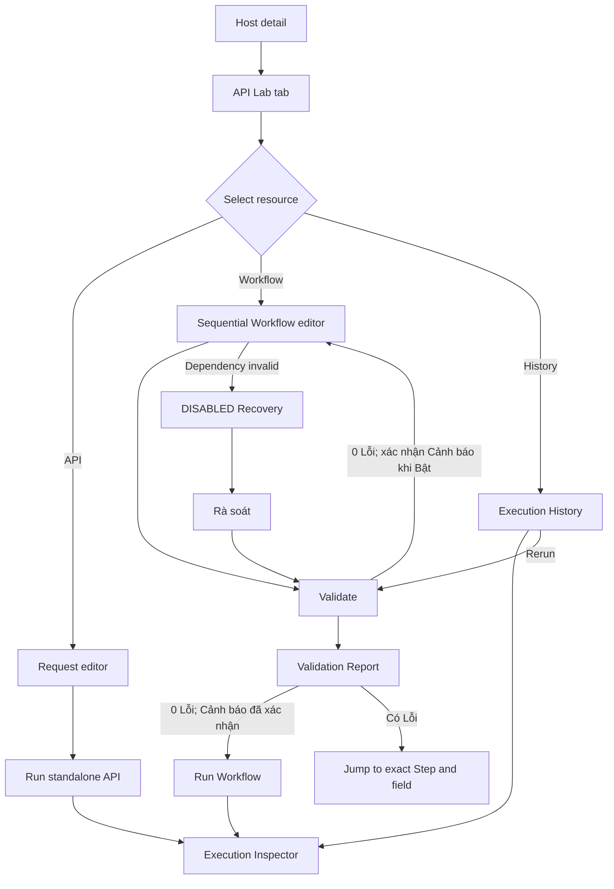

# Design Delta — v1.7.21-oidc-session-error-contracts

### 1. Rationale

API-018 exposes two user-observable dependency-failure boundaries. Design must distinguish the one safe same-callback retry before claim commit from the mandatory fresh API-017 recovery after claim commit, without reusing session-expiry copy.

### 2. Downstream Impact

- Architecture binds API-017/018/024 and SEQ-001 to the stable recovery state and copy.
- Plan TG-02C owns shell/store/router/view implementation plus component and browser tests.
- Test updates TC-065/072 and the state inventory for every DS-COMP-012 branch.
- Implement preserves the callback retry limit, countdown, focus/live-region behavior and zero post-claim resubmission.

### 3. Acceptance Notes

- Body/header retry values match and are positive before a countdown appears.
- Missing, invalid, out-of-range or mismatched recovery metadata never permits callback reuse and enters the fail-closed MSG-048 state.
- Pre-claim recovery permits no more than one same-callback retry.
- The pre-claim exhausted CTA performs no network request: it erases the retained callback URL/recovery state and returns to the ordinary login entry. The next explicit normal-login activation starts API-017 with fixed safe `returnTo=/`; it never reuses API-018 input or the prior route query.
- Each post-claim or malformed-contract CTA activation performs exactly one fresh API-017 navigation and zero API-018 resubmissions; a navigation failure permits another explicit user activation but never automatic retry.
- Every state has stable hooks, exact visible copy, focus behavior and a deterministic exit.

---

## New

<!-- ID: DS-COMP-012 -->
### DS-COMP-012: CallbackAuthenticationRecovery

- **Purpose:** Separate the two API-018 dependency-failure boundaries and expose only the action that remains safe after the one-time state decision.
- **Owner/surfaces:** the public root authentication shell owns SCREEN-009 at `/auth/callback` and `/login`; DS-COMP-012 renders there before any authenticated workspace exists. `ApiLabWorkspaceShell` begins only after a valid session and does not own callback recovery. Ordinary protected-request 503 states remain unchanged.
- **Trigger classification:** API-018 503 must carry an integer HTTP `Retry-After` in `[1,86400]` equal to `error.details.retry_after_seconds`. Missing `recovery_action` means the claim transaction did not commit; `recovery_action=RESTART_LOGIN` means it committed. Missing/non-integer/out-of-range/mismatched retry metadata or any other `recovery_action` enters the fail-closed malformed-contract state and never resubmits API-018.
- **Pre-claim action:** show MSG-047. `Thử hoàn tất đăng nhập` remains disabled until the countdown reaches zero, then may resubmit the same API-018 callback exactly once. If it fails again, remove the retry and expose `Quay lại đăng nhập`. That exhausted CTA performs no API-017/API-018 request: it clears the retained callback URL, retry counter, countdown and recovery error, then reveals the ordinary `Đăng nhập với Central IAM` entry. The next explicit normal-login activation starts API-017 with fixed safe `returnTo=/`, ignoring the prior route query; because the exhausted CTA itself has no navigation, it has no navigation-error substate.
- **Post-claim action:** show MSG-046. `Đăng nhập lại` remains disabled until the countdown reaches zero, then starts a new API-017 authorization with the fixed safe landing path `/`. It never derives recovery navigation from the consumed callback URL, the current browser route or unavailable API-018 success data, and never reloads or resubmits API-018.
- **Malformed-contract action:** show MSG-048 immediately with no countdown and no callback URL retained. `Bắt đầu đăng nhập lại` starts one fresh API-017 navigation with the fixed safe landing path `/` per explicit activation. A failed navigation remains `auth-callback-recovery-invalid` with MSG-048 and permits another explicit activation; `auth-restart-error` is reserved exclusively for failed post-claim API-017 navigation. There is no automatic retry.
- **Focus/accessibility:** focus moves to the alert heading; countdown is announced once per second through `aria-live="polite"` without stealing focus; enablement is announced; reduced motion removes animation, not the wait.
- **QA hooks:** root `auth-callback-recovery`; pre-claim `auth-callback-retry-required`, countdown `auth-callback-retry-countdown`, CTA `auth-callback-retry`; post-claim `auth-restart-required`, countdown `auth-restart-countdown`, CTA `auth-restart-login`; navigation failure `auth-restart-error`; malformed contract `auth-callback-recovery-invalid`.
- **Traceability:** SCREEN-009; UX-FLOW-14; API-017/018/024; SEQ-001; MSG-046/047/048; TC-065/072; supplements DESIGN-OVERVIEW-001.

| State | Stable identifier | Visible signal | Exit condition |
|---|---|---|---|
| Pre-claim waiting | `auth-callback-retry-required`, `aria-busy=true` | MSG-047; “Bạn có thể thử lại sau {seconds} giây.”; retry disabled | Countdown reaches zero |
| Pre-claim ready | `auth-callback-retry-required` | MSG-047; `Thử hoàn tất đăng nhập` enabled | One same-callback retry |
| Pre-claim exhausted | `auth-callback-retry-exhausted`, `role=alert` | “Không thể hoàn tất đăng nhập.”; `Quay lại đăng nhập` | Clear callback/retry/error state without a network request; show ordinary `Đăng nhập với Central IAM`; the next activation starts API-017 with fixed `returnTo=/` |
| Post-claim waiting | `auth-restart-required`, `aria-busy=true` | MSG-046; “Bạn có thể đăng nhập lại sau {seconds} giây.”; fresh-login CTA disabled | Countdown reaches zero |
| Post-claim ready | `auth-restart-required` | MSG-046; `Đăng nhập lại` enabled | Fresh API-017 |
| Post-claim navigation error | `auth-restart-error`, `role=alert` | “Không thể bắt đầu phiên đăng nhập mới.” | `Thử lại đăng nhập` starts fresh API-017 |
| Malformed recovery contract | `auth-callback-recovery-invalid`, `role=alert` | MSG-048; no countdown; `Bắt đầu đăng nhập lại` | One fresh API-017 navigation per explicit activation; failure remains `auth-callback-recovery-invalid`, never changes to `auth-restart-error` |

<!-- ID: SCREEN-009 -->
### SCREEN-009: Public Authentication Callback & Recovery

- **Purpose:** Complete the public OIDC callback or recover safely before an authenticated API Lab workspace exists.
- **Route/shell:** `/auth/callback` and `/login` inside the public root authentication shell; no Resource Tree, Host, Environment or authenticated workspace content is mounted.
- **Entry:** Central IAM redirects to `/auth/callback?code&state`, or an unauthenticated protected-route guard opens `/login?returnTo={safe-relative-path}`.
- **Exit:** successful API-018 navigates only to its validated same-origin `returnTo`; exhausted recovery reveals ordinary login and its next explicit activation uses `/`; post-claim/malformed recovery starts fresh API-017 with `/`.
- **Key interactions:** automatic one-time callback submission on valid route input; wait and explicitly retry once only before claim commit; clear exhausted state without a request; start fresh login after claim commit or malformed recovery metadata.

| State | Stable identifier | Visible signal: heading / subtext / CTA | Exit condition |
|---|---|---|---|
| Empty | `auth-login-entry` | “Đăng nhập”; safe return context when present; `Đăng nhập với Central IAM` | Explicit activation starts API-017; exhausted recovery always forces `returnTo=/` |
| Loading | `auth-callback-processing`, `aria-busy=true` | “Đang hoàn tất đăng nhập”; no CTA and no protected content | API-018 succeeds → validated return path; typed 503 → Recovery; invalid input → Error |
| Populated / recovery | `auth-callback-recovery` with DS-COMP-012 branch hook | MSG-046/047, bounded countdown and only the permitted CTA | One pre-claim API-018 retry, zero-request clear, or fresh API-017 according to DS-COMP-012 |
| Error | `auth-callback-invalid`, `role=alert` or DS-COMP-012 navigation/contract error hook | MSG-048 or exact navigation failure; safe retry/login CTA only | Correct public entry or explicit fresh-login activation; never reveal/mount protected content |

**Accessibility:** the public auth shell provides one `main` landmark and page heading; callback status is announced politely; error/recovery headings receive focus; closing/clearing recovery returns focus to the ordinary login CTA.

**Validation:** `code` and `state` are required only on `/auth/callback`; missing/unsafe input fails closed before API-018. Only same-origin relative `returnTo` is accepted. Callback input is never copied into accessible names, recovery navigation or the next ordinary login after exhaustion.

## Updated

<!-- ID: DESIGN-OVERVIEW-001 -->
### Design Overview

#### 1. Design Direction And Source

- **Product source:** [Sprint brief v1](../../product/sprint-brief-v1.md), [PRD proposal v1](../../product/proposals/prd-v1.md), [EP-001 proposal](../../product/proposals/epics/EP-001-api-lab-workflow-orchestration-v1.md) and APPROVED [Product delta `v1.7.18-api-lab-undo-warning-viewport`](../../changes/v1.7.18-api-lab-undo-warning-viewport/product-delta-v1.7.18-api-lab-undo-warning-viewport.md) covering FR-001/003/007/011, BR-005/011/012 and AC-044–059.
- **Industry vertical:** developer tooling / API management and workflow orchestration, inherited from Product `PROD-5` with high confidence.
- **Visual and component source:** layout requirements from the stakeholder image are fully restated in this proposal; implementation does not depend on the conversation asset. Colors/typography/control conventions resolve to [`frontend/src/style.css`](../../../../frontend/src/style.css), [`frontend/src/core/components`](../../../../frontend/src/core/components) and existing System Manager surfaces under [`frontend/src/features/system-manager`](../../../../frontend/src/features/system-manager).
- **Platform:** Web desktop. SCREEN-009 is a public pre-authentication surface and remains usable without the API Lab editor viewport gate. SCREEN-001–008 require an authenticated session and a device with `screen width >= 1280px`; on a supported screen, browser zoom through 200% keeps editing available via compact panels and horizontal scrolling in technical editor regions. Devices below 1280px show the editor unsupported-device state; no mobile/tablet API/Workflow editing in v1.
- **Language:** Vietnamese UI while retaining canonical technical entity/state terms `Host`, `API Workspace`, `Collection`, `Folder`, `API`, `Environment`, `Workflow`, `Step`, `Mapping`, `Execution`, `Retry`, `Timeout`, `DRAFT`, `READY`, `DISABLED`.

**Principles**

1. Context before action — Host and Environment remain visible before any Run action.
2. Inspectable by default — resolved request, response, duration, attempts and errors are reachable without leaving the workspace.
3. Safe dependency changes — destructive or contract-changing actions expose impact before confirmation and require explicit recovery.
4. Progressive disclosure — Resource Tree stays persistent; Variable Browser, Execution Inspector and Recovery Checklist open only in relevant contexts.
5. Accessible technical density — keyboard operability, semantic status text and stable QA hooks take precedence over decorative motion.

> Assumption: Existing application CSS and core/System Manager components remain the implementation source of truth; the supplied dark UI image is not a dark-theme mandate.
> Validate: UX Lead compares this proposal against the linked running surfaces before `approve design`.
> Change trigger: A new brand system or replacement of the linked component/style sources.

#### 2. Information Architecture And Screen Inventory

| Screen ID | Name | Route / Surface | Entry | Exit | FR / US |
|---|---|---|---|---|---|
| SCREEN-001 | Host API Lab Workspace | `/systems/:host_id/api-lab` | Host detail → tab `API Lab` | API, Workflow, History, Environment settings | FR-001, FR-003 / US-001, US-009 |
| SCREEN-002 | Environment & Credential Settings | `/systems/:host_id/api-lab/environments` | Workspace Environment selector → `Quản lý môi trường` | Workspace with selected Environment | FR-002 / US-002 |
| SCREEN-003 | API Request & Response Editor | Workspace route + `api=:api_id` | Resource Tree API node | Saved API, standalone Execution | FR-004, FR-005, FR-012 / US-003 |
| SCREEN-004 | Sequential Workflow Editor | `/systems/:host_id/api-lab/workflows/:workflow_id` | Workspace Workflow node | READY/DISABLED Workflow, Run | FR-006, FR-007, FR-008 / US-004, US-005, US-006, US-007 |
| SCREEN-005 | Execution Inspector | Contextual bottom panel/drawer | Run API/Workflow or open Execution | History detail or close panel | FR-008, FR-009, FR-012 / US-007, US-008 |
| SCREEN-006 | Dependency Impact & Recovery | Modal + contextual right panel | Delete/change method; open DISABLED Workflow | Workflow editor READY/DISABLED | FR-003, FR-011 / US-009 |
| SCREEN-007 | Execution History | `/systems/:host_id/api-lab/history` | Workspace tab `Lịch sử` | Inspector or new rerun Execution | FR-010, FR-012 / US-007, US-010 |
| SCREEN-008 | Workflow Validation Report | `/systems/:host_id/api-lab/workflows/:workflow_id/validation` | Workflow editor → `Kiểm tra workflow` | Exact Step/field, Run or Recovery checklist | FR-007, FR-011 / US-006, US-009 |
| SCREEN-009 | Public Authentication Callback & Recovery | `/auth/callback`, `/login` | Central IAM redirect or protected-route authentication guard | Validated same-origin destination or safe fresh API-017 | Cross-cutting auth boundary / US-001–010 |

The public root authentication shell owns SCREEN-009 and never mounts protected workspace content. After authentication, the global workspace shell uses three contextual zones: persistent Resource Tree left; primary editor center; contextual right drawer for Variables/Recovery. Execution Inspector opens below the center editor and can be collapsed. Opening a drawer never hides the selected Host, Environment or primary Run state.

#### 3. User Flows



| Flow | FR | Entry → action → success | Error/recovery and decision edges |
|---|---|---|---|
| UX-FLOW-01 | FR-001 | Host detail → `API Lab` → Workspace shows Host breadcrumb and ACTIVE state | Host INACTIVE: Run controls disabled, exact banner; session expired: return to sign-in then restore route |
| UX-FLOW-02 | FR-002 | `Quản lý môi trường` → edit common variable schema/value/credential → Save → selected Environment refreshed | Missing required value: inline error; save failure: retain edits and `Thử lại`; cancel: confirm discard only when dirty |
| UX-FLOW-03 | FR-003 | Resource Tree → create/move/copy/delete Collection/Folder/API → tree refreshes at correct level | Duplicate/blank name inline; delete with dependency routes to impact modal; confirmed API delete offers Undo for 10 seconds; rejected late request/failed restore shows MSG-036; network failure retains draft node |
| UX-FLOW-04 | FR-004 | Select API → configure method/path/query/header/body/timeout/sensitive paths → Save | Invalid field inline; unsaved navigation prompts; Host/environment credential remains read-only with settings link |
| UX-FLOW-05 | FR-005 | Select Environment → `Chạy API` → loading → response and duration in Inspector | Timeout/error retains request and offers `Chạy lại`; Environment change during run affects only next Execution |
| UX-FLOW-06 | FR-006 | Open Workflow → create/edit workflow-local variables → add/reorder ≤20 steps → drag variable or type expression → Save | Invalid/duplicate workflow-variable key or blank value stays inline; Step 21 rejected; later/current-step mapping rejected; no source response shows run-source guidance plus manual expression option |
| UX-FLOW-07 | FR-007 | `Kiểm tra workflow` → deterministic checks → SCREEN-008 summary → READY when Lỗi count is zero | Findings link to exact Step/field; Lỗi blocks Run/Bật workflow; Cảnh báo requires confirmation; deleted API/method change keeps DISABLED |
| UX-FLOW-08 | FR-008 | READY Workflow → `Chạy workflow` → capacity accepted → sequential step timeline → Execution SUCCEEDED/FAILED | If 20 Workflows are already running, reject the Run with MSG-041, create no Execution and retain editor state; otherwise failed Step expands automatically and later Steps show `Chưa chạy` |
| UX-FLOW-09 | FR-009 | API timeout + step retry config → run → attempts visible → final state | Non-retryable error stops immediately; exhausted attempts show final error; no control retries prior successful steps |
| UX-FLOW-10 | FR-010 | `Lịch sử` → filter/open record → detail → `Chạy lại` → validation → new Execution | Record expired: empty result; rerun invalid: route to Workflow issues; latest definition/environment is restated before confirmation |
| UX-FLOW-11 | FR-011 | Delete/change method → impact preview → confirm → affected Workflows DISABLED → Rà soát → Kiểm tra → Bật workflow | Host ACTIVE alone never enables; unresolved checklist disables Bật workflow; Undo restores API but never auto-enables; closing modal cancels destructive action |
| UX-FLOW-12 | FR-012 | Configure sensitive paths → execute → masked values in viewer/history/telemetry-facing UI | Unconfigured fields remain visible; UI warns “Chỉ các trường đã cấu hình mới được che”; Host credential always masked |
| UX-FLOW-13 | FR-007 | `Kiểm tra workflow` → SCREEN-008 displays Đạt/Cảnh báo/Lỗi totals → select finding → editor focuses exact Step/field | Any Lỗi blocks Run/Bật workflow; Cảnh báo requires explicit confirmation; report load failure retains prior editor state and offers retry |
| UX-FLOW-14 | Cross-cutting authentication boundary | Central IAM → public SCREEN-009 `/auth/callback` → API-018 → validated destination, or dependency failure → wait valid `Retry-After` → retry only the permitted action | Before claim commit: MSG-047 permits one same-callback retry; after claim commit: MSG-046 starts fresh API-017; malformed metadata: MSG-048 fails closed to fresh API-017. SCREEN-001–008 never mount before success and no post-claim/malformed branch resubmits API-018. |

#### 4. Navigation, Permission, Dirty State And Interaction Contracts

**Navigation contract**

| Surface | Breadcrumb | Back/ancestor behavior |
|---|---|---|
| Workspace | `System Manager / {Host} / API Lab` | `{Host}` returns to Host detail; `System Manager` returns to Host list |
| Environment settings | `System Manager / {Host} / API Lab / Environments` | `API Lab` restores the selected Environment and Resource Tree state |
| API editor | `System Manager / {Host} / API Lab / {Collection} / {Folder…} / {API}` | Collection/Folder crumbs select that node; API is `aria-current=page` |
| Workflow editor | `System Manager / {Host} / API Lab / Workflows / {Workflow}` | `Workflows` returns to the Workflow tree scope with search/filter preserved |
| Validation Report | `System Manager / {Host} / API Lab / Workflows / {Workflow} / Validation` | `{Workflow}` returns to the editor; finding links return and focus the exact field |
| Execution History/detail | `System Manager / {Host} / API Lab / History / {Execution ID?}` | History filters, sort, page and selected row are restored from URL state |
| Public authentication | No protected breadcrumb; page heading identifies `Đăng nhập` or callback/recovery state | `/auth/callback` accepts only Central-IAM callback input; safe exits are validated success navigation or `/login`/fresh API-017 with fixed `/` after recovery |

Breadcrumb is present below the existing application header on every full-page surface. It never replaces the Resource Tree. Browser Back and breadcrumb navigation use the same dirty-state guard and return focus to the destination page heading.

**Permission matrix — phase 1**

| User state | See Workspace/API/Workflow/History | Create/edit/delete | Validate/run/rerun | Environment/Credential configuration |
|---|---|---|---|---|
| Authenticated user | Yes | Yes | Yes, subject to Host/Workflow validity | Yes; saved credential remains masked |
| Unauthenticated/session expired | No | No | No | No; redirect to sign-in and preserve return URL |
| Unauthenticated callback/login visitor | SCREEN-009 only; no Workspace/API/Workflow/History payload | No | API-017/018 authentication actions only | No |

All authenticated users see the same navigation and controls; phase 1 has no role-specific hiding or action-level RBAC. Disabled controls always explain state constraints such as Host INACTIVE, Workflow DISABLED or validation Lỗi—not permission denial. Execution records still display the initiating user.

**Dirty-state and concurrent editing contract**

- Internal navigation, breadcrumb, Resource Tree selection and Browser Back use MSG-021 with `Lưu`, `Bỏ thay đổi`, `Ở lại`; Back proceeds only after Save/Discard.
- Browser refresh and tab/window close register `beforeunload` only while dirty. The browser-native confirmation copy is platform-controlled; cancel keeps the page and edits, confirm leaves and discards the unsaved client state.
- After successful save the dirty flag clears immediately, so refresh/close/back does not prompt. Failed save keeps both the dirty flag and user input.
- Workflow saves carry the loaded revision. If another user saved a newer revision, the later save is rejected and MSG-027 opens; the user may `Tải bản mới`, `Sao chép thay đổi` to copy the unsaved draft as text to the clipboard, or `Hủy`. This does not create another Workflow and never overwrites the newer revision silently.

**Global interaction rules**

- Environment selector is fixed in Workspace header. Changing it with unsaved editor changes opens: “Bạn có thay đổi chưa lưu. Lưu trước khi đổi môi trường?” with `Lưu và đổi`, `Bỏ thay đổi`, `Hủy`.
- Workflow variables are workflow-local static key/value pairs managed in SCREEN-004 under `Biến workflow`. They are stored in the saved Workflow revision, are available as `${{workflow.variable}}`, remain separate from Environment and Step-output namespaces, and are pinned with the revision used by an Execution. Editing them marks the Workflow dirty and makes the current Validation Report stale.
- Variable Browser opens from the `{x}` button or `Ctrl+Shift+V`; it lists only Environment/Workflow namespaces and prior steps. Drag and keyboard `Enter` insert at the active input caret.
- The Workflow tab in Variable Browser reflects valid unsaved workflow-variable rows immediately; invalid rows remain in the editor but are excluded from insertion until corrected. Deleting a referenced workflow variable creates MSG-045 at every affected field on the next validation.
- Prior-step field tree comes from the latest successful response available for that source API/step. When absent, show `Chưa có dữ liệu response để duyệt biến.` with `Chạy API nguồn`; manual expression remains available.
- System `step_key` is shown as read-only secondary text beside the editable step label. Copy button copies the key; rename never changes it.
- Execution Inspector opens on Run, keeps focus on the initiating button until content is ready, then announces status through `aria-live="polite"`; failure moves focus to the failed-step heading.
- Panel resize handles support pointer and keyboard arrows; minimum Resource Tree width 240px, Variable/Recovery drawer 320px, center editor 560px.
- All destructive dialogs use explicit object names and affected counts. `Escape` cancels; focus returns to the invoking control.
- After confirmed API deletion, the API disappears immediately and dependent Workflows become DISABLED. A 10-second MSG-025 toast with stable hook `api-delete-undo-toast` offers `Hoàn tác`; its visible/announced MSG-040 countdown updates once per second without moving focus. Success restores the same API identity/configuration/tree location but Workflows stay DISABLED until Rà soát → Kiểm tra → Bật workflow. Normal expiry removes the action; a rejected late request or failed restore shows MSG-036 and leaves the API deleted.
- Validation classifies every existing Product invalid condition as `Lỗi`. `Cảnh báo` is limited to: source mapping has no latest successful response sample (MSG-037), API inherits Host timeout (MSG-038), or `sensitive_fields` is empty (MSG-039). With zero Lỗi, Run/Bật workflow opens MSG-029 when Cảnh báo exists; the user must explicitly continue.
- Resource Tree search uses ranked fuzzy matching: exact match first, then prefix, then other fuzzy matches. Results retain resource type and full parent path; clearing search restores expansion/selection state.
- Execution History uses server-side pagination with 50 rows per page and a virtualized table body. Filters, sort, `page` and `page_size` live in the URL; Browser Back restores them and focus returns to the previously selected row.
- Central IAM returns `code/state` to the browser-hosted SPA route `/auth/callback`; that route calls API-018 through the shared credentialed Axios client. This handoff is mandatory so API-018 envelopes and headers reach DS-COMP-012 rather than rendering as raw browser JSON. On success the SPA accepts only API-018's validated same-origin `returnTo` and navigates there.
- API-018 callback recovery is owned globally by SCREEN-009's public root authentication shell through DS-COMP-012; `ApiLabWorkspaceShell` is not mounted until authentication succeeds. A valid 503 without `recovery_action` means claim did not commit: show MSG-047, wait the matching positive `Retry-After`, then permit exactly one Axios retry of the same API-018 URL; a second failure exposes `Quay lại đăng nhập`, whose activation clears all callback/retry/error state without a network request and returns to the ordinary login entry. The next explicit normal-login activation starts API-017 with fixed `returnTo=/`, ignores the prior route query and never reuses API-018 input. A valid API-018 503 with `recovery_action=RESTART_LOGIN` means claim committed: show MSG-046, wait, then start fresh API-017 with `returnTo=/` and never reload/resubmit API-018. The same action on any non-API-018 response is ignored as an invalid endpoint context. Malformed or contradictory API-018 metadata shows MSG-048, retains no callback URL and exposes only fresh API-017 with `returnTo=/`; failed navigation stays in that invalid-contract state.
- Concurrent Workflow capacity is authoritative at Run time. When 20 Workflows are already running, the initiating Run is rejected, no Execution/History record or Inspector is created, focus remains on `Chạy workflow`, and inline alert `workflow-capacity-rejected` shows MSG-041 with `Thử lại`. Retrying after at least one running Workflow reaches a terminal state exits the alert and follows UX-FLOW-08; there is no queue in v1.
- Supported-device check uses desktop `screen width`, not the zoom-reduced content viewport. A screen from 1280px remains editable through 200% zoom using compact panels and horizontal scroll limited to request/response, step table and code regions. A physical screen below 1280px uses MSG-022.

> Assumption: Latest successful response metadata is available to the Design surface without introducing a user-managed example schema in v1.
> Evidence: Approved Architecture v1 exposes retained response-field metadata; implementation tests remain the delivery gate.
> Change trigger: Architecture cannot expose the latest response field tree or Product adds user-defined response schemas.

#### 5. Message Copy Catalog

| ID | Context / trigger | Exact copy | Type | Recovery |
|---|---|---|---|---|
| MSG-001 | Host INACTIVE | “Host đang không hoạt động. Hãy kích hoạt Host trước khi chạy.” | Persistent banner | Link `Mở System Manager` |
| MSG-002 | Workspace load fails | “Không thể tải API Workspace. Vui lòng thử lại.” | Page alert | `Thử lại` |
| MSG-003 | Empty Workspace | “Workspace này chưa có collection.” | Empty state | `Tạo collection` |
| MSG-004 | Required Environment value missing | “Thiếu giá trị biến {variable} trong environment {environment}.” | Inline error | Focus field |
| MSG-005 | API timeout | “API hết thời gian chờ sau {timeout} giây.” | Inspector error | `Chạy lại` |
| MSG-006 | Missing mapped value | “Không tìm thấy ${{source_path}}.” | Step inline error | `Sửa mapping` |
| MSG-007 | Non-JSON mapping source | “Phase 1 chỉ hỗ trợ mapping từ response JSON.” | Variable drawer alert | `Đóng` |
| MSG-008 | Reverse/circular mapping | “Chỉ được ánh xạ dữ liệu từ bước đứng trước; mapping ngược có thể tạo vòng lặp.” | Inline error | Return to source picker |
| MSG-009 | Step limit | “Workflow chỉ hỗ trợ tối đa 20 bước trong phase 1.” | Toast + inline | Remove/reuse step |
| MSG-010 | Workflow valid | “Workflow hợp lệ và sẵn sàng chạy.” | Success banner | `Chạy workflow` |
| MSG-011 | API deleted | “API không còn tồn tại. Hãy chọn API thay thế hoặc xóa bước này.” | Step error | `Chọn API khác` |
| MSG-012 | Forward reference | “Chỉ được tham chiếu bước đứng trước.” | Step error | `Sửa mapping` |
| MSG-013 | Execution failed | “Thất bại tại bước {step_index}: {step_label}.” | Inspector error | Expand step |
| MSG-014 | Non-retryable | “Lỗi không thuộc nhóm được retry.” | Inspector error | `Xem chi tiết` |
| MSG-015 | Delete API impact | “Các workflow này sẽ bị vô hiệu hóa sau khi xóa API.” | Warning modal | Review list; `Hủy` |
| MSG-016 | Host recovered | “Host đã hoạt động. Hãy review và kiểm tra workflow trước khi bật lại.” | Recovery banner | `Bắt đầu review` |
| MSG-017 | No response fields | “Chưa có dữ liệu response để duyệt biến.” | Drawer empty state | `Chạy API nguồn` |
| MSG-018 | Sensitive config warning | “Chỉ các trường đã cấu hình mới được che.” | Inline warning | `Cấu hình trường nhạy cảm` |
| MSG-019 | History empty | “Chưa có execution nào trong 30 ngày gần đây.” | Empty state | `Mở workflow` |
| MSG-020 | History load fails | “Không thể tải lịch sử execution. Vui lòng thử lại.” | Page alert | `Thử lại` |
| MSG-021 | Unsaved changes | “Bạn có thay đổi chưa lưu.” | Modal | `Lưu`, `Bỏ thay đổi`, `Ở lại` |
| MSG-022 | Unsupported device | “API Lab Workflow cần màn hình desktop rộng tối thiểu 1280px.” | Full-page notice | `Quay lại Host` |
| MSG-023 | Save succeeds | “Đã lưu thay đổi.” | Success toast | No recovery needed |
| MSG-024 | Session expires | “Phiên đăng nhập đã hết hạn. Vui lòng đăng nhập lại.” | Blocking alert | `Đăng nhập lại` |
| MSG-025 | API delete completed | “Đã xóa API {api_name}. Các workflow phụ thuộc đã bị vô hiệu hóa.” | 10-second toast | `Hoàn tác` |
| MSG-026 | Resource search has no result | “Không tìm thấy tài nguyên phù hợp với “{query}”.” | Tree empty state | `Xóa tìm kiếm` |
| MSG-027 | Concurrent edit conflict | “Workflow đã được cập nhật bởi {user}. Thay đổi của bạn chưa được ghi đè.” | Blocking dialog | `Tải bản mới`, `Sao chép thay đổi`, `Hủy` |
| MSG-028 | Validation result | “Đã kiểm tra workflow: {passed} Đạt, {warnings} Cảnh báo, {errors} Lỗi.” | Report summary | Open SCREEN-008 |
| MSG-029 | Validation warning confirmation | “Workflow còn {warnings} cảnh báo. Bạn có muốn tiếp tục?” | Confirmation dialog | `Tiếp tục`, `Quay lại báo cáo` |
| MSG-030 | Validation report load fails | “Không thể tải Validation Report. Vui lòng thử lại.” | Page alert | `Thử lại`, `Quay lại workflow` |
| MSG-031 | HTTP method change impact | “Các workflow này sẽ bị vô hiệu hóa nếu bạn xác nhận thay đổi method.” | Warning modal | Review list; `Hủy` |
| MSG-032 | Duplicate system step key | “Khóa bước bị trùng. Hãy lưu lại hoặc liên hệ quản trị viên.” | Validation finding | Focus both conflicting Steps; block Run |
| MSG-033 | Deferred execution modes | “Parallel và loop được lên kế hoạch cho v2.” | Persistent scope note | No action |
| MSG-034 | Environment not selected | “Vui lòng chọn environment trước khi chạy.” | Inline header error | Focus Environment selector |
| MSG-035 | Save failure | “Không thể lưu thay đổi. Dữ liệu bạn nhập vẫn được giữ.” | Page/form alert | `Thử lại` |
| MSG-036 | Undo API delete failed | “Không thể hoàn tác xóa API. API vẫn bị xóa.” | Error toast | Open affected Workflow list |
| MSG-037 | Mapping source has no response sample | “Chưa có response mẫu cho {source_step}. Bạn vẫn có thể nhập mapping thủ công.” | Validation warning | Focus source Step/field; `Chạy API nguồn` |
| MSG-038 | API inherits Host timeout | “API {api_name} đang kế thừa timeout {host_timeout} giây từ Host.” | Validation warning | Focus API timeout; `Cấu hình timeout` |
| MSG-039 | Sensitive paths are empty | “API {api_name} chưa cấu hình sensitive_fields. Dữ liệu có thể hiển thị nguyên giá trị.” | Validation warning | Focus sensitive-field settings; `Cấu hình trường nhạy cảm` |
| MSG-040 | Undo countdown | “Có thể hoàn tác trong {seconds} giây.” | Live status text | Countdown ends → remove Undo action |
| MSG-041 | Workflow concurrency limit reached | “Đã đạt giới hạn 20 workflow đang chạy. Vui lòng thử lại khi có execution hoàn tất.” | Inline alert | `Thử lại`; no Execution created |
| MSG-042 | Invalid/duplicate workflow variable key | “Tên biến workflow phải bắt đầu bằng chữ hoặc `_` và không được trùng.” | Inline error | Focus key field |
| MSG-043 | Empty workflow variable value | “Giá trị biến workflow không được để trống.” | Inline error | Focus value field |
| MSG-044 | Workflow variable load fails | “Không thể tải biến workflow. Vui lòng thử lại.” | Panel alert | `Thử lại` |
| MSG-045 | Referenced workflow variable missing | “Không tìm thấy biến workflow {variable}.” | Validation finding | Focus every affected mapping field |
| MSG-046 | Post-claim authentication restart | “Dịch vụ xác thực tạm thời gián đoạn nên phiên đăng nhập chưa được tạo. Hãy bắt đầu đăng nhập lại.” | Blocking authentication alert | Wait `Retry-After`; `Đăng nhập lại` starts fresh API-017 |
| MSG-047 | Pre-claim callback retry | “Dịch vụ lưu phiên đăng nhập tạm thời gián đoạn. Bạn có thể thử hoàn tất đăng nhập thêm một lần.” | Blocking authentication alert | Wait `Retry-After`; `Thử hoàn tất đăng nhập` retries the same API-018 once |
| MSG-048 | Invalid callback recovery contract | “Không thể xác minh cách khôi phục đăng nhập an toàn. Hãy bắt đầu đăng nhập lại.” | Blocking authentication alert | No countdown or callback reuse; `Bắt đầu đăng nhập lại` starts fresh API-017 |

#### 6. Consolidated Form Validation

| Form / field | Required | Rule | Trigger | Exact error / dependency |
|---|---|---|---|---|
| Resource `name` | Yes | Trimmed length 1–120; unique among siblings | blur + submit | “Tên không được để trống.” / “Tên này đã tồn tại trong cùng thư mục.” |
| Environment `name` | Yes | Trimmed length 1–64; unique per Host | blur + submit | “Tên environment không hợp lệ hoặc đã tồn tại.” |
| Variable `key` | Yes | `[A-Za-z_][A-Za-z0-9_]*`, max 64, unique schema-wide | blur + submit | “Tên biến phải bắt đầu bằng chữ hoặc `_` và không được trùng.” |
| Required variable `value` | Conditional | Non-empty in every Environment when marked required | submit | MSG-004 |
| Credential value | Yes when credential enabled | Non-empty; always masked after save | submit | “Vui lòng nhập credential cho environment này.” |
| Execution Environment | Yes for Run/rerun | One current Environment selected; required values present | run/rerun | MSG-034, then MSG-004 per missing required value |
| API method | Yes | One available method selected | change + submit | “Vui lòng chọn HTTP method.” |
| API path | Yes | Non-empty and begins `/` | blur + submit | “Path phải bắt đầu bằng `/`.” |
| Query/Header key | Conditional | Non-empty when row enabled; no duplicate enabled key | blur + submit | “Key không được để trống hoặc trùng trong request.” |
| Query/Header value | No | Empty string allowed; if an expression is present it must satisfy Mapping expression rules | blur + submit/run | Mapping errors use MSG-006/008/012 |
| API JSON body | Conditional | When body type is JSON, content must be valid JSON | blur + submit/run | “Body JSON không hợp lệ.” |
| Timeout | No | Blank inherits Host 30s; otherwise integer >0 | blur + submit | “Timeout phải là số nguyên lớn hơn 0.” |
| `sensitive_fields` path | No | Unique, syntactically valid path | blur + submit | “Đường dẫn trường nhạy cảm không hợp lệ hoặc bị trùng.” |
| Workflow `name` | Yes | Trimmed length 1–120 | blur + submit | “Tên workflow không được để trống.” |
| Workflow variable `key` | Yes when row exists | `[A-Za-z_][A-Za-z0-9_]*`, max 64; unique within Workflow namespace | blur + save + validate | MSG-042; invalid row is excluded from Variable Browser |
| Workflow variable `value` | Yes when row exists | Non-empty static string after trim; saved with Workflow revision | blur + save + validate | MSG-043 |
| Step API | Yes | Existing API in same Host Workspace | change + validate | MSG-011 |
| Step label | Yes | Trimmed length 1–120; duplicate labels allowed; key remains read-only | blur + submit | “Tên hiển thị của bước không được để trống.” |
| Retry count | Yes | Integer 0–5 | blur + submit | “Số lần retry phải từ 0 đến 5.” |
| Retry delay | Yes | Defaults to 1 second; number ≥0 | blur + submit | “Thời gian chờ retry không được nhỏ hơn 0.” |
| Mapping expression | Conditional | Namespace required; only prior `step_key`; source path resolvable when running | blur + validate | MSG-006, MSG-007, MSG-008, MSG-012 |
| System `step_key` | System-only | Unique and immutable; duplicate persistence/import keys are both reported and never auto-rewritten | validate | MSG-032; block Run/Enable |
| History date range | No | At most 30 days; end date must be on/after start date | submit | “Khoảng ngày không hợp lệ hoặc vượt quá 30 ngày.” |

Submit controls are disabled only during an active save/validation request, not merely because untouched fields are empty; submitting reveals all field errors and focuses the first. Server/save failure retains user input. Cross-field changes revalidate dependent mapping and required Environment values.

**Per-form submit behavior**

| Form/action | Loading | Success | Validation/client failure | Server/network failure |
|---|---|---|---|---|
| Resource create/rename/move | Invoking action disabled; draft node shows spinner | Tree selects persisted node; MSG-023 | Inline resource-name error; no mutation | MSG-035; retain draft node and input |
| Environment/Credential Save | `Lưu thay đổi` disabled with spinner | Clear dirty flag; MSG-023; masked credential remains masked | Focus first invalid Environment/key/value/credential | MSG-035; retain all values locally, never reveal saved credential |
| API Save | Save disabled; editor remains readable | Clear dirty flag; MSG-023 | Focus first request/timeout/sensitive-field error | MSG-035; retain request draft |
| Workflow Save | Save disabled; Step/variable editors remain readable | Clear dirty flag; MSG-023; saved revision pins workflow variables | Focus first workflow-variable/Step/mapping/retry error; duplicate system key uses MSG-032 | MSG-027 for revision conflict; otherwise MSG-035; retain unsaved draft |
| Validate/Run/rerun | Action disabled only while request is active; progress is observable | Open SCREEN-008 or SCREEN-005 | MSG-034/004/finding list; MSG-041 rejects the 21st concurrent Run without creating Execution | Keep definition/filter state; show contextual Retry |
| History filters | Table uses Loading state; filters remain enabled except submit | URL/page/result count update | Date range error remains inline | MSG-020; retain filters and prior rows |

> Assumption: Name lengths and variable-key syntax are UI guardrails pending Architecture persistence constraints.
> Evidence: Approved Architecture v1 aligns persistence/API constraints with this table; implementation contract tests remain the delivery gate.
> Change trigger: Existing API Lab permits a broader naming format that must be preserved for backward compatibility.

#### 7. Design-to-FR Traceability

| FR | Screens | Flow | Components | Four states / exact errors / validation | Status |
|---|---|---|---|---|---|
| FR-001 | SCREEN-001, SCREEN-006 | UX-FLOW-01 | DS-COMP-001, 004, 008 | SCREEN-001 states; MSG-001/002; Host state has no editable field | Designed |
| FR-002 | SCREEN-002 | UX-FLOW-02 | DS-COMP-004, 009 | SCREEN-002 states; MSG-004; Environment form table | Designed |
| FR-003 | SCREEN-001, SCREEN-006 | UX-FLOW-03 | DS-COMP-002, 008 | SCREEN-001/006 states; resource errors; MSG-015/025/036 and exact 10-second Undo contract | Designed |
| FR-004 | SCREEN-003 | UX-FLOW-04 | DS-COMP-003, 004, 009 | SCREEN-003 states; request form errors; sensitive path validation | Designed |
| FR-005 | SCREEN-003, SCREEN-005 | UX-FLOW-05 | DS-COMP-003, 007 | Both screen states; MSG-005; Run requires selected Environment | Designed |
| FR-006 | SCREEN-004 | UX-FLOW-06 | DS-COMP-005, 006, 011 | SCREEN-004 and workflow-variable panel states; MSG-007/008/009/017/042–045; workflow/mapping validation | Designed |
| FR-007 | SCREEN-004, SCREEN-006, SCREEN-008 | UX-FLOW-07, UX-FLOW-13 | DS-COMP-005, 008, 010 | Validation Report states + field links; Đạt/Cảnh báo/Lỗi contract; MSG-010/011/012/028/029/030/032/033/037/038/039 | Designed |
| FR-008 | SCREEN-004, SCREEN-005 | UX-FLOW-08 | DS-COMP-001, 007, 009 | `workflow-capacity-rejected` + MSG-041 for the 21st Run; SCREEN-005 runtime states and MSG-013 | Designed |
| FR-009 | SCREEN-004, SCREEN-005 | UX-FLOW-09 | DS-COMP-005, 007 | Retry/timeout fields; MSG-005/014; attempts observable | Designed |
| FR-010 | SCREEN-007, SCREEN-005 | UX-FLOW-10 | DS-COMP-007, 009 | SCREEN-007 states; MSG-019/020; filter validation + rerun confirmation | Designed |
| FR-011 | SCREEN-001, SCREEN-006, SCREEN-008 | UX-FLOW-03, UX-FLOW-11, UX-FLOW-13 | DS-COMP-002, 008, 010 | Lỗi blocks Bật workflow; Cảnh báo confirmation; Undo never bypasses recovery checklist | Designed |
| FR-012 | SCREEN-002, 003, 005, 007 | UX-FLOW-12 | DS-COMP-003, 007, 009 | Masked-value states; MSG-018; sensitive path validation | Designed |

**Cross-cutting authentication traceability**

| Architecture contract | Screens / flow | Component / copy | QA | Status |
|---|---|---|---|---|
| API-017, API-018, API-024, SEQ-001 | SCREEN-009 / UX-FLOW-14; SCREEN-001–008 only after success | DS-COMP-012; MSG-046/047/048 | TC-065 and TC-072 | Designed |

#### 8. Component Inventory

| Component ID | Name | Main screens | Contract summary |
|---|---|---|---|
| DS-COMP-001 | ApiLabWorkspaceShell | SCREEN-001–008 | Host/Environment context, breadcrumb, supported-device gate, zoom compact mode and panel orchestration |
| DS-COMP-002 | ResourceTree | SCREEN-001, 003, 004 | Collection/Folder/API/Workflow tree with CRUD and keyboard navigation |
| DS-COMP-003 | RequestResponseSplitPane | SCREEN-003 | Resizable request/response panes with masked-value rendering |
| DS-COMP-004 | EnvironmentSelector | SCREEN-001–005 | Header selector, snapshot notice, Host settings link |
| DS-COMP-005 | SequentialStepList | SCREEN-004 | Reorderable max-20 step list, immutable key, retry fields |
| DS-COMP-006 | VariableBrowser | SCREEN-004 | Prior-step/env/workflow sources, search, drag/keyboard insertion |
| DS-COMP-007 | ExecutionInspector | SCREEN-003, 005, 007 | Execution/step timeline, attempts, masked IO, failure focus |
| DS-COMP-008 | WorkflowRecoveryPanel | SCREEN-004, 006 | Impact and ordered Rà soát/Kiểm tra/Bật workflow checklist |
| DS-COMP-009 | SensitiveValue | SCREEN-002, 003, 005, 007 | Masked display/copy policy and config warning |
| DS-COMP-010 | ValidationReport | SCREEN-004, 006, 008 | Đạt/Cảnh báo/Lỗi summary, finding list and exact-field navigation |
| DS-COMP-011 | WorkflowVariableEditor | SCREEN-004 | Workflow-local static key/value management and `${{workflow.variable}}` source |
| DS-COMP-012 | CallbackAuthenticationRecovery | SCREEN-009 | Bounded pre-claim callback retry, post-claim fresh login, or fail-closed malformed-contract recovery from API-018 in the public auth shell |

#### 9. Semantic Design Tokens

No new hard-coded brand palette is introduced. Implementations consume existing application tokens through these semantic aliases:

```json
{
  "surface.workspace": "var(--surface-default)",
  "surface.panel": "var(--surface-raised)",
  "text.primary": "var(--text-primary)",
  "text.secondary": "var(--text-secondary)",
  "border.default": "var(--border-default)",
  "border.focus": "var(--focus-ring)",
  "status.success": "var(--status-success)",
  "status.warning": "var(--status-warning)",
  "status.error": "var(--status-error)",
  "status.info": "var(--status-info)",
  "font.ui": "var(--font-ui)",
  "font.code": "var(--font-mono)",
  "spacing.unit": "4px",
  "radius.panel": "var(--radius-md)",
  "panel.resizeHandle": "8px"
}
```

Status always combines icon, text and color. Code/request/response text uses `font.code`; all other content uses current `font.ui`.

#### 10. Responsive And Panel Behavior

| Width | Behavior |
|---|---|
| ≥1440px | Resource Tree persistent; center split pane; one right drawer; Inspector below center. |
| 1280–1439px | Resource Tree collapsible; center remains ≥560px; right drawer overlays center and traps focus only when modal. |
| Supported desktop screen ≥1280px, but content viewport <1280px because of browser zoom/window layout | Compact mode: Resource Tree collapses; drawers overlay; dense code/table regions use localized horizontal scroll; focused Save/Run and validation controls remain reachable through 200% zoom. |
| Physical desktop screen width <1280px | Stable state `workspace-unsupported-device`; exact MSG-022; `Quay lại Host` remains available; editor and Run controls are not rendered. |

The support gate uses physical desktop screen width, not the zoom-reduced CSS viewport. Browser zoom to 200% on a supported screen uses compact layout and localized scrolling without clipping the focused control. The v1 editor is not touch-optimized and does not advertise mobile/tablet editing.

#### 11. Accessibility Requirements

- WCAG 2.2 AA target: normal text contrast ≥4.5:1, large text and UI boundaries ≥3:1.
- Full keyboard access: tree arrows, `Enter` select, `Shift+F10` context menu, step reorder via `Alt+Arrow`, drawer close via `Escape`, resize via focused handle + arrows.
- Every panel has a named landmark; selected tab/tree node uses `aria-selected`; async containers use `aria-busy`.
- Focus ring is at least 2px and never removed. Opening modal/drawer moves focus to heading; closing returns focus to invoker.
- Status is announced in text; success/error never depends only on green/red.
- `prefers-reduced-motion` removes panel slide and step-progress animation; state changes remain immediate.
- Request/response code viewers expose an accessible plain-text mode and retain logical reading order.
- Masked values announce “Giá trị đã được che”; copy is disabled for masked values.
- The 10-second Undo toast uses `role=status` plus `aria-live=polite`; `Hoàn tác` remains keyboard-focusable in normal tab order, focus is never stolen, MSG-040 exposes remaining time, and expiry is announced before the action is removed.
- Capacity rejection uses `role=alert` without opening SCREEN-005; focus stays on `Chạy workflow`, and `Thử lại` is the next keyboard-reachable recovery action.
- Workflow-variable rows use programmatic key/value labels and inline errors connected through `aria-describedby`; adding/removing a row is announced and keyboard focus moves predictably to the new key or nearest surviving row.
- SCREEN-009 remains keyboard/screen-reader operable independently of the authenticated workspace and editor width gate; it exposes no protected landmark/content before API-018 succeeds.

#### 12. Industry UX Decisions

- `[industry-standard]` Resource tree and request/response split pane accepted.
- `[industry-standard]` Execution inspector with per-step evidence accepted.
- `[common]` Prior-step Variable Browser with drag/autocomplete accepted.
- `[common]` DISABLED recovery checklist accepted.
- `[niche]` Ordered sequential step list selected instead of an n8n-style canvas for phase 1.

#### 13. Open Questions And Risks

- No open UX question blocks the DRAFT. Linked application styles/components are the implementation source for visual comparison.
- Approved Architecture v1 defines response-field availability, same-identity Undo transaction semantics, validation-severity payloads and supported-screen detection; implementation must preserve those contracts.
- User research is limited to approved personas and stakeholder review; usability validation should test creating a three-step Workflow, undoing API deletion, confirming a warning-only validation, repairing a DISABLED Workflow, rerunning from History and editing at 200% zoom.
- Architecture must persist workflow-local variables in the saved Workflow revision and enforce the 20-running-Workflow limit atomically; Design intentionally specifies rejection rather than queuing.

## Removed

### Self-Review Checklist

- [x] Delta metadata, rationale, downstream impact and acceptance notes are present.
- [x] DESIGN-OVERVIEW-001 contains UX-FLOW-14, MSG-046/047/048, cross-cutting traceability and DS-COMP-012 inventory.
- [x] Pre-claim and post-claim branches have distinct hooks, copy, countdown, action limits and exits.
- [x] Pre-claim exhausted recovery clears callback/retry/error state without navigation; subsequent login uses the ordinary API-017 validated-return contract.
- [x] Public root-auth-shell ownership and SCREEN-009 cover pre-session callback/recovery without mounting SCREEN-001–008 or changing ordinary protected-route retry.
