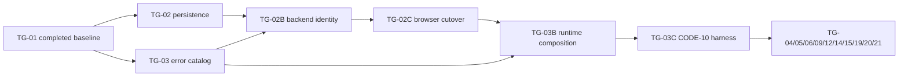

# Plan Delta — v1.7.21-oidc-session-error-contracts

## 1. Rationale And Precedence

The base Plan and APPROVED Plan deltas remain authoritative except for the identity/error-foundation corrections below. The previously oversized TG-02/TG-03 scopes are split into six bounded AI contexts: TG-02 persistence/crypto, TG-02B backend identity delivery, TG-02C browser-session cutover, TG-03 catalog generation, TG-03B runtime observability/composition and TG-03C CODE-10 harness. Together with canonical TG-01–TG-30, the effective adapter has **34 authoritative Task Group headings**. This pack is authoritative for their effort, dependency, ownership, QA and downstream-edge substitutions.

## 2. Effective Authoritative Field Corrections

| TG | Corrected field | Effective value / addition | Reason |
|---|---|---|---|
| TG-01 | `blocks` | add TG-02 and TG-03 to the existing downstream list | reciprocal edge for the reviewed baseline prerequisite |
| TG-02 | Scope | Identity persistence/crypto only: ENT-022/023 Prisma schema, repositories, `IdentityKeyPort`, both key IDs, encrypted recoverable PKCE/CSRF and lifecycle tests | one bounded DB/crypto context |
| TG-02B | New sequenced slice | API-017–020 backend delivery, `requireActor`/`requireCsrf`, module public entrypoint and current backend auth replacement | one backend HTTP/application context |
| TG-02C | New sequenced slice | frontend opaque-cookie/CSRF session service/store/router/auth-view cutover and frontend tests | one browser context after backend contract review |
| TG-03 | Scope | canonical `backend/errors.yml`, generator, generated TypeScript/OpenAPI and catalog contract tests only | one bounded build-time generation context |
| TG-03B | New sequenced slice | audit/telemetry adapters, frontend correlation adapter, live server composition and package-manifest handoff | one runtime composition context after TG-02C and TG-03 |
| TG-03C | New sequenced slice | five-service CODE-10 Compose/config/fixtures/self-test/cleanup harness | one isolated executable harness context after runtime composition |

TG-02 and TG-03 run in parallel after the completed **pre-pack D1-W0 TG-01 baseline**. TG-02B follows both TG-02 and the frozen TG-03 generated error exports it consumes; TG-02C follows TG-02B. TG-03B follows both TG-02C and TG-03 and is the sole `app.ts`/`server.ts`/`index.ts`/manifest owner. TG-03C follows TG-03B, owns only the CODE-10 harness, and closes the live foundation gate. In every effective downstream `blocked_by` list, any immediate prerequisite on old TG-02 and/or old TG-03 is replaced by TG-03C; the preceding slices remain transitive prerequisites. TG-04 also waits for TG-03C and begins only after TG-02 releases `schema.prisma`.

### Canonical heading invariant

The approved v1.7.20 adapter contributes exactly one heading for each TG-01–TG-30. This delta adds exactly one heading for TG-02B, TG-02C, TG-03B and TG-03C. Validator expectation is therefore **34 unique canonical headings**; it must reject missing/duplicate headings or the stale 30-heading assertion.

Consumers MUST materialize the effective Plan by stable TG ID, never by raw Markdown concatenation: apply `replace` for TG-02/TG-03, then `add` TG-02B/TG-02C/TG-03B/TG-03C, and reject a second effective definition. Raw source files may therefore contain 36 headings while the authoritative resolved set contains exactly 34. This operation table is machine-reviewable and normative:

| TG | Operation | Source of effective definition |
|---|---|---|
| TG-02 | replace | this delta |
| TG-03 | replace | this delta |
| TG-02B | add | this delta |
| TG-02C | add | this delta |
| TG-03B | add | this delta |
| TG-03C | add | this delta |

## 3. Canonical Implementation Validator Adapter Corrections

### Task Group 02 — Identity persistence and cryptography

- **Owner:** khanh-pham.
- **external_qa_readiness:** N/A — no external QA in sprint v1.
- **Delivery Notes**: AI implements one repository/crypto slice; the developer reviews migration reversibility, key boundaries and lifecycle invariants.
- **Deliverable**: reversible ENT-022/023 migration, repository/domain/key-port implementation and focused persistence suite.
- **Linked Test Coverage**: TC-065, TC-068.
- **Architecture References**: NFR-002/004/010; API-017–020/024; ADR-006; ARCH-COMP-001; ENT-022/023; PR-001; FLOW-004; EXC-AUTH-001.
- **Design References**: N/A — no visual surface is owned; this slice supplies persistence behind the approved authentication recovery/session surfaces.
- **User Stories**: N/A — infrastructure enabling protected US.
- **Feature References**: NFR-002/004/010; API-017–020/024; ADR-006; ARCH-COMP-001; ENT-022/023; PR-001; FLOW-004; EXC-AUTH-001.
- **Tracking IDs**: none provided.
- **target_modules_packages**: Identity domain/infrastructure, Identity-owned Prisma repositories/migration and key-provider port.
- **public_entrypoints_impacted**: `OidcLoginStateRepository`, `AuthSessionRepository`, `IdentityKeyPort`.
- **inherited_architecture_obligations**: exact 10-minute one-time state; hashed state/nonce/session/CSRF selectors; AES-256-GCM encrypted recoverable PKCE verifier and CSRF with unique nonce/tag; both `OIDC_STATE_KEY_ID` and `SESSION_CSRF_KEY_ID`; IAM-derived absolute expiry; idle `>15m`; activity write `>=60s`; monotonic invalidation; `KEY_PROVIDER_UNAVAILABLE` distinct from `SESSION_STORE_UNAVAILABLE`; no raw IAM token/full claim persistence.
- **allowed_diff_boundary**: ENT-022/023 schema, migration, repositories, key adapter, safe Prisma-validation wrapper and persistence tests only.
- **affected_code_surfaces**: Prisma identity schema/migration; repository transactions; hashing/encryption; lifecycle clock boundaries.
- **code_ownership_zones**: `backend/prisma/schema.prisma`; `backend/prisma/migrations/*identity_session*`; `backend/src/modules/identity/domain/**`; `backend/src/modules/identity/infrastructure/identity-crypto.ts`; `backend/src/modules/identity/infrastructure/prisma-identity-repositories.ts`; `backend/src/modules/identity/identity.persistence.integration.test.ts`; `backend/scripts/validate-prisma-schema.ts`.
- **shared_foundation_guard**: sole Identity/Prisma writer in D1; TG-04 cannot touch `schema.prisma` until TG-02 review/merge.
- **blocks**: [TG-02B].
- **blocked_by**: [TG-01].
- **qa_test_refs**: TC-065, TC-068; TG-26 consumes the resulting auth/security fixture after TG-03C integration.
- **repo_test_delta_target**:
  - Add: `backend/src/modules/identity/identity.persistence.integration.test.ts` with BVA/replay/concurrency/key/store/secret-marker coverage.
  - Add: `backend/scripts/validate-prisma-schema.ts`.
  - The wrapper copies only the Prisma schema to an ephemeral directory, supplies a synthetic database URL explicitly and never loads a repository environment file.
- **review_mode**: both.
- **validation commands to run**: additional focused commands: `npm --workspace backend run prisma:validate`; `npm run typecheck`; `node --import tsx --test backend/src/modules/identity/identity.persistence.integration.test.ts`. The approved common contract still requires `validate implementation --mode spec` and `validate implementation --mode quality` after integrated delivery.
- **Estimated Start / Day Range**: Day 1.
- **Complexity**: S; 6 agent-hours + 0.75 developer review-hours.
- **AI context fit**: one Prisma/repository/crypto context, no HTTP/frontend/composition files.
- **DOD checklist**: inherits the approved Plan common DOD, plus:
  - [ ] Migration and focused integration tests pass.
  - [ ] Both key IDs/ports and every lifecycle boundary match Architecture.
  - [ ] New logic reaches ≥90% line and branch coverage; secret scans report zero findings.
  - [ ] Owner completes the security-sensitive persistence review.
  - [ ] No completion validation is claimed until dependent slices are integrated.

### Task Group 02B — Backend identity delivery

- **Owner:** khanh-pham.
- **external_qa_readiness:** N/A — no external QA in sprint v1.
- **Delivery Notes**: AI implements backend application/delivery and runtime quarantine of legacy auth; physical brownfield source/schema removal is explicitly deferred to a separately traced migration after dependent data consumers are inventoried. Frontend cutover is handed to TG-02C after contract review.
- **Deliverable**: API-017–020 backend plugin, guards, IAM adapter and module public entrypoint with focused contract tests.
- **Linked Test Coverage**: TC-065, TC-068, TC-070.
- **Architecture References**: NFR-002/004/010; API-017–020/024; ADR-006; ARCH-COMP-001; PR-001; SEQ-001; FLOW-004; EXC-AUTH-001.
- **Design References**: SCREEN-009 public root auth shell; DS-COMP-012 pre-claim callback retry, post-claim fresh-login recovery, and malformed-contract fail-closed recovery; MSG-046/047/048; DESIGN-OVERVIEW-001 session-expiry contract remains separate.
- **User Stories**: N/A — shared authentication boundary for US-001–010.
- **Feature References**: NFR-002/004/010; API-017–020/024; ADR-006; ARCH-COMP-001; PR-001; SEQ-001; FLOW-004; EXC-AUTH-001.
- **Tracking IDs**: none provided.
- **target_modules_packages**: Identity application/delivery, pure startup configuration contract, Central-IAM adapter and runtime replacement/quarantine of current backend auth.
- **public_entrypoints_impacted**: `requireActor`, `requireCsrf`, API-017–020 and protected-route middleware inheritance.
- **inherited_architecture_obligations**: use TG-02 repositories/key port; fail closed at startup unless the exact NFR-010 TTL/idle/activity/login/status values and two distinct Secret Manager key references are present; login discovery/JWKS budget 5000ms with retry only for safe GET; token POST never retries; protected status is one direct 2000ms request to the configured issuer status endpoint with no discovery, positive cache or retry; pre-claim store rollback permits callback retry while only dependency failures after claim commit return `RESTART_LOGIN`; API-017/018 are public pre-session POST operations with JSON bodies and require `Cache-Control: no-store, private` plus `Pragma: no-cache` on every success/error, no prefetch/speculative call, rate limits, exact input validation and replay controls; `401 AUTH_REQUIRED`, `503 SERVICE_UNAVAILABLE`, `503 KEY_PROVIDER_UNAVAILABLE` and `503 SESSION_STORE_UNAVAILABLE` remain distinct; API-019 supports only local `allSessions=false`, uses one direct status request on ACTIVE sessions and no IAM request for a `LOGOUT` tombstone; API-019/020 use no session 404; API-020 matching ETag returns 304 empty body without CSRF decrypt/activity write.
- **allowed_diff_boundary**: backend auth application/delivery/adapter and old backend auth replacement only; no frontend, schema, generator or composition-root edit.
- **affected_code_surfaces**: API-017–020 handlers/hooks, pure Identity runtime-config validator, IAM adapter, old local-JWT runtime quarantine/import-boundary test and public Identity module export; physical legacy source/schema removal is out of scope.
- **code_ownership_zones**: `backend/src/modules/identity/application/**`; `backend/src/modules/identity/delivery/**`; `backend/src/modules/identity/config.ts`; `backend/src/modules/identity/infrastructure/http-central-iam-adapter.ts`; `backend/src/modules/identity/index.ts`; `backend/src/modules/identity/identity.contract.test.ts`; `backend/src/auth/**`.
- **shared_foundation_guard**: consumes reviewed TG-02 ports; exports a composition-ready plugin but never edits `server.ts`/`index.ts`.
- **blocks**: [TG-02C].
- **blocked_by**: [TG-02, TG-03].
- **qa_test_refs**: TC-065, TC-068, TC-070; TG-26 owns the integrated security refutation after TG-03C.
- **repo_test_delta_target**:
  - Add: `backend/src/modules/identity/identity.contract.test.ts` including startup-config fail-closed rows, API-017/018 no-store/no-cache headers on success/error/replay, API-020 200/304 and all protected middleware outcomes.
  - Update: runtime composition contract proving `/api/auth/login` is absent and composition imports no legacy routes/password/token module.
- **review_mode**: both.
- **validation commands to run**: additional focused commands: `npm run typecheck`; `node --import tsx --test backend/src/modules/identity/identity.contract.test.ts`. The approved common contract still requires `validate implementation --mode spec` and `validate implementation --mode quality` after integrated delivery.
- **Estimated Start / Day Range**: Day 2.
- **Complexity**: S; 4 agent-hours + 0.5 developer review-hours.
- **AI context fit**: one backend application/delivery/IAM-adapter context; persistence, browser and runtime composition remain external reviewed seams.
- **DOD checklist**: inherits the approved Plan common DOD, plus:
  - [ ] Contract tests pass with ≥90% line and branch coverage.
  - [ ] Callback pre/post-claim recovery, replay, expiry, revocation, one-call IAM, key/store and 304 branches are refuted.
  - [ ] Security owner reviews route/cookie/CSRF behavior.
  - [ ] Reviewed merge precedes TG-02C.

### Task Group 02C — Browser opaque-session cutover

- **Owner:** khanh-pham.
- **external_qa_readiness:** N/A — no external QA in sprint v1.
- **Delivery Notes**: AI changes only browser API/session/router/auth-view surfaces against the reviewed TG-02B contract; developer reviews navigation and no-token-storage behavior.
- **Deliverable**: opaque-cookie/CSRF frontend session client, public SPA `/auth/callback` handoff, router/auth-view cutover, DS-COMP-012 state machine/component rendering and focused contract/browser tests.
- **Linked Test Coverage**: TC-065, TC-068, TC-072, TC-073.
- **Architecture References**: API-017–020/024; ADR-006; PR-001; FLOW-004; EXC-AUTH-001.
- **Design References**: SCREEN-009 public auth route/shell plus DS-COMP-012 and MSG-046/047/048 for post-claim restart, bounded pre-claim retry, and malformed-contract fail-closed recovery; DESIGN-OVERVIEW-001/MSG-024 only for actual session expiry.
- **User Stories**: N/A — shared authentication boundary for US-001–010.
- **Feature References**: NFR-004/008/010; API-017–020/024; ADR-006; PR-001; FLOW-004.
- **Tracking IDs**: none provided.
- **target_modules_packages**: frontend auth/session service, store, router and auth views.
- **public_entrypoints_impacted**: frontend session bootstrap, API CSRF injection and authentication route guards.
- **inherited_architecture_obligations**: no browser bearer/localStorage token; SCREEN-009's public root auth shell exists independently of `ApiLabWorkspaceShell` and mounts no protected content; Central IAM redirects to SPA `/auth/callback`, which submits code/state to API-018 through the shared credentialed Axios client only when both values exist and accepts only a validated same-origin success return path; API-017 starts only from explicit user activation and neither API-017 nor API-018 is prefetched/speculatively called; API-018 pre-claim failure permits exactly one Axios retry of the same API URL after Retry-After, then the exhausted CTA clears callback/retry/error state without a network request and reveals the ordinary login entry; the next normal login starts API-017 with fixed `returnTo=/`, ignores the prior route query and never reuses callback input; post-claim or malformed recovery starts fresh API-017 with fixed `returnTo=/` and never resubmits callback; non-API-018 `RESTART_LOGIN` is ignored; malformed-navigation failure remains the invalid-contract state; API-020 200/304 contract; opaque Secure/HttpOnly/SameSite cookie and request-local CSRF.
- **allowed_diff_boundary**: frontend auth/session/router/view code and focused frontend tests only.
- **affected_code_surfaces**: frontend API/session service, store, auth lifecycle composition, router and Login/Setup views.
- **code_ownership_zones**: `frontend/src/core/auth/**`; `frontend/src/stores/session.ts`; `frontend/src/services/api.ts`; `frontend/src/main.ts`; `frontend/src/router/**`; `frontend/src/views/auth/**`; `frontend/src/**/*.contract.test.ts` limited to owned auth surfaces; `tests/e2e/callback-recovery.spec.ts`; `tests/e2e/callback-recovery.config.ts`; `docs/evidence/accessibility/TC-072/*`.
- **shared_foundation_guard**: consumes reviewed TG-02B endpoints; never edits backend composition, persistence or generated catalog.
- **blocks**: [TG-03B].
- **blocked_by**: [TG-02B].
- **qa_test_refs**: TC-065, TC-068, TC-072, TC-073.
- **repo_test_delta_target**:
  - Add: `frontend/src/core/auth/session.contract.test.ts` covering no token storage, API-018 SPA/Axios handoff and safe success return path, 200/304, CSRF and restart-login routing.
  - Add: `frontend/src/core/auth/callback-recovery.contract.test.ts` executing pre/post-claim state, countdown, single-retry and navigation-error transitions.
  - Add: `tests/e2e/callback-recovery.spec.ts` exercising the public SPA callback → credentialed API-018 → safe success-return path, rendering every DS-COMP-012 state and capturing screenshot/focus evidence.
  - Add: `docs/evidence/accessibility/TC-072/manifest.json` indexing the locally executed browser/version/viewport and exact evidence files.
- **review_mode**: both.
- **validation commands to run**: additional focused commands: `npm run typecheck`; `node --experimental-test-coverage --import tsx --test frontend/src/core/auth/session.contract.test.ts frontend/src/core/auth/callback-recovery.contract.test.ts`; start `npm --workspace frontend run dev -- --host 127.0.0.1 --port 5174` with `VITE_ENV_DIR` set to a newly created empty temporary directory, then run `CALLBACK_E2E_BASE_URL=http://127.0.0.1:5174 npx playwright test --config=tests/e2e/callback-recovery.config.ts` and stop Vite/remove that empty directory in `finally`. Common spec/quality validations remain mandatory after integration.
- **Estimated Start / Day Range**: Day 2.
- **Complexity**: S; 2 agent-hours + 0.25 developer review-hours.
- **AI context fit**: one browser-session context with one reviewed backend seam.
- **DOD checklist**: inherits common DOD, plus frontend contract/browser tests pass, all DS-COMP-012 hooks/copy/focus/live/countdown states have screenshot evidence, browser token storage is absent, callback retry/restart routing is exact and every governed changed surface reaches ≥90% line/branch coverage.

### Task Group 03 — Canonical error catalog generation

- **Owner:** khanh-pham.
- **external_qa_readiness:** N/A — no external QA in sprint v1.
- **Delivery Notes**: AI owns isolated source/generator work; developer reviews compatibility and generated-schema parity.
- **Deliverable**: canonical catalog, decomposed deterministic generator, generated TypeScript/OpenAPI and contract tests.
- **Linked Test Coverage**: TC-061, TC-064, TC-070, TC-073.
- **Architecture References**: NFR-006/008/010; API-024; ADR-008; PR-008; EXC-STACK-001.
- **Design References**: N/A — generated backend contract only; visible copy remains the approved Design contract.
- **User Stories**: N/A — infrastructure.
- **Feature References**: NFR-006/008/010; API-024; ADR-008; PR-008; EXC-STACK-001.
- **Tracking IDs**: none provided.
- **target_modules_packages**: canonical YAML catalog, deterministic generator and generated TypeScript/OpenAPI.
- **public_entrypoints_impacted**: generated `ErrorCode`, metadata and OpenAPI response components.
- **inherited_architecture_obligations**: middleware inheritance is generator-consumed; API-024 503 `retry_after_seconds` is integer 1..86400 and exactly equals HTTP `Retry-After`; non-429/503 omits the field; API-019 excludes key-provider error and API-020 304 performs no decrypt; metadata complete; pre-release aliases rejected; output deterministic/atomic; stale check fails.
- **allowed_diff_boundary**: catalog/generator/generated outputs and their focused test only.
- **affected_code_surfaces**: `backend/errors.yml`, generator and generated shared-error files.
- **code_ownership_zones**: `backend/errors.yml`; `backend/scripts/generate-errors.ts`; `backend/src/shared/errors/**`.
- **shared_foundation_guard**: runs after TG-01 baseline; TG-03B alone owns manifests/runtime composition.
- **blocks**: [TG-02B, TG-03B].
- **blocked_by**: [TG-01].
- **qa_test_refs**: TC-061, TC-064, TC-070, TC-073; TG-03 owns catalog/generator assertions and TG-03B owns live routing/observability assertions.
- **repo_test_delta_target**:
  - Add: `backend/src/shared/errors/error-catalog.contract.test.ts` using isolated temp catalog/output fixtures.
- **review_mode**: both.
- **validation commands to run**: additional focused commands: `node --import tsx backend/scripts/generate-errors.ts --check`; `npm run typecheck`; `node --import tsx --test backend/src/shared/errors/error-catalog.contract.test.ts`. The approved common contract still requires `validate implementation --mode spec` and `validate implementation --mode quality` after integrated delivery.
- **Estimated Start / Day Range**: Day 1.
- **Complexity**: S; 5 agent-hours + 0.75 developer review-hours.
- **AI context fit**: one build-time catalog/generator context; no runtime adapter/frontend/Compose files.
- **DOD checklist**: inherits the approved Plan common DOD, plus:
  - [ ] Generation/check is deterministic and atomic.
  - [ ] API-024 inheritance/status/metadata parity passes.
  - [ ] Generator rejects out-of-range/unequal body/header retry metadata and any forbidden non-503 detail.
  - [ ] Deprecated aliases and stale/secret/partial output are rejected.
  - [ ] New logic reaches ≥90% line and branch coverage.

### Task Group 03B — Observability and runtime composition

- **Owner:** khanh-pham.
- **external_qa_readiness:** N/A — no external QA in sprint v1.
- **Delivery Notes**: AI composes reviewed Identity/catalog exports with observability and manifests; developer reviews only the runtime dependency graph and package diff.
- **Deliverable**: audit/telemetry/correlation adapters, live Fastify composition, package/lock handoff and runtime contract suite.
- **Linked Test Coverage**: TC-061, TC-064, TC-070, TC-073.
- **Architecture References**: NFR-002/004/006/008/010; API-017–020/024; ARCH-COMP-001/007; PR-001/006/008; FLOW-004; EXC-STACK-001.
- **Design References**: DS-COMP-012 global recovery hook plus DESIGN-OVERVIEW-001 existing error/session hooks; no visual redesign.
- **User Stories**: N/A — runtime foundation.
- **Feature References**: NFR-002/004/006/008/010; API-017–020/024; ARCH-COMP-001/007; PR-001/006/008; FLOW-004; EXC-STACK-001.
- **Tracking IDs**: none provided.
- **target_modules_packages**: audit/telemetry adapters, Fastify composition, frontend correlation adapter and manifests.
- **public_entrypoints_impacted**: `AuditSink`, `Telemetry`, live request/error hooks, Identity plugin registration and the live backend runtime entrypoint consumed by TG-03C; the `foundation-self-test` entrypoint itself is owned only by TG-03C.
- **inherited_architecture_obligations**: adapter-only SDK imports; redaction before persistence/export; injected composition clock for deterministic audit timestamps; exporter failure cannot roll back business data; live composition invokes the reviewed TG-02B fail-closed startup validator before constructing repositories/adapters and consumes reviewed TG-02B/TG-03 exports.
- **allowed_diff_boundary**: runtime integration/observability and exact manifest additions only; no feature-domain or Compose/harness logic.
- **affected_code_surfaces**: audit/telemetry, frontend correlation/build budget, `app.ts`/`server.ts`/`index.ts` and manifests.
- **code_ownership_zones**: `backend/src/platform/audit/**`; `backend/src/platform/observability/**`; `backend/src/app.ts`; `backend/src/index.ts`; `backend/src/server.ts`; `frontend/src/core/api/**`; `frontend/src/core/observability/**`; `frontend/vite.config.ts`; `backend/package.json`; `package-lock.json`; `backend/src/shared/errors/error-observability.contract.test.ts`.
- **shared_foundation_guard**: sole composition/manifest writer after TG-02C and TG-03 review; TG-03C consumes this reviewed runtime.
- **blocks**: [TG-03C].
- **blocked_by**: [TG-02C, TG-03].
- **qa_test_refs**: TC-061, TC-064, TC-070, TC-073; TG-03B owns runtime/error routing and TG-27 later consumes its observability evidence.
- **repo_test_delta_target**:
  - Add: `backend/src/shared/errors/error-observability.contract.test.ts`.
- **review_mode**: both.
- **validation commands to run**: additional focused commands: `npm run typecheck`; `node --import tsx --test backend/src/shared/errors/error-observability.contract.test.ts`; `node --import tsx backend/scripts/generate-errors.ts --check`. Common spec/quality validations remain mandatory after integrated delivery.
- **Estimated Start / Day Range**: Day 2.
- **Complexity**: S; 4 agent-hours + 0.75 developer review-hours.
- **AI context fit**: one runtime composition/observability context with reviewed identity/catalog seams; no schema/catalog/harness authoring.
- **DOD checklist**: inherits the approved Plan common DOD, plus:
  - [ ] Runtime/error/observability contracts pass.
  - [ ] Error/correlation/redaction/exporter behavior reaches ≥90% line and branch coverage on new logic.
  - [ ] Package/lock diff contains only used dependencies.
  - [ ] Sprint-v1 internal bundle stays within the explicit 1.75 MiB warning budget; TG-29 owns route-level splitting before external/public/commercial deployment.
  - [ ] Reviewed merge precedes TG-03C.

### Task Group 03C — CODE-10 foundation self-test harness

- **Owner:** khanh-pham.
- **external_qa_readiness:** N/A — no external QA in sprint v1.
- **Delivery Notes**: AI owns only Compose/config/fixtures/runner/cleanup; developer reviews deterministic environment setup and residue checks.
- **Deliverable**: five-service local foundation harness with happy/IAM/key/store paths and deterministic cleanup evidence.
- **Linked Test Coverage**: TC-061, TC-065, TC-070, TC-073.
- **Architecture References**: NFR-002/004/006/008/010; API-017–020/024; FLOW-004; PR-001/008; EXC-STACK-001.
- **Design References**: N/A — local runtime verification harness only.
- **User Stories**: N/A — runtime foundation gate.
- **Feature References**: CODE-10; NFR-002/004/006/008/010; API-017–020/024.
- **Tracking IDs**: none provided.
- **target_modules_packages**: Compose topology, inline synthetic non-secret environment, fake dependencies, fixtures and self-test runner.
- **public_entrypoints_impacted**: local `foundation-self-test` service/runner only.
- **inherited_architecture_obligations**: exercise exact 5000ms login/2000ms single-status behavior, zero status cache/retry, distinct IAM/key/store errors, retry metadata equality and no protected payload.
- **allowed_diff_boundary**: `backend/test/compose/**` plus `backend/scripts/self-test-foundation.ts`, `backend/scripts/foundation-response-contract.ts` and its focused test only.
- **affected_code_surfaces**: foundation Compose, config examples, fixtures, self-test runner and the extracted pure response-contract assertion.
- **code_ownership_zones**: `backend/test/compose/foundation.compose.yml`; `backend/test/compose/config/foundation.env.example`; `backend/test/compose/fixtures/**`; `backend/scripts/self-test-foundation.ts`; `backend/scripts/foundation-response-contract.ts`; `backend/scripts/foundation-response-contract.test.ts`.
- **shared_foundation_guard**: consumes reviewed TG-03B image/runtime and never edits package manifests or application code.
- **blocks**: [TG-04, TG-05, TG-06, TG-09, TG-12, TG-14, TG-15, TG-19, TG-20, TG-21].
- **blocked_by**: [TG-03B].
- **qa_test_refs**: TC-061, TC-065, TC-070, TC-073.
- **repo_test_delta_target**:
  - Add: `backend/scripts/self-test-foundation.ts`.
  - Add: `backend/scripts/foundation-response-contract.ts` and `backend/scripts/foundation-response-contract.test.ts` covering body/header retry equality, bounds, correlation and recursive protected-payload absence.
  - Add: `backend/test/compose/foundation.compose.yml`.
- **review_mode**: both.
- **validation commands to run**: `node --experimental-test-coverage --import tsx --test backend/scripts/foundation-response-contract.test.ts`; use `docker compose --env-file /dev/null -p api-lab-foundation -f backend/test/compose/foundation.compose.yml` for every Compose step: `config`, `up --build --wait mysql iam-fake key-provider-fake backend`, then `--profile self-test run --rm foundation-self-test`; cleanup in `finally` with `down -v --remove-orphans`, then assert zero project containers and project-labelled volumes. Common spec/quality validations remain mandatory. Passing `/dev/null` explicitly prevents Compose from loading a repository `.env` file.
- **Estimated Start / Day Range**: Day 2.
- **Complexity**: S; 2 agent-hours + 0.25 developer review-hours.
- **AI context fit**: one bounded harness context with no application authoring.
- **CODE-10 executable contract**: `up --build --wait` intentionally starts only the four long-running dependencies; the next explicit `--profile self-test run --rm foundation-self-test` command starts the one-shot fifth service. This two-command contract is normative and removes any implication that the profile-gated service starts during `up`.
- **Coverage scope / justified exclusion**: the extracted pure response-contract module is governed changed logic and must reach ≥90% line/branch coverage. The one-shot runner's process argument parsing, real-network orchestration and cleanup shell are excluded from unit line coverage because executing them without Compose would replace, not test, their runtime contract; they are exercised end-to-end by the required five-service Compose command and residue check. No response-validation branch is excluded.
- **DOD checklist**: inherits common DOD, plus happy/IAM/key/store paths pass, every 503 proves equal bounded retry body/header values and recursive protected-payload absence, extracted response logic reaches ≥90% line/branch coverage, health/config/seed/reset are repeatable, and cleanup proves zero container/volume residue.

## 4. Dependency And Timeline Reconciliation

### 4.1 Delivery Traceability Index Override (`PLAN-1`)

The following full rows replace the matching effective DTI rows (`NFR-002, NFR-003`, `NFR-004`, `NFR-006`, `NFR-008`) and add `NFR-010`. Their columns exactly preserve the approved DTI schema; unaffected rows remain authoritative.

| FR / NFR | US | Architecture Refs | QA Test Intent | External QA Readiness | Task Group | Affected Code Surfaces | Validation Commands | Repo Test Delta Target |
|---|---|---|---|---|---|---|---|---|
| NFR-002, NFR-003 | US-003, US-007–010 | NFR-002/003/010; ADR-004/005/006; ARCH-COMP-001; API-024; FLOW-004 | TC-060, TC-062, TC-063, TC-065, TC-067, TC-068 | N/A | TG-02, TG-02B, TG-02C, TG-03B, TG-03C, TG-09, TG-11, TG-21, TG-22, TG-23, TG-25, TG-26 | Durable identity persistence, protected dependency degradation, leases, capacity, health and recovery refutation | focused TG commands; `validate implementation --mode spec`; `validate implementation --mode quality` | Identity persistence/contract/browser tests + CODE-10 dependency failure/capacity/lease/recovery tests |
| NFR-004 | US-002/003/007/009/010 | NFR-004/010; ADR-005/006; API-017–020/024; ENT-022/023; FLOW-001/002/004 | TC-062, TC-065, TC-068 | N/A | TG-02, TG-02B, TG-02C, TG-03B, TG-03C, TG-04, TG-12, TG-26, TG-29 | OIDC state/session storage, cookie/CSRF cutover, manifest, secrets, SSRF, redaction and browser/source-map gates | focused TG commands; `validate implementation --mode spec`; `validate implementation --mode quality` | Identity persistence/contract + auth/CSRF/manifest/SSRF/browser-storage/security tests |
| NFR-006 | US-001–010 | NFR-006/010; ARCH-COMP-001/007; API-024; FLOW-004; PR-006/008 | TC-064, TC-070, TC-076 | N/A | TG-03, TG-03B, TG-03C, TG-14, TG-27 | Generated error metadata, correlated redacted audit/telemetry, live routing, exporter and KPI-correlation refutation | focused TG commands; `validate implementation --mode spec`; `validate implementation --mode quality` | Isolated catalog generator + live error/observability/exporter-failure/KPI-correlation tests |
| NFR-008 | US-001–010 | NFR-008/010; API-024; SCREEN-001–009; PR-007/008 | TC-044, TC-045, TC-061, TC-064, TC-070, TC-072, TC-073 | N/A | TG-02C, TG-03, TG-03B, TG-03C, TG-15–TG-20, TG-24, TG-28, TG-29, TG-30 | Deterministic generated contracts, runtime composition, keyboard, responsive gate, browser security and code quality | focused TG commands; `validate implementation --mode spec`; `validate implementation --mode quality` | Catalog/runtime contract + component/a11y/Playwright/browser/coverage gates |
| NFR-010 | US-001–010 | NFR-010; ENT-022/023; API-017–020/024; ADR-006; ARCH-COMP-001; FLOW-004 | TC-065, TC-070 | N/A | TG-02, TG-02B, TG-02C, TG-03, TG-03B, TG-03C, TG-26 | Exact state/session/IAM/key configuration, callback recovery, retry-metadata equality and generated/runtime routing | focused TG commands; `validate implementation --mode spec`; `validate implementation --mode quality` | Configured-parameter BVA, auth/browser/catalog/runtime and integrated security tests |

### 4.2 Reciprocal Dependency Graph Override (`PLAN-3`)

Reciprocal fields are authoritative: TG-01 blocks TG-02/TG-03; TG-02 and TG-03 block TG-02B because backend identity consumes both persistence and frozen generated errors; TG-02B blocks TG-02C; TG-02C and TG-03 block TG-03B; TG-03B blocks TG-03C; TG-03C blocks the downstream set above. In every effective downstream `blocked_by` list, old TG-02/TG-03 prerequisites are replaced by TG-03C. This substitution prevents duplicate dependency meanings while preserving stronger prerequisites.

### 4.3 AI Waves, Effort And Capacity

| Day / wave | Work | Merge gate |
|---|---|---|
| Pre-pack D1-W0 | TG-01 completed baseline | manifest/shared foundation handoff finished before candidate slices; no same-day ownership overlap |
| D1-W1 | TG-02 and TG-03 in parallel | persistence and generated catalog each pass focused tests; ownership is disjoint |
| D2-W0A | TG-02B | consumes reviewed TG-02 plus frozen TG-03 generated errors; Security owner reviews route/cookie/CSRF behavior |
| D2-W0B | TG-02C | consumes reviewed TG-02B; browser session contract passes |
| D2-W0C | TG-03B | consumes reviewed TG-02C/TG-03; runtime composition passes |
| D2-W0D | TG-03C | consumes reviewed TG-03B; Compose happy/error and cleanup pass |
| D2-W1 | existing TG-04/TG-15 lanes after TG-03C | TG-04 becomes next exclusive `schema.prisma` owner |
| D4-W1 | existing work plus moved TG-21 | disjoint IaC zone; Day-4 developer capacity remains ≤6h |
| D6-W1 | existing work plus moved TG-14 | disjoint backup/audit-retention zone; Day-6 capacity remains ≤6h |

Old TG-02/TG-03 effort was 12 agent-hours and 2.5 developer-hours. The six bounded slices total 23 agent-hours and 3.25 developer-hours: **+11 agent-hours, +0.75 developer-hours**. Effective sprint totals remain **208 agent-hours and 39.75 developer-hours**, still within the 10-day/60-hour human capacity. Day 1 becomes 2.5h; Day 2 becomes 4.75h after TG-14/TG-21 move; Day 4 becomes 4.5h; Day 6 becomes 4.0h; all other effective day totals from v1.7.19 remain unchanged. The delivery horizon stays Day 1–10; a failed wave moves the forecast rather than weakening scope or QA.

## 5. Open Issues

None.

## Self-Review Checklist

- [x] TG-02/TG-02B/TG-02C/TG-03/TG-03B/TG-03C expose the complete PLAN-2 field set and 34-heading invariant
- [x] Reciprocal dependency edges and explicit waves match every `blocks`/`blocked_by` field
- [x] Same-wave ownership zones have zero overlap; Prisma, manifests and composition each have one writer
- [x] Repo-test targets cover persistence, backend auth, browser cutover, isolated generation, runtime composition and CODE-10 happy/error surfaces
- [x] PLAN-1 explicitly preserves TC-044/045/060/061/062/063/064/065/067/068/070/072/073/076 and traces every new Architecture surface
- [x] Effort/capacity arithmetic is explicit and remains within the approved Day 1–10 horizon
