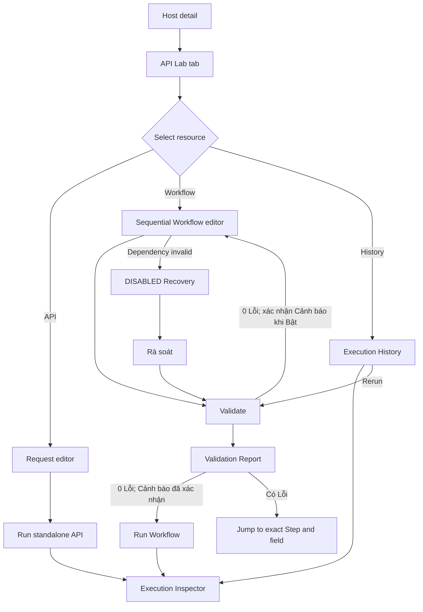

# Design System Proposal — Sprint v1

## New

<!-- ID: DESIGN-OVERVIEW-001 -->
### Design Overview

#### 1. Design Direction And Source

- **Product source:** [Sprint brief v1](../../product/sprint-brief-v1.md), [PRD proposal v1](../../product/proposals/prd-v1.md), [EP-001 proposal](../../product/proposals/epics/EP-001-api-lab-workflow-orchestration-v1.md) and APPROVED [Product delta `v1.7.18-api-lab-undo-warning-viewport`](../../changes/v1.7.18-api-lab-undo-warning-viewport/product-delta-v1.7.18-api-lab-undo-warning-viewport.md) covering FR-001/003/007/011, BR-005/011/012 and AC-044–059.
- **Industry vertical:** developer tooling / API management and workflow orchestration, inherited from Product `PROD-5` with high confidence.
- **Visual and component source:** layout requirements from the stakeholder image are fully restated in this proposal; implementation does not depend on the conversation asset. Colors/typography/control conventions resolve to [`frontend/src/style.css`](../../../../frontend/src/style.css), [`frontend/src/core/components`](../../../../frontend/src/core/components) and existing System Manager surfaces under [`frontend/src/features/system-manager`](../../../../frontend/src/features/system-manager).
- **Platform:** authenticated Web desktop on a device with `screen width >= 1280px`. On a supported screen, browser zoom through 200% keeps editing available via compact panels and horizontal scrolling in technical editor regions. Devices below 1280px show an unsupported-device state; no mobile/tablet editing in v1.
- **Language:** Vietnamese UI while retaining canonical technical entity/state terms `Host`, `API Workspace`, `Collection`, `Folder`, `API`, `Environment`, `Workflow`, `Step`, `Mapping`, `Execution`, `Retry`, `Timeout`, `DRAFT`, `READY`, `DISABLED`.

**Principles**

1. Context before action — Host and Environment remain visible before any Run action.
2. Inspectable by default — resolved request, response, duration, attempts and errors are reachable without leaving the workspace.
3. Safe dependency changes — destructive or contract-changing actions expose impact before confirmation and require explicit recovery.
4. Progressive disclosure — Resource Tree stays persistent; Variable Browser, Execution Inspector and Recovery Checklist open only in relevant contexts.
5. Accessible technical density — keyboard operability, semantic status text and stable QA hooks take precedence over decorative motion.

> Assumption: Existing application CSS and core/System Manager components remain the implementation source of truth; the supplied dark UI image is not a dark-theme mandate.
> Validate: UX Lead compares this proposal against the linked running surfaces before `approve design`.
> Change trigger: A new brand system or replacement of the linked component/style sources.

#### 2. Information Architecture And Screen Inventory

| Screen ID | Name | Route / Surface | Entry | Exit | FR / US |
|---|---|---|---|---|---|
| SCREEN-001 | Host API Lab Workspace | `/systems/:host_id/api-lab` | Host detail → tab `API Lab` | API, Workflow, History, Environment settings | FR-001, FR-003 / US-001, US-009 |
| SCREEN-002 | Environment & Credential Settings | `/systems/:host_id/api-lab/environments` | Workspace Environment selector → `Quản lý môi trường` | Workspace with selected Environment | FR-002 / US-002 |
| SCREEN-003 | API Request & Response Editor | Workspace route + `api=:api_id` | Resource Tree API node | Saved API, standalone Execution | FR-004, FR-005, FR-012 / US-003 |
| SCREEN-004 | Sequential Workflow Editor | `/systems/:host_id/api-lab/workflows/:workflow_id` | Workspace Workflow node | READY/DISABLED Workflow, Run | FR-006, FR-007, FR-008 / US-004, US-005, US-006, US-007 |
| SCREEN-005 | Execution Inspector | Contextual bottom panel/drawer | Run API/Workflow or open Execution | History detail or close panel | FR-008, FR-009, FR-012 / US-007, US-008 |
| SCREEN-006 | Dependency Impact & Recovery | Modal + contextual right panel | Delete/change method; open DISABLED Workflow | Workflow editor READY/DISABLED | FR-003, FR-011 / US-009 |
| SCREEN-007 | Execution History | `/systems/:host_id/api-lab/history` | Workspace tab `Lịch sử` | Inspector or new rerun Execution | FR-010, FR-012 / US-007, US-010 |
| SCREEN-008 | Workflow Validation Report | `/systems/:host_id/api-lab/workflows/:workflow_id/validation` | Workflow editor → `Kiểm tra workflow` | Exact Step/field, Run or Recovery checklist | FR-007, FR-011 / US-006, US-009 |

Global workspace shell uses three contextual zones: persistent Resource Tree left; primary editor center; contextual right drawer for Variables/Recovery. Execution Inspector opens below the center editor and can be collapsed. Opening a drawer never hides the selected Host, Environment or primary Run state.

#### 3. User Flows



| Flow | FR | Entry → action → success | Error/recovery and decision edges |
|---|---|---|---|
| UX-FLOW-01 | FR-001 | Host detail → `API Lab` → Workspace shows Host breadcrumb and ACTIVE state | Host INACTIVE: Run controls disabled, exact banner; session expired: return to sign-in then restore route |
| UX-FLOW-02 | FR-002 | `Quản lý môi trường` → edit common variable schema/value/credential → Save → selected Environment refreshed | Missing required value: inline error; save failure: retain edits and `Thử lại`; cancel: confirm discard only when dirty |
| UX-FLOW-03 | FR-003 | Resource Tree → create/move/copy/delete Collection/Folder/API → tree refreshes at correct level | Duplicate/blank name inline; delete with dependency routes to impact modal; confirmed API delete offers Undo for 10 seconds; rejected late request/failed restore shows MSG-036; network failure retains draft node |
| UX-FLOW-04 | FR-004 | Select API → configure method/path/query/header/body/timeout/sensitive paths → Save | Invalid field inline; unsaved navigation prompts; Host/environment credential remains read-only with settings link |
| UX-FLOW-05 | FR-005 | Select Environment → `Chạy API` → loading → response and duration in Inspector | Timeout/error retains request and offers `Chạy lại`; Environment change during run affects only next Execution |
| UX-FLOW-06 | FR-006 | Open Workflow → create/edit workflow-local variables → add/reorder ≤20 steps → drag variable or type expression → Save | Invalid/duplicate workflow-variable key or blank value stays inline; Step 21 rejected; later/current-step mapping rejected; no source response shows run-source guidance plus manual expression option |
| UX-FLOW-07 | FR-007 | `Kiểm tra workflow` → deterministic checks → SCREEN-008 summary → READY when Lỗi count is zero | Findings link to exact Step/field; Lỗi blocks Run/Bật workflow; Cảnh báo requires confirmation; deleted API/method change keeps DISABLED |
| UX-FLOW-08 | FR-008 | READY Workflow → `Chạy workflow` → capacity accepted → sequential step timeline → Execution SUCCEEDED/FAILED | If 20 Workflows are already running, reject the Run with MSG-041, create no Execution and retain editor state; otherwise failed Step expands automatically and later Steps show `Chưa chạy` |
| UX-FLOW-09 | FR-009 | API timeout + step retry config → run → attempts visible → final state | Non-retryable error stops immediately; exhausted attempts show final error; no control retries prior successful steps |
| UX-FLOW-10 | FR-010 | `Lịch sử` → filter/open record → detail → `Chạy lại` → validation → new Execution | Record expired: empty result; rerun invalid: route to Workflow issues; latest definition/environment is restated before confirmation |
| UX-FLOW-11 | FR-011 | Delete/change method → impact preview → confirm → affected Workflows DISABLED → Rà soát → Kiểm tra → Bật workflow | Host ACTIVE alone never enables; unresolved checklist disables Bật workflow; Undo restores API but never auto-enables; closing modal cancels destructive action |
| UX-FLOW-12 | FR-012 | Configure sensitive paths → execute → masked values in viewer/history/telemetry-facing UI | Unconfigured fields remain visible; UI warns “Chỉ các trường đã cấu hình mới được che”; Host credential always masked |
| UX-FLOW-13 | FR-007 | `Kiểm tra workflow` → SCREEN-008 displays Đạt/Cảnh báo/Lỗi totals → select finding → editor focuses exact Step/field | Any Lỗi blocks Run/Bật workflow; Cảnh báo requires explicit confirmation; report load failure retains prior editor state and offers retry |

#### 4. Navigation, Permission, Dirty State And Interaction Contracts

**Navigation contract**

| Surface | Breadcrumb | Back/ancestor behavior |
|---|---|---|
| Workspace | `System Manager / {Host} / API Lab` | `{Host}` returns to Host detail; `System Manager` returns to Host list |
| Environment settings | `System Manager / {Host} / API Lab / Environments` | `API Lab` restores the selected Environment and Resource Tree state |
| API editor | `System Manager / {Host} / API Lab / {Collection} / {Folder…} / {API}` | Collection/Folder crumbs select that node; API is `aria-current=page` |
| Workflow editor | `System Manager / {Host} / API Lab / Workflows / {Workflow}` | `Workflows` returns to the Workflow tree scope with search/filter preserved |
| Validation Report | `System Manager / {Host} / API Lab / Workflows / {Workflow} / Validation` | `{Workflow}` returns to the editor; finding links return and focus the exact field |
| Execution History/detail | `System Manager / {Host} / API Lab / History / {Execution ID?}` | History filters, sort, page and selected row are restored from URL state |

Breadcrumb is present below the existing application header on every full-page surface. It never replaces the Resource Tree. Browser Back and breadcrumb navigation use the same dirty-state guard and return focus to the destination page heading.

**Permission matrix — phase 1**

| User state | See Workspace/API/Workflow/History | Create/edit/delete | Validate/run/rerun | Environment/Credential configuration |
|---|---|---|---|---|
| Authenticated user | Yes | Yes | Yes, subject to Host/Workflow validity | Yes; saved credential remains masked |
| Unauthenticated/session expired | No | No | No | No; redirect to sign-in and preserve return URL |

All authenticated users see the same navigation and controls; phase 1 has no role-specific hiding or action-level RBAC. Disabled controls always explain state constraints such as Host INACTIVE, Workflow DISABLED or validation Lỗi—not permission denial. Execution records still display the initiating user.

**Dirty-state and concurrent editing contract**

- Internal navigation, breadcrumb, Resource Tree selection and Browser Back use MSG-021 with `Lưu`, `Bỏ thay đổi`, `Ở lại`; Back proceeds only after Save/Discard.
- Browser refresh and tab/window close register `beforeunload` only while dirty. The browser-native confirmation copy is platform-controlled; cancel keeps the page and edits, confirm leaves and discards the unsaved client state.
- After successful save the dirty flag clears immediately, so refresh/close/back does not prompt. Failed save keeps both the dirty flag and user input.
- Workflow saves carry the loaded revision. If another user saved a newer revision, the later save is rejected and MSG-027 opens; the user may `Tải bản mới`, `Sao chép thay đổi` to copy the unsaved draft as text to the clipboard, or `Hủy`. This does not create another Workflow and never overwrites the newer revision silently.

**Global interaction rules**

- Environment selector is fixed in Workspace header. Changing it with unsaved editor changes opens: “Bạn có thay đổi chưa lưu. Lưu trước khi đổi môi trường?” with `Lưu và đổi`, `Bỏ thay đổi`, `Hủy`.
- Workflow variables are workflow-local static key/value pairs managed in SCREEN-004 under `Biến workflow`. They are stored in the saved Workflow revision, are available as `${{workflow.variable}}`, remain separate from Environment and Step-output namespaces, and are pinned with the revision used by an Execution. Editing them marks the Workflow dirty and makes the current Validation Report stale.
- Variable Browser opens from the `{x}` button or `Ctrl+Shift+V`; it lists only Environment/Workflow namespaces and prior steps. Drag and keyboard `Enter` insert at the active input caret.
- The Workflow tab in Variable Browser reflects valid unsaved workflow-variable rows immediately; invalid rows remain in the editor but are excluded from insertion until corrected. Deleting a referenced workflow variable creates MSG-045 at every affected field on the next validation.
- Prior-step field tree comes from the latest successful response available for that source API/step. When absent, show `Chưa có dữ liệu response để duyệt biến.` with `Chạy API nguồn`; manual expression remains available.
- System `step_key` is shown as read-only secondary text beside the editable step label. Copy button copies the key; rename never changes it.
- Execution Inspector opens on Run, keeps focus on the initiating button until content is ready, then announces status through `aria-live="polite"`; failure moves focus to the failed-step heading.
- Panel resize handles support pointer and keyboard arrows; minimum Resource Tree width 240px, Variable/Recovery drawer 320px, center editor 560px.
- All destructive dialogs use explicit object names and affected counts. `Escape` cancels; focus returns to the invoking control.
- After confirmed API deletion, the API disappears immediately and dependent Workflows become DISABLED. A 10-second MSG-025 toast with stable hook `api-delete-undo-toast` offers `Hoàn tác`; its visible/announced MSG-040 countdown updates once per second without moving focus. Success restores the same API identity/configuration/tree location but Workflows stay DISABLED until Rà soát → Kiểm tra → Bật workflow. Normal expiry removes the action; a rejected late request or failed restore shows MSG-036 and leaves the API deleted.
- Validation classifies every existing Product invalid condition as `Lỗi`. `Cảnh báo` is limited to: source mapping has no latest successful response sample (MSG-037), API inherits Host timeout (MSG-038), or `sensitive_fields` is empty (MSG-039). With zero Lỗi, Run/Bật workflow opens MSG-029 when Cảnh báo exists; the user must explicitly continue.
- Resource Tree search uses ranked fuzzy matching: exact match first, then prefix, then other fuzzy matches. Results retain resource type and full parent path; clearing search restores expansion/selection state.
- Execution History uses server-side pagination with 50 rows per page and a virtualized table body. Filters, sort, `page` and `page_size` live in the URL; Browser Back restores them and focus returns to the previously selected row.
- Concurrent Workflow capacity is authoritative at Run time. When 20 Workflows are already running, the initiating Run is rejected, no Execution/History record or Inspector is created, focus remains on `Chạy workflow`, and inline alert `workflow-capacity-rejected` shows MSG-041 with `Thử lại`. Retrying after at least one running Workflow reaches a terminal state exits the alert and follows UX-FLOW-08; there is no queue in v1.
- Supported-device check uses desktop `screen width`, not the zoom-reduced content viewport. A screen from 1280px remains editable through 200% zoom using compact panels and horizontal scroll limited to request/response, step table and code regions. A physical screen below 1280px uses MSG-022.

> Assumption: Latest successful response metadata is available to the Design surface without introducing a user-managed example schema in v1.
> Validate: Architecture confirms response-field availability and retention before `approve architecture`.
> Change trigger: Architecture cannot expose the latest response field tree or Product adds user-defined response schemas.

#### 5. Message Copy Catalog

| ID | Context / trigger | Exact copy | Type | Recovery |
|---|---|---|---|---|
| MSG-001 | Host INACTIVE | “Host đang không hoạt động. Hãy kích hoạt Host trước khi chạy.” | Persistent banner | Link `Mở System Manager` |
| MSG-002 | Workspace load fails | “Không thể tải API Workspace. Vui lòng thử lại.” | Page alert | `Thử lại` |
| MSG-003 | Empty Workspace | “Workspace này chưa có collection.” | Empty state | `Tạo collection` |
| MSG-004 | Required Environment value missing | “Thiếu giá trị biến {variable} trong environment {environment}.” | Inline error | Focus field |
| MSG-005 | API timeout | “API hết thời gian chờ sau {timeout} giây.” | Inspector error | `Chạy lại` |
| MSG-006 | Missing mapped value | “Không tìm thấy ${{source_path}}.” | Step inline error | `Sửa mapping` |
| MSG-007 | Non-JSON mapping source | “Phase 1 chỉ hỗ trợ mapping từ response JSON.” | Variable drawer alert | `Đóng` |
| MSG-008 | Reverse/circular mapping | “Chỉ được ánh xạ dữ liệu từ bước đứng trước; mapping ngược có thể tạo vòng lặp.” | Inline error | Return to source picker |
| MSG-009 | Step limit | “Workflow chỉ hỗ trợ tối đa 20 bước trong phase 1.” | Toast + inline | Remove/reuse step |
| MSG-010 | Workflow valid | “Workflow hợp lệ và sẵn sàng chạy.” | Success banner | `Chạy workflow` |
| MSG-011 | API deleted | “API không còn tồn tại. Hãy chọn API thay thế hoặc xóa bước này.” | Step error | `Chọn API khác` |
| MSG-012 | Forward reference | “Chỉ được tham chiếu bước đứng trước.” | Step error | `Sửa mapping` |
| MSG-013 | Execution failed | “Thất bại tại bước {step_index}: {step_label}.” | Inspector error | Expand step |
| MSG-014 | Non-retryable | “Lỗi không thuộc nhóm được retry.” | Inspector error | `Xem chi tiết` |
| MSG-015 | Delete API impact | “Các workflow này sẽ bị vô hiệu hóa sau khi xóa API.” | Warning modal | Review list; `Hủy` |
| MSG-016 | Host recovered | “Host đã hoạt động. Hãy review và kiểm tra workflow trước khi bật lại.” | Recovery banner | `Bắt đầu review` |
| MSG-017 | No response fields | “Chưa có dữ liệu response để duyệt biến.” | Drawer empty state | `Chạy API nguồn` |
| MSG-018 | Sensitive config warning | “Chỉ các trường đã cấu hình mới được che.” | Inline warning | `Cấu hình trường nhạy cảm` |
| MSG-019 | History empty | “Chưa có execution nào trong 30 ngày gần đây.” | Empty state | `Mở workflow` |
| MSG-020 | History load fails | “Không thể tải lịch sử execution. Vui lòng thử lại.” | Page alert | `Thử lại` |
| MSG-021 | Unsaved changes | “Bạn có thay đổi chưa lưu.” | Modal | `Lưu`, `Bỏ thay đổi`, `Ở lại` |
| MSG-022 | Unsupported device | “API Lab Workflow cần màn hình desktop rộng tối thiểu 1280px.” | Full-page notice | `Quay lại Host` |
| MSG-023 | Save succeeds | “Đã lưu thay đổi.” | Success toast | No recovery needed |
| MSG-024 | Session expires | “Phiên đăng nhập đã hết hạn. Vui lòng đăng nhập lại.” | Blocking alert | `Đăng nhập lại` |
| MSG-025 | API delete completed | “Đã xóa API {api_name}. Các workflow phụ thuộc đã bị vô hiệu hóa.” | 10-second toast | `Hoàn tác` |
| MSG-026 | Resource search has no result | “Không tìm thấy tài nguyên phù hợp với “{query}”.” | Tree empty state | `Xóa tìm kiếm` |
| MSG-027 | Concurrent edit conflict | “Workflow đã được cập nhật bởi {user}. Thay đổi của bạn chưa được ghi đè.” | Blocking dialog | `Tải bản mới`, `Sao chép thay đổi`, `Hủy` |
| MSG-028 | Validation result | “Đã kiểm tra workflow: {passed} Đạt, {warnings} Cảnh báo, {errors} Lỗi.” | Report summary | Open SCREEN-008 |
| MSG-029 | Validation warning confirmation | “Workflow còn {warnings} cảnh báo. Bạn có muốn tiếp tục?” | Confirmation dialog | `Tiếp tục`, `Quay lại báo cáo` |
| MSG-030 | Validation report load fails | “Không thể tải Validation Report. Vui lòng thử lại.” | Page alert | `Thử lại`, `Quay lại workflow` |
| MSG-031 | HTTP method change impact | “Các workflow này sẽ bị vô hiệu hóa nếu bạn xác nhận thay đổi method.” | Warning modal | Review list; `Hủy` |
| MSG-032 | Duplicate system step key | “Khóa bước bị trùng. Hãy lưu lại hoặc liên hệ quản trị viên.” | Validation finding | Focus both conflicting Steps; block Run |
| MSG-033 | Deferred execution modes | “Parallel và loop được lên kế hoạch cho v2.” | Persistent scope note | No action |
| MSG-034 | Environment not selected | “Vui lòng chọn environment trước khi chạy.” | Inline header error | Focus Environment selector |
| MSG-035 | Save failure | “Không thể lưu thay đổi. Dữ liệu bạn nhập vẫn được giữ.” | Page/form alert | `Thử lại` |
| MSG-036 | Undo API delete failed | “Không thể hoàn tác xóa API. API vẫn bị xóa.” | Error toast | Open affected Workflow list |
| MSG-037 | Mapping source has no response sample | “Chưa có response mẫu cho {source_step}. Bạn vẫn có thể nhập mapping thủ công.” | Validation warning | Focus source Step/field; `Chạy API nguồn` |
| MSG-038 | API inherits Host timeout | “API {api_name} đang kế thừa timeout {host_timeout} giây từ Host.” | Validation warning | Focus API timeout; `Cấu hình timeout` |
| MSG-039 | Sensitive paths are empty | “API {api_name} chưa cấu hình sensitive_fields. Dữ liệu có thể hiển thị nguyên giá trị.” | Validation warning | Focus sensitive-field settings; `Cấu hình trường nhạy cảm` |
| MSG-040 | Undo countdown | “Có thể hoàn tác trong {seconds} giây.” | Live status text | Countdown ends → remove Undo action |
| MSG-041 | Workflow concurrency limit reached | “Đã đạt giới hạn 20 workflow đang chạy. Vui lòng thử lại khi có execution hoàn tất.” | Inline alert | `Thử lại`; no Execution created |
| MSG-042 | Invalid/duplicate workflow variable key | “Tên biến workflow phải bắt đầu bằng chữ hoặc `_` và không được trùng.” | Inline error | Focus key field |
| MSG-043 | Empty workflow variable value | “Giá trị biến workflow không được để trống.” | Inline error | Focus value field |
| MSG-044 | Workflow variable load fails | “Không thể tải biến workflow. Vui lòng thử lại.” | Panel alert | `Thử lại` |
| MSG-045 | Referenced workflow variable missing | “Không tìm thấy biến workflow {variable}.” | Validation finding | Focus every affected mapping field |

#### 6. Consolidated Form Validation

| Form / field | Required | Rule | Trigger | Exact error / dependency |
|---|---|---|---|---|
| Resource `name` | Yes | Trimmed length 1–120; unique among siblings | blur + submit | “Tên không được để trống.” / “Tên này đã tồn tại trong cùng thư mục.” |
| Environment `name` | Yes | Trimmed length 1–64; unique per Host | blur + submit | “Tên environment không hợp lệ hoặc đã tồn tại.” |
| Variable `key` | Yes | `[A-Za-z_][A-Za-z0-9_]*`, max 64, unique schema-wide | blur + submit | “Tên biến phải bắt đầu bằng chữ hoặc `_` và không được trùng.” |
| Required variable `value` | Conditional | Non-empty in every Environment when marked required | submit | MSG-004 |
| Credential value | Yes when credential enabled | Non-empty; always masked after save | submit | “Vui lòng nhập credential cho environment này.” |
| Execution Environment | Yes for Run/rerun | One current Environment selected; required values present | run/rerun | MSG-034, then MSG-004 per missing required value |
| API method | Yes | One available method selected | change + submit | “Vui lòng chọn HTTP method.” |
| API path | Yes | Non-empty and begins `/` | blur + submit | “Path phải bắt đầu bằng `/`.” |
| Query/Header key | Conditional | Non-empty when row enabled; no duplicate enabled key | blur + submit | “Key không được để trống hoặc trùng trong request.” |
| Query/Header value | No | Empty string allowed; if an expression is present it must satisfy Mapping expression rules | blur + submit/run | Mapping errors use MSG-006/008/012 |
| API JSON body | Conditional | When body type is JSON, content must be valid JSON | blur + submit/run | “Body JSON không hợp lệ.” |
| Timeout | No | Blank inherits Host 30s; otherwise integer >0 | blur + submit | “Timeout phải là số nguyên lớn hơn 0.” |
| `sensitive_fields` path | No | Unique, syntactically valid path | blur + submit | “Đường dẫn trường nhạy cảm không hợp lệ hoặc bị trùng.” |
| Workflow `name` | Yes | Trimmed length 1–120 | blur + submit | “Tên workflow không được để trống.” |
| Workflow variable `key` | Yes when row exists | `[A-Za-z_][A-Za-z0-9_]*`, max 64; unique within Workflow namespace | blur + save + validate | MSG-042; invalid row is excluded from Variable Browser |
| Workflow variable `value` | Yes when row exists | Non-empty static string after trim; saved with Workflow revision | blur + save + validate | MSG-043 |
| Step API | Yes | Existing API in same Host Workspace | change + validate | MSG-011 |
| Step label | Yes | Trimmed length 1–120; duplicate labels allowed; key remains read-only | blur + submit | “Tên hiển thị của bước không được để trống.” |
| Retry count | Yes | Integer 0–5 | blur + submit | “Số lần retry phải từ 0 đến 5.” |
| Retry delay | Yes | Defaults to 1 second; number ≥0 | blur + submit | “Thời gian chờ retry không được nhỏ hơn 0.” |
| Mapping expression | Conditional | Namespace required; only prior `step_key`; source path resolvable when running | blur + validate | MSG-006, MSG-007, MSG-008, MSG-012 |
| System `step_key` | System-only | Unique and immutable; duplicate persistence/import keys are both reported and never auto-rewritten | validate | MSG-032; block Run/Enable |
| History date range | No | At most 30 days; end date must be on/after start date | submit | “Khoảng ngày không hợp lệ hoặc vượt quá 30 ngày.” |

Submit controls are disabled only during an active save/validation request, not merely because untouched fields are empty; submitting reveals all field errors and focuses the first. Server/save failure retains user input. Cross-field changes revalidate dependent mapping and required Environment values.

**Per-form submit behavior**

| Form/action | Loading | Success | Validation/client failure | Server/network failure |
|---|---|---|---|---|
| Resource create/rename/move | Invoking action disabled; draft node shows spinner | Tree selects persisted node; MSG-023 | Inline resource-name error; no mutation | MSG-035; retain draft node and input |
| Environment/Credential Save | `Lưu thay đổi` disabled with spinner | Clear dirty flag; MSG-023; masked credential remains masked | Focus first invalid Environment/key/value/credential | MSG-035; retain all values locally, never reveal saved credential |
| API Save | Save disabled; editor remains readable | Clear dirty flag; MSG-023 | Focus first request/timeout/sensitive-field error | MSG-035; retain request draft |
| Workflow Save | Save disabled; Step/variable editors remain readable | Clear dirty flag; MSG-023; saved revision pins workflow variables | Focus first workflow-variable/Step/mapping/retry error; duplicate system key uses MSG-032 | MSG-027 for revision conflict; otherwise MSG-035; retain unsaved draft |
| Validate/Run/rerun | Action disabled only while request is active; progress is observable | Open SCREEN-008 or SCREEN-005 | MSG-034/004/finding list; MSG-041 rejects the 21st concurrent Run without creating Execution | Keep definition/filter state; show contextual Retry |
| History filters | Table uses Loading state; filters remain enabled except submit | URL/page/result count update | Date range error remains inline | MSG-020; retain filters and prior rows |

> Assumption: Name lengths and variable-key syntax are UI guardrails pending Architecture persistence constraints.
> Validate: Architecture aligns DB/API constraints with this table before `approve architecture`.
> Change trigger: Existing API Lab permits a broader naming format that must be preserved for backward compatibility.

#### 7. Design-to-FR Traceability

| FR | Screens | Flow | Components | Four states / exact errors / validation | Status |
|---|---|---|---|---|---|
| FR-001 | SCREEN-001, SCREEN-006 | UX-FLOW-01 | DS-COMP-001, 004, 008 | SCREEN-001 states; MSG-001/002; Host state has no editable field | Designed |
| FR-002 | SCREEN-002 | UX-FLOW-02 | DS-COMP-004, 009 | SCREEN-002 states; MSG-004; Environment form table | Designed |
| FR-003 | SCREEN-001, SCREEN-006 | UX-FLOW-03 | DS-COMP-002, 008 | SCREEN-001/006 states; resource errors; MSG-015/025/036 and exact 10-second Undo contract | Designed |
| FR-004 | SCREEN-003 | UX-FLOW-04 | DS-COMP-003, 004, 009 | SCREEN-003 states; request form errors; sensitive path validation | Designed |
| FR-005 | SCREEN-003, SCREEN-005 | UX-FLOW-05 | DS-COMP-003, 007 | Both screen states; MSG-005; Run requires selected Environment | Designed |
| FR-006 | SCREEN-004 | UX-FLOW-06 | DS-COMP-005, 006, 011 | SCREEN-004 and workflow-variable panel states; MSG-007/008/009/017/042–045; workflow/mapping validation | Designed |
| FR-007 | SCREEN-004, SCREEN-006, SCREEN-008 | UX-FLOW-07, UX-FLOW-13 | DS-COMP-005, 008, 010 | Validation Report states + field links; Đạt/Cảnh báo/Lỗi contract; MSG-010/011/012/028/029/030/032/033/037/038/039 | Designed |
| FR-008 | SCREEN-004, SCREEN-005 | UX-FLOW-08 | DS-COMP-001, 007, 009 | `workflow-capacity-rejected` + MSG-041 for the 21st Run; SCREEN-005 runtime states and MSG-013 | Designed |
| FR-009 | SCREEN-004, SCREEN-005 | UX-FLOW-09 | DS-COMP-005, 007 | Retry/timeout fields; MSG-005/014; attempts observable | Designed |
| FR-010 | SCREEN-007, SCREEN-005 | UX-FLOW-10 | DS-COMP-007, 009 | SCREEN-007 states; MSG-019/020; filter validation + rerun confirmation | Designed |
| FR-011 | SCREEN-001, SCREEN-006, SCREEN-008 | UX-FLOW-03, UX-FLOW-11, UX-FLOW-13 | DS-COMP-002, 008, 010 | Lỗi blocks Bật workflow; Cảnh báo confirmation; Undo never bypasses recovery checklist | Designed |
| FR-012 | SCREEN-002, 003, 005, 007 | UX-FLOW-12 | DS-COMP-003, 007, 009 | Masked-value states; MSG-018; sensitive path validation | Designed |

#### 8. Component Inventory

| Component ID | Name | Main screens | Contract summary |
|---|---|---|---|
| DS-COMP-001 | ApiLabWorkspaceShell | SCREEN-001–008 | Host/Environment context, breadcrumb, supported-device gate, zoom compact mode and panel orchestration |
| DS-COMP-002 | ResourceTree | SCREEN-001, 003, 004 | Collection/Folder/API/Workflow tree with CRUD and keyboard navigation |
| DS-COMP-003 | RequestResponseSplitPane | SCREEN-003 | Resizable request/response panes with masked-value rendering |
| DS-COMP-004 | EnvironmentSelector | SCREEN-001–005 | Header selector, snapshot notice, Host settings link |
| DS-COMP-005 | SequentialStepList | SCREEN-004 | Reorderable max-20 step list, immutable key, retry fields |
| DS-COMP-006 | VariableBrowser | SCREEN-004 | Prior-step/env/workflow sources, search, drag/keyboard insertion |
| DS-COMP-007 | ExecutionInspector | SCREEN-003, 005, 007 | Execution/step timeline, attempts, masked IO, failure focus |
| DS-COMP-008 | WorkflowRecoveryPanel | SCREEN-004, 006 | Impact and ordered Rà soát/Kiểm tra/Bật workflow checklist |
| DS-COMP-009 | SensitiveValue | SCREEN-002, 003, 005, 007 | Masked display/copy policy and config warning |
| DS-COMP-010 | ValidationReport | SCREEN-004, 006, 008 | Đạt/Cảnh báo/Lỗi summary, finding list and exact-field navigation |
| DS-COMP-011 | WorkflowVariableEditor | SCREEN-004 | Workflow-local static key/value management and `${{workflow.variable}}` source |

#### 9. Semantic Design Tokens

No new hard-coded brand palette is introduced. Implementations consume existing application tokens through these semantic aliases:

```json
{
  "surface.workspace": "var(--surface-default)",
  "surface.panel": "var(--surface-raised)",
  "text.primary": "var(--text-primary)",
  "text.secondary": "var(--text-secondary)",
  "border.default": "var(--border-default)",
  "border.focus": "var(--focus-ring)",
  "status.success": "var(--status-success)",
  "status.warning": "var(--status-warning)",
  "status.error": "var(--status-error)",
  "status.info": "var(--status-info)",
  "font.ui": "var(--font-ui)",
  "font.code": "var(--font-mono)",
  "spacing.unit": "4px",
  "radius.panel": "var(--radius-md)",
  "panel.resizeHandle": "8px"
}
```

Status always combines icon, text and color. Code/request/response text uses `font.code`; all other content uses current `font.ui`.

#### 10. Responsive And Panel Behavior

| Width | Behavior |
|---|---|
| ≥1440px | Resource Tree persistent; center split pane; one right drawer; Inspector below center. |
| 1280–1439px | Resource Tree collapsible; center remains ≥560px; right drawer overlays center and traps focus only when modal. |
| Supported desktop screen ≥1280px, but content viewport <1280px because of browser zoom/window layout | Compact mode: Resource Tree collapses; drawers overlay; dense code/table regions use localized horizontal scroll; focused Save/Run and validation controls remain reachable through 200% zoom. |
| Physical desktop screen width <1280px | Stable state `workspace-unsupported-device`; exact MSG-022; `Quay lại Host` remains available; editor and Run controls are not rendered. |

The support gate uses physical desktop screen width, not the zoom-reduced CSS viewport. Browser zoom to 200% on a supported screen uses compact layout and localized scrolling without clipping the focused control. The v1 editor is not touch-optimized and does not advertise mobile/tablet editing.

#### 11. Accessibility Requirements

- WCAG 2.2 AA target: normal text contrast ≥4.5:1, large text and UI boundaries ≥3:1.
- Full keyboard access: tree arrows, `Enter` select, `Shift+F10` context menu, step reorder via `Alt+Arrow`, drawer close via `Escape`, resize via focused handle + arrows.
- Every panel has a named landmark; selected tab/tree node uses `aria-selected`; async containers use `aria-busy`.
- Focus ring is at least 2px and never removed. Opening modal/drawer moves focus to heading; closing returns focus to invoker.
- Status is announced in text; success/error never depends only on green/red.
- `prefers-reduced-motion` removes panel slide and step-progress animation; state changes remain immediate.
- Request/response code viewers expose an accessible plain-text mode and retain logical reading order.
- Masked values announce “Giá trị đã được che”; copy is disabled for masked values.
- The 10-second Undo toast uses `role=status` plus `aria-live=polite`; `Hoàn tác` remains keyboard-focusable in normal tab order, focus is never stolen, MSG-040 exposes remaining time, and expiry is announced before the action is removed.
- Capacity rejection uses `role=alert` without opening SCREEN-005; focus stays on `Chạy workflow`, and `Thử lại` is the next keyboard-reachable recovery action.
- Workflow-variable rows use programmatic key/value labels and inline errors connected through `aria-describedby`; adding/removing a row is announced and keyboard focus moves predictably to the new key or nearest surviving row.

#### 12. Industry UX Decisions

- `[industry-standard]` Resource tree and request/response split pane accepted.
- `[industry-standard]` Execution inspector with per-step evidence accepted.
- `[common]` Prior-step Variable Browser with drag/autocomplete accepted.
- `[common]` DISABLED recovery checklist accepted.
- `[niche]` Ordered sequential step list selected instead of an n8n-style canvas for phase 1.

#### 13. Open Questions And Risks

- No open UX question blocks the DRAFT. Linked application styles/components are the implementation source for visual comparison.
- Architecture must validate response-field availability, same-identity Undo transaction semantics, validation-severity payloads and supported-screen detection before `approve architecture`.
- User research is limited to approved personas and stakeholder review; usability validation should test creating a three-step Workflow, undoing API deletion, confirming a warning-only validation, repairing a DISABLED Workflow, rerunning from History and editing at 200% zoom.
- Architecture must persist workflow-local variables in the saved Workflow revision and enforce the 20-running-Workflow limit atomically; Design intentionally specifies rejection rather than queuing.

<!-- ID: SCREEN-001 -->
### SCREEN-001: Host API Lab Workspace

- **Purpose:** Enter API Lab from one Host and organize Collection/Folder/API resources without losing Host/Environment context.
- **Layout:** Existing app shell; Host breadcrumb + `API Lab` tab; fixed Environment selector; left Resource Tree; center welcome/editor surface; contextual panels collapsed initially.
- **Key interactions:** Create/rename/move/copy/delete resources; ranked exact/prefix/fuzzy search; open Environment settings, API, Workflow or History.

| State | Stable identifier | Visible signal: heading / subtext / CTA | Exit condition |
|---|---|---|---|
| Empty | `workspace-empty` | “Workspace này chưa có collection.” / “Tạo collection đầu tiên để tổ chức API của Host.” / `Tạo collection` | Create succeeds → Populated |
| Loading | `workspace-loading`, `aria-busy=true` | Heading: Host + `API Lab`; subtext: “Đang tải API Workspace…” with 6 tree-row skeletons; CTA: Không có — Run controls disabled | Load resolves → Empty/Populated/Error |
| Populated | `workspace-ready` | Heading: Host + `API Lab`; subtext: Environment, resource counts and selected-resource context; CTA: primary action of the selected resource | Refresh starts → Loading; Host INACTIVE → Error/blocked variant |
| Error | `workspace-error`, `role=alert` | Heading: “Không thể tải API Workspace”; subtext: MSG-002; CTA: `Thử lại`. Host INACTIVE variant uses MSG-001 + `Mở System Manager` | Retry succeeds or Host becomes ACTIVE; workflow remains independently DISABLED |

**FR flows:** FR-001 follows UX-FLOW-01; FR-003 follows UX-FLOW-03. Canceling a dirty create/rename restores the prior node. API delete uses MSG-025 for 10-second Undo; a rejected late request or failed restore uses MSG-036. Search displays exact, prefix then fuzzy results with full parent path; MSG-026 handles no result. Session expiry preserves return URL, not unsaved fields.

**Validation:** Resource name rules in Overview §6; deleting an API with dependents never executes directly and opens SCREEN-006. Successful Undo restores the same API identity, method, request configuration and prior tree location; dependent Workflows remain DISABLED and require `Rà soát → Kiểm tra → Bật workflow`.

> Assumption: The current API Lab tree interaction conventions remain recognizable and are extended rather than replaced.
> Validate: UX Lead compares tree behavior with the existing API Lab before approval.
> Change trigger: Existing tree lacks nested Folder support or uses a different canonical navigation surface.

<!-- ID: SCREEN-002 -->
### SCREEN-002: Environment & Credential Settings

- **Purpose:** Maintain one variable schema with per-Environment values and credentials for the selected Host.
- **Layout:** Header with Host breadcrumb; Environment list left; schema/value grid center; masked credential card right; footer Save/Cancel.
- **Key interactions:** Add Environment, add schema key, mark required, edit value, replace credential, save, return to Workspace.

| State | Stable identifier | Visible signal: heading / subtext / CTA | Exit condition |
|---|---|---|---|
| Empty | `environment-empty` | “Host này chưa có environment.” / “Tạo environment để chạy API và workflow.” / `Tạo environment` | Create succeeds → Populated |
| Loading | `environment-loading`, `aria-busy=true` | Heading: “Environment & Credential”; subtext: “Đang tải cấu hình môi trường…” with grid skeleton; CTA: Không có — Save disabled | Load resolves |
| Populated | `environment-ready` | Heading: selected Environment; subtext: common schema, current values and credential `••••••••`; CTA: `Lưu thay đổi` | Save starts → Loading; delete last → Empty |
| Error | `environment-error`, `role=alert` | Heading: “Không thể tải cấu hình environment”; subtext: “Vui lòng thử lại.”; CTA: `Thử lại`; save errors remain inline | Retry/save succeeds |

**FR flow:** FR-002 follows UX-FLOW-02. Environment switch with dirty form uses MSG-021. Credential reveal is not offered; replacement requires new input.

**Validation:** Environment, variable and credential rules in Overview §6. Missing required values surface MSG-004 per Environment/key.

<!-- ID: SCREEN-003 -->
### SCREEN-003: API Request & Response Editor

- **Purpose:** Define, save and run an API independently while inspecting masked request/response data.
- **Layout:** Resource Tree; tabbed API editor center-left; response viewer center-right; Environment fixed above; Inspector collapsed below until Run.
- **Key interactions:** Edit method/path/query/header/body/timeout/sensitive paths; Save; Run; resize panes; open Variables when expression-enabled field focused.

| State | Stable identifier | Visible signal: heading / subtext / CTA | Exit condition |
|---|---|---|---|
| Empty | `api-editor-empty` | “Chọn một API để bắt đầu.” / “Bạn có thể tạo API mới từ cây tài nguyên.” / `Tạo API` | Select/create API → Loading/Populated |
| Loading | `api-editor-loading`, `aria-busy=true` | Heading: selected API; subtext: “Đang tải API…” with editor skeleton; CTA: Không có — Save/Run disabled | API loads → Populated/Error |
| Populated | `api-editor-ready` | Heading: method + path; subtext: timeout inheritance, request configuration and response status; CTA: `Lưu`, `Chạy API` | Run → SCREEN-005; select another API → Loading |
| Error | `api-editor-error`, `role=alert` | Heading: “Không thể tải API” or “API chạy thất bại”; subtext: load guidance or MSG-005; CTA: `Thử lại`/`Chạy lại` | Retry succeeds; validation error stays Populated with inline fields |

**FR flows:** FR-004 UX-FLOW-04; FR-005 UX-FLOW-05; FR-012 UX-FLOW-12. During Execution, Environment selector may change but Inspector shows pinned snapshot metadata. Refresh, tab close, Browser Back and breadcrumb navigation follow the dirty-state contract.

**Validation:** API request and sensitive-path rules in Overview §6. Save focuses first error; Run requires saved API and selected Environment.

<!-- ID: SCREEN-004 -->
### SCREEN-004: Sequential Workflow Editor

- **Purpose:** Create, reorder, map, validate and run a sequential Workflow of at most 20 API Steps.
- **Layout:** Resource Tree; Workflow header/status; collapsible `Biến workflow` editor above the vertical Step list; selected Step editor; contextual Variable Browser right; Inspector below after an accepted Run.
- **Key interactions:** Add/edit/delete workflow-local static variables; add/remove/reorder Step; edit label; copy read-only key; configure retry; drag/type mapping; Save; Validate; Run.

| State | Stable identifier | Visible signal: heading / subtext / CTA | Exit condition |
|---|---|---|---|
| Empty | `workflow-empty` | “Workflow chưa có bước nào.” / “Thêm API đầu tiên để tạo chuỗi tuần tự.” / `Thêm bước` | Step added → Populated |
| Loading | `workflow-loading`, `aria-busy=true` | Heading: Workflow name; subtext: “Đang tải workflow…” with 4 step skeleton rows; CTA: Không có — editing disabled | Load resolves |
| Populated | `workflow-ready-editor` | Heading: Workflow name + DRAFT/READY/DISABLED; subtext: workflow variables, ordered Steps, immutable keys and selected-step configuration; CTA: `Kiểm tra workflow`, with Run enabled only after SCREEN-008 has zero Lỗi | Variable/Step/validation/run changes state |
| Error | `workflow-error`, `role=alert`; capacity variant `workflow-capacity-rejected` | Invalid variant: “Workflow chưa hợp lệ” + Lỗi/Cảnh báo totals + `Xem Validation Report`. Capacity variant: MSG-041 + `Thử lại`; no Inspector/Execution appears | Correct/save/validate errors → READY; capacity drops below 20 and Retry is accepted → SCREEN-005 Loading |

**FR flows:** FR-006 UX-FLOW-06; FR-007 UX-FLOW-07 and UX-FLOW-13; FR-008 rejection branch UX-FLOW-08; FR-009 configuration portion UX-FLOW-09. Phase 1 contains no canvas, branch, parallel or loop controls; MSG-033 keeps that v2 scope visible. Two-user saves follow optimistic locking through MSG-027; `Sao chép thay đổi` copies the local unsaved draft to the clipboard for manual reconciliation and never creates or overwrites a Workflow.

**Workflow-variable panel states:** Empty `workflow-variables-empty` shows “Workflow chưa có biến dùng chung.” + `Thêm biến`; Loading `workflow-variables-loading`, `aria-busy=true`, shows four row skeletons; Populated `workflow-variables-ready` shows editable key/value rows and `Thêm biến`; Error `workflow-variables-error`, `role=alert`, shows MSG-044 + `Thử lại`. Empty exits when a row is added; Loading exits when the Workflow revision resolves; Error exits after successful retry; Populated returns to Empty when the last row is removed.

**Validation:** Workflow-variable/Step/retry/mapping rules in Overview §6. Duplicate system `step_key` uses MSG-032. Variable Browser shows prior steps, Environment variables and valid workflow-local draft variables; reverse drop is rejected before modifying the field. Only missing response sample, inherited Host timeout and empty `sensitive_fields` are Cảnh báo; all other invalid conditions remain Lỗi. Validation outcome is always rendered in SCREEN-008 rather than reduced to a transient invalid toast. Capacity rejection is an operational Run error, not a validation finding.

<!-- ID: SCREEN-005 -->
### SCREEN-005: Execution Inspector

- **Purpose:** Observe standalone or Workflow Execution state, attempts, duration and masked inputs/outputs.
- **Layout:** Collapsible bottom panel or History detail drawer; step timeline left; selected step tabs `Tổng quan/Yêu cầu/Phản hồi/Input-Output/Lỗi` right.
- **Key interactions:** Select Step, expand attempts, copy non-sensitive value, open source Workflow/API, rerun after terminal state.

| State | Stable identifier | Visible signal: heading / subtext / CTA | Exit condition |
|---|---|---|---|
| Empty | `execution-inspector-empty` | “Chưa có execution để hiển thị.” / “Chạy API hoặc workflow để xem chi tiết tại đây.” / `Đóng` | Run starts or record opens → Loading/Populated |
| Loading | `execution-inspector-running`, `aria-busy=true` | Heading: “Execution đang chạy”; subtext: active Step, attempts and future Steps `Chưa chạy`; CTA: `Đóng` | Terminal state → Populated/Error |
| Populated | `execution-inspector-success` | Heading: “Execution thành công”; subtext: pinned version/Environment timestamp, duration and masked I/O; CTA: `Chạy lại` | Rerun creates new Loading Execution |
| Error | `execution-inspector-failed`, `role=alert` | Heading: MSG-013; subtext: final attempt/error and later Steps `Chưa chạy`; CTA: `Xem lỗi`, `Chạy lại` | Close or rerun; definition remains READY if valid |

**FR flows:** FR-005 UX-FLOW-05; FR-008 UX-FLOW-08; FR-009 UX-FLOW-09; FR-012 UX-FLOW-12. UI updates within Product's ≤1 second post-response target. A capacity-rejected Run never opens this Inspector because no Execution exists.

**Validation:** N/A — runtime Inspector has no editable field. Rerun always opens confirmation restating latest Workflow version and current Environment before creating a new Execution.

<!-- ID: SCREEN-006 -->
### SCREEN-006: Dependency Impact & Recovery

- **Purpose:** Preview affected Workflows before destructive/contract changes and safely restore a DISABLED Workflow.
- **Layout:** Impact modal for delete/method change; recovery right panel for an existing DISABLED Workflow; checklist `Rà soát → Kiểm tra → Bật workflow`.
- **Key interactions:** Inspect affected list, cancel/confirm change, jump to affected Step, mark Rà soát complete, Kiểm tra, Bật workflow.

| State | Stable identifier | Visible signal: heading / subtext / CTA | Exit condition |
|---|---|---|---|
| Empty | `impact-empty` | “Không có workflow nào bị ảnh hưởng.” / “Bạn có thể tiếp tục thay đổi.” / `Tiếp tục` | Confirm closes modal |
| Loading | `impact-loading`, `aria-busy=true` | Heading: “Kiểm tra ảnh hưởng”; subtext: “Đang kiểm tra workflow bị ảnh hưởng…”; CTA: `Hủy`, with confirm disabled | Dependency scan resolves |
| Populated | `impact-ready` | Heading: named API/Host; subtext: affected count/list with MSG-015 for delete or MSG-031 for method change; CTA: `Hủy` + destructive confirm, or checklist action in recovery mode | Confirm → Workflow DISABLED; checklist completion → READY |
| Error | `impact-error`, `role=alert` | Heading: “Không thể xác định workflow bị ảnh hưởng”; subtext: “Thay đổi chưa được thực hiện.”; CTA: `Thử lại` | Retry succeeds or cancel |

**FR flows:** FR-003 follows UX-FLOW-03; FR-011 follows UX-FLOW-11 and UX-FLOW-13. After Host becomes ACTIVE, MSG-016 is shown but Rà soát stays incomplete. Bật workflow remains disabled while SCREEN-008 has Lỗi; Cảnh báo requires MSG-029 confirmation. Undo restores a deleted API but does not bypass this recovery checklist.

**Validation:** Checklist order is enforced: Rà soát before Kiểm tra; Bật workflow requires zero Lỗi and explicit acknowledgement of any Cảnh báo. Confirmation dialog requires typing nothing; object name and affected count provide safety context.

<!-- ID: SCREEN-007 -->
### SCREEN-007: Execution History

- **Purpose:** Find executions retained for 30 days, inspect evidence and rerun using latest Workflow/Environment state.
- **Layout:** Header filters; sortable virtual table; status/duration/version/environment columns; server-pagination footer; detail opens SCREEN-005 drawer.
- **Key interactions:** Filter by date/status/environment/workflow; change page/page size; open detail; rerun; follow source Execution link.

| State | Stable identifier | Visible signal: heading / subtext / CTA | Exit condition |
|---|---|---|---|
| Empty | `history-empty` | MSG-019 / “Thay đổi bộ lọc hoặc chạy workflow để tạo execution.” / `Mở workflow` | Record appears/filter changes → Populated |
| Loading | `history-loading`, `aria-busy=true` | Heading: “Lịch sử execution”; subtext: “Đang tải lịch sử execution…” with 8 row skeletons; CTA: Không có — filters retained | Load resolves |
| Populated | `history-table` | Heading: “Lịch sử execution”; subtext: result count, active filters and `Trang {page}/{pages}`; CTA per row: `Xem chi tiết`, `Chạy lại`; table renders only visible rows | Filter/page yields zero → Empty; open → Inspector |
| Error | `history-error`, `role=alert` | Heading: “Không thể tải lịch sử execution”; subtext: MSG-020; CTA: `Thử lại`; filters remain editable | Retry succeeds |

**FR flows:** FR-010 UX-FLOW-10; FR-012 UX-FLOW-12. Rerun confirmation says: “Lần chạy mới sẽ dùng workflow và environment mới nhất. Lịch sử cũ không thay đổi.”

**Validation:** Date range cannot exceed retention view; end date must be on/after start date. Error: “Khoảng ngày không hợp lệ hoặc vượt quá 30 ngày.” Filter validation triggers on submit. Server query owns filtering/sorting/pagination; URL stores `date_from`, `date_to`, `status`, `environment`, `workflow`, `sort`, `page`, `page_size`, defaulting to 50 rows per page.

<!-- ID: SCREEN-008 -->
### SCREEN-008: Workflow Validation Report

- **Purpose:** Present the complete deterministic validation result as actionable Đạt, Cảnh báo and Lỗi findings instead of a transient “Workflow invalid” toast.
- **Layout:** Workflow breadcrumb and pinned saved revision; summary cards `✓ {passed} Đạt`, `⚠ {warnings} Cảnh báo`, `❌ {errors} Lỗi`; filter chips; grouped finding list with Step label/key, field path, reason and action; sticky footer with `Quay lại workflow` and conditional Run/Bật workflow.
- **Key interactions:** Kiểm tra/thử lại; lọc severity; mở evidence; chọn finding để quay lại SCREEN-004 và focus/scroll đúng Step/field; xác nhận Cảnh báo; Chạy workflow hoặc quay lại Bật workflow.

| State | Stable identifier | Visible signal: heading / subtext / CTA | Exit condition |
|---|---|---|---|
| Empty | `validation-report-empty` | Heading: “Chưa có kết quả validation”; subtext: “Chạy kiểm tra để đánh giá workflow hiện tại.”; CTA: `Kiểm tra workflow` | Validation starts → Loading |
| Loading | `validation-report-loading`, `aria-busy=true` | Heading: “Đang kiểm tra workflow”; subtext: saved revision and validation progress; CTA: `Quay lại workflow` | Validation resolves → Populated/Error |
| Populated | `validation-report-ready` | Heading: MSG-028; subtext: Đạt/Cảnh báo/Lỗi totals and current filters; CTA: finding `Đi đến field`, `Chạy workflow` when 0 Lỗi, or `Tiếp tục Bật workflow` in recovery | Definition changes → result becomes stale; new validation refreshes report |
| Error | `validation-report-error`, `role=alert` | Heading: “Không thể tải Validation Report”; subtext: MSG-030; CTA: `Thử lại`, `Quay lại workflow` | Retry succeeds or user returns to editor |

**Severity contract:** `Lỗi` blocks Run and Bật workflow. Only missing response sample, inherited Host timeout and empty `sensitive_fields` are `Cảnh báo`; all existing invalid conditions remain `Lỗi`. Zero Lỗi makes the saved revision READY, while Run/Bật workflow with Cảnh báo opens MSG-029 and proceeds only after explicit confirmation. `Đạt` is collapsed by default. Counts and severity text are never conveyed by color alone.

**Finding navigation:** Each finding contains stable `step_key`, field path and focus target. Selecting it navigates to SCREEN-004, expands the Step, selects the relevant request/mapping/retry tab, scrolls the control into view, focuses it, and announces the finding. If the field no longer exists, the editor focuses the Step heading and asks the user to revalidate.

**FR flows:** FR-007 uses UX-FLOW-07/13; FR-011 uses UX-FLOW-11/13. The report is tied to the saved Workflow revision used for validation; unsaved edits display “Kết quả đã cũ” and disable Chạy/Bật workflow until validation is run again.

**Validation:** N/A for editable fields. Report actions enforce the Lỗi/Cảnh báo rules above; report load/retry never mutates the Workflow.

<!-- ID: DS-COMP-001 -->
### DS-COMP-001: ApiLabWorkspaceShell

- **Variants:** normal, tree-collapsed, zoom-compact, drawer-open, inspector-open, capacity-rejected, unsupported-device.
- **Behavior:** Coordinates Host/Environment header and contextual panels; renders MSG-041 beside the initiating Run without opening Inspector when capacity rejects; uses physical screen width for the ≥1280px support gate; supports 200% zoom through compact panels and localized horizontal scroll; persists panel sizes per user/device.
- **States:** default, loading context, Host blocked, zoom compact, capacity rejected, unsupported device.
- **Accessibility:** Landmark labels, skip links, logical tab order, width notice is `role=status`.
- **Tokens:** `surface.workspace`, `border.default`, `panel.resizeHandle`.
- **Stable hook:** `api-lab-workspace-shell`.
- **Screens:** SCREEN-001–008.

<!-- ID: DS-COMP-002 -->
### DS-COMP-002: ResourceTree

- **Variants:** collection, folder, API, workflow; selected, expanded, disabled, search-result.
- **Behavior:** Arrow-key tree navigation, context menu CRUD, drag move with valid-target preview; search ranks exact, prefix then fuzzy matches and shows parent path.
- **States:** empty, loading skeleton, populated, load/mutation error.
- **Accessibility:** `role=tree/treeitem`, level/expanded/selected announced; context actions keyboard reachable.
- **Tokens:** semantic text/status/border tokens.
- **Stable hook:** `resource-tree` plus `resource-node-{id}`.
- **Screens:** SCREEN-001, 003, 004.

<!-- ID: DS-COMP-003 -->
### DS-COMP-003: RequestResponseSplitPane

- **Variants:** request-only, split, response-empty, response-success, response-error.
- **Behavior:** Keyboard/pointer resize, request tabs, formatted/plain response, sensitive masking.
- **States:** empty, loading, populated, error.
- **Accessibility:** Named regions, accessible plain-text mode, resize handle `role=separator`.
- **Tokens:** `surface.panel`, `font.code`, `border.focus`.
- **Stable hook:** `request-response-split-pane`.
- **Screens:** SCREEN-003.

<!-- ID: DS-COMP-004 -->
### DS-COMP-004: EnvironmentSelector

- **Variants:** selected, loading, missing-required-value, disabled-by-Host.
- **Behavior:** Fixed header selector; dirty-change confirmation; links to Environment settings.
- **States:** default, expanded, loading, error, disabled.
- **Accessibility:** Combobox pattern with selected Environment and error description.
- **Tokens:** existing select tokens + status tokens.
- **Stable hook:** `environment-selector`.
- **Screens:** SCREEN-001–005.

<!-- ID: DS-COMP-005 -->
### DS-COMP-005: SequentialStepList

- **Variants:** DRAFT, READY, DISABLED; step valid/warning/error/running/success/failed/not-run; edit-conflict.
- **Behavior:** Add ≤20, reorder pointer or `Alt+Arrow`, immutable key copy, selected-step editor; revision-aware save opens MSG-027 on conflict.
- **States:** empty, loading, populated, validation error.
- **Accessibility:** Ordered list semantics; position announcements after reorder; status icon + text.
- **Tokens:** status and focus tokens.
- **Stable hook:** `workflow-step-list`, `workflow-step-{step_key}`.
- **Screens:** SCREEN-004.

<!-- ID: DS-COMP-006 -->
### DS-COMP-006: VariableBrowser

- **Variants:** prior-step, Environment, Workflow tabs; searchable; no-response-data.
- **Behavior:** Shows only valid prior-step, Environment and workflow-local sources; the Workflow tab reflects valid unsaved DS-COMP-011 rows; drag, click or Enter inserts expression at caret; invalid target rejected.
- **States:** empty, loading tree, populated, source error.
- **Accessibility:** Search input, tree semantics, keyboard insert, insertion announced.
- **Tokens:** panel/tree/input tokens.
- **Stable hook:** `variable-browser` and `variable-source-{namespace}`.
- **Screens:** SCREEN-004.

<!-- ID: DS-COMP-007 -->
### DS-COMP-007: ExecutionInspector

- **Variants:** standalone/workflow; PENDING/RUNNING/SUCCEEDED/FAILED; compact/full.
- **Behavior:** Live step timeline, attempts, masked I/O tabs, auto-focus failed Step, rerun entry.
- **States:** empty, running, success, failed.
- **Accessibility:** `aria-live=polite`, step status text, focus management, code plain-text mode.
- **Tokens:** status, code and panel tokens.
- **Stable hook:** `execution-inspector`, `execution-step-{index}`.
- **Screens:** SCREEN-003, 005, 007.

<!-- ID: DS-COMP-008 -->
### DS-COMP-008: WorkflowRecoveryPanel

- **Variants:** impact-preview, disabled-recovery, Host-recovered, validation-failed, ready-to-enable.
- **Behavior:** Ordered Rà soát/Kiểm tra/Bật workflow checklist; links to affected Step; Bật workflow requires zero Lỗi and acknowledgement of any Cảnh báo.
- **States:** empty impact, loading scan, populated checklist, scan/validation error.
- **Accessibility:** Dialog/panel heading, focus trap only for modal, checklist status announced.
- **Tokens:** warning/error/success semantic tokens.
- **Stable hook:** `workflow-recovery-panel`.
- **Screens:** SCREEN-004, 006.

<!-- ID: DS-COMP-009 -->
### DS-COMP-009: SensitiveValue

- **Variants:** masked, visible-unconfigured, credential-masked, config-warning.
- **Behavior:** Masked value renders `••••••••`, cannot copy/reveal; unconfigured value stays visible with contextual warning where configuration is edited.
- **States:** loading placeholder, masked, visible, path-error.
- **Accessibility:** Masked content label “Giá trị đã được che”; no secret in accessible name/DOM copy affordance.
- **Tokens:** text secondary and warning tokens.
- **Stable hook:** `sensitive-value-{path_hash}`.
- **Screens:** SCREEN-002, 003, 005, 007.

<!-- ID: DS-COMP-010 -->
### DS-COMP-010: ValidationReport

- **Variants:** empty, validating, passed-only, warnings, errors, stale, load-error.
- **Behavior:** Displays Đạt/Cảnh báo/Lỗi totals and grouped findings; filters by severity; exact-field navigation; Lỗi blocks Run/Bật workflow; Cảnh báo opens explicit confirmation.
- **States:** empty, loading, populated, error, stale-after-edit.
- **Accessibility:** Summary is a named region; count changes use `aria-live=polite`; findings are keyboard links with Step/field context; icon + text + count accompany color.
- **Tokens:** status success/warning/error, surface panel, border focus.
- **Stable hook:** `workflow-validation-report`, `validation-finding-{finding_id}`.
- **Screens:** SCREEN-004, 006, 008.

<!-- ID: DS-COMP-011 -->
### DS-COMP-011: WorkflowVariableEditor

- **Variants:** empty, loading, populated, load-error; row default/focus/invalid/dirty.
- **Behavior:** Manages static key/value pairs owned by the Workflow; add focuses the new key, delete marks referenced expressions invalid, Save persists values in the Workflow revision, and valid draft rows feed the Workflow tab of DS-COMP-006.
- **States:** `workflow-variables-empty`, `workflow-variables-loading`, `workflow-variables-ready`, `workflow-variables-error`; row validation uses MSG-042/043 and missing references use MSG-045.
- **Accessibility:** Named `Biến workflow` region; key/value labels and `aria-describedby`; keyboard add/delete; row-count and deletion announcements; predictable focus after mutation.
- **Tokens:** panel, input, focus, error and code-font tokens.
- **Stable hook:** `workflow-variable-editor`, `workflow-variable-{key_hash}`.
- **Screens:** SCREEN-004.

## Updated

## Removed

### Self-Review Checklist

- [x] `DESIGN-OVERVIEW-001` contains principles, source, inventory, 13 FR flows, navigation/permission/dirty-state contracts, copy, validation, traceability, tokens, responsive and accessibility rules.
- [x] 8/8 screen blocks cover Empty, Loading, Populated and Error with stable identifiers, visible signals and exit conditions.
- [x] 12/12 Must FRs map to at least one flow and one screen; exact error and validation behavior are present or explicitly N/A for read-only runtime surfaces.
- [x] 11/11 project components have behavior, states, accessibility, tokens, stable hooks and screen back-references.
- [x] No Product `PENDING` marker is required because Product v1 is APPROVED.
