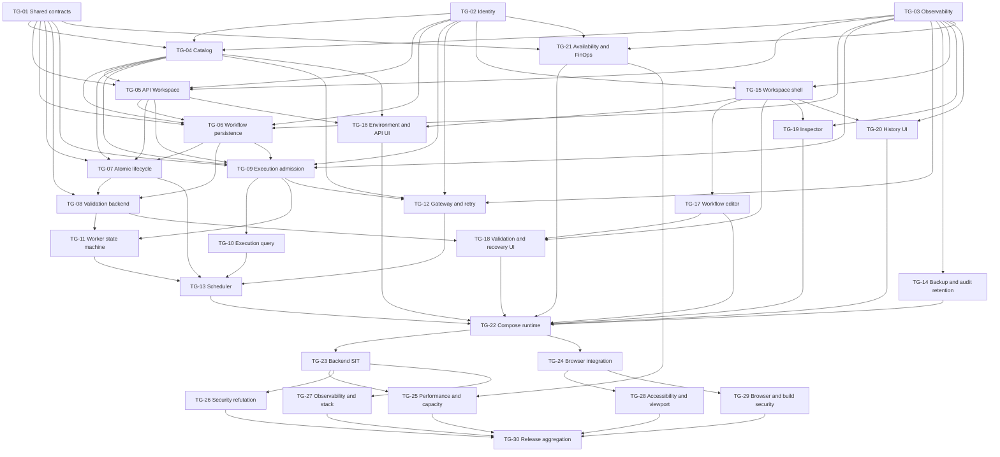

# Implementation Plan — API Lab Workflow Orchestration (Sprint v1)

## 1. Planning Overview

| Attribute | Value |
|---|---|
| Planning objective | Deliver the approved API Lab Workflow Orchestration v1 as one internally runnable release |
| Delivery strategy | AI-first, contract-first and risk/dependency-aware; independent AI lanes generate code/tests/docs concurrently, while the developer reviews decisions, integration evidence and complex exceptions |
| Team size (developers driving AI code generation) | 1 (`khanh-pham`) |
| Developer review/orchestration capacity | 6 hours/day; 60 hours across the 10-day target |
| AI execution capacity | Up to 5 concurrent task groups per wave across isolated ownership zones; concurrency is reduced whenever paths or contracts overlap |
| Planning horizon | 10 working days across 13 dependency waves; 30 authoritative task groups; no discretionary schedule buffer |
| Target environment | Local Docker Compose and internal verification only; no external/public/commercial users |
| Tracking IDs | none provided |
| QA model | Dev-owned repo tests and internal verification; Test phase references remain `qa_test_intent_pending` until Test artifacts exist |
| Primary risks | OIDC migration, signed address-manifest authority, schema migration, queue lease/idempotency, SSRF/secret masking, 20-workflow capacity, brownfield module extraction, AI contract drift and human review bottlenecks |

## 2. Planning Assumptions

- One developer orchestrates and reviews multiple AI task groups. AI performs the primary analysis, code generation, refactor, tests and documentation; the developer owns architectural decisions, high-risk review, merge approval and complex exception handling.
- `team_size = 1` still makes the mandatory multi-developer `PLAN-3` rule N/A. The stricter AI Parallel Execution Matrix in §4b is nevertheless normative: task groups may share a day only when their dependency wave and concrete ownership zones do not overlap.
- Approved Product pack `v1.7.18-api-lab-undo-warning-viewport` is part of effective truth: 10-second same-identity API Undo, Warning confirmation and compact supported-width UI are mandatory.
- Existing-to-target paths and public entrypoints come from PR-001–008. An implementation-discovered boundary change requires Architecture feedback/change handling rather than silent plan drift.
- Runtime scope must provide a local Docker Compose self-test path (`CODE-10`); public/commercial deployment is excluded until the recorded independent security review trigger is satisfied.
- All code task groups use `review_mode: both`; new meaningful code targets line and branch coverage ≥90%.
- No external QA handoff is required. Each group records `N/A — no external QA handoff`; internal evidence stays in repository test/validation outputs without secrets.
- Test has not started, so `qa_test_refs` use `qa_test_intent_pending` and must be reconciled to approved TC IDs before `approve implement`.
- Product `RISK-OPEN-002` is dispositioned for Plan by `PLAN-DEC-001`: one AI-orchestrating developer, 6 developer hours/day, a 10-working-day relative target, and `khanh-pham` as Product Owner, Delivery Lead and internal owner. Calendar deadline and internal service SLA are explicitly N/A for local personal use, not silently assumed; the change triggers in §2c reopen the decision.
- AI effort is estimated as active agent-hours, not elapsed calendar hours. The developer capacity budget in §4b includes prompting, review, feedback, merge and complex decisions; the developer must finish the prior wave's required gate work before authorizing a dependent wave.
- Parallel branches integrate only through frozen public contracts. Same-wave task groups have disjoint `code_ownership_zones`; shared-file or contract changes are sequenced into a later wave instead of being reconciled optimistically.
- Internal rollout does not waive Must NFR delivery. TG-14, TG-21 and TG-25–TG-30 deliver auditable backup/PITR, audit retention, availability/IaC/FinOps, performance/security/observability/accessibility/release artifacts even though deployment remains internal-only.

## 2b. Delivery Traceability Index

| FR / NFR | US | Architecture Refs | QA Test Intent | External QA Readiness | Task Group | Affected Code Surfaces | Validation Commands | Repo Test Delta Target |
|---|---|---|---|---|---|---|---|---|
| FR-001 | US-001, US-009 | ARCH-COMP-002/003; API-001/021/022; SEQ-001/005 | FR-001/US-001/009 `qa_test_intent_pending` | N/A | TG-04, TG-07, TG-15, TG-23, TG-24 | Host context/lifecycle APIs; workspace shell; backend/UI integration | `validate implementation --mode spec`; `validate implementation --mode quality` | Catalog integration + workspace UI state + SIT/E2E tests |
| FR-002 | US-002 | ARCH-COMP-001/002; API-001/002/023; ENT-002/003/016 | FR-002/US-002 `qa_test_intent_pending` | N/A | TG-04, TG-16, TG-23, TG-24 | Environment CRUD, credential/variable UI and integration | `validate implementation --mode spec`; `validate implementation --mode quality` | Manifest/encryption integration + UI form/E2E tests |
| FR-003 | US-001, US-009 | ARCH-COMP-003; API-003–006; ENT-004–006 | FR-003/US-001/009 `qa_test_intent_pending` | N/A | TG-05, TG-07, TG-15, TG-23, TG-24 | Resource commands, delete/Undo, ResourceTree and integration | `validate implementation --mode spec`; `validate implementation --mode quality` | Tree, impact, exact-identity Undo and E2E tests |
| FR-004 | US-003 | ARCH-COMP-003; API-007; ENT-006/017 | FR-004/US-003 `qa_test_intent_pending` | N/A | TG-05, TG-16, TG-23, TG-24 | API definition versioning, request editor and integration | `validate implementation --mode spec`; `validate implementation --mode quality` | API schema/version + editor validation/E2E tests |
| FR-005 | US-003 | ARCH-COMP-005/006; API-012/014; SEQ-003 | FR-005/US-003 `qa_test_intent_pending` | N/A | TG-09, TG-12, TG-16, TG-19, TG-23, TG-24 | Standalone admission, worker, Inspector and integration | `validate implementation --mode spec`; `validate implementation --mode quality` | Admission/worker/Inspector SIT and E2E tests |
| FR-006 | US-004, US-005 | ARCH-COMP-004; API-008/009; ENT-007–009 | FR-006/US-004/005 `qa_test_intent_pending` | N/A | TG-06, TG-17, TG-23, TG-24 | Workflow version/mapping, editor and integration | `validate implementation --mode spec`; `validate implementation --mode quality` | Step order/key/mapping property + component/E2E tests |
| FR-007 | US-006 | ARCH-COMP-004/005; API-010/011/013/016; ENT-010/011 | FR-007/US-006 `qa_test_intent_pending` | N/A | TG-08, TG-09, TG-10, TG-18, TG-23, TG-24 | Validation report, admission/rerun freshness, Warning acknowledgement and integrated UI confirmation | `validate implementation --mode spec`; `validate implementation --mode quality` | Severity/field-target plus API-013/API-016 stale-report/acknowledgement SIT/E2E tests |
| FR-008 | US-007 | ARCH-COMP-005; API-013/014; SEQ-004 | FR-008/US-007 `qa_test_intent_pending` | N/A | TG-09, TG-11, TG-12, TG-19, TG-23, TG-24 | Sequential execution and live evidence integration | `validate implementation --mode spec`; `validate implementation --mode quality` | State-machine/attempt/polling SIT and E2E tests |
| FR-009 | US-008 | ARCH-COMP-005/006; API-013/014; SEQ-004 | FR-009/US-008 `qa_test_intent_pending` | N/A | TG-12, TG-19, TG-23, TG-24, TG-26 | Timeout/retry, attempts UI and retry refutation | `validate implementation --mode spec`; `validate implementation --mode quality` | Retry classification/count/delay SIT, E2E and security tests |
| FR-010 | US-007, US-010 | ARCH-COMP-005/008; API-015/016; SEQ-006 | FR-010/US-007/010 `qa_test_intent_pending` | N/A | TG-10, TG-13, TG-20, TG-23, TG-24 | History, rerun, retention and integration | `validate implementation --mode spec`; `validate implementation --mode quality` | History filters/rerun/retention SIT and E2E tests |
| FR-011 | US-009 | ARCH-COMP-002–004/008; API-004–007/011/021/022 | FR-011/US-009 `qa_test_intent_pending` | N/A | TG-06, TG-07, TG-08, TG-15, TG-18, TG-23, TG-24, TG-26 | Impact, disable, recovery, enable and queue-recovery refutation | `validate implementation --mode spec`; `validate implementation --mode quality` | Atomic lifecycle/recovery checklist SIT, E2E and authorized-recovery tests |
| FR-012 | US-003, US-007, US-010 | ARCH-COMP-002/005–007; API-002/007/014/015 | FR-012/US-003/007/010 `qa_test_intent_pending` | N/A | TG-04, TG-05, TG-09, TG-10, TG-12, TG-15, TG-16, TG-19, TG-20, TG-23, TG-24, TG-26, TG-29 | Sensitive config, masked storage/projection/UI and cross-surface leak refutation | `validate implementation --mode spec`; `validate implementation --mode quality` | Secret non-disclosure, masking SIT/E2E and browser-storage tests |
| NFR-001 | US-001–010 | NFR-001; API/UI/worker latency scenarios | NFR-001 `qa_test_intent_pending` | N/A | TG-25 | Focused load/capacity harness and indexed query paths | `validate implementation --mode spec`; `validate implementation --mode quality` | Performance and capacity scenario tests |
| NFR-002, NFR-003 | US-003, US-007–010 | NFR-002/003; ADR-004/005 | NFR-002/003 `qa_test_intent_pending` | N/A | TG-02, TG-09, TG-11, TG-21, TG-22, TG-23, TG-25, TG-26 | Degradation, leases, capacity, health and recovery refutation | `validate implementation --mode spec`; `validate implementation --mode quality` | Dependency failure/capacity/lease/recovery tests |
| NFR-004 | US-002/003/007/009/010 | NFR-004; ADR-005/006; FLOW-001/002 | NFR-004 `qa_test_intent_pending` | N/A | TG-02, TG-04, TG-12, TG-26, TG-29 | OIDC, manifest, secrets, SSRF, redaction and browser/source-map gates | `validate implementation --mode spec`; `validate implementation --mode quality` | Auth/CSRF/manifest/SSRF/browser-storage/security tests |
| NFR-005, NFR-007 | US-007, US-010 | NFR-005/007; SEQ-006 | NFR-005/007 `qa_test_intent_pending` | N/A | TG-13, TG-14, TG-22, TG-23 | Retention, recovery, backup and payload bounds | `validate implementation --mode spec`; `validate implementation --mode quality` | Clock/retention/recovery/boundary SIT tests |
| NFR-006 | US-001–010 | NFR-006; ARCH-COMP-007 | NFR-006 `qa_test_intent_pending` | N/A | TG-03, TG-14, TG-27 | Correlated redacted audit/telemetry and exporter refutation | `validate implementation --mode spec`; `validate implementation --mode quality` | Audit schema/redaction/exporter failure tests |
| NFR-008 | US-001–010 | NFR-008; SCREEN-001–008; PR-007/008 | NFR-008 `qa_test_intent_pending` | N/A | TG-15–TG-20, TG-24, TG-28, TG-29, TG-30 | Keyboard, responsive gate, browser security and code quality | `validate implementation --mode spec`; `validate implementation --mode quality` | Component/a11y/Playwright/browser/coverage gates |
| NFR-009 | N/A — infrastructure | NFR-009; ADR-001/004 | NFR-009 `qa_test_intent_pending` | N/A | TG-21, TG-22, TG-25 | Docker Compose runtime, resource budgets and capacity evidence | `validate implementation --mode spec`; `validate implementation --mode quality` | Compose smoke/resource/capacity evidence |

## 2c. Planning Decision And Dependency Register

| ID | Source And Decision Owner | Resolved Values / Disposition | Downstream Effect And Validation Evidence | Change Trigger |
|---|---|---|---|---|
| PLAN-DEC-001 — disposition for Product `RISK-OPEN-002` | User Plan answer batch dated 2026-07-19; `khanh-pham` acts as Product Owner, Delivery Lead, developer and internal owner for this personal project | Team size: one AI-orchestrating developer; capacity: 6 developer hours/day; delivery target: 10 relative working days after implementation starts; internal owner: `khanh-pham`; calendar deadline: N/A; internal service SLA: N/A for local personal use | Authorizes the relative Day 1–10 capacity/ownership model in §4b without inventing a calendar date or service commitment. Evidence is this durable decision row plus the explicit answer batch summarized in Planning Assumptions; `validate plan` must verify schedule arithmetic and ownership | A fixed calendar date, internal SLA, additional developer, reduced daily capacity, external user, public production or commercial deployment reopens the decision and requires Product/Plan feedback |
| PLAN-DEP-001 — Platform baseline disposition | User selected Local Docker Compose/internal-only target in the Plan answer batch; `khanh-pham` acts as Technical Owner under `ARCH-001` | Live Kubernetes namespace, Cloudflare ingress and Prisma Access policy identifiers are N/A for sprint-v1 local runtime. TG-21 produces non-deployable reference IaC/policy schemas and validation tests only; no provider namespace/policy value is fabricated | TG-21 validates policy schemas/deny-by-default/showback, TG-22 proves the local Compose path and TG-25 refutes capacity/resource budgets. Plan approval confirms this scoped N/A disposition, not a production baseline | Any SIT/production/non-local deployment requires Platform-owner namespace/policy confirmation and Architecture feedback before implementation/release |
| PLAN-DEP-002 — Vault reference disposition | User selected Local Docker Compose/internal-only target; `khanh-pham` acts as Security/Technical Owner under `ARCH-001` | Live Vault mount, auth role and key IDs are N/A for sprint-v1 local runtime. TG-04/TG-12 implement the `KeyProvider`/envelope-encryption contracts with non-secret local test adapters; no live mount/auth/key identifier is fabricated | TG-04/TG-12 implement fail-closed key use/rotation and TG-26 refutes secret non-disclosure. Plan approval confirms only this local disposition | Introducing a live Vault-compatible service requires Security-owner confirmation of mount/auth/key references, rotation rehearsal and Architecture feedback before release |

## 3. Phase Breakdown

The four phases below are a concise crosswalk only. All executable scope, dependencies, effort, references, deliverables and DOD live exclusively in the authoritative TG-01–TG-30 catalog. One TG is assigned to one isolated AI context; up to five dependency-safe contexts may run in the same wave.

| Plan Phase | Goal And Scope | Authoritative TGs | Entry Dependency | Exit Gate |
|---|---|---|---|---|
| P1 — Security And Data Foundations | Freeze shared ports, identity, observability, Catalog and API Workspace persistence | TG-01–TG-05 | Approved Product, Design and Architecture; PLAN-DEC-001 and dependency dispositions in §2c | Shared contracts and serialized canonical schema through TG-05 pass |
| P2 — Workflow And Execution Runtime | Workflow persistence, lifecycle, validation, admission, query, worker, gateway and recovery | TG-06–TG-14 | P1 public ports and persistence contracts | Runtime state, security, retry, recovery and retention contracts pass |
| P3 — User Workspace | Workspace shell, configuration editors, workflow and validation UI, and execution evidence UI | TG-15–TG-20 | Approved Design and API contracts; TG-15 shell precedes feature UI | Component and contract tests pass against approved fixtures |
| P4 — Internal Release And Quality Gates | IaC/FinOps, Compose, split backend/UI integration, focused NFR refutation, accessibility and release aggregation | TG-21–TG-30 | Completed feature TGs and accepted-exception controls | TG-22–TG-29 evidence passes and TG-30 aggregation gate is clean |

## 3a. Authoritative Task Group Catalog

### Common Contract Applied To Every Task Group

- **Tracking IDs:** `none provided`.
- **external_qa_readiness:** `N/A — no external QA handoff for this task group`; revisit if the Test phase introduces an external bridge.
- **review_mode:** `both`.
- **validation commands to run:** `validate implementation --mode spec` and `validate implementation --mode quality`; TG-02/04/12/26/29 additionally run a security-standards spot check; TG-21/22 run the Docker/IaC checks named in their repo-test targets.
- **Owner:** `khanh-pham`, Developer/Tech Lead and merge authority. Each task group receives one isolated AI implementation context; multiple contexts may run concurrently only as allowed by §4b.
- **Definition of Done for every TG:**
  - [ ] Listed User Stories/Feature References and task-specific evidence pass.
  - [ ] Meaningful touched code carries CODE-1 links for TG, FR/US, Architecture/Design and Tracking IDs when supplied.
  - [ ] Diff stays inside the declared paths/boundary; divergence is governed before merge.
  - [ ] Declared unit/integration/contract/component test delta ships and passes; new code reaches ≥90% line and branch coverage.
  - [ ] API/DB/UI/security contract checks applicable to the slice pass; feature-flag state is documented (`N/A` when unused).
  - [ ] Code is reviewed and merged to the delivery branch with no related P0/P1 defect.
  - [ ] Both validation commands return no blocker before the TG closes.

### A. Scope, Architecture And Public Surfaces

| TG | Phase / Description | User Stories | Feature References | target_modules_packages | public_entrypoints_impacted | affected_code_surfaces |
|---|---|---|---|---|---|---|
| TG-01 | P1 — shared caller-owned UnitOfWork, idempotency, response-schema and signed-manifest port contracts | N/A — infrastructure | NFR-003/004; API-004–007/009/011/021/022 | PR-002/004/005/008 | `IdempotencyCoordinator`, `WorkflowImpactService`, `UnitOfWork`, `ExecutionResponseSchemaReader`, `ApprovedAddressSetRegistry` contracts | Cross-module DTO/port exports and transaction/manifest/projection contract tests; no route behavior |
| TG-02 | P1 — OIDC/session/CSRF backend | N/A — infrastructure enabling protected US | NFR-002/004; EXC-AUTH-001 | PR-001/008 | `requireActor`, `requireCsrf`, API-017–020 | Identity delivery/application/domain/infrastructure and session routes |
| TG-03 | P1 — error catalog, correlation, audit/telemetry foundation | N/A — infrastructure | NFR-006/008; EXC-STACK-001 | PR-006/008 | `AuditSink`, `Telemetry`, request/error hooks | Error/OpenAPI generation, API/worker telemetry adapters and frontend Sentry boundary |
| TG-04 | P1 — Catalog Host/Environment persistence, signed manifest and encryption | US-002, US-009 | FR-001/002/012; NFR-004 | PR-002 | `HostContextReader`, `ConfigureEnvironment`, `DeleteEnvironment`; API-001/002/023 | ENT-001–003/016, manifest registry, key adapter, Environment CRUD |
| TG-05 | P1 — resource tree and immutable API definitions | US-001, US-003 | FR-003/004/012 | PR-003 | `ApiDefinitionReader`, `DependencyImpactReader`; API-003/004/007 | ENT-004–006/017, resource commands and API version handlers |
| TG-06 | P2 — workflow version/mapping/dependency persistence and impact implementation | US-004, US-005 | FR-006/011 | PR-004 | `WorkflowVersionReader`, `WorkflowImpactService`; API-008/009 | ENT-007–009, step-key/order/mapping and dependency projections |
| TG-07 | P2 — atomic Host/API lifecycle, method change, delete/Undo and disablement | US-001, US-009 | FR-001/003/011 | PR-002/003/004/005 | API-005/006/021/022 through TG-01 ports | Caller-owned atomic mutation handlers, ENT-015 original response and exact disabled IDs |
| TG-08 | P2 — deterministic validation report, enable and recovery backend | US-006, US-009 | FR-007/011 | PR-004/005 | `WorkflowValidationService`, `ExecutionResponseSchemaReader`; API-010/011 | ENT-010, severity/field targets, review/Warning/enable gates |
| TG-09 | P2 — execution admission, validation freshness, Warning acknowledgement, snapshots, jobs and capacity | US-003, US-006, US-007 | FR-005/007/008/012; NFR-003/004 | PR-005 | `ExecutionAdmission`; API-012/013 | ENT-011/013/015/020/021, admission transaction and current validation-report enforcement |
| TG-10 | P2 — authorized execution query, history and rerun | US-006, US-007, US-010 | FR-007/010/012; NFR-001/007 | PR-005 | `ExecutionQuery`, `ExecutionResponseSchemaReader`; API-014–016 | History filters/ETag, attempt/artifact projection, rerun linkage and workflow acknowledgement |
| TG-11 | P2 — worker lease, sequential state machine and mapping resolution | US-005, US-007 | FR-008; NFR-003 | PR-005/006 | `JobClaimer`, worker job handler | ENT-012/018 state transitions, lease/heartbeat and prior-step mapping |
| TG-12 | P2 — outbound SSRF/secret boundary, timeout/retry, masking and artifacts | US-003, US-007, US-008 | FR-005/009/012; NFR-004; EXC-RETRY-001 | PR-005/006 | `ProviderGateway`; worker attempt completion | Secret resolution, DNS/connect/redirect validation, retry classifier, ENT-014 artifacts |
| TG-13 | P2 — Undo expiry, execution retention and lease recovery scheduler | US-009, US-010 | FR-010/011; NFR-003/007; EXC-QUEUE-001 | PR-005/006 | `runRetention`, `recoverExpiredLeases`, dead-job inspection/recovery operations | Scheduler singleton, exact retention boundary, DEAD escalation, authorized manual recovery and capacity release |
| TG-14 | P4 — encrypted backup/binlog/PITR restore and 6/12-month audit retention | N/A — platform obligation | NFR-005/006 | PR-006/008 | Backup/restore and audit-retention jobs/config | Backup policy, PITR rehearsal, audit partition/archive and restore evidence |
| TG-15 | P3 — workspace shell, physical-screen gate and Resource Tree UI | US-001, US-009 | FR-001/003/011; NFR-008 | PR-003/007 | Workspace routes and `api-lab-workspace/index.ts` | SCREEN-001/006 shell, breadcrumb/context, tree/search/impact/Undo UI |
| TG-16 | P3 — Environment settings, API editor and standalone-run entry UI | US-002, US-003 | FR-002/004/005/012; NFR-008 | PR-002/003/005/007 | Typed API-001–007/012/014/023 clients | SCREEN-002/003 forms, editor, sensitive values and standalone Run handoff |
| TG-17 | P3 — workflow Step editor, reorder and variables UI | US-004, US-005 | FR-006; NFR-008 | PR-004/007 | Workflow editor feature export and API-008/009 clients | SCREEN-004, DS-COMP-005/006/011 |
| TG-18 | P3 — Validation Report, Warning confirmation and recovery UI | US-006, US-009 | FR-007/011; NFR-008 | PR-004/007 | Validation/recovery feature exports and API-010/011 clients | SCREEN-006/008, exact finding focus, stale gate and checklist |
| TG-19 | P3 — live Execution Inspector and terminal-aware polling | US-003, US-007, US-008 | FR-005/008/009/012; NFR-001/008 | PR-005/007 | Inspector export and API-014 client | SCREEN-005 attempts, NOT_RUN, masking, failure focus and polling |
| TG-20 | P3 — History filters, URL state and rerun UI | US-007, US-010 | FR-010/012; NFR-008 | PR-005/007 | History export and API-015/016 clients | SCREEN-007 pagination, filters, deleted-Host read-only and rerun confirm |
| TG-21 | P4 — deployment availability, IaC controls and FinOps governance artifacts | N/A — platform obligation | NFR-002/009 | PR-006/008 | Health/readiness/deployment manifests and policy checks | Multi-replica API/worker routing config, tags, idle TTL, right-sizing/showback evidence |
| TG-22 | P4 — reproducible Docker Compose runtime foundation | N/A — integration infrastructure | NFR-002/009; CODE-10 | PR-001/006/008 | Compose services, health endpoints and migration/seed/reset/smoke commands | Runtime wiring and local runbook only; feature SIT belongs to TG-23/TG-24 |
| TG-23 | P4 — backend contract and recovery SIT | US-001–US-010 | FR-001–FR-012; NFR-002/003/005/007; EXC-QUEUE-001; EXC-RETRY-001 | PR-002–006 | No new route; backend SIT harness and fixtures | Catalog/Workspace/Workflow/Execution three-step, restart, retry and recovery contracts |
| TG-24 | P4 — frontend-to-backend workflow E2E integration | US-001–US-010 | FR-001–FR-012; NFR-008 | PR-003–005/007 | No new public API; Playwright integration fixtures | Workspace-to-History happy/error/recovery journeys against TG-22 runtime |
| TG-25 | P4 — performance and capacity refutation | US-001–US-010 | NFR-001/002/003/009 | PR-001/005/006 | No new API; load/capacity harness only | Latency, concurrent workflow, worker and resource-budget evidence |
| TG-26 | P4 — auth, SSRF, retry and queue security refutation | US-002/003/007–010 | NFR-003/004; EXC-AUTH-001; EXC-QUEUE-001; EXC-RETRY-001 | PR-001/002/005/006 | No new API; security/recovery harness only | IAM/session/CSRF/SSRF/secret, exact retry and authorized queue-recovery evidence |
| TG-27 | P4 — observability, audit and supported-stack refutation | US-001–US-010 | NFR-006; EXC-STACK-001 | PR-006/008 | No new API; observability/version harness only | Correlation, redaction, audit schema, exporter failure and supported-version evidence |
| TG-28 | P4 — accessibility and physical-screen/viewport refutation | US-001–US-010 | NFR-008; FR-001–FR-012 | PR-007/008 | No new API; accessibility/viewport harness only | Axe, keyboard, focus, zoom, 1280px physical-screen and compact-view evidence |
| TG-29 | P4 — browser-storage and production source-map security gate | US-001–US-010 | NFR-004/008; EXC-AUTH-001; EXC-STACK-001 | PR-001/007/008 | No new API; browser/build security checks only | No browser token/secret persistence and production source-map deny evidence |
| TG-30 | P4 — coverage and internal-release evidence aggregation | US-001–US-010 | FR-001–FR-012; NFR-001–009 | PR-001–008 | No code behavior or public API; evidence manifest only | Verify prior TG evidence, coverage thresholds and internal release decision; behavioral fixes return to owner |

### B. Diff Boundaries And Dependencies

| TG | inherited_architecture_obligations | allowed_diff_boundary | code_ownership_zones | shared_foundation_guard | blocks | blocked_by |
|---|---|---|---|---|---|---|
| TG-01 | Caller-owned transaction; no nested UoW; original idempotent response | Contracts/tests only, no feature behavior | `backend/src/modules/execution/application/idempotency/**`; `backend/src/modules/execution/index.ts`; `backend/src/modules/workflow-definition/index.ts`; `backend/src/modules/system-catalog/index.ts`; `backend/src/shared/unit-of-work/**` | Freezes mutation, response-schema and signed-manifest ports before dependent AI waves | [TG-04, TG-05, TG-06, TG-07, TG-08, TG-09, TG-21] | [] |
| TG-02 | OIDC PKCE, authoritative status, cookie/CSRF, fail closed | Identity + auth core only | `backend/src/modules/identity/**`; `frontend/src/core/auth/**` | Owns auth surface | [TG-04, TG-05, TG-06, TG-09, TG-12, TG-15, TG-21] | [] |
| TG-03 | Typed errors, request/trace IDs, redaction, adapter-only SDKs | Observability/error contract only | `backend/src/platform/{audit,observability}/**`; `backend/src/shared/errors/**`; `backend/src/app.ts`; `frontend/src/core/{api,observability}/**` | Owns cross-cutting diagnostics | [TG-04, TG-05, TG-06, TG-09, TG-12, TG-14, TG-15, TG-19, TG-20, TG-21] | [] |
| TG-04 | Manifest exact match, AEAD, revision/audit, key-free delete | Catalog and owned schema only; lifecycle orchestration deferred TG-07 | `backend/src/modules/system-catalog/**`; `backend/prisma/schema.prisma`; `backend/prisma/migrations/*system_catalog*` | Implements the TG-01 manifest port; owns shared schema only in D2 | [TG-05, TG-06, TG-07, TG-09, TG-12, TG-16] | [TG-01, TG-02, TG-03] |
| TG-05 | Normalized tree, immutable API versions, optimistic revision | Workspace and owned schema only; delete/Undo deferred TG-07 | `backend/src/modules/api-workspace/**`; `backend/prisma/schema.prisma`; `backend/prisma/migrations/*api_workspace*` | Resource dependency on TG-04 serializes canonical schema ownership | [TG-06, TG-07, TG-09, TG-16] | [TG-01, TG-02, TG-03, TG-04] |
| TG-06 | Immutable step_key, prior-step mapping, dependency projection | Workflow versions/dependencies only; validation/enable deferred TG-08 | `backend/src/modules/workflow-definition/{domain,infrastructure}/**`; `backend/src/modules/workflow-definition/application/{saveWorkflow,workflowImpactService}.ts`; `backend/prisma/schema.prisma`; `backend/prisma/migrations/*workflow_definition*` | Owns the shared schema only in D4-W1 after TG-05; implements TG-01 impact port | [TG-07, TG-08, TG-09] | [TG-01, TG-02, TG-03, TG-04, TG-05] |
| TG-07 | API-005/006/021/022 atomic Workspace/Catalog + Workflow + ENT-015 | Named lifecycle handlers and integration tests only | `backend/src/modules/api-workspace/application/{deleteApi,undoApiDeletion,changeApiMethod}.ts`; `backend/src/modules/system-catalog/application/changeHostLifecycle.ts`; `backend/src/modules/execution/application/idempotency/**` | Runs only after all participating ports exist | [TG-08, TG-13] | [TG-01, TG-04, TG-05, TG-06] |
| TG-08 | Deterministic no-provider validation; Error block; Warning confirm; explicit enable | Workflow validation/report/enable handlers only | `backend/src/modules/workflow-definition/application/{validateWorkflow,enableWorkflow}.ts`; `backend/src/modules/workflow-definition/domain/validation/**`; `backend/src/modules/workflow-definition/delivery/**validation*` | Consumes TG-01 response-schema port plus TG-06/07 workflow contracts | [TG-11, TG-18] | [TG-01, TG-06, TG-07] |
| TG-09 | Locked revisions, immutable ciphertext/policy snapshot, capacity ≤20 | Admission/jobs/snapshot only; query/worker separate | `backend/src/modules/execution/application/admission/**`; `backend/src/modules/execution/domain/{execution,capacity}/**`; `backend/src/modules/execution/infrastructure/*Admission*`; `backend/prisma/schema.prisma`; `backend/prisma/migrations/*execution_admission*` | Owns the shared schema only in D5 after TG-06; uses TG-01 idempotency | [TG-10, TG-11, TG-12] | [TG-01, TG-02, TG-03, TG-04, TG-05, TG-06] |
| TG-10 | Authorized masked projection, attempt join, latest-state rerun | Query/history/rerun only | `backend/src/modules/execution/application/{query,history,rerun,responseSchema}/**`; `backend/src/modules/execution/delivery/*Execution*` | Implements the TG-01 response-schema port; backend/browser integration occurs in TG-23/TG-24 | [TG-13] | [TG-09] |
| TG-11 | Lease/heartbeat, monotonic state, prior-step mapping | Runner/state machine only; HTTP gateway separate | `backend/src/modules/execution/application/runner/**`; `backend/src/modules/execution/domain/{step,attempt}/**`; `backend/src/worker.ts` | Consumes TG-08/09 and the Architecture-frozen ProviderGateway port | [TG-13] | [TG-08, TG-09] |
| TG-12 | Pinned key/policy, DNS/connect/redirect gate, fixed current-step retry, masking | Outbound gateway and attempt-completion adapter only | `backend/src/platform/outbound/**`; `backend/src/modules/execution/application/attempt/**`; `backend/src/modules/execution/infrastructure/*Artifact*` | Implements ProviderGateway independently of runner; integration waits TG-23 | [TG-13] | [TG-02, TG-03, TG-04, TG-09] |
| TG-13 | Singleton schedule, exact retention, safe reclaim/DEAD, no HTTP handler calls | Scheduler and declared repository methods only | `backend/src/platform/scheduler/**`; `backend/src/modules/execution/infrastructure/{ExecutionRetentionRepository,JobLeaseRepository}.ts`; `deploy/cronjobs/**` | Waits for lifecycle/query/worker/gateway | [TG-22] | [TG-07, TG-10, TG-11, TG-12] |
| TG-14 | Daily encrypted backup, binlog/PITR, quarterly restore evidence; audit online 6m/retained 12m | Backup/audit retention artifacts only | `deploy/mysql/{backup,restore,binlog}/**`; `backend/src/platform/audit/retention/**`; `docs/runbooks/{backup-restore,audit-retention}.md` | Uses generic database/audit contracts; final schema restore is refuted in TG-23 | [TG-22] | [TG-03] |
| TG-15 | Physical screen gate; compact only on supported physical screen; tree/Undo/accessibility | Shell/tree only; form/editors separate | `frontend/src/pages/**/api-lab/**`; `frontend/src/features/api-lab-workspace/{shell,resource-tree,impact,undo}/**`; `frontend/src/shared/layout/api-lab/**` | Builds against approved API mocks after auth/typed-error foundations; live browser integration occurs in TG-24 | [TG-16, TG-17, TG-18, TG-19, TG-20] | [TG-02, TG-03] |
| TG-16 | Dirty/revision conflict, masked fields, standalone snapshot handoff | Environment/API editor only | `frontend/src/features/api-lab-workspace/{environment,api-editor,api}/**`; `frontend/src/pages/**/environments/**` | Consumes TG-15 exports and approved API mocks; runtime convergence starts TG-22 and browser integration occurs TG-24 | [TG-22] | [TG-04, TG-05, TG-15] |
| TG-17 | ≤20 steps, immutable key, prior-step variables, keyboard reorder | Workflow editor/variables only | `frontend/src/features/workflow-editor/**`; `frontend/src/pages/**/workflows/**/index.*` | Consumes TG-15 and approved API-008/009 mocks; runtime convergence starts TG-22 and browser integration occurs TG-24 | [TG-18, TG-22] | [TG-15] |
| TG-18 | Exact finding focus, stale report, Warning confirm, ordered recovery | Validation/recovery UI only | `frontend/src/features/workflow-validation/**`; `frontend/src/features/workflow-editor/recovery/**`; `frontend/src/pages/**/validation/**` | Consumes frozen report/recovery contracts; no shared-shell rewrite | [TG-22] | [TG-08, TG-15, TG-17] |
| TG-19 | 1s polling stop rules, attempt IDs, NOT_RUN, masking/failure focus | Inspector only | `frontend/src/features/execution-inspector/**` | Builds against approved API-014 fixtures; runtime convergence starts TG-22 and browser integration occurs TG-24 | [TG-22] | [TG-03, TG-15] |
| TG-20 | URL filters/page state, read-only deleted Host, latest rerun confirm | History/rerun only | `frontend/src/features/execution-history/**`; `frontend/src/pages/**/history/**` | Builds against approved API-015/016 fixtures; runtime convergence starts TG-22 and browser integration occurs TG-24 | [TG-22] | [TG-03, TG-15] |
| TG-21 | Availability 99.5 evidence, min replicas/routing recovery, tags/TTL/right-sizing/showback | Deployment/IaC policy only; no public rollout | `deploy/kubernetes/**`; `infra/**`; `scripts/validate-iac.*`; `docs/runbooks/{availability,finops}.md` | Consumes the TG-01 signed-manifest schema; internal validation still proves artifacts | [TG-22, TG-25] | [TG-01, TG-02, TG-03] |
| TG-22 | Reproducible Compose, migrations, seeds and health | Runtime/config only; feature SIT excluded | `compose*.yml`; `deploy/docker/**`; `scripts/{migrate,seed,reset,smoke}.*`; `docs/runbooks/local-api-lab.md` | Integrates services/config only; domain mismatch returns to owner | [TG-23, TG-24] | [TG-13, TG-14, TG-16, TG-17, TG-18, TG-19, TG-20, TG-21] |
| TG-23 | Backend API/domain/restart/recovery integration | Backend SIT only; UI and NFR harnesses excluded | `tests/sit/backend/**`; `tests/fixtures/api-lab/**`; `scripts/verify-backend-sit.*` | Consumes stable TG-22 runtime; feature defects return to owning TG | [TG-25, TG-26, TG-27] | [TG-22] |
| TG-24 | Workspace-to-History browser integration | Frontend E2E integration only; accessibility/security/coverage excluded | `tests/e2e/api-lab-workflow/**`; `frontend/tests/integration/**` | Consumes stable TG-22 runtime and reviewed UI/backend contracts | [TG-28, TG-29] | [TG-22] |
| TG-25 | NFR latency, throughput, active-workflow and resource-budget evidence | Performance/capacity harness only | `tests/performance/**`; `scripts/verify-performance.*`; `docs/evidence/performance/**` | Uses TG-23 backend SIT baseline and TG-21 budgets; no feature fixes | [TG-30] | [TG-21, TG-23] |
| TG-26 | Auth/session/CSRF/SSRF/secret/retry/queue exception evidence | Security and recovery harness only | `tests/security/{auth,outbound,execution}/**`; `scripts/verify-security.*`; `docs/evidence/security/**` | Uses TG-23 backend SIT baseline; behavioral fixes return to TG-02/12/13 | [TG-30] | [TG-23] |
| TG-27 | Audit/correlation/redaction/exporter/version evidence | Observability and stack harness only | `tests/observability/**`; `scripts/verify-observability.*`; `scripts/verify-supported-stack.*`; `docs/evidence/observability/**` | Uses TG-23 baseline; does not change feature behavior | [TG-30] | [TG-23] |
| TG-28 | WCAG, keyboard/focus/zoom and physical-screen evidence | Accessibility/viewport harness only | `tests/accessibility/**`; `tests/e2e/viewport/**`; `docs/evidence/accessibility/**` | Uses TG-24 E2E baseline; no browser-security or coverage work | [TG-30] | [TG-24] |
| TG-29 | Browser storage/DOM leak and production source-map evidence | Browser/build security checks only | `tests/security/browser/**`; `scripts/verify-production-build.*`; `docs/evidence/browser-security/**` | Uses TG-24 E2E baseline; feature fixes return to auth/UI owner | [TG-30] | [TG-24] |
| TG-30 | Coverage and release evidence aggregation | Evidence verification only; no source/test behavior changes | `scripts/verify-quality.*`; `docs/evidence/release/**` | Reads immutable TG-25–TG-29 outputs; any failure returns to owning TG | [] | [TG-25, TG-26, TG-27, TG-28, TG-29] |

### C. QA, Delivery And Sizing

| TG | qa_test_refs | repo_test_delta_target | Delivery Notes | Linked Test Coverage | AI effort | Developer-with-AI effort | AI context fit | Scheduled wave | Task-specific DOD evidence |
|---|---|---|---|---|---|---|---|---|---|
| TG-01 | API lifecycle + NFR-003/004 `qa_test_intent_pending` | Port/UoW/idempotency/response-schema contract tests | Freeze public contracts before feature code | Pending API-004–007/009/011/021/022 scenarios | 6 agent-h | 1.0 h | Four small interfaces + contract fakes only | D1-W1 | Nested transaction rejected; original response replayed |
| TG-02 | NFR-002/004 pending | Identity unit + Fastify OIDC/session/CSRF integration | Uses local IAM stub; no Product route behavior | Pending auth/session degradation scenarios | 6 agent-h | 1.5 h | One bounded module and four cohesive auth routes | D1-W1 | Revoked/uncertain status fails closed |
| TG-03 | NFR-006/008 pending | Error/correlation/audit/telemetry contract tests | Establish generated catalog and redaction before modules | Pending observability/redaction scenarios | 6 agent-h | 1.0 h | Adapters/hooks and schemas only | D1-W1 | Required context present; exporter outage safe |
| TG-04 | FR-001/002/012, US-002/009 pending | Catalog property/Prisma/manifest/encryption contracts | Owns `schema.prisma` exclusively in D2; implements TG-01 manifest port | Pending Environment/Host/security scenarios | 8 agent-h | 1.5 h | One Catalog module and owned entities | D2-W1 | Key-free delete; manifest/key failures leave no partial write |
| TG-05 | FR-003/004/012, US-001/003 pending | Tree invariant/property, version and CRUD contracts | Owns `schema.prisma` exclusively after TG-04 | Pending tree/API definition scenarios | 8 agent-h | 1.5 h | One Workspace module without lifecycle orchestration | D3-W1 | Tree/version invariants and optimistic revision pass |
| TG-06 | FR-006/011, US-004/005 pending | Step/key/mapping/dependency unit+Prisma contracts | Owns `schema.prisma` exclusively after TG-05; validation deferred TG-08 | Pending workflow authoring/mapping scenarios | 8 agent-h | 1.5 h | One workflow persistence/mapping slice | D4-W1 | 20-step/key/order/mapping invariants pass |
| TG-07 | FR-001/003/011, US-001/009 pending | Atomic lifecycle/idempotency/Undo integration | First TG allowed to close destructive lifecycle DOD | Pending impact/delete/method/Host/Undo scenarios | 8 agent-h | 1.5 h | Four named handlers over stable ports | D5-W1 | One commit/rollback spans exact affected modules; Undo identity/deadline enforced |
| TG-08 | FR-007/011, US-006/009 pending | Severity/target/enable/recovery contracts | Consumes TG-01 response-schema port; live projection is integrated in TG-23 | Pending validation/Warning/recovery scenarios | 7 agent-h | 1.5 h | Validation/report/enable only | D6-W1 | No provider call; Error/Warning/stale/review gates pass |
| TG-09 | FR-005/007/008/012, US-003/006/007 pending | Admission race/idempotency/capacity/snapshot plus API-013 report freshness/Warning acknowledgement integration | Owns `schema.prisma` exclusively after TG-06; query/worker excluded | Pending admission/validation/snapshot/capacity scenarios | 8 agent-h | 1.5 h | One transaction and owned entities | D5-W1 | Durable job before response; stale/missing report and unacknowledged Warning reject; ≤20 active workflows |
| TG-10 | FR-007/010/012, US-006/007/010 pending | Query/history/ETag/rerun/response-schema plus API-016 acknowledgement contracts | Implements the TG-01 projection port | Pending history/rerun/validation/evidence scenarios | 5 agent-h | 1.0 h | Read/query projection slice only | D6-W1 | Masked attempt join; workflow rerun enforces latest report and Warning acknowledgement |
| TG-11 | FR-008, US-005/007 pending | Lease/state-machine/mapping property+integration | Consumes the frozen ProviderGateway port; live adapter joins in TG-23 | Pending sequential execution scenarios | 8 agent-h | 1.5 h | Worker state machine with gateway fake | D7-W1 | Monotonic state; later Steps NOT_RUN |
| TG-12 | FR-005/009/012, US-003/007/008, EXC-RETRY-001 pending | Provider stub, SSRF corpus, exact attempts/delay/error-class/current-Step and non-provider exponential-jitter contracts | Implements ProviderGateway in parallel with TG-11; integration waits TG-23 | Pending gateway/retry/masking scenarios | 8 agent-h | 1.5 h | Outbound gateway/attempt adapter only | D7-W1 | Provider attempts equal `1+retryCount` with fixed delay; prior Steps never repeat; non-provider retry is max 3 with exponential jitter |
| TG-13 | FR-010/011, US-009/010, EXC-QUEUE-001 pending | Clock/lease/singleton/retention plus third-exhaustion/inspection/manual-recovery/capacity-release tests | Execution retention remains distinct from TG-14 audit retention; Operations runbook ships here | Pending retention/recovery/dead-job scenarios | 5 agent-h | 1.0 h | Scheduler, recovery operations and two repository ports | D8-W1 | Third exhaustion sets DEAD, alerts, fails Execution, releases slot and permits only authorized audited recovery |
| TG-14 | NFR-005/006 pending | Backup/PITR/restore/audit-retention integration | Generic backup/audit policy is built early; final schema restore is proven in TG-23 | Pending DR/audit-retention scenarios | 7 agent-h | 1.5 h | Storage operations only | D2-W1 | RPO/RTO rehearsal and 6/12-month policy evidence |
| TG-15 | FR-001/003/011, US-001/009, NFR-008 pending | Shell/tree/viewport/Undo component+Playwright | Uses approved API mocks; physical screen <1280 has no editor | Pending workspace/impact/viewport scenarios | 8 agent-h | 1.5 h | Shell/tree/impact UI only | D2-W1 | Keyboard tree, focus, physical/CSS viewport and Undo timer pass |
| TG-16 | FR-002/004/005/012, US-002/003 pending | Form/editor/masking/standalone component+contract tests | Uses TG-15 exports and approved mocks; live browser integration waits TG-24 | Pending Environment/API/standalone scenarios | 8 agent-h | 1.5 h | Environment/API editors only | D4-W1 | Dirty/conflict validation and secret DOM/copy protection pass |
| TG-17 | FR-006, US-004/005 pending | Reorder/key/variable/mapping component+property tests | Builds from approved API-008/009 mocks; validation UI excluded | Pending workflow authoring scenarios | 8 agent-h | 1.5 h | Workflow editor/variables only | D3-W1 | Keyboard reorder and valid-source insertion pass |
| TG-18 | FR-007/011, US-006/009 pending | Report/focus/stale/Warning/recovery component+E2E | Consumes frozen TG-08 contract and TG-17 editor | Pending validation/recovery scenarios | 6 agent-h | 1.0 h | Validation/recovery UI only | D7-W1 | Exact focus, Warning confirmation and checklist order pass |
| TG-19 | FR-005/008/009/012, US-003/007/008 pending | Fake-clock polling/attempt/masking/failure component tests | Builds from approved API-014 fixtures; live browser integration waits TG-24 | Pending Inspector/runtime scenarios | 6 agent-h | 1.0 h | Inspector/polling only | D3-W1 | Poll stops correctly; NOT_RUN/failure focus/masking pass |
| TG-20 | FR-010/012, US-007/010 pending | URL/pagination/deleted-Host/rerun component+E2E | Builds from approved API-015/016 fixtures; live browser integration waits TG-24 | Pending History/rerun scenarios | 6 agent-h | 1.0 h | History/rerun feature only | D3-W1 | URL restoration, read-only tombstone and rerun confirmation pass |
| TG-21 | NFR-002/009 pending | IaC policy/schema, replica/failover, tag/TTL/showback checks | Consumes TG-01 signed-manifest schema; public rollout remains prohibited | Pending availability/FinOps scenarios | 8 agent-h | 1.5 h | Deployment/IaC policies only | D2-W1 | Replica/routing recovery and monthly governance evidence generated |
| TG-22 | NFR-002/009, CODE-10 pending | Compose health/migration/seed/reset/smoke contracts | Runtime foundation only; no feature SIT or quality aggregation | Pending local-runtime scenarios | 5 agent-h | 1.0 h | Compose/config/runbook context only | D8-W2 | One-command runtime, health and deterministic reset pass |
| TG-23 | FR-001–012, US-001–010, NFR-002/003/005/007, EXC-QUEUE-001/EXC-RETRY-001 pending | Backend API/domain/restart/degradation/recovery SIT | Consumes TG-22; defects return to feature owner | Pending backend three-step/recovery scenarios | 6 agent-h | 1.5 h | Backend SIT harness/fixtures only | D9-W1 | Three-step workflow, stale Warning, retry, restart and authorized recovery pass |
| TG-24 | FR-001–012, US-001–010, NFR-008 pending | Workspace-to-History Playwright integration | Consumes TG-22 and approved live contracts; accessibility/security excluded | Pending browser E2E scenarios | 6 agent-h | 1.5 h | One browser journey family only | D9-W1 | Create/run/inspect/recover/rerun journeys pass against live runtime |
| TG-25 | NFR-001/002/003/009 pending | Latency/load/capacity/resource-budget harness | Consumes TG-21 budgets and TG-23 baseline | Pending performance/capacity scenarios | 5 agent-h | 0.5 h | Performance harness/evidence only | D9-W2 | Numeric latency, 20-workflow capacity and resource budgets pass |
| TG-26 | NFR-003/004 + EXC-AUTH-001/EXC-QUEUE-001/EXC-RETRY-001 pending | Auth/CSRF/SSRF/secret/retry/queue security suites | Consumes TG-23 baseline; no observability/UI quality work | Pending security/exception scenarios | 7 agent-h | 1.5 h | Security and recovery corpus only | D9-W2 | Every allocated auth/retry/queue control and leak/SSRF gate passes |
| TG-27 | NFR-006 + EXC-STACK-001 pending | Correlation/audit/redaction/exporter/version harness | Consumes TG-23 baseline; no feature changes | Pending observability/stack scenarios | 5 agent-h | 1.0 h | Observability/version evidence only | D9-W2 | Audit schema, exporter failure, boundary and supported-version gates pass |
| TG-28 | NFR-008 + FR-001–012 pending | Axe/keyboard/focus/zoom/physical-screen suites | Consumes TG-24 E2E baseline | Pending accessibility/viewport scenarios | 5 agent-h | 1.0 h | Accessibility/viewport corpus only | D10-W1 | WCAG, keyboard, zoom and physical-screen gates pass |
| TG-29 | NFR-004/008 + EXC-AUTH-001/EXC-STACK-001 pending | Browser-storage/DOM and production-build source-map scans | Consumes TG-24 E2E baseline; no accessibility/coverage work | Pending browser/build security scenarios | 4 agent-h | 1.0 h | Browser/build security checks only | D10-W1 | No token/secret persistence and source-map deny gate pass |
| TG-30 | FR-001–012, US-001–010, NFR-001–009 pending | Coverage/evidence-manifest/release verification | Aggregates immutable TG-25–TG-29 evidence; no behavior/test generation | Pending final internal-release evidence | 3 agent-h | 1.0 h | Read-only aggregation and decision context | D10-W2 | Coverage ≥90/90, all evidence linked and internal release decision recorded |

### D. Mandatory Task-Group Delivery Fields

This matrix is authoritative and completes the named `PLAN-2` contract for every TG. Canonical `S` means no more than one developer-with-AI working day; every TG below has one single-day range, one isolated context, a concrete path boundary and at most 8 active agent-hours. No custom agent-hour estimate overrides this sizing contract or the §4b developer-capacity gate.

| TG | Complexity | Estimated Start / Day Range | Deliverable | Architecture References | Design References |
|---|---|---|---|---|---|
| TG-01 | S | Day 1 | Reviewed UnitOfWork, idempotency, impact, response-schema and signed-manifest ports with contract fakes | ADR-001/004; ARCH-COMP-004/005; PR-004/005/008 | N/A — infrastructure contract only; downstream screens consume implementations |
| TG-02 | S | Day 1 | OIDC callback/session/logout/status/CSRF slice with fail-closed IAM behavior | ADR-006; ARCH-COMP-001; API-017–020; EXC-AUTH-001 | N/A — backend identity foundation; UI auth shell is outside API Lab screen scope |
| TG-03 | S | Day 1 | Typed error catalog, correlation, audit/telemetry adapters and supported-stack gates | ADR-008; ARCH-COMP-007; PR-006/008; EXC-STACK-001 | Design §11 accessibility/diagnostic announcements; no screen-specific UI deliverable |
| TG-04 | S | Day 2 | Catalog Host/Environment persistence, signed manifest registry and encrypted credential adapter | ADR-002/005; ARCH-COMP-002; API-001/002/023; ENT-001–003/016 | SCREEN-002; DS-COMP-004/009 |
| TG-05 | S | Day 3 | Normalized Resource Tree persistence and immutable API-definition version commands | ADR-003; ARCH-COMP-003; API-003/004/007; ENT-004–006/017 | SCREEN-001/003; DS-COMP-002/003 |
| TG-06 | S | Day 4 | Workflow version, immutable step key, mapping and dependency-impact persistence | ADR-003; ARCH-COMP-004; API-008/009; ENT-007–009 | SCREEN-004; DS-COMP-005/006/011 |
| TG-07 | S | Day 5 | Atomic Host/API lifecycle, dependency disablement, method change and exact-identity 10-second Undo handlers | ARCH-COMP-002–005; API-005/006/021/022; SEQ-001/005 | SCREEN-001/006; DS-COMP-002/008/011 |
| TG-08 | S | Day 6 | Deterministic validation report, explicit enable and recovery backend | ARCH-COMP-004/005; API-010/011; ENT-010; SEQ-002 | SCREEN-006/008; DS-COMP-008/010 |
| TG-09 | S | Day 5 | Atomic execution admission with report freshness, Warning acknowledgement, immutable snapshots/jobs and capacity enforcement | ADR-004; ARCH-COMP-005; API-012/013; ENT-011/013/015/020/021 | SCREEN-003/004/008 validation-to-run handoff |
| TG-10 | S | Day 6 | Authorized execution detail/history/rerun projections with API-016 workflow acknowledgement | ARCH-COMP-005/008; API-014–016; SEQ-006 | SCREEN-005/007/008; DS-COMP-007/010 |
| TG-11 | S | Day 7 | Lease-safe sequential worker state machine with prior-step mapping and ProviderGateway port | ADR-004/007; ARCH-COMP-005; SEQ-004; ENT-012/018 | SCREEN-005 runtime evidence contract; no direct UI code |
| TG-12 | S | Day 7 | SSRF-safe ProviderGateway, envelope-key use, timeout/retry classifier, masking and attempt artifacts | ADR-005; ARCH-COMP-006/007; SEQ-003/004; EXC-RETRY-001 | SCREEN-003/005; DS-COMP-003/007/009 |
| TG-13 | S | Day 8 | Undo expiry, execution retention, lease exhaustion/DEAD operations and authorized recovery runbook | ADR-004; ARCH-COMP-008; SEQ-005/006; ENT-013/021; EXC-QUEUE-001 | SCREEN-006/007 recovery/history outcomes |
| TG-14 | S | Day 2 | Encrypted backup/binlog/PITR restore scripts and 6/12-month audit-retention evidence | ARCH-COMP-007/008; NFR-005/006 | N/A — platform storage obligation with no interactive surface |
| TG-15 | S | Day 2 | Workspace shell, physical-screen gate, Resource Tree, impact and Undo UI | PR-003/007; API-003–006/021/022 | SCREEN-001/006; DS-COMP-001/002/008/011 |
| TG-16 | S | Day 4 | Environment/API editors, sensitive-value behavior and standalone Run entry | PR-002/003/005/007; API-001–007/012/014/023 | SCREEN-002/003; DS-COMP-003/004/009 |
| TG-17 | S | Day 3 | Workflow Step editor, keyboard reorder and prior-step Variable Browser | PR-004/007; API-008/009 | SCREEN-004; DS-COMP-005/006/011 |
| TG-18 | S | Day 7 | Validation Report, exact-field focus, Warning confirmation and recovery checklist UI | PR-004/007; API-010/011 | SCREEN-006/008; DS-COMP-008/010 |
| TG-19 | S | Day 3 | Terminal-aware Execution Inspector with attempts, NOT_RUN, failure focus and masking | PR-005/007; API-014; SEQ-004 | SCREEN-005; DS-COMP-007/009 |
| TG-20 | S | Day 3 | URL-state History, read-only deleted-Host evidence and API-016 rerun confirmation UI | PR-005/007; API-015/016; SEQ-006 | SCREEN-007/008; DS-COMP-007/010 |
| TG-21 | S | Day 2 | Local-scope reference IaC, availability and FinOps policy schemas plus validation evidence | ADR-001/004; ARCH-COMP-007; NFR-002/009; PLAN-DEP-001 | N/A — non-deployable platform evidence under local-only disposition |
| TG-22 | S | Day 8 | Reproducible Docker Compose runtime, health, migrations and deterministic seed/reset/smoke path | ADR-001/004/008; PR-001/006/008; CODE-10 | N/A — runtime integration foundation; no direct interactive deliverable |
| TG-23 | S | Day 9 | Backend contract, three-step workflow, restart/degradation and authorized recovery SIT evidence | ADR-004/005/007; PR-002–006; EXC-QUEUE-001; EXC-RETRY-001 | SCREEN-001–008 backend contract outcomes; browser journeys belong to TG-24 |
| TG-24 | S | Day 9 | Workspace-to-History live Playwright integration journeys | PR-003–005/007; API-001–023 | SCREEN-001–008; DS-COMP-001–011 |
| TG-25 | S | Day 9 | Focused latency, throughput, 20-workflow capacity and resource-budget refutation evidence | NFR-001/002/003/009; ADR-004 | N/A — performance harness with no interactive surface |
| TG-26 | S | Day 9 | Focused IAM/session/CSRF/SSRF/secret/retry/queue security evidence | NFR-003/004; ADR-005/006; EXC-AUTH-001; EXC-QUEUE-001; EXC-RETRY-001 | SCREEN-003/005/006 security and recovery outcomes |
| TG-27 | S | Day 9 | Correlation, redaction, audit schema, exporter failure and supported-stack evidence | NFR-006; ADR-008; EXC-STACK-001 | N/A — observability/version harness with no interactive surface |
| TG-28 | S | Day 10 | Axe, keyboard, focus, zoom and physical-screen/viewport evidence | NFR-008; PR-007/008 | SCREEN-001–008; DS-COMP-001–011 |
| TG-29 | S | Day 10 | Browser token/secret storage and production source-map security evidence | NFR-004/008; EXC-AUTH-001; EXC-STACK-001 | SCREEN-001–008 browser/build boundary |
| TG-30 | S | Day 10 | Read-only coverage/evidence manifest and internal release decision | FR-001–012; NFR-001–009; PR-001–008 | SCREEN-001–008 evidence index; no implementation delta |

### E. Accepted Architecture Exception Allocation Register

| Exception | Accountable Owner / TG Allocation | Required Controls And Code/Evidence Surfaces | Repo Tests And DOD Evidence | Revisit Trigger |
|---|---|---|---|---|
| EXC-AUTH-001 | `khanh-pham` Security/Technical Owner; TG-02 implementation, TG-26 auth refutation, TG-29 browser evidence | `backend/src/modules/identity/**`, `frontend/src/core/auth/**`, `tests/security/{auth,browser}/**`; Authorization Code + PKCE/state, MFA assurance, Secure/HttpOnly/SameSite cookie, CSRF, authoritative IAM status, deny-all ABAC, >15-minute inactivity expiry, immediate revocation and no browser token storage | Callback/state/PKCE/MFA, CSRF, revoked/idle session, IAM uncertainty fail-closed and browser-storage scans pass; independent security review remains mandatory before external/public/commercial scope | Central IAM mandates another browser profile, action-time step-up enters scope, or external/public/commercial deployment is proposed |
| EXC-STACK-001 | `khanh-pham` Technical Owner; TG-03 integration foundation, TG-27 boundary/version refutation, TG-29 source-map gate, TG-30 evidence aggregation | PR-008 import boundaries, generated OpenAPI/error contracts, supported Node/Fastify/Vue dependency policy, framework-idiomatic adapters and production source-map controls | Boundary/import test, OpenAPI/error compatibility, supported-version/EOL scan, dependency audit and production source-map deny gate pass | New standalone service/UI, unsupported runtime/framework version or boundary-changing refactor |
| EXC-QUEUE-001 | `khanh-pham` Operations/Technical Owner; TG-11 lease/state implementation, TG-13 operations/runbook, TG-23 backend SIT, TG-26 recovery refutation | `backend/src/modules/execution/**`, scheduler/recovery operations, immediate critical alert, inspect command/API restricted to authorized operator, audited manual recovery and atomic terminal Execution/capacity-slot release | Third recovery exhaustion produces DEAD + alert + failed Execution + released slot; inspection and authorized/unauthorized manual recovery tests pass; Operations runbook is executable | NFR-001/003 fails after tuning, recovery becomes unsafe, or workload requires broker-native DLQ |
| EXC-RETRY-001 | `khanh-pham` Product/Security/Technical Owner; TG-12 implementation, TG-23 backend SIT, TG-26 retry refutation | Provider retry allowlist, exact attempts=`1+retryCount`, fixed configured delay, current-Step isolation and persisted evidence; standalone retry=0; every non-provider dependency max 3 with exponential jitter | Exact attempt/delay/error-class tests, prior-successful-Step non-repeat test, standalone zero-retry test and non-provider max-3 exponential-jitter tests pass | Advanced backoff, changed retry range/error policy or another provider protocol requires Product and Architecture feedback |

## 4. Task-Group Dependency Graph

The graph is authoritative for dependency direction. Each `blocks`/`blocked_by` field is the immediate dependency set; transitive dependencies are not repeated. Contract fixtures permit frontend/platform generation before live integration. TG-22 owns runtime wiring only, TG-23/TG-24 own backend/browser integration, TG-25–TG-29 own disjoint refutation contexts, and TG-30 is a read-only aggregation gate.

## 4b. AI Parallel Execution Lanes And Delivery Schedule

`team_size = 1` refers to the human merge authority, not AI execution capacity. Up to five isolated AI contexts may run in one wave. A wave closes only after required tests pass and the developer reviews the contracts needed by the next wave. Output that fails review returns to its owning TG; it does not silently widen a downstream diff.

| Day / Wave | Parallel AI task groups | Concurrent contexts | Isolation and merge gate |
|---|---|---:|---|
| D1-W1 | TG-01, TG-02, TG-03 | 3 | Disjoint shared-contract, Identity and observability zones; developer freezes ports/auth/error contracts before D2 |
| D2-W1 | TG-04, TG-14, TG-15, TG-21 | 4 | Catalog exclusively owns `schema.prisma`; storage, shell and IaC paths are disjoint and consume TG-01 frozen contracts |
| D3-W1 | TG-05, TG-17, TG-19, TG-20 | 4 | Workspace exclusively owns `schema.prisma`; three UI feature zones consume reviewed shell/mocks |
| D4-W1 | TG-06, TG-16 | 2 | Workflow backend exclusively owns `schema.prisma`; Environment/API UI is disjoint |
| D5-W1 | TG-07, TG-09 | 2 | Admission exclusively owns `schema.prisma`; lifecycle uses separate application paths over reviewed ports |
| D6-W1 | TG-08, TG-10 | 2 | Validation consumes reviewed lifecycle contracts; query implements the frozen TG-01 response-schema port |
| D7-W1 | TG-11, TG-12, TG-18 | 3 | Runner and gateway independently implement the frozen ProviderGateway seam; validation UI is disjoint |
| D8-W1 | TG-13 | 1 | Scheduler closes backend feature path after gateway/query/runner evidence |
| D8-W2 | TG-22 | 1 | After TG-13 review, Compose/config context establishes the stable local runtime; no feature SIT is bundled |
| D9-W1 | TG-23, TG-24 | 2 | Backend SIT and browser integration use disjoint test zones over the reviewed TG-22 runtime |
| D9-W2 | TG-25, TG-26, TG-27 | 3 | After integration review, performance, security and observability/version refutation use disjoint harness/evidence zones |
| D10-W1 | TG-28, TG-29 | 2 | Accessibility/viewport and browser/build security use disjoint suites over reviewed TG-24 journeys |
| D10-W2 | TG-30 | 1 | Read-only aggregation verifies TG-25–TG-29 outputs; failures return to the owning TG rather than expanding TG-30 |

**Critical path:** `{TG-01, TG-02, TG-03} → TG-04 → TG-05 → TG-06 → {TG-07 → TG-08 → TG-11, TG-09 → {TG-10, TG-12}} → TG-13 → TG-22 → {TG-23 → {TG-25, TG-26, TG-27}, TG-24 → {TG-28, TG-29}} → TG-30`. TG-04, TG-05, TG-06 and TG-09 remain serialized because they successively own `backend/prisma/schema.prisma`; every post-runtime context has one harness family and a disjoint ownership zone.

**Capacity contract:** total estimated effort is 194 parallelizable agent-hours plus 38 developer-with-AI hours. Every Matrix C developer estimate includes prompting/context setup, feedback/iteration, review/decisions, integration, rework allowance within the TG and merge/evidence orchestration—not review alone. Every `S` group is bounded to one developer-with-AI day, each context has at most 8 active agent-hours, and each day has at most 6 developer hours. The 38 scheduled developer hours fit within 60 available hours across ten days. A failed gate moves the forecast rather than weakening scope or QA.

| Day | Developer-with-AI hours from scheduled TGs | Capacity check |
|---|---:|---|
| Day 1 | 3.5 | ≤6; TG-01/02/03 |
| Day 2 | 6.0 | ≤6; TG-04/14/15/21 |
| Day 3 | 5.0 | ≤6; TG-05/17/19/20 |
| Day 4 | 3.0 | ≤6; TG-06/16 |
| Day 5 | 3.0 | ≤6; TG-07/09 |
| Day 6 | 2.5 | ≤6; TG-08/10 |
| Day 7 | 4.0 | ≤6; TG-11/12/18 |
| Day 8 | 2.0 | ≤6; TG-13 then TG-22 |
| Day 9 | 6.0 | ≤6; TG-23/24 then TG-25/26/27 |
| Day 10 | 3.0 | ≤6; TG-28/29 then TG-30 |
| **Total** | **38.0** | ≤60 available developer hours |

One TG is active per individual AI context, not per repository. Multiple contexts may run concurrently only within the same declared wave, after prior-wave review gates close and while their ownership/contract surfaces remain isolated. The single developer remains the sole merge authority and never performs more than six hours of prompting, feedback, review and merge work in a day.

## 5. Risks And Mitigations

| Risk ID | Risk | Affected Task Group | Mitigation | Escalation Trigger |
|---|---|---|---|---|
| PLAN-RISK-001 | Brownfield source differs from PR-008 §9 Existing-To-Target Mapping | TG-01–TG-30 | Preserve public boundaries; stop and route Architecture feedback for material ownership/import changes | Required code path crosses a forbidden module boundary |
| PLAN-RISK-002 | OIDC/secret/manifest dependencies unavailable locally | TG-02/TG-04/TG-12/TG-22 | Contract-faithful local stubs, fail-closed tests and secret references only | Stub cannot reproduce authoritative status/signature/key behavior |
| PLAN-RISK-003 | Schema migration threatens current API Lab data | TG-04–TG-14 | Forward/rollback fixtures, transaction boundaries and migration rehearsal | Non-reversible loss or ambiguous Host ownership mapping |
| PLAN-RISK-004 | Queue lease/idempotency/capacity race | TG-01/TG-09/TG-11–TG-13 | Database constraints, controlled clocks, concurrent integration/property tests | Duplicate terminal attempt or >20 active workflows observed |
| PLAN-RISK-005 | Provider SSRF or secret leakage | TG-12/TG-23/TG-26/TG-29 | DNS/connect/redirect corpus and cross-surface secret scans | Any credential sent before validation or appears raw in evidence |
| PLAN-RISK-006 | UI scope overloads an AI context | TG-15–TG-20 | Keep feature zones separate; consume shared shell only through exports | A task needs another feature's internals or exceeds three days |
| PLAN-RISK-007 | Test phase later changes QA intent | All | Reconcile `qa_test_intent_pending` to approved TC IDs before implementation approval | Approved Test exposes missing scenario/seed/hook obligation |
| PLAN-RISK-008 | Personal/internal exception scope changes | TG-21–TG-30 | Keep release internal; preserve independent-security-review trigger | Any external user, public endpoint or commercial deployment is proposed |
| PLAN-RISK-009 | AI parallel branches drift from frozen contracts | TG-01–TG-30 | One context per TG, contract fixtures, disjoint same-wave zones and wave-end human review | A branch changes another TG's public contract/path or cannot merge without cross-zone edits |
| PLAN-RISK-010 | Human review becomes the critical bottleneck | TG-01–TG-30 | Review next-wave contracts first; cap concurrency at five; defer non-gating documentation review within the same ten-day budget | Required review queue exceeds 6 hours/day or a high-risk decision remains unresolved at wave close |
| PLAN-RISK-011 | Local-only Platform/Vault dispositions are applied outside their approved scope | TG-04/TG-12/TG-21–TG-30 | Enforce PLAN-DEP-001/002; generate no live namespace, policy, mount, auth-role or key-ID value; block non-local promotion | Any SIT/production/non-local environment or live Vault/Cloudflare/Kubernetes/Prisma Access dependency is introduced |

## 6. Phase Acceptance Gate

**Plan is approval-ready when:**

1. Every Must FR, prioritized NFR and US is mapped through the Delivery Traceability Index.
2. All 30 authoritative task groups retain the full PLAN-2 field set, use canonical `S` with one single-day range, and fit one isolated AI context with ≤8 active agent-hours.
3. Dependency graph and the 10-day/13-wave AI schedule agree with every `blocks`/`blocked_by` field; no same-wave ownership zone or unfrozen contract overlaps; the daily developer-with-AI budget remains ≤6 hours.
4. Every group declares concrete repo test delta and `qa_test_intent_pending`; no external QA obligation is implied.
5. Every `EXC-AUTH-001`, `EXC-STACK-001`, `EXC-QUEUE-001` and `EXC-RETRY-001` owner, control, repo test, DOD and revisit trigger in the Exception Allocation Register is assigned and remains within its accepted scope.
6. `PLAN-DEC-001`, `PLAN-DEP-001` and `PLAN-DEP-002` remain consistent with the local personal-project target. A non-local/live dependency activates their change triggers and blocks approval/release until Product/Architecture feedback records confirmed Platform/Vault values.
7. FR-007 admission and rerun enforcement proves API-013/API-016 validation-report freshness and Warning acknowledgement in TG-09/TG-10/TG-23/TG-24 tests.
8. `validate plan` returns clean with zero blockers; no `## Open Issues` remain.

**Approver:** `khanh-pham` acting as Product Owner, Delivery Lead, Security Owner and Technical Owner for the personal/internal scope recorded in `ARCH-001`.  
**Approval method:** explicit PRISM command `approve plan` after a clean independent validation.

## 7. Rollout Plan

| Feature / Module | Rollout Strategy | Feature Flag | Target Environment | Target |
|---|---|---|---|---|
| Full API Lab Workflow v1 | One internal release after TG-25–TG-29 evidence and TG-30 aggregation; no percentage rollout | N/A — internal-only | Local Docker Compose | End of working Day 10 |

Public/external/commercial rollout is out of scope and requires independent security review plus a new governed delivery decision.

## 8. References

- Effective truth: approved sprint-v1 Product, approved change pack `v1.7.18-api-lab-undo-warning-viewport`, Design and Architecture.
- Product: `docs/sprint-v1/product/proposals/prd-v1.md`; `docs/sprint-v1/product/proposals/epics/EP-001-api-lab-workflow-orchestration-v1.md`.
- Design: `docs/sprint-v1/design/proposals/design-system-v1.md`, SCREEN-001–008 and DS-COMP-001–011.
- Architecture: `docs/sprint-v1/architecture/proposals/architecture-v1.md`, `project-reference-v1.md`, `api-specs-v1.md`, `erd-v1.md`, `sequence-v1.md`, `nfr-v1.md`, `data-flow-v1.md`, `adr-v1.md`, `events-v1.md`.
- Validation evidence: `docs/sprint-v1/tempo/completed/validate-architecture-base.md`.
- Testing: not started; all QA references intentionally use `qa_test_intent_pending` until `start test` produces concrete artifacts.

---

## Self-Review Checklist

- [x] `DOC-1/2/3`, `LINK-1/2`, `ORB-1`, `PLAN-1` and `PLAN-2` are represented; mandatory multi-developer `PLAN-3` is N/A, while an equivalent AI parallel-lane matrix is provided.
- [x] 12/12 Must FRs, 9/9 NFRs and 10/10 USs map through the Delivery Traceability Index.
- [x] All 30 authoritative task groups have User Stories or explicit infrastructure classification, Feature References, Tracking IDs and affected code surfaces.
- [x] All 30 authoritative task groups have module/entrypoint/obligation/diff/code-zone/dependency/QA/repo-test/review/validation fields plus named Complexity, Day Range, Deliverable and Architecture/Design references.
- [x] All 30 authoritative task groups are canonical `S`, use one single-day range, fit one AI context and carry explicit agent-hour, complete developer-with-AI effort and dependency-wave estimates.
- [x] All 30 authoritative task groups inherit seven common observable DOD checks and add task-specific coverage/contract/security/UI evidence as applicable.
- [x] Dependency graph, immediate dependency fields and 10-day AI parallel schedule are consistent with no same-wave path or contract overlap.
- [x] `PLAN-DEC-001` dispositions Product `RISK-OPEN-002`; `PLAN-DEP-001/002` record scoped Platform/Vault decisions without fabricated provider values.
- [x] FR-007 traces validation freshness and Warning acknowledgement through API-013/API-016 and TG-09/TG-10.
- [x] All four accepted `EXC-*` obligations have named owners, TGs, surfaces, tests, DOD and revisit triggers.
- [x] Legacy `WS-01`–`WS-12` duplicate execution claims were removed; the four-phase crosswalk is non-authoritative.
- [x] External QA is explicitly N/A; Test intent is pending rather than invented.
- [x] CODE-10 Docker Compose evidence and the internal-only release boundary are explicit.
- [x] Phase acceptance approver and approval method are explicit.
