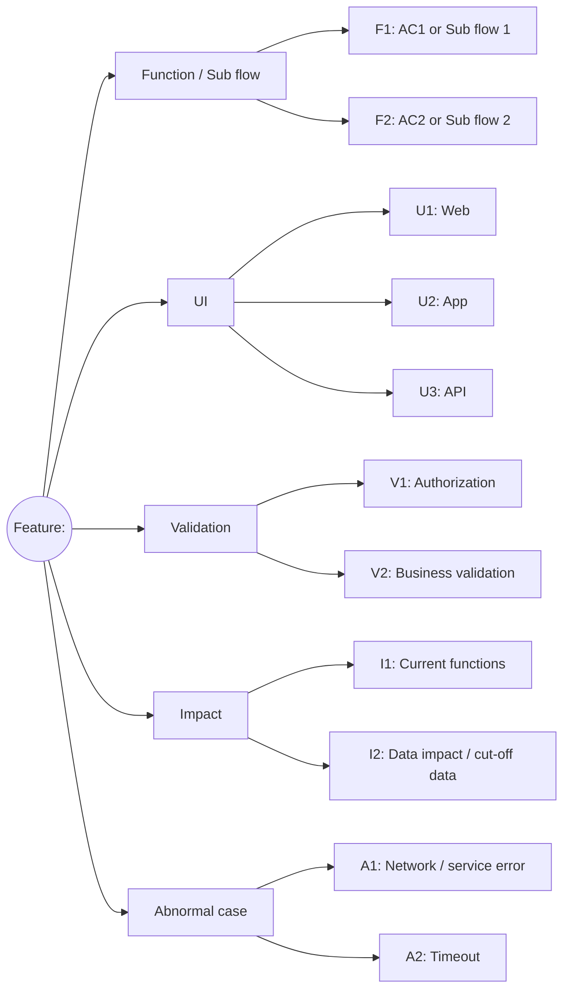
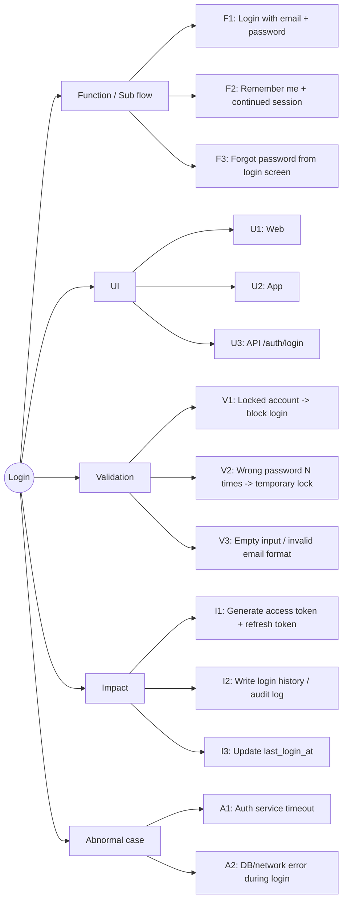

# Test Design HLTC Template (High-Level, Optional)

Use this template for Skill 04 (qa-core/04-test-design-high-level) to quickly review test scope before writing detailed test cases.
Markdown outline is the default format. Mermaid/diagrams are optional and only used when a visual review is needed.

## Storage format and conversions

| Purpose | Format | How to use | Security |
|---|---|---|---|
| View + edit in VS Code (recommended) | Markmap Markdown | Install the "Markmap" extension (gera2ld) -> renders live inside the editor; editing the file updates the view instantly | Local |
| Store in .md file / GitHub | Mermaid `graph LR` | Renders in VS Code (Mermaid Preview ext) / GitHub / Notion | Local |
| Import into XMind (offline) | Tab-indent outline | File > Import > Text Outline | Local |
| Fallback option (no sensitive data) | Markmap Markdown | markmap.js.org/repl -> client-side, no server upload | Do not use for internal content |

> Mermaid `mindmap` is not used as the primary format — it is hard to read.

**Install Markmap for VS Code (one-time setup):**
1. Extensions (`Ctrl+Shift+X`) -> search for **"Markmap"** publisher: `gera2ld` -> Install
2. Open a `.md` file -> click the Markmap icon on the toolbar or press `Ctrl+Shift+P` -> `Markmap: Open as Markmap`
3. The side panel shows the live mindmap -> editing the file updates it automatically

## Markdown Outline (default format)

```markdown
# Feature: <feature name>

## Function / Sub flow
- F1: AC1 or Sub flow 1
- F2: AC2 or Sub flow 2

## UI
- U1: Web
- U2: App
- U3: API

## Validation
- V1: Authorization
- V2: Business validation

## Impact
- I1: Current functions
- I2: Data impact / cut-off data

## Abnormal case
- A1: Network / service error
- A2: Timeout
```

## Markmap Markdown - optional when a diagram is needed

```markdown
# Feature: <feature name>

## Function / Sub flow
- F1: AC1 or Sub flow 1
- F2: AC2 or Sub flow 2

## UI
- U1: Web
- U2: App
- U3: API

## Validation
- V1: Authorization
- V2: Business validation

## Impact
- I1: Current functions
- I2: Data impact / cut-off data

## Abnormal case
- A1: Network / service error
- A2: Timeout
```

Instructions:
1. Go to **markmap.js.org/repl**
2. Delete the sample content on the left, paste your markdown in
3. The mindmap appears on the right immediately
4. Click **Download SVG** or **Download HTML** to save

## Mermaid Graph LR (format for storing in .md)



## Tab-indent outline - import into XMind / MindMeister / Coggle

```text
Feature: <feature name>
	Function / Sub flow
		F1: AC1 or Sub flow 1
		F2: AC2 or Sub flow 2
	UI
		U1: Web
		U2: App
		U3: API
	Validation
		V1: Authorization
		V2: Business validation
	Impact
		I1: Current functions
		I2: Data impact / cut-off data
	Abnormal case
		A1: Network / service error
		A2: Timeout
```

## Review Gate Checklist

Use exactly these 9 items (per Skill 04) — do not add or remove any:

- [ ] All main Function/Sub flow branches are covered
- [ ] UI coverage includes the correct applicable channels (Web/App/API)
- [ ] Validation is covered: authorization and important business rules
- [ ] Impact is covered: current functions and data impact
- [ ] Abnormal cases are covered: timeout and network/system errors
- [ ] At least 1 negative branch per important rule is covered
- [ ] Branches to include in Smoke are clearly identified
- [ ] No obvious contradictions with AC/BR
- [ ] Team has reviewed and confirmed "Approved" on the high-level scope

Gate result: PASS / FAIL

## Example - Login Feature

```markdown
# Login

## Function / Sub flow
- F1: Login with email + password
- F2: Remember me + continued session
- F3: Forgot password from login screen

## UI
- U1: Web
- U2: App
- U3: API /auth/login

## Validation
- V1: Locked account -> block login
- V2: Wrong password N times -> temporary lock
- V3: Empty input / invalid email format

## Impact
- I1: Generate access token + refresh token
- I2: Write login history / audit log
- I3: Update last_login_at

## Abnormal case
- A1: Auth service timeout
- A2: DB/network error during login
```



### Review Gate - Login

- [x] All main Function/Sub flow branches are covered
- [x] UI coverage includes the correct applicable channels (Web/App/API)
- [x] Validation is covered: authorization and important business rules
- [x] Impact is covered: current functions and data impact
- [x] Abnormal cases are covered: timeout and network/system errors
- [x] At least 1 negative branch per important rule is covered
- [x] Branches to include in Smoke are clearly identified
- [x] No obvious contradictions with AC/BR
- [x] Team has reviewed and confirmed "Approved" on the high-level scope

Gate result: PASS
